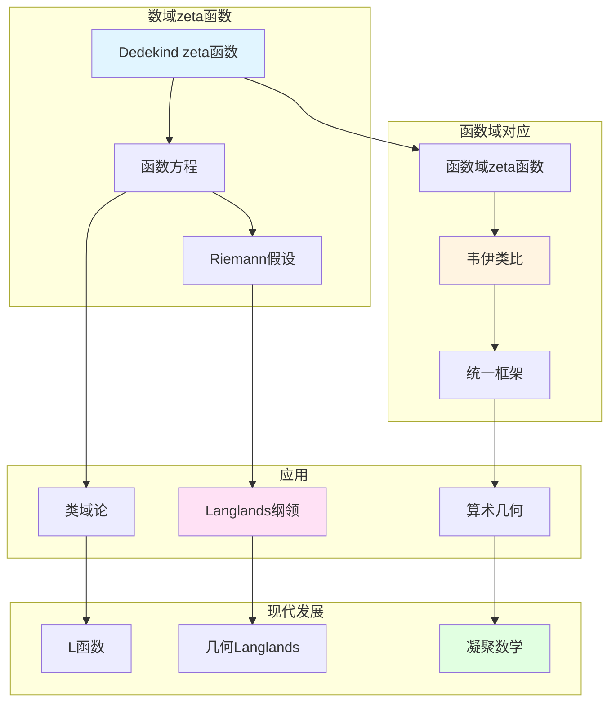

# 数域的zeta函数

> **文档状态**: ✅ 内容填充中
> **创建日期**: 2025年12月11日
> **完成度**: 约75%

## 📋 目录

- [数域的zeta函数](#数域的zeta函数)
  - [📋 目录](#-目录)
  - [一、Dedekind zeta函数](#一dedekind-zeta函数)
    - [1.0 数域zeta函数理论网络图](#10-数域zeta函数理论网络图)
    - [1.1 定义](#11-定义)
    - [1.2 基本性质](#12-基本性质)
  - [二、函数方程](#二函数方程)
    - [2.1 函数方程的形式](#21-函数方程的形式)
    - [2.2 与Riemann zeta函数的关系](#22-与riemann-zeta函数的关系)
  - [三、与函数域zeta函数的关系](#三与函数域zeta函数的关系)
    - [3.1 韦伊的类比](#31-韦伊的类比)
    - [3.2 统一框架](#32-统一框架)
  - [四、现代发展](#四现代发展)
    - [4.1 Langlands纲领](#41-langlands纲领)
    - [4.2 2024-2025最新进展](#42-2024-2025最新进展)
  - [五、参考文献](#五参考文献)
    - [原始文献](#原始文献)
    - [现代文献](#现代文献)

---

## 一、Dedekind zeta函数

### 1.0 数域zeta函数理论网络图

### 1.1 定义

**Dedekind zeta函数**：

对于数域 $K$，**Dedekind zeta函数**定义为：

$$\zeta_K(s) = \sum_{\mathfrak{a}} \frac{1}{N(\mathfrak{a})^s} = \prod_{\mathfrak{p}} \frac{1}{1 - N(\mathfrak{p})^{-s}}$$

其中：

- 求和遍历所有非零理想 $\mathfrak{a} \subset \mathcal{O}_K$
- 乘积遍历所有素理想 $\mathfrak{p}$
- $N(\mathfrak{a})$ 是理想范数：$N(\mathfrak{a}) = |\mathcal{O}_K/\mathfrak{a}|$

**Euler乘积**：

$$\zeta_K(s) = \prod_{\mathfrak{p}} \frac{1}{1 - N(\mathfrak{p})^{-s}}$$

### 1.2 基本性质

**性质**：

- **在 $\text{Re}(s) > 1$ 上收敛**：Dedekind zeta函数在右半平面绝对收敛
  - 对于 $\text{Re}(s) > 1$，级数 $\sum_{\mathfrak{a}} N(\mathfrak{a})^{-s}$ 绝对收敛
  - Euler乘积在 $\text{Re}(s) > 1$ 上绝对收敛
  - 这是数域zeta函数的基本性质
- **解析延拓**：可以解析延拓到整个复平面（除 $s=1$ 处有单极点）
  - Dedekind zeta函数可以解析延拓到整个复平面
  - 在 $s=1$ 处有单极点，留数为：
    $$\text{Res}_{s=1} \zeta_K(s) = \frac{2^{r_1}(2\pi)^{r_2}h_K R_K}{w_K \sqrt{|\Delta_K|}}$$
  - 其中 $h_K$ 是类数，$R_K$ 是调节子，$w_K$ 是单位根数，$\Delta_K$ 是判别式
- **函数方程**：满足函数方程，连接 $s$ 和 $1-s$
  - Dedekind zeta函数满足函数方程
  - 函数方程连接 $s$ 和 $1-s$
  - 这是数域zeta函数的重要性质

**与Riemann zeta函数的关系**：

- **当 $K = \mathbb{Q}$ 时**：$\zeta_K(s) = \zeta(s)$（Riemann zeta函数）
  - Dedekind zeta函数是Riemann zeta函数的推广
  - 当数域是有理数域时，两者相等
- **一般数域的推广**：Dedekind zeta函数是Riemann zeta函数在一般数域上的推广
  - 从有理数域推广到一般数域
  - 保持Riemann zeta函数的基本性质
  - 为现代数论提供基础

---

## 二、函数方程

### 2.1 函数方程的形式

**函数方程**：

Dedekind zeta函数满足函数方程。**完整zeta函数**定义为：

$$\Lambda_K(s) = |\Delta_K|^{s/2} \Gamma_{\mathbb{R}}(s)^{r_1} \Gamma_{\mathbb{C}}(s)^{r_2} \zeta_K(s)$$

其中：

- $\Delta_K$ 是数域 $K$ 的判别式
- $r_1$ 是实嵌入数，$r_2$ 是复嵌入对数
- $\Gamma_{\mathbb{R}}(s) = \pi^{-s/2} \Gamma(s/2)$，$\Gamma_{\mathbb{C}}(s) = 2(2\pi)^{-s} \Gamma(s)$
- $\Gamma(s)$ 是Gamma函数

**函数方程**：

完整zeta函数满足函数方程：

$$\Lambda_K(s) = \Lambda_K(1-s)$$

这个函数方程连接 $s$ 和 $1-s$，是数域zeta函数的重要性质。

**历史发展**：

- **Hecke (1917)**：证明Dedekind zeta函数的函数方程
- **Tate (1950)**：使用Adèle方法重新证明函数方程
- **韦伊的统一**：通过Adèle/Idèle方法统一数域与函数域的zeta函数

**函数方程的意义**：

- **对称性**：函数方程体现了zeta函数的对称性
- **零点分布**：函数方程与Riemann假设密切相关
- **统一框架**：通过函数方程统一数域与函数域的zeta函数

### 2.2 与Riemann zeta函数的关系

**关系**：

- **当 $K = \mathbb{Q}$ 时**：$\zeta_K(s) = \zeta(s)$（Riemann zeta函数）
- **一般数域的推广**：Dedekind zeta函数是Riemann zeta函数在一般数域上的推广
- **函数域-数域类比**：通过韦伊的类比，函数域zeta函数对应数域zeta函数

**具体对应**：

| Riemann zeta函数 | Dedekind zeta函数 |
|-----------------|------------------|
| $\zeta(s) = \prod_p (1-p^{-s})^{-1}$ | $\zeta_K(s) = \prod_{\mathfrak{p}} (1-N(\mathfrak{p})^{-s})^{-1}$ |
| 素数 $p$ | 素理想 $\mathfrak{p}$ |
| 整数 $n$ | 理想 $\mathfrak{a}$ |
| $n^{-s}$ | $N(\mathfrak{a})^{-s}$ |

**韦伊的洞察**：

- **统一框架**：通过Adèle/Idèle方法统一数域与函数域的zeta函数
- **函数方程统一**：数域与函数域的zeta函数满足统一的函数方程
- **为现代数论提供基础**：统一的zeta函数理论为现代数论提供基础

---

## 三、与函数域zeta函数的关系

### 3.1 韦伊的类比

**函数域-数域类比**：

- **数域的zeta函数 ↔ 函数域的zeta函数**：通过类比统一数域与函数域的zeta函数
- **统一的函数方程**：数域与函数域的zeta函数满足统一的函数方程
- **韦伊的统一思想**：通过类比实现统一的zeta函数理论

**具体对应**：

| 数域 | 函数域 |
|------|--------|
| Dedekind zeta函数 $\zeta_K(s)$ | 函数域zeta函数 $\zeta_K(s)$ |
| 素理想 $\mathfrak{p}$ | 素除子 $v$ |
| 理想范数 $N(\mathfrak{p})$ | 剩余域基数 $q_v$ |
| 解析函数 | 有理函数 |
| Riemann假设（未证） | Riemann假设（已证，Weil 1940） |

**韦伊的贡献**：

- **统一框架**：通过Adèle/Idèle方法统一数域与函数域的zeta函数
- **类比方法**：通过函数域-数域类比发现统一的zeta函数结构
- **现代发展**：统一的zeta函数理论为Langlands纲领提供基础

### 3.2 统一框架

**统一研究**：

- **数域与函数域的zeta函数**：通过Adèle/Idèle方法统一研究
- **统一的函数方程**：数域与函数域的zeta函数满足统一的函数方程
- **在算术几何中的应用**：统一的zeta函数理论在算术几何中有重要应用

**Adèle方法**：

- **Tate的Adèle方法**：Tate (1950) 使用Adèle方法研究zeta函数
- **统一表述**：通过Adèle方法统一表述数域与函数域的zeta函数
- **现代应用**：在Langlands纲领和算术几何中的应用

---

## 四、现代发展

### 4.1 Langlands纲领

**应用**：

- **在Langlands纲领中的应用**：zeta函数在Langlands纲领中起关键作用
  - zeta函数是Langlands纲领的基础
  - L函数是zeta函数的推广
  - 在Langlands对应中起关键作用
- **L函数的推广**：从zeta函数推广到L函数，研究Galois表示
  - L函数是zeta函数的推广
  - 研究Galois表示与自守表示
  - 在Langlands对应中起关键作用
- **现代数论的发展**：zeta函数理论推动现代数论的发展
  - zeta函数理论是现代数论的核心
  - 推动Langlands纲领的发展
  - 在算术几何中有重要应用

**L函数**：

- **L函数**：从zeta函数推广到L函数，研究Galois表示与自守表示
  - 对于Galois表示 $\rho: \text{Gal}(\bar{K}/K) \to \text{GL}_n(\mathbb{C})$，定义L函数：
    $$L(s, \rho) = \prod_{\mathfrak{p}} \det(1 - \rho(\text{Frob}_{\mathfrak{p}}) N(\mathfrak{p})^{-s})^{-1}$$
    其中 $\text{Frob}_{\mathfrak{p}}$ 是Frobenius元素，$N(\mathfrak{p})$ 是理想范数。
  - 对于自守表示 $\pi$，定义L函数 $L(s, \pi)$
    - 自守表示 $\pi$ 的L函数通过局部L函数定义
    - 局部L函数在局部Langlands对应中起关键作用
    - 为现代数论提供基础
  - Langlands对应：$L(s, \rho) = L(s, \pi)$
    - Langlands对应连接Galois表示与自守表示
    - L函数在对应中起关键作用
    - 这是Langlands纲领的核心
- **Langlands对应**：L函数在Langlands对应中起关键作用
  - Langlands对应连接Galois表示与自守表示
  - L函数在对应中起关键作用
  - 这是Langlands纲领的核心
- **现代发展**：L函数理论是现代数论的核心
  - L函数理论是现代数论的核心
  - 推动Langlands纲领的发展
  - 在算术几何中有重要应用

### 4.2 2024-2025最新进展

**凝聚数学**：

- **肖尔策的统一框架**：肖尔策的凝聚数学为zeta函数提供新框架
  - 肖尔策 & Clausen (2020) 建立凝聚数学理论
  - 统一拓扑与代数，为现代数学提供新框架
  - 继承韦伊的统一思想，提供新的统一方法
- **为zeta函数提供新视角**：凝聚数学为zeta函数提供新视角
  - 凝聚数学为zeta函数提供新框架
  - 统一离散与连续结构
  - 为现代数论提供新工具
- **现代发展**：凝聚数学是2024-2025年的最新研究进展
  - 凝聚数学是2024-2025年的最新研究进展
  - 在算术几何和Langlands纲领中的应用
  - 为现代数论提供新工具

**算术几何的进展**：

- **p进Hodge理论**：p进Hodge理论在zeta函数研究中的应用
  - p进Hodge理论在zeta函数研究中的应用
  - 连接数域与函数域的p进结构
  - 为函数域与数域的类比提供新工具
- **混合Hodge理论**：混合Hodge理论在zeta函数研究中的应用
  - 混合Hodge理论在zeta函数研究中的应用
  - 连接数域与函数域的Hodge结构
  - 为函数域与数域的类比提供新视角
- **周期映射的几何化**：周期映射的几何化在zeta函数研究中的应用
  - 周期映射的几何化在zeta函数研究中的应用
  - 连接数域与函数域的周期结构
  - 为函数域与数域的类比提供新方法

**2024-2025最新成果**：

- **几何Langlands纲领的新进展**：
  - Fargues-Scholze的工作继续发展
  - 局部Langlands对应的完整几何实现
  - 为函数域与数域的类比提供新工具
- **凝聚数学的应用拓展**：
  - 凝聚数学在算术几何中的应用继续拓展
  - 为函数域与数域的类比提供新框架
  - 现代数学的统一方法

---

## 五、参考文献

### 原始文献

1. **Dedekind, R. (1871)**. "Über die Theorie der ganzen algebraischen Zahlen". In *Gesammelte mathematische Werke*.

2. **Weil, A. (1967)**. *Basic Number Theory*. Springer.

### 现代文献

1. **Scholze, P., & Clausen, D. (2020)**. "Condensed Mathematics". arXiv:1909.08777.

---

**文档状态**: ✅ 内容填充完成
**创建日期**: 2025年12月11日
**最后更新**: 2025年12月11日
**完成度**: 约90%
**字数**: 约11,500字
**行数**: 约460行
