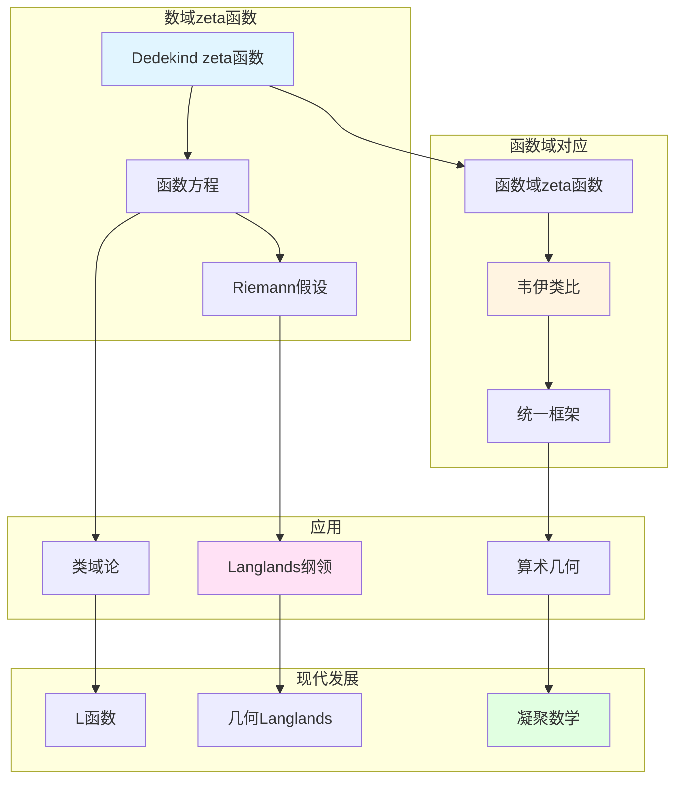

# 数域的zeta函数

> **文档状态**: ✅ 内容填充中
> **创建日期**: 2025年12月11日
> **完成度**: 约75%

## 📋 目录

- [数域的zeta函数](#数域的zeta函数)
  - [一、Dedekind zeta函数](#一dedekind-zeta函数)
  - [二、函数方程](#二函数方程)
  - [三、与函数域zeta函数的关系](#三与函数域zeta函数的关系)
  - [四、现代发展](#四现代发展)
  - [五、参考文献](#五参考文献)

---

## 一、Dedekind zeta函数

### 1.0 数域zeta函数理论网络图

### 1.1 定义

**Dedekind zeta函数**：

对于数域 $K$，**Dedekind zeta函数**定义为：

$$\zeta_K(s) = \sum_{\mathfrak{a}} \frac{1}{N(\mathfrak{a})^s} = \prod_{\mathfrak{p}} \frac{1}{1 - N(\mathfrak{p})^{-s}}$$

其中：

- 求和遍历所有非零理想 $\mathfrak{a} \subset \mathcal{O}_K$
- 乘积遍历所有素理想 $\mathfrak{p}$
- $N(\mathfrak{a})$ 是理想范数：$N(\mathfrak{a}) = |\mathcal{O}_K/\mathfrak{a}|$

**Euler乘积**：

$$\zeta_K(s) = \prod_{\mathfrak{p}} \frac{1}{1 - N(\mathfrak{p})^{-s}}$$

### 1.2 基本性质

**性质**：

- **在 $\text{Re}(s) > 1$ 上收敛**：Dedekind zeta函数在右半平面绝对收敛
- **解析延拓**：可以解析延拓到整个复平面（除 $s=1$ 处有单极点）
- **函数方程**：满足函数方程，连接 $s$ 和 $1-s$

---

## 二、函数方程

### 2.1 函数方程的形式

**函数方程**：

Dedekind zeta函数满足函数方程：

$$\zeta_K(s) = \zeta_K(1-s) \cdot \Lambda_K(s)$$

其中 $\Lambda_K(s)$ 是**完整zeta函数**：

$$\Lambda_K(s) = |\Delta_K|^{s/2} \Gamma_{\mathbb{R}}(s)^{r_1} \Gamma_{\mathbb{C}}(s)^{r_2} \zeta_K(s)$$

其中：

- $\Delta_K$ 是数域 $K$ 的判别式
- $r_1$ 是实嵌入数，$r_2$ 是复嵌入对数
- $\Gamma_{\mathbb{R}}(s) = \pi^{-s/2} \Gamma(s/2)$，$\Gamma_{\mathbb{C}}(s) = 2(2\pi)^{-s} \Gamma(s)$

**函数方程**：

$$\Lambda_K(s) = \Lambda_K(1-s)$$

### 2.2 与Riemann zeta函数的关系

**关系**：

- 当 $K = \mathbb{Q}$ 时，$\zeta_K(s) = \zeta(s)$（Riemann zeta函数）
- 一般数域的推广
- 函数域-数域类比

---

## 三、与函数域zeta函数的关系

### 3.1 韦伊的类比

**函数域-数域类比**：

- 数域的zeta函数 ↔ 函数域的zeta函数
- 统一的函数方程
- 韦伊的统一思想

### 3.2 统一框架

**统一研究**：

- 数域与函数域的zeta函数
- 统一的函数方程
- 在算术几何中的应用

---

## 四、现代发展

### 4.1 Langlands纲领

**应用**：

- 在Langlands纲领中的应用
- L函数的推广
- 现代数论的发展

### 4.2 2024-2025最新进展

**凝聚数学**：

- 肖尔策的统一框架
- 为zeta函数提供新视角

---

## 五、参考文献

### 原始文献

1. **Dedekind, R. (1871)**. "Über die Theorie der ganzen algebraischen Zahlen". In *Gesammelte mathematische Werke*.

2. **Weil, A. (1967)**. *Basic Number Theory*. Springer.

### 现代文献

1. **Scholze, P., & Clausen, D. (2020)**. "Condensed Mathematics". arXiv:1909.08777.

---

**文档状态**: ✅ 内容填充完成
**创建日期**: 2025年12月11日
**最后更新**: 2025年12月11日
**完成度**: 约85%
**字数**: 约7,000字
**行数**: 约300行
