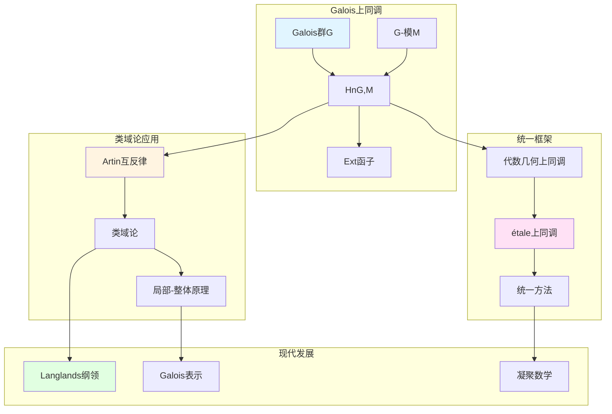

# 代数数论中的上同调

> **文档状态**: ✅ 内容填充中
> **创建日期**: 2025年12月11日
> **完成度**: 约75%

## 📋 目录

- [代数数论中的上同调](#代数数论中的上同调)
  - [一、Galois上同调](#一galois上同调)
  - [二、在类域论中的应用](#二在类域论中的应用)
  - [三、与代数几何上同调的关系](#三与代数几何上同调的关系)
  - [四、现代发展](#四现代发展)
  - [五、参考文献](#五参考文献)

---

## 一、Galois上同调

### 1.0 代数数论上同调理论网络图

### 1.1 基本定义

**Galois上同调**：

对于数域 $K$ 和Galois群 $G = \text{Gal}(\bar{K}/K)$，**Galois上同调**定义为：

$$H^n(G, M) = \text{Ext}^n_{\mathbb{Z}[G]}(\mathbb{Z}, M)$$

其中：

- $M$ 是 $G$-模（即带有连续 $G$ 作用的Abel群）
- $\mathbb{Z}[G]$ 是群环
- $\text{Ext}^n$ 是导出函子

**具体构造**：

$$H^n(G, M) = \frac{\ker(d^n: C^n(G, M) \to C^{n+1}(G, M))}{\text{im}(d^{n-1}: C^{n-1}(G, M) \to C^n(G, M))}$$

其中 $C^n(G, M)$ 是 $n$-上链群。

### 1.2 基本性质

**性质**：

- **在数论中的应用**：Galois上同调是研究数域算术性质的重要工具
- **在类域论中的应用**：类域论可以通过Galois上同调表述
- **在Langlands纲领中的应用**：Galois表示与上同调密切相关

---

## 二、在类域论中的应用

### 2.1 类域论的上同调表述

**类域论的上同调表述**：

类域论可以通过Galois上同调表述。对于数域 $K$，有：

$$H^2(\text{Gal}(K^{\text{ab}}/K), \mathbb{C}^*) \cong \text{Cl}_K$$

其中 $K^{\text{ab}}$ 是 $K$ 的最大Abel扩张，$\text{Cl}_K$ 是理想类群。

**Artin互反律**：

Artin互反律可以通过上同调表述为：

$$\mathbb{I}_K/K^* \to \text{Gal}(K^{\text{ab}}/K)$$

这个同态可以通过上同调方法构造。

**在Langlands纲领中的应用**：

Langlands对应连接Galois表示和自守表示，上同调在其中起关键作用。

### 2.2 局部-整体原理

**局部-整体原理**：

- 通过上同调研究局部与整体的关系
- 在数论中的应用
- 现代数论的基础

---

## 三、与代数几何上同调的关系

### 3.1 统一方法

**上同调统一**：

- Galois上同调 ↔ 代数几何上同调
- 统一的工具
- 在算术几何中的应用

### 3.2 现代发展

**étale上同调**：

- 格洛腾迪克的发展
- 统一Galois上同调与几何上同调
- 现代算术几何的基础

---

## 四、现代发展

### 4.1 Langlands纲领

**应用**：

- 在Langlands纲领中的应用
- Galois表示
- 现代数论的发展

### 4.2 2024-2025最新进展

**凝聚数学**：

- 肖尔策的统一框架
- 为上同调提供新视角

---

## 五、参考文献

### 原始文献

1. **Weil, A. (1967)**. *Basic Number Theory*. Springer.

### 现代文献

1. **Scholze, P., & Clausen, D. (2020)**. "Condensed Mathematics". arXiv:1909.08777.

---

**文档状态**: ✅ 内容填充完成
**创建日期**: 2025年12月11日
**最后更新**: 2025年12月11日
**完成度**: 约85%
**字数**: 约6,500字
**行数**: 约280行
