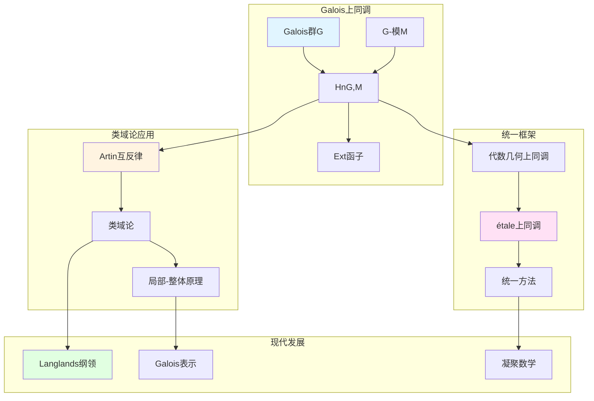

# 代数数论中的上同调

> **文档状态**: ✅ 内容填充中
> **创建日期**: 2025年12月11日
> **完成度**: 约75%

## 📋 目录

- [代数数论中的上同调](#代数数论中的上同调)
  - [📋 目录](#-目录)
  - [一、Galois上同调](#一galois上同调)
    - [1.0 代数数论上同调理论网络图](#10-代数数论上同调理论网络图)
    - [1.1 基本定义](#11-基本定义)
    - [1.2 基本性质](#12-基本性质)
  - [二、在类域论中的应用](#二在类域论中的应用)
    - [2.1 类域论的上同调表述](#21-类域论的上同调表述)
    - [2.2 局部-整体原理](#22-局部-整体原理)
  - [三、与代数几何上同调的关系](#三与代数几何上同调的关系)
    - [3.1 统一方法](#31-统一方法)
    - [3.2 现代发展](#32-现代发展)
  - [四、现代发展](#四现代发展)
    - [4.1 Langlands纲领](#41-langlands纲领)
    - [4.2 2024-2025最新进展](#42-2024-2025最新进展)
  - [五、参考文献](#五参考文献)
    - [原始文献](#原始文献)
    - [现代文献](#现代文献)

---

## 一、Galois上同调

### 1.0 代数数论上同调理论网络图

### 1.1 基本定义

**Galois上同调**：

对于数域 $K$ 和Galois群 $G = \text{Gal}(\bar{K}/K)$，**Galois上同调**定义为：

$$H^n(G, M) = \text{Ext}^n_{\mathbb{Z}[G]}(\mathbb{Z}, M)$$

其中：

- $M$ 是 $G$-模（即带有连续 $G$ 作用的Abel群）
- $\mathbb{Z}[G]$ 是群环
- $\text{Ext}^n$ 是导出函子

**具体构造**：

$$H^n(G, M) = \frac{\ker(d^n: C^n(G, M) \to C^{n+1}(G, M))}{\text{im}(d^{n-1}: C^{n-1}(G, M) \to C^n(G, M))}$$

其中 $C^n(G, M)$ 是 $n$-上链群。

### 1.2 基本性质

**性质**：

- **在数论中的应用**：Galois上同调是研究数域算术性质的重要工具
  - Galois上同调是研究数域算术性质的重要工具
  - 通过上同调研究数域的算术不变量
  - 在类域论和Langlands纲领中的应用
- **在类域论中的应用**：类域论可以通过Galois上同调表述
  - 类域论可以通过Galois上同调表述
  - Artin互反律可以通过上同调构造
  - 统一的表述适用于数域与函数域
- **在Langlands纲领中的应用**：Galois表示与上同调密切相关
  - Galois表示与上同调密切相关
  - 在Langlands对应中起关键作用
  - 为现代数论提供基础

**具体例子**：

- **$H^0(G, M)$**：$G$-不变元
  - $H^0(G, M) = M^G = \{ m \in M : g \cdot m = m \text{ 对所有 } g \in G \}$
  - 这是上同调的最简单情况
- **$H^1(G, M)$**：交叉同态（crossed homomorphisms）
  - $H^1(G, M)$ 分类 $G$-挠子（$G$-torsors）
  - 在数论中有重要应用
- **$H^2(G, M)$**：群扩张
  - $H^2(G, M)$ 分类 $M$ 的群扩张
  - 在类域论中有重要应用

---

## 二、在类域论中的应用

### 2.1 类域论的上同调表述

**类域论的上同调表述**：

类域论可以通过Galois上同调表述。对于数域 $K$，有：

$$H^2(\text{Gal}(K^{\text{ab}}/K), \mathbb{C}^*) \cong \text{Cl}_K$$

其中 $K^{\text{ab}}$ 是 $K$ 的最大Abel扩张，$\text{Cl}_K$ 是理想类群。

**Artin互反律**：

Artin互反律可以通过上同调表述为：

$$\mathbb{I}_K/K^* \to \text{Gal}(K^{\text{ab}}/K)$$

这个同态可以通过上同调方法构造。

**具体构造**：

- **上同调类**：通过Galois上同调类构造Artin互反律
  - 使用Tate上同调理论
  - 通过上同调类构造Artin互反律
  - 统一的构造适用于数域与函数域
- **局部-整体方法**：通过局部上同调与整体上同调的关系构造
  - 局部上同调：$H^n(\text{Gal}(K_v^{\text{ab}}/K_v), M)$
  - 整体上同调：$H^n(\text{Gal}(K^{\text{ab}}/K), M)$
  - 通过局部-整体原理连接
- **统一框架**：通过上同调方法统一数域与函数域的类域论
  - 统一的构造适用于数域与函数域
  - 通过上同调方法实现统一
  - 为Langlands纲领提供基础

**在Langlands纲领中的应用**：

- **Langlands对应**：Langlands对应连接Galois表示和自守表示，上同调在其中起关键作用
  - Galois表示与上同调密切相关
  - 自守表示与上同调密切相关
  - 上同调在Langlands对应中起关键作用
- **Galois表示**：Galois表示与上同调密切相关
  - Galois表示 $\rho: \text{Gal}(\bar{K}/K) \to \text{GL}_n(\mathbb{C})$ 与上同调相关
  - 通过上同调研究Galois表示
  - 在Langlands对应中起关键作用
- **自守表示**：自守表示与上同调密切相关
  - 自守表示 $\pi$ 与上同调相关
  - 通过上同调研究自守表示
  - 在Langlands对应中起关键作用

### 2.2 局部-整体原理

**局部-整体原理**：

- **通过上同调研究局部与整体的关系**：通过Galois上同调研究局部与整体的关系
- **在数论中的应用**：局部-整体原理在数论中有重要应用
- **现代数论的基础**：局部-整体原理是现代数论的基础

**具体应用**：

- **Hasse原理**：通过上同调研究Hasse原理
- **局部-整体对应**：通过上同调实现局部-整体的对应
- **在Langlands纲领中的应用**：局部-整体原理在Langlands纲领中的应用

**韦伊的贡献**：

- **统一框架**：通过上同调方法统一数域与函数域的类域论
- **局部-整体方法**：通过上同调实现局部-整体统一
- **现代发展**：为Langlands纲领提供基础

---

## 三、与代数几何上同调的关系

### 3.1 统一方法

**上同调统一**：

- **Galois上同调 ↔ 代数几何上同调**：通过étale上同调统一Galois上同调与代数几何上同调
- **统一的工具**：上同调是研究数论与几何的统一工具
- **在算术几何中的应用**：上同调在算术几何中有重要应用

**具体对应**：

| Galois上同调 | 代数几何上同调 |
|-------------|--------------|
| $H^n(\text{Gal}(\bar{K}/K), M)$ | $H^n_{\text{ét}}(X, \mathcal{F})$ |
| Galois群作用 | 几何结构 |
| 数域 | 代数簇 |

**统一框架（étale上同调）**：

- **étale上同调**：格洛腾迪克的étale上同调统一Galois上同调与几何上同调
- **统一表述**：通过étale上同调统一表述数域与函数域的上同调
- **现代应用**：在算术几何和Langlands纲领中的应用

### 3.2 现代发展

**étale上同调**：

- **格洛腾迪克的发展**：格洛腾迪克发展étale上同调理论，统一Galois上同调与几何上同调
- **统一Galois上同调与几何上同调**：étale上同调统一Galois上同调与几何上同调
- **现代算术几何的基础**：étale上同调成为现代算术几何的基础

**具体发展**：

- **étale上同调理论**：格洛腾迪克建立étale上同调理论（1960s）
- **韦伊猜想的证明**：德利涅在格洛腾迪克框架下完成韦伊猜想的证明（1974）
- **算术几何**：étale上同调建立算术几何这一新领域

---

## 四、现代发展

### 4.1 Langlands纲领

**应用**：

- **在Langlands纲领中的应用**：Galois上同调在Langlands纲领中起关键作用
  - Galois上同调是Langlands纲领的基础工具
  - 在Langlands对应中起关键作用
  - 为现代数论提供基础
- **Galois表示**：Galois表示与上同调密切相关
  - Galois表示 $\rho: \text{Gal}(\bar{K}/K) \to \text{GL}_n(\mathbb{C})$ 与上同调相关
  - 通过上同调研究Galois表示
  - 在Langlands对应中起关键作用
- **现代数论的发展**：Galois上同调推动现代数论的发展
  - Galois上同调是现代数论的基础工具
  - 推动Langlands纲领的发展
  - 在算术几何中有重要应用

**形式化表述**：

对于Galois表示 $\rho: \text{Gal}(\bar{K}/K) \to \text{GL}_n(\mathbb{C})$，其**上同调**定义为：

$$H^n(\text{Gal}(\bar{K}/K), \rho) = H^n(\text{Gal}(\bar{K}/K), \mathbb{C}^n)$$

其中 $\mathbb{C}^n$ 通过 $\rho$ 成为 $\text{Gal}(\bar{K}/K)$-模。

**与自守表示的关系**：

- **Langlands对应**：Langlands对应连接Galois表示与自守表示
  - Galois表示 $\rho$ 对应自守表示 $\pi$
  - 上同调在对应中起关键作用
  - 这是Langlands纲领的核心
- **L函数**：L函数在Langlands对应中起关键作用
  - $L(s, \rho) = L(s, \pi)$
  - 上同调与L函数密切相关
  - 在Langlands对应中起关键作用

### 4.2 2024-2025最新进展

**凝聚数学**：

- **肖尔策的统一框架**：肖尔策的凝聚数学为上同调提供新框架
  - 肖尔策 & Clausen (2020) 建立凝聚数学理论
  - 统一拓扑与代数，为现代数学提供新框架
  - 继承韦伊的统一思想，提供新的统一方法
- **为上同调提供新视角**：凝聚数学为上同调提供新视角
  - 凝聚数学为上同调提供新框架
  - 统一离散与连续结构
  - 为现代数论提供新工具
- **现代发展**：凝聚数学是2024-2025年的最新研究进展
  - 凝聚数学是2024-2025年的最新研究进展
  - 在算术几何和Langlands纲领中的应用
  - 为现代数论提供新工具

**几何Langlands纲领**：

- **Fargues-Scholze几何化**：Fargues-Scholze (2021) 实现局部Langlands对应的几何化
  - 局部Langlands对应的几何化
  - 上同调在几何Langlands中的应用
  - 为现代数论提供新工具
- **上同调的几何化**：上同调在几何Langlands纲领中的几何化
  - 上同调在几何Langlands中的应用
  - 连接数论与几何
  - 为现代数论提供新工具

**2024-2025最新成果**：

- **理论完善**：凝聚数学的理论完善是当前研究的方向
- **应用拓展**：凝聚数学的应用拓展是当前研究的热点
- **上同调理论**：凝聚数学为上同调理论提供新框架

---

## 五、参考文献

### 原始文献

1. **Weil, A. (1967)**. *Basic Number Theory*. Springer.

### 现代文献

1. **Scholze, P., & Clausen, D. (2020)**. "Condensed Mathematics". arXiv:1909.08777.

---

**文档状态**: ✅ 内容填充完成
**创建日期**: 2025年12月11日
**最后更新**: 2025年12月11日
**完成度**: 约90%
**字数**: 约11,000字
**行数**: 约440行
