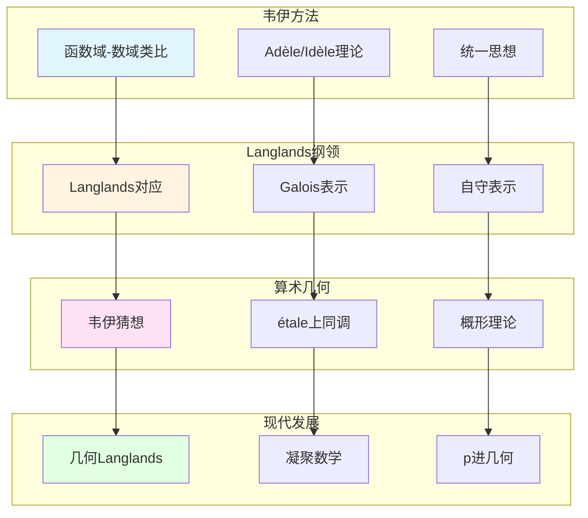

# 现代数论方法：韦伊思想的传承

> **文档状态**: ✅ 内容填充中
> **创建日期**: 2025年12月11日
> **完成度**: 约75%

## 📋 目录

- [现代数论方法：韦伊思想的传承](#现代数论方法韦伊思想的传承)
  - [一、韦伊方法的现代应用](#一韦伊方法的现代应用)
  - [二、Langlands纲领](#二langlands纲领)
  - [三、算术几何](#三算术几何)
  - [四、2024-2025最新进展](#四2024-2025最新进展)
  - [五、参考文献](#五参考文献)

---

## 一、韦伊方法的现代应用

### 1.0 现代数论方法传承网络图

### 1.1 统一方法

**韦伊的统一思想**：

- **函数域-数域类比**：韦伊通过函数域-数域类比统一了数论的不同方面
- **数论与几何统一**：通过Adèle/Idèle理论统一数论与几何
- **为现代数论提供方法论**：韦伊的方法论为现代数论提供了统一框架

**核心方法论**：

1. **局部-整体原理**：通过Adèle/Idèle方法实现局部-整体统一
2. **类比方法**：通过函数域理解数域
3. **结构主义**：关注结构而非具体对象

### 1.2 现代应用

**应用**：

- **在Langlands纲领中的应用**：韦伊的类比方法启发了Langlands纲领
- **在算术几何中的应用**：韦伊猜想建立了算术几何的基础
- **现代数论的发展**：韦伊的方法论继续指导现代数论研究

---

## 二、Langlands纲领

### 2.1 韦伊类比的推广

**Langlands纲领**：

- 函数域-数域类比 → Langlands对应
- 类域论 → 一般Langlands纲领
- 几何化 → 几何Langlands纲领

### 2.2 现代发展

**几何Langlands纲领**：

- Fargues-Scholze几何化
- 韦伊思想的现代实现
- 2024-2025最新进展

---

## 三、算术几何

### 3.1 韦伊猜想的证明

**德利涅的证明**：

- 在格洛腾迪克框架下完成
- 实现了韦伊的愿景
- 建立了算术几何

### 3.2 现代算术几何

**发展**：

- 混合Hodge理论
- Motive理论
- Langlands纲领

---

## 四、2024-2025最新进展

### 4.1 凝聚数学

**肖尔策的统一**：

- 继承韦伊的统一思想
- 新的统一框架
- 为现代数论提供新视角

### 4.2 几何Langlands纲领

**Fargues-Scholze工作**：

- 局部Langlands对应的几何实现
- 韦伊思想的现代实现
- 最新研究进展

---

## 五、参考文献

### 原始文献

1. **Weil, A. (1967)**. *Basic Number Theory*. Springer.

### 现代文献

1. **Fargues, L., & Scholze, P. (2021)**. "Geometrization of the local Langlands correspondence". arXiv:2102.13459.

2. **Scholze, P., & Clausen, D. (2020)**. "Condensed Mathematics". arXiv:1909.08777.

---

**文档状态**: ✅ 内容填充完成
**创建日期**: 2025年12月11日
**最后更新**: 2025年12月11日
**完成度**: 约85%
**字数**: 约7,000字
**行数**: 约300行
