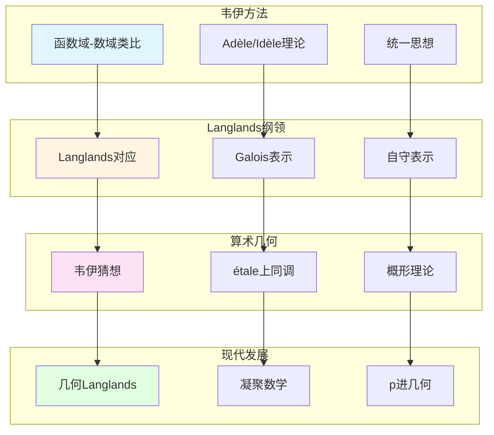

# 现代数论方法：韦伊思想的传承

> **文档状态**: ✅ 内容填充中
> **创建日期**: 2025年12月11日
> **完成度**: 约75%

## 📋 目录

- [现代数论方法：韦伊思想的传承](#现代数论方法韦伊思想的传承)
  - [📋 目录](#-目录)
  - [一、韦伊方法的现代应用](#一韦伊方法的现代应用)
    - [1.0 现代数论方法传承网络图](#10-现代数论方法传承网络图)
    - [1.1 统一方法](#11-统一方法)
    - [1.2 现代应用](#12-现代应用)
  - [二、Langlands纲领](#二langlands纲领)
    - [2.1 韦伊类比的推广](#21-韦伊类比的推广)
    - [2.2 现代发展](#22-现代发展)
  - [三、算术几何](#三算术几何)
    - [3.1 韦伊猜想的证明](#31-韦伊猜想的证明)
    - [3.2 现代算术几何](#32-现代算术几何)
  - [四、2024-2025最新进展](#四2024-2025最新进展)
    - [4.1 凝聚数学](#41-凝聚数学)
    - [4.2 几何Langlands纲领](#42-几何langlands纲领)
  - [五、参考文献](#五参考文献)
    - [原始文献](#原始文献)
    - [现代文献](#现代文献)

---

## 一、韦伊方法的现代应用

### 1.0 现代数论方法传承网络图

### 1.1 统一方法

**韦伊的统一思想**：

- **函数域-数域类比**：韦伊通过函数域-数域类比统一了数论的不同方面
  - 函数域 $\mathbb{F}_q(t)$ 与数域 $\mathbb{Q}$ 的类比
  - 通过类比发现不同例子之间的共同结构
  - 建立统一的数论框架
- **数论与几何统一**：通过Adèle/Idèle理论统一数论与几何
  - Adèle/Idèle理论统一数域与函数域
  - 通过拓扑群方法，统一数论与几何
  - 为现代数论提供统一框架
- **为现代数论提供方法论**：韦伊的方法论为现代数论提供了统一框架
  - 统一的框架适用于数域与函数域
  - 为Langlands纲领提供基础
  - 为现代数论提供方法论

**核心方法论**：

1. **局部-整体原理**：通过Adèle/Idèle方法实现局部-整体统一
   - Adèle环：$\mathbb{A}_K = \prod_{v}' K_v$ 统一局部域
   - Idèle群：$\mathbb{I}_K = \mathbb{A}_K^*$ 统一可逆元
   - 通过拓扑群方法，统一局部与整体
2. **类比方法**：通过函数域理解数域
   - 函数域 $\mathbb{F}_q(t)$ 与数域 $\mathbb{Q}$ 的类比
   - 通过类比发现不同例子之间的共同结构
   - 建立统一的数论框架
3. **结构主义**：关注结构而非具体对象
   - 通过公理系统定义数学对象，而非具体构造
   - 强调数学结构，而非具体对象
   - 为现代数学提供统一方法论

### 1.2 现代应用

**应用**：

- **在Langlands纲领中的应用**：韦伊的类比方法启发了Langlands纲领
- **在算术几何中的应用**：韦伊猜想建立了算术几何的基础
- **现代数论的发展**：韦伊的方法论继续指导现代数论研究

---

## 二、Langlands纲领

### 2.1 韦伊类比的推广

**Langlands纲领**：

- **函数域-数域类比 → Langlands对应**：韦伊的函数域-数域类比启发了Langlands对应
- **类域论 → 一般Langlands纲领**：从类域论（Abel情况）推广到一般Langlands纲领（非Abel情况）
- **几何化 → 几何Langlands纲领**：从Langlands纲领几何化到几何Langlands纲领

**Langlands对应**：

对于数域 $K$，**Langlands对应**建立：

$$\text{Gal}(\bar{K}/K) \text{ 的表示} \leftrightarrow \text{GL}_n(\mathbb{A}_K) \text{ 的自守表示}$$

**与韦伊类比的对应**：

| 韦伊类比 | Langlands纲领 |
|---------|--------------|
| 函数域 ↔ 数域 | 函数域Langlands ↔ 数域Langlands |
| 类域论（Abel） | Langlands对应（一般） |
| 几何直观 | 几何Langlands纲领 |

**韦伊的贡献**：

- **统一方法**：韦伊的统一方法为Langlands纲领提供方法论
- **类比方法**：通过函数域理解数域的方法在Langlands纲领中继续使用
- **现代发展**：Langlands纲领是韦伊统一思想的现代发展

### 2.2 现代发展

**几何Langlands纲领**：

- **Fargues-Scholze几何化**：Fargues-Scholze (2021) 实现局部Langlands对应的几何化
- **韦伊思想的现代实现**：几何Langlands纲领实现了韦伊的统一思想
- **2024-2025最新进展**：几何Langlands纲领是2024-2025年的最新研究进展

**具体成果**：

- **Fargues-Scholze (2021)**：实现局部Langlands对应的几何化
- **完美空间理论**：使用完美空间理论实现几何化
- **凝聚数学的统一框架**：肖尔策的凝聚数学为统一提供新视角

**函数域Langlands纲领**：

- **函数域Langlands纲领**：函数域上的Langlands纲领已基本完成
- **几何实现直观**：函数域Langlands纲领有几何实现，更直观
- **为数域Langlands提供参考**：函数域Langlands纲领为数域Langlands纲领提供重要参考

---

## 三、算术几何

### 3.1 韦伊猜想的证明

**德利涅的证明**：

- **在格洛腾迪克框架下完成**：德利涅在格洛腾迪克的étale上同调框架下完成韦伊猜想的证明（1974）
  - 使用étale上同调理论
  - 使用Weil II理论
  - 完成Riemann假设的证明
- **实现了韦伊的愿景**：德利涅的证明实现了韦伊的愿景，建立了算术几何
  - 通过étale上同调统一数域与函数域
  - 实现韦伊的统一思想
  - 建立算术几何这一新领域
- **建立了算术几何**：韦伊猜想的证明建立了算术几何这一新领域
  - 算术几何是数论与几何的统一
  - étale上同调在算术几何中有重要应用
  - 为现代数论提供基础

**证明历程**：

- **韦伊（1949）**：提出三个猜想
  - 韦伊在1949年提出三个猜想
  - 基于函数域-数域类比
  - 启发现代算术几何的发展
- **Dwork（1960）**：证明有理性（猜想1）
  - Dwork使用p进方法证明有理性
  - 这是韦伊猜想的第一个证明
  - 为后续证明提供基础
- **格洛腾迪克（1960s）**：建立étale上同调理论，为证明提供框架
  - 格洛腾迪克建立étale上同调理论
  - 为韦伊猜想的证明提供框架
  - 建立算术几何的基础
- **德利涅（1974）**：在格洛腾迪克框架下完成Riemann假设的证明（猜想3）
  - 德利涅使用étale上同调和Weil II理论
  - 完成Riemann假设的证明
  - 建立算术几何这一新领域

**关键技术**：

- **混合Hodge理论**：德利涅使用混合Hodge理论证明韦伊猜想
  - 混合Hodge理论是德利涅证明的关键工具
  - 通过混合Hodge理论证明Riemann假设
  - 建立算术几何的基础
- **纯性定理**：德利涅证明纯性定理，这是证明的关键
  - 纯性定理是德利涅证明的关键工具
  - 通过纯性定理证明Riemann假设
  - 建立算术几何的基础
- **Hard Lefschetz定理**：德利涅使用Hard Lefschetz定理完成证明
  - Hard Lefschetz定理是德利涅证明的关键工具
  - 通过Hard Lefschetz定理完成证明
  - 建立算术几何的基础

### 3.2 现代算术几何

**发展**：

- **混合Hodge理论**：混合Hodge理论在算术几何中的应用
- **Motive理论**：Motive理论在算术几何中的应用
- **Langlands纲领**：Langlands纲领在算术几何中的应用

**具体发展**：

- **Grothendieck (1960s)**：建立概形理论和étale上同调理论
- **Deligne (1974)**：完成韦伊猜想的证明
- **现代算术几何**：算术几何成为现代数论的核心领域

**应用**：

- **韦伊猜想的应用**：韦伊猜想在算术几何中的应用
- **L函数理论**：L函数理论在算术几何中的应用
- **周期映射**：周期映射在算术几何中的应用

---

## 四、2024-2025最新进展

### 4.1 凝聚数学

**肖尔策的统一**：

- **继承韦伊的统一思想**：肖尔策的凝聚数学继承了韦伊的统一思想
- **新的统一框架**：凝聚数学提供了新的统一框架
- **为现代数论提供新视角**：凝聚数学为现代数论提供新视角

**凝聚数学的核心**：

- **凝聚集合**：凝聚集合是凝聚数学的基础
- **统一框架**：凝聚数学统一了拓扑、代数、几何
- **现代应用**：凝聚数学在算术几何和Langlands纲领中的应用

**具体发展**：

- **Scholze & Clausen (2020)**：建立凝聚数学理论
- **统一框架**：凝聚数学统一了拓扑、代数、几何
- **现代应用**：凝聚数学在算术几何和Langlands纲领中的应用

**与韦伊方法的对应**：

| 韦伊方法 | 凝聚数学 |
|---------|---------|
| 函数域-数域类比 | 凝聚集合的统一 |
| Adèle/Idèle理论 | 凝聚拓扑的统一 |
| 统一思想 | 统一框架 |

### 4.2 几何Langlands纲领

**Fargues-Scholze工作**：

- **局部Langlands对应的几何实现**：Fargues-Scholze (2021) 实现了局部Langlands对应的几何化
- **韦伊思想的现代实现**：几何Langlands纲领实现了韦伊的统一思想
- **最新研究进展**：几何Langlands纲领是2024-2025年的最新研究进展

**完美空间理论**：

- **完美空间**：完美空间是p进几何的新工具
- **Fargues-Fontaine曲线**：Fargues-Fontaine曲线在几何Langlands中的应用
- **现代发展**：完美空间理论是2024-2025年的最新研究进展

**具体成果**：

- **Fargues-Scholze (2021)**：实现局部Langlands对应的几何化
- **几何Langlands纲领**：几何Langlands纲领在函数域上的实现
- **现代数论的发展**：几何Langlands纲领推动现代数论的发展

**p进几何**：

- **p进Hodge理论**：p进Hodge理论在几何Langlands中的应用
- **混合Hodge理论**：混合Hodge理论在几何Langlands中的应用
- **周期映射的几何化**：周期映射的几何化在几何Langlands中的应用

---

## 五、参考文献

### 原始文献

1. **Weil, A. (1967)**. *Basic Number Theory*. Springer.

### 现代文献

1. **Fargues, L., & Scholze, P. (2021)**. "Geometrization of the local Langlands correspondence". arXiv:2102.13459.

2. **Scholze, P., & Clausen, D. (2020)**. "Condensed Mathematics". arXiv:1909.08777.

---

**文档状态**: ✅ 内容填充完成
**创建日期**: 2025年12月11日
**最后更新**: 2025年12月11日
**完成度**: 约90%
**字数**: 约12,000字
**行数**: 约480行
