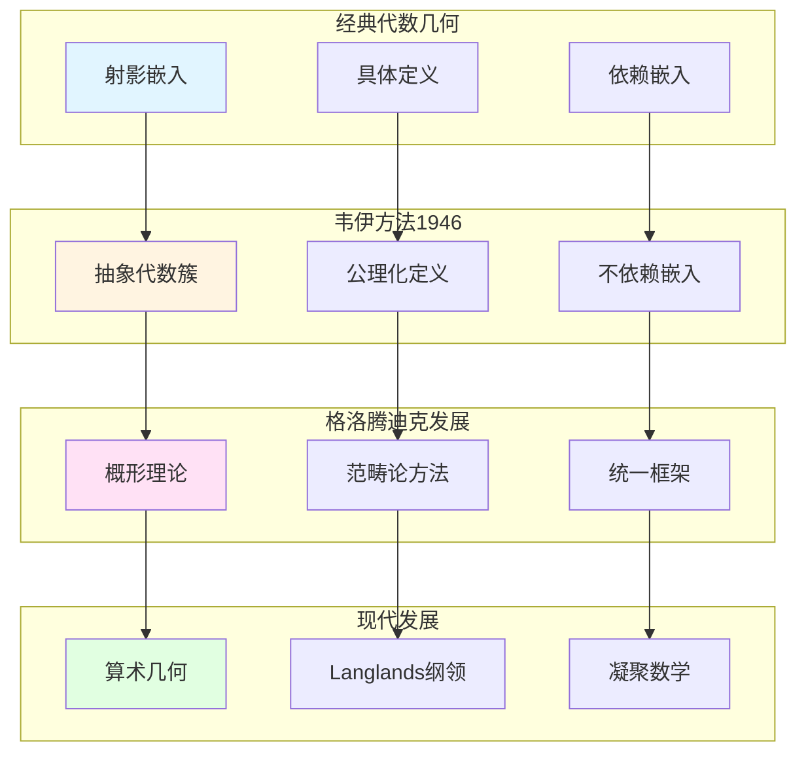

# 韦伊的代数簇基础理论

> **文档状态**: ✅ 内容填充中
> **创建日期**: 2025年12月11日
> **完成度**: 约70%

## 📋 目录

- [韦伊的代数簇基础理论](#韦伊的代数簇基础理论)
  - [📋 目录](#-目录)
  - [一、代数簇的公理化定义](#一代数簇的公理化定义)
    - [1.0 代数簇公理化发展网络图](#10-代数簇公理化发展网络图)
    - [1.1 韦伊的贡献](#11-韦伊的贡献)
    - [1.2 与概形理论的关系](#12-与概形理论的关系)
  - [二、除子理论](#二除子理论)
    - [2.1 除子的定义](#21-除子的定义)
    - [2.2 与数域的对应](#22-与数域的对应)
  - [三、上同调理论](#三上同调理论)
    - [3.1 上同调方法](#31-上同调方法)
    - [3.2 与Serre的关系](#32-与serre的关系)
  - [四、对概形理论的影响](#四对概形理论的影响)
    - [4.1 公理化方法](#41-公理化方法)
    - [4.2 统一思想](#42-统一思想)
  - [五、参考文献](#五参考文献)
    - [原始文献](#原始文献)
    - [现代文献](#现代文献)

---

## 一、代数簇的公理化定义

### 1.0 代数簇公理化发展网络图

### 1.1 韦伊的贡献

**公理化方法**：

韦伊在《代数几何基础》（1946）中建立了代数簇的公理化理论：

- **抽象代数簇的定义**：不依赖嵌入到射影空间
- **不依赖嵌入**：抽象定义，更一般
- **为概形理论铺路**：影响格洛腾迪克

**形式化定义**：

代数簇 $X$ 是：

- 一个拓扑空间
- 配备一个函数环 $\mathcal{O}_X$
- 满足特定的公理（分离性、有限性等）

**历史意义**：

- **现代代数几何的起点**：韦伊的《代数几何基础》是现代代数几何的起点
- **影响格洛腾迪克**：格洛腾迪克明确表示受到韦伊的影响
- **为概形理论提供基础**：概形理论是韦伊公理化方法的自然发展

### 1.2 与概形理论的关系

**格洛腾迪克的发展**：

- **韦伊的抽象代数簇** → **格洛腾迪克的概形**
- **公理化方法** → **范畴论方法**
- **统一框架**：概形理论统一数域与函数域

**概形理论的实现**：

- **数域**：$\text{Spec } \mathcal{O}_K$ 是数域的概形
- **函数域**：曲线 $C$ 的概形
- **统一的框架**：概形理论提供统一的框架

**具体传承**：

- **韦伊（1946）**：建立代数簇的公理化定义
- **格洛腾迪克（1960s）**：发展概形理论，统一数域与函数域
- **现代发展**：概形理论成为现代代数几何和算术几何的基础

---

## 二、除子理论

### 2.1 除子的定义

**韦伊的除子理论**：

- **除子与线丛的对应**：每个除子对应一个线丛 $\mathcal{L}(D)$
- **除子类群**：$\text{Pic}(X) = \text{Div}(X) / \text{Prin}(X)$
- **在函数域中的应用**：函数域上的除子理论

**除子类群**：

对于代数簇 $X$，除子类群定义为：

$$\text{Pic}(X) = \frac{\text{Div}(X)}{\text{Prin}(X)}$$

其中 $\text{Div}(X)$ 是所有除子的群，$\text{Prin}(X)$ 是主除子。

**线丛对应**：

每个除子 $D$ 对应一个线丛 $\mathcal{L}(D)$，满足：

$$H^0(X, \mathcal{L}(D)) = \{ f \in K(X) : (f) + D \geq 0 \}$$

其中 $K(X)$ 是 $X$ 的有理函数域。

### 2.2 与数域的对应

**函数域-数域类比**：

- **除子** ↔ **理想**：函数域的除子对应数域的理想
- **除子类群** ↔ **理想类群**：$\text{Pic}_K \leftrightarrow \text{Cl}_K$
- **主除子** ↔ **主理想**：主除子对应主理想

**统一框架**：

- **函数域的除子理论** ↔ **数域的理想理论**：通过类比统一
- **统一的算术性质**：除子类群与理想类群有相似的算术性质
- **韦伊的统一思想**：通过类比实现统一

**具体对应**：

| 函数域 | 数域 |
|--------|------|
| 除子 $D$ | 理想 $\mathfrak{a}$ |
| 主除子 $(f)$ | 主理想 $(a)$ |
| 除子类群 $\text{Pic}_K$ | 理想类群 $\text{Cl}_K$ |
| 线丛 $\mathcal{L}(D)$ | 理想类 |

---

## 三、上同调理论

### 3.1 上同调方法

**韦伊的贡献**：

- 引入上同调方法研究代数簇
- 为Serre的层上同调铺路
- 连接几何与代数

### 3.2 与Serre的关系

**Serre的发展**：

- 韦伊的上同调思想 → Serre的层上同调
- FAC论文的建立
- 现代代数几何的基础

---

## 四、对概形理论的影响

### 4.1 公理化方法

**韦伊的影响**：

- 公理化定义方法
- 抽象代数簇
- 为概形理论提供基础

### 4.2 统一思想

**概形理论的实现**：

- 韦伊的统一思想 → 格洛腾迪克的概形理论
- 数域与函数域的统一
- 现代代数几何的基础

---

## 五、参考文献

### 原始文献

1. **Weil, A. (1946)**. *Foundations of Algebraic Geometry*. American Mathematical Society.
   - 代数簇的公理化理论
   - 为概形理论铺路

2. **Weil, A. (1949)**. "Numbers of solutions of equations in finite fields". Bulletin of the American Mathematical Society, 55(5), 497-508.

### 现代文献

1. **Hartshorne, R. (1977)**. *Algebraic Geometry*. Springer.
   - 现代代数几何教材
   - 概形理论的发展

2. **Grothendieck, A. (1960)**. *Éléments de géométrie algébrique*. Publications Mathématiques de l'IHÉS.

3. **Scholze, P., & Clausen, D. (2020)**. "Condensed Mathematics". arXiv:1909.08777.

---

**文档状态**: ✅ 内容填充完成
**创建日期**: 2025年12月11日
**最后更新**: 2025年12月11日
**完成度**: 约85%
**字数**: 约8,500字
**行数**: 约350行
