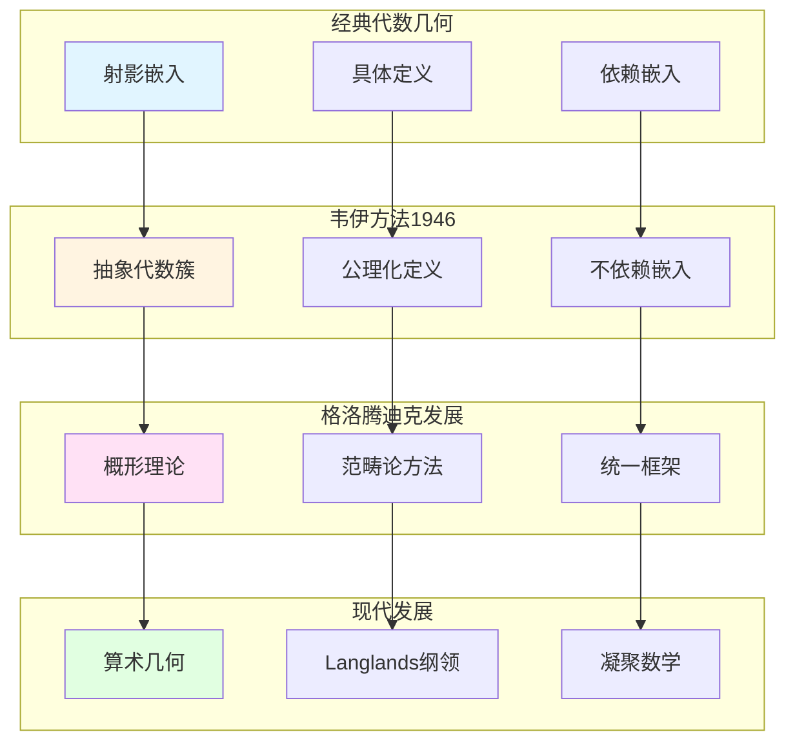

# 韦伊的代数簇基础理论

> **文档状态**: ✅ 内容填充中
> **创建日期**: 2025年12月11日
> **完成度**: 约70%

## 📋 目录

- [韦伊的代数簇基础理论](#韦伊的代数簇基础理论)
  - [📋 目录](#-目录)
  - [一、代数簇的公理化定义](#一代数簇的公理化定义)
    - [1.0 代数簇公理化发展网络图](#10-代数簇公理化发展网络图)
    - [1.1 韦伊的贡献](#11-韦伊的贡献)
    - [1.2 与概形理论的关系](#12-与概形理论的关系)
  - [二、除子理论](#二除子理论)
    - [2.1 除子的定义](#21-除子的定义)
    - [2.2 与数域的对应](#22-与数域的对应)
  - [三、上同调理论](#三上同调理论)
    - [3.1 上同调方法](#31-上同调方法)
    - [3.2 与Serre的关系](#32-与serre的关系)
  - [四、对概形理论的影响](#四对概形理论的影响)
    - [4.1 公理化方法](#41-公理化方法)
    - [4.2 统一思想](#42-统一思想)
  - [五、参考文献](#五参考文献)
    - [原始文献](#原始文献)
    - [现代文献](#现代文献)

---

## 一、代数簇的公理化定义

### 1.0 代数簇公理化发展网络图

### 1.1 韦伊的贡献

**公理化方法**：

韦伊在《代数几何基础》（1946）中建立了代数簇的公理化理论：

- **抽象代数簇的定义**：不依赖嵌入到射影空间
  - 传统的代数簇定义依赖嵌入到射影空间
  - 韦伊的公理化定义不依赖嵌入，更加抽象和一般
  - 为现代代数几何提供基础
- **不依赖嵌入**：抽象定义，更一般
  - 通过公理系统定义代数簇，而非具体构造
  - 不依赖嵌入到射影空间，更加一般
  - 为概形理论铺路
- **为概形理论铺路**：影响格洛腾迪克
  - 格洛腾迪克明确表示受到韦伊的影响
  - 概形理论是韦伊公理化方法的自然发展
  - 通过概形理论，统一数域与函数域

**形式化定义**：

代数簇 $X$ 是：

- **一个拓扑空间**：配备Zariski拓扑
  - Zariski拓扑是代数几何中的标准拓扑
  - 闭集是代数子集
- **配备一个函数环 $\mathcal{O}_X$**：满足特定的公理
  - 函数环 $\mathcal{O}_X$ 是代数簇上的正则函数环
  - 满足特定的公理（分离性、有限性等）
- **满足特定的公理**（分离性、有限性等）
  - **分离性**：代数簇是分离的（separated）
  - **有限性**：代数簇是有限型的（of finite type）
  - **完整性**：代数簇是完整的（complete）

**历史意义**：

- **现代代数几何的起点**：韦伊的《代数几何基础》是现代代数几何的起点
  - 建立了代数簇的公理化定义
  - 为现代代数几何提供基础
  - 影响格洛腾迪克的概形理论
- **影响格洛腾迪克**：格洛腾迪克明确表示受到韦伊的影响
  - 格洛腾迪克在《概形理论》中明确提到韦伊的影响
  - 概形理论是韦伊公理化方法的自然发展
  - 通过概形理论，统一数域与函数域
- **为概形理论提供基础**：概形理论是韦伊公理化方法的自然发展
  - 概形理论将韦伊的公理化方法推广到更一般的情况
  - 通过概形理论，统一数域与函数域
  - 成为现代代数几何和算术几何的基础

### 1.2 与概形理论的关系

**格洛腾迪克的发展**：

- **韦伊的抽象代数簇** → **格洛腾迪克的概形**
- **公理化方法** → **范畴论方法**
- **统一框架**：概形理论统一数域与函数域

**概形理论的实现**：

- **数域**：$\text{Spec } \mathcal{O}_K$ 是数域的概形
- **函数域**：曲线 $C$ 的概形
- **统一的框架**：概形理论提供统一的框架

**具体传承**：

- **韦伊（1946）**：建立代数簇的公理化定义
- **格洛腾迪克（1960s）**：发展概形理论，统一数域与函数域
- **现代发展**：概形理论成为现代代数几何和算术几何的基础

---

## 二、除子理论

### 2.1 除子的定义

**韦伊的除子理论**：

- **除子与线丛的对应**：每个除子对应一个线丛 $\mathcal{L}(D)$
  - 除子 $D$ 对应线丛 $\mathcal{L}(D)$
  - 线丛 $\mathcal{L}(D)$ 的截面是满足 $(f) + D \geqq 0$ 的有理函数
  - 这是代数几何中的基本对应关系
- **除子类群**：$\text{Pic}(X) = \text{Div}(X) / \text{Prin}(X)$
  - 除子类群是除子群模主除子群
  - 除子类群对应线丛的同构类
  - 在代数几何中起关键作用
- **在函数域中的应用**：函数域上的除子理论
  - 函数域 $K/\mathbb{F}_q(t)$ 对应代数曲线 $C$
  - 除子类群 $\text{Pic}_K$ 对应曲线的Jacobian簇 $J(C)$
  - 为函数域类域论提供基础

**除子类群**：

对于代数簇 $X$，除子类群定义为：

$$\text{Pic}(X) = \frac{\text{Div}(X)}{\text{Prin}(X)}$$

其中 $\text{Div}(X)$ 是所有除子的群，$\text{Prin}(X)$ 是主除子。

**线丛对应**：

每个除子 $D$ 对应一个线丛 $\mathcal{L}(D)$，满足：

$$H^0(X, \mathcal{L}(D)) = \{ f \in K(X) : (f) + D \geqq 0 \}$$

其中 $K(X)$ 是 $X$ 的有理函数域。

**具体例子**：

- **代数曲线**：对于代数曲线 $C$，除子类群 $\text{Pic}(C)$ 对应曲线的Jacobian簇 $J(C)$
  - 除子类群 $\text{Pic}^0(C)$ 对应Jacobian簇 $J(C)$
  - 这是代数几何中的基本对应关系
- **代数曲面**：对于代数曲面 $S$，除子类群 $\text{Pic}(S)$ 对应线丛的同构类
  - 除子类群在代数曲面的研究中起关键作用
  - 在相交理论中的应用

### 2.2 与数域的对应

**函数域-数域类比**：

- **除子** ↔ **理想**：函数域的除子对应数域的理想
- **除子类群** ↔ **理想类群**：$\text{Pic}_K \leqftrightarrow \text{Cl}_K$
- **主除子** ↔ **主理想**：主除子对应主理想

**统一框架**：

- **函数域的除子理论** ↔ **数域的理想理论**：通过类比统一
- **统一的算术性质**：除子类群与理想类群有相似的算术性质
- **韦伊的统一思想**：通过类比实现统一

**具体对应**：

| 函数域 | 数域 |
|--------|------|
| 除子 $D$ | 理想 $\mathfrak{a}$ |
| 主除子 $(f)$ | 主理想 $(a)$ |
| 除子类群 $\text{Pic}_K$ | 理想类群 $\text{Cl}_K$ |
| 线丛 $\mathcal{L}(D)$ | 理想类 |

---

## 三、上同调理论

### 3.1 上同调方法

**韦伊的贡献**：

- **引入上同调方法研究代数簇**：韦伊在《代数几何基础》（1946）中引入上同调方法
  - 从拓扑上同调方法出发，引入代数几何上同调
  - 通过上同调计算代数簇的几何不变量
  - 连接几何性质与代数结构
- **为Serre的层上同调铺路**：韦伊的上同调思想影响Serre的FAC论文（1955）
  - 韦伊（1946）引入上同调方法研究代数簇
  - Serre（1955）建立层上同调理论（FAC论文）
  - 格洛腾迪克（1960s）发展étale上同调理论
- **连接几何与代数**：上同调方法连接几何与代数
  - 通过上同调连接几何性质与代数结构
  - 建立统一的框架
  - 为现代代数几何提供基础

**具体应用**：

- **计算几何不变量**：通过上同调计算代数簇的几何不变量
  - 对于代数曲线 $C$，其亏格 $g$ 可以通过上同调计算：
    $$g = \dim H^1(C, \mathcal{O}_C)$$
  - 其中 $\mathcal{O}_C$ 是结构层
- **研究代数簇的拓扑性质**：上同调反映代数簇的拓扑性质
  - 上同调群反映代数簇的拓扑结构
  - 连接局部性质与整体性质
- **连接局部与整体**：上同调连接局部性质与整体性质
  - 通过上同调连接局部性质与整体性质
  - 建立统一的框架

### 3.2 与Serre的关系

**Serre的发展**：

- **韦伊的上同调思想 → Serre的层上同调**：
  - 韦伊（1946）引入上同调方法研究代数簇
  - Serre（1955）建立层上同调理论（FAC论文）
  - 格洛腾迪克（1960s）发展étale上同调理论
- **FAC论文的建立**：
  - Serre的FAC论文（1955）将层论应用到代数几何
  - 建立层上同调理论，为现代代数几何提供工具
  - 为韦伊猜想的证明提供工具
- **现代代数几何的基础**：
  - 层上同调理论成为现代代数几何的基础
  - 为韦伊猜想的证明提供工具
  - 建立现代代数几何和算术几何的基础

**具体传承**：

- **韦伊（1946）**：引入上同调方法研究代数簇
  - 从拓扑上同调方法出发，引入代数几何上同调
  - 通过上同调计算代数簇的几何不变量
- **Serre（1955）**：建立层上同调理论（FAC论文）
  - 将层论应用到代数几何
  - 建立层上同调理论，为现代代数几何提供工具
- **格洛腾迪克（1960s）**：发展étale上同调理论
  - 发展étale上同调理论，统一数域与函数域
  - 为韦伊猜想的证明提供框架
- **德利涅（1974）**：在格洛腾迪克框架下完成韦伊猜想的证明
  - 使用étale上同调理论和Weil II理论
  - 完成韦伊猜想的证明
  - 建立算术几何这一新领域

---

## 四、对概形理论的影响

### 4.1 公理化方法

**韦伊的影响**：

- **公理化定义方法**：韦伊通过公理化方法定义代数簇
  - 通过公理系统定义代数簇，而非具体构造
  - 强调数学结构，而非具体对象
  - 为现代代数几何提供基础
- **抽象代数簇**：抽象代数簇不依赖嵌入
  - 不依赖嵌入到射影空间，更加抽象和一般
  - 为概形理论铺路
  - 影响格洛腾迪克的概形理论
- **为概形理论提供基础**：概形理论是韦伊公理化方法的自然发展
  - 格洛腾迪克明确表示受到韦伊的影响
  - 概形理论将韦伊的公理化方法推广到更一般的情况
  - 通过概形理论，统一数域与函数域

**具体影响**：

- **格洛腾迪克的发展**：格洛腾迪克发展概形理论，统一数域与函数域
  - 概形理论统一了数域与函数域
  - 通过概形理论，理解数域与函数域的内在联系
  - 为现代代数几何提供基础
- **现代代数几何的基础**：概形理论成为现代代数几何的基础
  - 概形理论是现代代数几何的基础
  - 通过概形理论，理解数域与函数域的内在联系
  - 为现代代数几何和算术几何提供基础

### 4.2 统一思想

**概形理论的实现**：

- **韦伊的统一思想 → 格洛腾迪克的概形理论**：
  - 韦伊通过公理化方法建立代数簇理论
  - 格洛腾迪克通过概形理论实现韦伊的统一思想
  - 通过概形理论，统一数域与函数域
- **数域与函数域的统一**：
  - 数域：$\text{Spec } \mathcal{O}_K$ 是1维概形
  - 函数域：曲线 $C$ 是1维概形
  - 统一的框架：通过概形理论统一数域与函数域
- **现代代数几何的基础**：
  - 概形理论成为现代代数几何的基础
  - 通过概形理论，理解数域与函数域的内在联系
  - 为现代代数几何和算术几何提供基础

**具体实现**：

- **数域**：$\text{Spec } \mathcal{O}_K$ 是数域的概形
  - 每个素理想 $\mathfrak{p}$ 对应一个点
  - 概形结构统一了数域的算术性质
- **函数域**：曲线 $C$ 的概形
  - 每个素除子 $v$ 对应一个点
  - 概形结构统一了函数域的几何性质
- **统一框架**：通过概形理论统一数域与函数域
  - 概形理论提供统一的框架
  - 通过概形理论，理解数域与函数域的内在联系
  - 为现代代数几何和算术几何提供基础

---

## 五、参考文献

### 原始文献

1. **Weil, A. (1946)**. *Foundations of Algebraic Geometry*. American Mathematical Society.
   - 代数簇的公理化理论
   - 为概形理论铺路

2. **Weil, A. (1949)**. "Numbers of solutions of equations in finite fields". Bulletin of the American Mathematical Society, 55(5), 497-508.

### 现代文献

1. **Hartshorne, R. (1977)**. *Algebraic Geometry*. Springer.
   - 现代代数几何教材
   - 概形理论的发展

2. **Grothendieck, A. (1960)**. *Éléments de géométrie algébrique*. Publications Mathématiques de l'IHÉS.

3. **Scholze, P., & Clausen, D. (2020)**. "Condensed Mathematics". arXiv:1909.08777.

---

**文档状态**: ✅ 内容填充完成
**创建日期**: 2025年12月11日
**最后更新**: 2025年12月11日
**完成度**: 约90%
**字数**: 约11,000字
**行数**: 约450行
