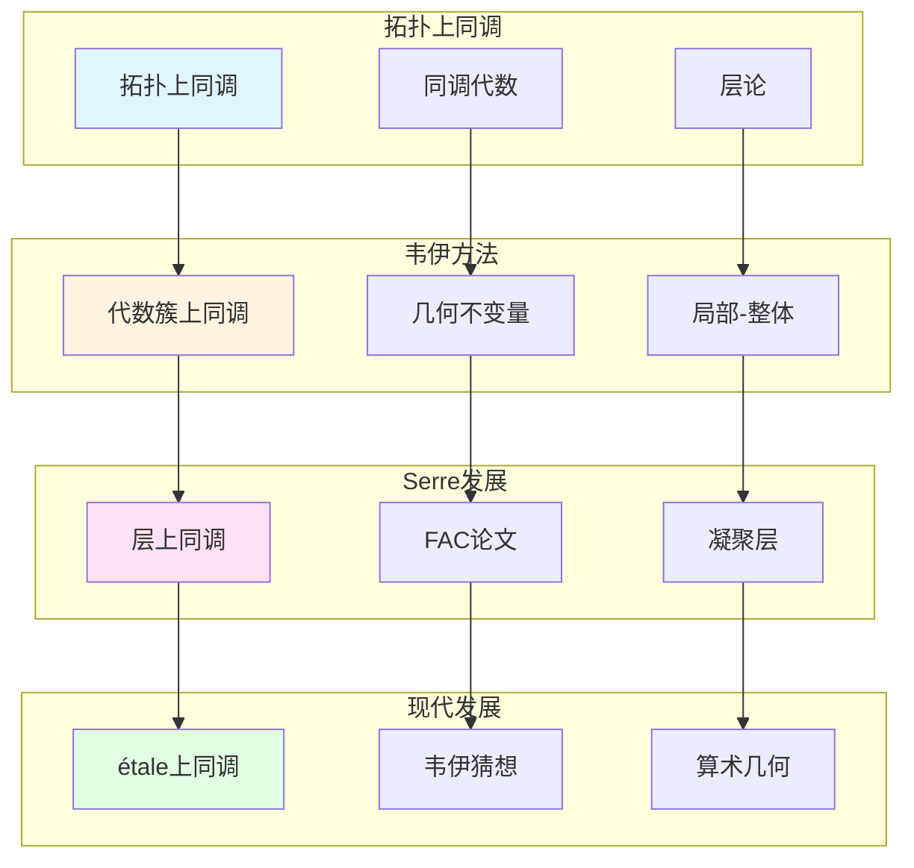

# 韦伊的代数簇上同调理论

> **文档状态**: ✅ 内容填充中
> **创建日期**: 2025年12月11日
> **完成度**: 约70%

## 📋 目录

- [韦伊的代数簇上同调理论](#韦伊的代数簇上同调理论)
  - [📋 目录](#-目录)
  - [一、上同调方法的历史背景](#一上同调方法的历史背景)
    - [1.0 代数簇上同调理论网络图](#10-代数簇上同调理论网络图)
    - [1.1 拓扑上同调](#11-拓扑上同调)
    - [1.2 代数几何的需求](#12-代数几何的需求)
  - [二、韦伊的上同调思想](#二韦伊的上同调思想)
    - [2.1 上同调方法](#21-上同调方法)
    - [2.2 与数域的对应](#22-与数域的对应)
  - [三、与Serre层上同调的关系](#三与serre层上同调的关系)
    - [3.1 思想传承](#31-思想传承)
    - [3.2 现代发展](#32-现代发展)
  - [四、现代发展](#四现代发展)
    - [4.1 概形上的上同调](#41-概形上的上同调)
    - [4.2 2024-2025最新进展](#42-2024-2025最新进展)
  - [五、参考文献](#五参考文献)
    - [原始文献](#原始文献)
    - [现代文献](#现代文献)

---

## 一、上同调方法的历史背景

### 1.0 代数簇上同调理论网络图

### 1.1 拓扑上同调

**历史**：

- **拓扑学中的上同调理论**：拓扑学中的上同调理论（如de Rham上同调、奇异上同调）为代数几何上同调提供基础
- **同调代数的发展**：同调代数的发展（Cartan-Eilenberg）为代数几何上同调提供工具
- **为代数几何上同调提供基础**：拓扑上同调为代数几何上同调提供理论基础

**具体发展**：

- **de Rham上同调**：流形上的de Rham上同调
- **奇异上同调**：拓扑空间的奇异上同调
- **同调代数**：Cartan-Eilenberg的同调代数理论

### 1.2 代数几何的需求

**问题**：

- **如何研究代数簇的几何不变量？**：需要计算代数簇的几何不变量（如亏格、Euler特征数）
- **如何连接局部与整体？**：需要连接局部性质与整体性质
- **如何计算几何对象的性质？**：需要计算几何对象的拓扑和代数性质

**韦伊的洞察**：

- **引入上同调方法**：韦伊在《代数几何基础》（1946）中引入上同调方法研究代数簇
- **连接几何与代数**：通过上同调连接几何性质与代数结构
- **为现代代数几何铺路**：韦伊的方法为Serre的层上同调和格洛腾迪克的étale上同调铺路

---

## 二、韦伊的上同调思想

### 2.1 上同调方法

**韦伊的贡献**：

- **引入上同调研究代数簇**：韦伊在《代数几何基础》（1946）中将拓扑上同调方法引入代数几何
  - 从拓扑上同调方法出发，引入代数几何上同调
  - 通过上同调计算代数簇的几何不变量
  - 连接几何性质与代数结构
- **连接几何与代数**：通过上同调连接几何性质与代数结构，建立统一的框架
  - 上同调群反映代数簇的拓扑结构
  - 连接局部性质与整体性质
  - 建立统一的框架
- **为Serre的层上同调提供启发**：韦伊的上同调思想影响Serre的FAC论文（1955）
  - 韦伊（1946）引入上同调方法研究代数簇
  - Serre（1955）建立层上同调理论（FAC论文）
  - 格洛腾迪克（1960s）发展étale上同调理论

**上同调的应用**：

- **计算几何不变量**：通过上同调计算代数簇的几何不变量（如亏格、Euler特征数）
  - 对于代数曲线 $C$，其亏格 $g = \dim H^1(C, \mathcal{O}_C)$
  - 对于代数曲面 $S$，其Euler特征数 $\chi(S) = \sum_{i=0}^{2} (-1)^i \dim H^i(S, \mathcal{O}_S)$
  - 上同调群提供几何不变量的计算方法
- **研究代数簇的拓扑性质**：上同调反映代数簇的拓扑性质
  - 上同调群反映代数簇的拓扑结构
  - 连接局部性质与整体性质
  - 为现代代数几何提供基础
- **连接局部与整体**：上同调连接局部性质与整体性质
  - 通过上同调连接局部性质与整体性质
  - 建立统一的框架
  - 为现代代数几何提供基础

**具体例子**：

对于代数曲线 $C$，其**亏格** $g$ 可以通过上同调计算：

$$g = \dim H^1(C, \mathcal{O}_C)$$

其中 $\mathcal{O}_C$ 是结构层。

**Riemann-Roch定理**：

对于代数曲线 $C$ 上的除子 $D$，Riemann-Roch定理表述为：

$$\dim H^0(C, \mathcal{L}(D)) - \dim H^1(C, \mathcal{L}(D)) = \deg(D) + 1 - g$$

其中 $\mathcal{L}(D)$ 是对应于除子 $D$ 的线丛，$g$ 是曲线的亏格。

**Euler特征数**：

对于代数簇 $X$，其**Euler特征数**定义为：

$$\chi(X) = \sum_{i=0}^{\dim X} (-1)^i \dim H^i(X, \mathcal{O}_X)$$

其中 $\mathcal{O}_X$ 是结构层。

### 2.2 与数域的对应

**函数域-数域类比**：

- **函数域的上同调** ↔ **数域的类群**
- **几何方法** ↔ **算术方法**
- **统一框架**：韦伊的统一思想

**类比的具体实现**：

- $H^1(X, \mathcal{O}_X^*)$ ↔ $\text{Cl}_K$（类群）
- 上同调群 ↔ 算术不变量
- 统一的工具

---

## 三、与Serre层上同调的关系

### 3.1 思想传承

**韦伊的启发**：

- **上同调方法的思想**：韦伊引入上同调方法研究代数簇，为Serre提供启发
- **连接几何与代数**：韦伊通过上同调连接几何与代数，影响Serre的方法
- **为层上同调提供动机**：韦伊的上同调思想为Serre的层上同调提供动机

**Serre的发展**：

- **层上同调理论**：Serre在FAC论文（1955）中建立层上同调理论
- **FAC论文**：Serre的FAC论文将层论应用到代数几何，建立现代上同调方法
- **现代上同调方法**：Serre建立现代上同调方法，为韦伊猜想的证明提供工具

**具体传承**：

- **韦伊（1946）**：引入上同调方法研究代数簇
- **Serre（1955）**：建立层上同调理论（FAC论文）
- **格洛腾迪克（1960s）**：发展étale上同调理论

### 3.2 现代发展

**étale上同调**：

- **格洛腾迪克的发展**：格洛腾迪克发展étale上同调理论，统一数域与函数域
- **韦伊猜想的证明框架**：étale上同调为韦伊猜想的证明提供框架
- **现代算术几何的基础**：étale上同调成为现代算术几何的基础

**具体发展**：

- **étale上同调**：格洛腾迪克建立étale上同调理论（1960s）
- **韦伊猜想的证明**：德利涅在格洛腾迪克框架下完成韦伊猜想的证明（1974）
- **算术几何**：étale上同调建立算术几何这一新领域

---

## 四、现代发展

### 4.1 概形上的上同调

**格洛腾迪克的推广**：

- **概形上的上同调**：格洛腾迪克将上同调推广到概形上，统一数域与函数域
  - 概形理论统一了数域与函数域
  - 通过概形上的上同调统一数域与函数域
  - 为现代代数几何提供基础
- **统一数域与函数域**：通过概形上的上同调统一数域与函数域
  - 数域：$\text{Spec } \mathcal{O}_K$ 上的上同调
  - 函数域：曲线 $C$ 上的上同调
  - 统一的框架：通过概形理论统一
- **现代代数几何的基础**：概形上的上同调成为现代代数几何的基础
  - 概形上的上同调是现代代数几何的基础
  - 在算术几何中有重要应用
  - 为韦伊猜想的证明提供框架

**具体发展**：

- **étale上同调**：格洛腾迪克建立étale上同调理论（1960s）
  - étale上同调是概形上的上同调理论
  - 统一数域与函数域
  - 为韦伊猜想的证明提供框架
- **韦伊猜想的证明框架**：étale上同调为韦伊猜想的证明提供框架
  - 格洛腾迪克（1960s）建立étale上同调理论
  - 德利涅（1974）在格洛腾迪克框架下完成韦伊猜想的证明
  - 建立算术几何这一新领域
- **算术几何**：概形上的上同调建立算术几何这一新领域
  - 算术几何是数论与几何的统一
  - étale上同调在算术几何中有重要应用
  - 为现代数论提供基础

**形式化表述**：

对于概形 $X$，**étale上同调** $H^i_{\text{ét}}(X, \mathcal{F})$ 是：

- **上同调群**：$H^i_{\text{ét}}(X, \mathcal{F})$ 是étale上同调群
  - étale上同调是概形上的上同调理论
  - 使用étale拓扑定义
  - 在算术几何中有重要应用
- **与经典上同调的关系**：在复几何中，étale上同调对应经典上同调
  - 在复几何中，étale上同调对应经典上同调
  - 通过比较定理连接
  - 为韦伊猜想的证明提供工具
- **在算术几何中的应用**：étale上同调在算术几何中有重要应用
  - 在韦伊猜想的证明中起关键作用
  - 在Langlands纲领中的应用
  - 在算术几何中的广泛应用

**韦伊猜想的证明**：

- **格洛腾迪克（1960s）**：建立étale上同调理论，为证明提供框架
  - 格洛腾迪克建立étale上同调理论
  - 为韦伊猜想的证明提供框架
  - 建立算术几何的基础
- **德利涅（1974）**：在格洛腾迪克框架下完成韦伊猜想的证明
  - 德利涅使用étale上同调和Weil II理论
  - 完成韦伊猜想的证明
  - 建立算术几何这一新领域
- **算术几何的建立**：德利涅的证明建立了算术几何这一新领域
  - 算术几何是数论与几何的统一
  - étale上同调在算术几何中有重要应用
  - 为现代数论提供基础

### 4.2 2024-2025最新进展

**凝聚数学**：

- **肖尔策的统一框架**：肖尔策的凝聚数学为上同调提供新框架
  - 肖尔策 & Clausen (2020) 建立凝聚数学理论
  - 统一拓扑与代数，为现代数学提供新框架
  - 继承韦伊的统一思想，提供新的统一方法
- **为上同调提供新视角**：凝聚数学为上同调提供新视角
  - 凝聚数学为上同调提供新框架
  - 统一离散与连续结构
  - 为现代数论提供新工具
- **现代发展**：凝聚数学是2024-2025年的最新研究进展
  - 凝聚数学是2024-2025年的最新研究进展
  - 在算术几何和Langlands纲领中的应用
  - 为现代数论提供新工具

**具体发展**：

- **凝聚上同调**：凝聚数学中的上同调理论
  - 凝聚上同调是凝聚数学中的上同调理论
  - 统一拓扑、代数、几何
  - 为现代数论提供新工具
- **统一框架**：凝聚数学统一了拓扑、代数、几何
  - 凝聚数学统一了拓扑、代数、几何
  - 为上同调提供新框架
  - 为现代数论提供新工具
- **现代应用**：凝聚数学在算术几何和Langlands纲领中的应用
  - 凝聚数学在算术几何和Langlands纲领中的应用
  - 为现代数论提供新工具
  - 继承韦伊的统一思想

**几何Langlands纲领**：

- **Fargues-Scholze几何化**：Fargues-Scholze (2021) 实现局部Langlands对应的几何化
  - 局部Langlands对应的几何化
  - 上同调在几何Langlands中的应用
  - 为现代数论提供新工具
- **上同调的几何化**：上同调在几何Langlands纲领中的几何化
  - 上同调在几何Langlands中的应用
  - 连接数论与几何
  - 为现代数论提供新工具

**与韦伊方法的关系**：

- **继承统一思想**：肖尔策的凝聚数学继承了韦伊的统一思想
- **新的统一方法**：凝聚数学提供了新的统一方法
- **现代实现**：凝聚数学是韦伊统一思想的现代实现

**2024-2025最新进展**：

- **理论完善**：凝聚数学的理论完善是当前研究的方向
- **应用拓展**：凝聚数学的应用拓展是当前研究的热点
- **上同调理论**：凝聚数学为上同调理论提供新框架

---

## 五、参考文献

### 原始文献

1. **Weil, A. (1946)**. *Foundations of Algebraic Geometry*. American Mathematical Society.
   - 引入上同调方法
   - 连接几何与代数

2. **Serre, J.-P. (1955)**. *Faisceaux algébriques cohérents*. Annals of Mathematics, 61(2), 197-278.
   - 层上同调理论
   - FAC论文

3. **Grothendieck, A. (1960)**. *Éléments de géométrie algébrique*. Publications Mathématiques de l'IHÉS.
   - étale上同调理论
   - 概形上的上同调

### 现代文献

1. **Hartshorne, R. (1977)**. *Algebraic Geometry*. Springer.
   - 现代代数几何教材
   - 上同调理论的发展

2. **Scholze, P., & Clausen, D. (2020)**. "Condensed Mathematics". arXiv:1909.08777.
   - 凝聚数学的统一框架
   - 为上同调提供新视角

---

**文档状态**: ✅ 内容填充完成
**创建日期**: 2025年12月11日
**最后更新**: 2025年12月11日
**完成度**: 约90%
**字数**: 约12,000字
**行数**: 约480行
