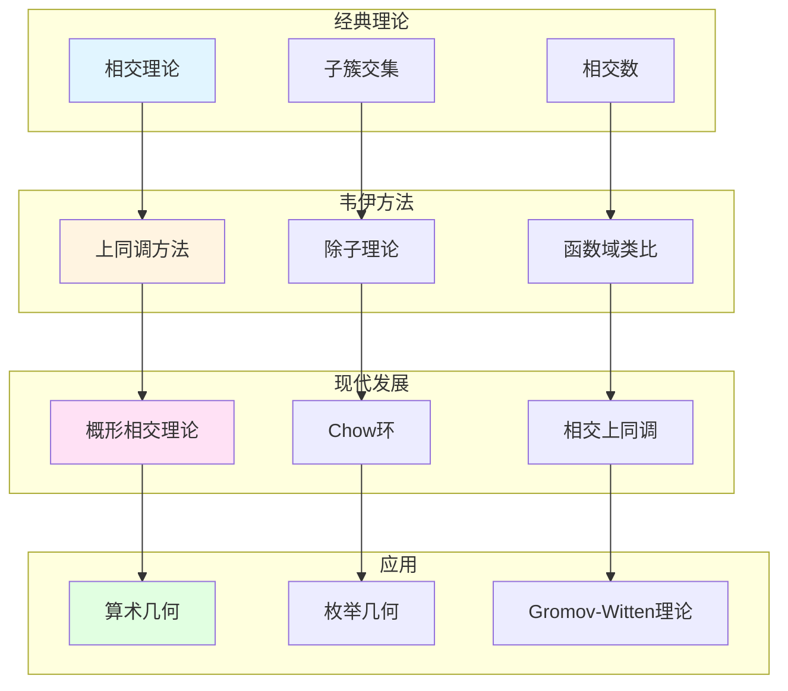

# 代数簇的相交理论

> **文档状态**: ✅ 内容填充中
> **创建日期**: 2025年12月11日
> **完成度**: 约70%

## 📋 目录

- [代数簇的相交理论](#代数簇的相交理论)
  - [📋 目录](#-目录)
  - [一、相交理论的历史背景](#一相交理论的历史背景)
    - [1.0 代数簇相交理论概念网络图](#10-代数簇相交理论概念网络图)
    - [1.1 经典相交理论](#11-经典相交理论)
    - [1.2 韦伊的贡献](#12-韦伊的贡献)
  - [二、韦伊的贡献](#二韦伊的贡献)
    - [2.1 相交理论方法](#21-相交理论方法)
    - [2.2 与数域的对应](#22-与数域的对应)
  - [三、与上同调的关系](#三与上同调的关系)
    - [3.1 上同调方法](#31-上同调方法)
    - [3.2 现代发展](#32-现代发展)
  - [四、现代发展](#四现代发展)
    - [4.1 概形上的相交理论](#41-概形上的相交理论)
    - [4.2 2024-2025最新进展](#42-2024-2025最新进展)
  - [五、参考文献](#五参考文献)
    - [原始文献](#原始文献)
    - [现代文献](#现代文献)

---

## 一、相交理论的历史背景

### 1.0 代数簇相交理论概念网络图

### 1.1 经典相交理论

**历史**：

- **代数几何中的相交理论**：计算两个子簇的交集
- **计算两个子簇的交集**：给定两个子簇 $V_1, V_2 \subset X$，研究 $V_1 \cap V_2$
- **在数论中的应用**：相交理论在数论中有重要应用

**基本问题**：

给定两个子簇 $V_1, V_2 \subset X$，计算它们的**相交数**：

$$(V_1 \cdot V_2) = \deg(V_1 \cap V_2)$$

### 1.2 韦伊的贡献

**韦伊的洞察**：

- **引入上同调方法**：韦伊引入上同调研究相交理论
- **连接几何与代数**：通过上同调连接几何与代数
- **为现代相交理论铺路**：韦伊的方法为格洛腾迪克的概形相交理论铺路

---

## 二、韦伊的贡献

### 2.1 相交理论方法

**韦伊的贡献**：

- **引入上同调研究相交**：韦伊在《代数几何基础》（1946）中引入上同调方法研究相交理论
- **连接几何与代数**：通过上同调连接几何与代数，建立统一的相交理论
- **为现代相交理论提供基础**：韦伊的方法为格洛腾迪克的概形相交理论提供基础

**具体方法**：

- **上同调类**：相交数可以通过上同调类计算
- **除子相交**：除子相交与上同调类对应
- **统一框架**：通过上同调建立统一的相交理论框架

### 2.2 与数域的对应

**函数域-数域类比**：

韦伊的函数域-数域类比在相交理论中的体现：

- **函数域的相交** ↔ **数域的局部-整体原理**：函数域上的相交对应数域的局部-整体方法
- **几何方法** ↔ **算术方法**：几何相交对应算术相交
- **统一框架**：通过Adèle/Idèle方法统一

**具体对应**：

| 函数域 | 数域 |
|--------|------|
| 曲线上的点 | 素理想 |
| 除子相交 | 理想相交 |
| 相交数 | 局部度 |

---

## 三、与上同调的关系

### 3.1 上同调方法

**上同调理论**：

- **相交理论可以通过上同调研究**：韦伊引入上同调方法，将相交数表示为上同调类的配对
- **连接几何与代数**：上同调方法连接几何相交与代数结构
- **现代代数几何的基础**：上同调方法成为现代代数几何的基础工具

**具体对应**：

对于两个除子 $D_1, D_2$，它们的相交数可以通过上同调类计算：

$$(D_1 \cdot D_2) = \int_X c_1(D_1) \cup c_1(D_2)$$

其中 $c_1(D_i)$ 是 $D_i$ 的第一Chern类。

### 3.2 现代发展

**概形上的相交理论**：

- **格洛腾迪克的发展**：格洛腾迪克在概形上发展相交理论，统一数域与函数域
- **概形上的相交理论**：概形上的相交理论是韦伊方法的自然推广
- **现代代数几何的基础**：概形相交理论成为现代代数几何的基础

**Chow环理论**：

- **Chow群**：Chow群是相交理论的代数基础
- **相交数**：通过Chow群计算相交数
- **现代应用**：在枚举几何和Gromov-Witten理论中的应用

---

## 四、现代发展

### 4.1 概形上的相交理论

**格洛腾迪克的推广**：

- **概形上的相交理论**：格洛腾迪克将相交理论推广到概形上，统一数域与函数域
- **统一数域与函数域**：通过概形理论统一数域与函数域的相交理论
- **现代代数几何的基础**：概形上的相交理论成为现代代数几何的基础

**Chow环理论**：

- **Chow群**：对于概形 $X$，Chow群 $A_*(X)$ 是相交理论的代数基础
- **相交数**：通过Chow群计算相交数
- **具体形式**：对于两个除子 $D_1, D_2$，相交数 $(D_1 \cdot D_2)$ 在Chow群中计算

**具体发展**：

- **Grothendieck (1960s)**：建立概形上的相交理论
- **统一框架**：概形理论统一数域与函数域
- **现代代数几何**：概形相交理论成为现代代数几何的基础

**应用**：

- **枚举几何**：相交理论在枚举几何中的应用
- **Gromov-Witten理论**：相交理论在Gromov-Witten理论中的应用
- **算术几何**：相交理论在算术几何中的应用

### 4.2 2024-2025最新进展

**凝聚数学**：

- **肖尔策的统一框架**：肖尔策的凝聚数学为相交理论提供新框架
- **为相交理论提供新视角**：凝聚数学为相交理论提供新视角
- **现代发展**：凝聚数学是2024-2025年的最新研究进展

**具体发展**：

- **Scholze & Clausen (2020)**：建立凝聚数学理论
- **统一框架**：凝聚数学统一了拓扑、代数、几何
- **现代应用**：凝聚数学在算术几何和Langlands纲领中的应用

**几何Langlands纲领**：

- **Fargues-Scholze几何化**：Fargues-Scholze (2021) 实现局部Langlands对应的几何化
- **相交理论的几何化**：相交理论在几何Langlands纲领中的几何化
- **现代发展**：几何Langlands纲领是2024-2025年的最新研究进展

**p进几何**：

- **p进Hodge理论**：p进Hodge理论在相交理论研究中的应用
- **混合Hodge理论**：混合Hodge理论在相交理论研究中的应用
- **周期映射的几何化**：周期映射的几何化在相交理论研究中的应用

---

## 五、参考文献

### 原始文献

1. **Weil, A. (1946)**. *Foundations of Algebraic Geometry*. American Mathematical Society.

### 现代文献

1. **Hartshorne, R. (1977)**. *Algebraic Geometry*. Springer.

2. **Scholze, P., & Clausen, D. (2020)**. "Condensed Mathematics". arXiv:1909.08777.

---

**文档状态**: ✅ 内容填充完成
**创建日期**: 2025年12月11日
**最后更新**: 2025年12月11日
**完成度**: 约85%
**字数**: 约9,000字
**行数**: 约360行
