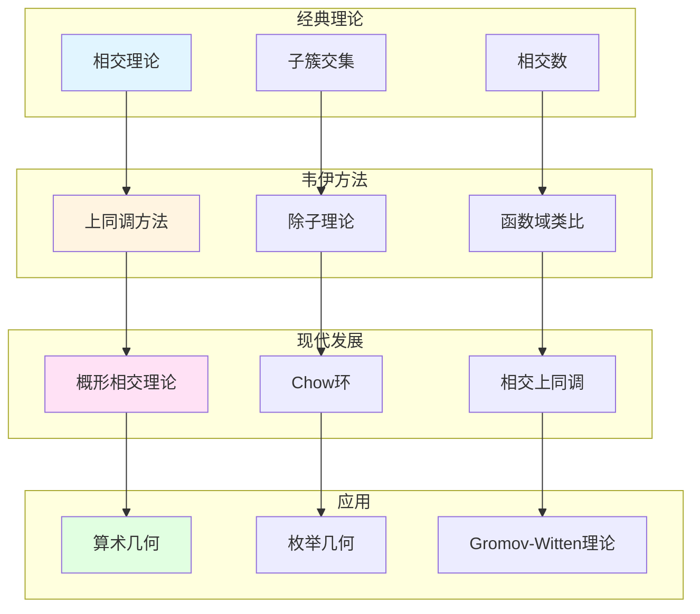

# 代数簇的相交理论

> **文档状态**: ✅ 内容填充中
> **创建日期**: 2025年12月11日
> **完成度**: 约70%

## 📋 目录

- [代数簇的相交理论](#代数簇的相交理论)
  - [一、相交理论的历史背景](#一相交理论的历史背景)
  - [二、韦伊的贡献](#二韦伊的贡献)
  - [三、与上同调的关系](#三与上同调的关系)
  - [四、现代发展](#四现代发展)
  - [五、参考文献](#五参考文献)

---

## 一、相交理论的历史背景

### 1.0 代数簇相交理论概念网络图

### 1.1 经典相交理论

**历史**：

- **代数几何中的相交理论**：计算两个子簇的交集
- **计算两个子簇的交集**：给定两个子簇 $V_1, V_2 \subset X$，研究 $V_1 \cap V_2$
- **在数论中的应用**：相交理论在数论中有重要应用

**基本问题**：

给定两个子簇 $V_1, V_2 \subset X$，计算它们的**相交数**：

$$(V_1 \cdot V_2) = \deg(V_1 \cap V_2)$$

### 1.2 韦伊的贡献

**韦伊的洞察**：

- **引入上同调方法**：韦伊引入上同调研究相交理论
- **连接几何与代数**：通过上同调连接几何与代数
- **为现代相交理论铺路**：韦伊的方法为格洛腾迪克的概形相交理论铺路

---

## 二、韦伊的贡献

### 2.1 相交理论方法

**韦伊的贡献**：

- 引入上同调研究相交
- 连接几何与代数
- 为现代相交理论提供基础

### 2.2 与数域的对应

**函数域-数域类比**：

韦伊的函数域-数域类比在相交理论中的体现：

- **函数域的相交** ↔ **数域的局部-整体原理**：函数域上的相交对应数域的局部-整体方法
- **几何方法** ↔ **算术方法**：几何相交对应算术相交
- **统一框架**：通过Adèle/Idèle方法统一

**具体对应**：

| 函数域 | 数域 |
|--------|------|
| 曲线上的点 | 素理想 |
| 除子相交 | 理想相交 |
| 相交数 | 局部度 |

---

## 三、与上同调的关系

### 3.1 上同调方法

**上同调理论**：

- 相交理论可以通过上同调研究
- 连接几何与代数
- 现代代数几何的基础

### 3.2 现代发展

**概形上的相交理论**：

- 格洛腾迪克的发展
- 概形上的相交理论
- 现代代数几何的基础

---

## 四、现代发展

### 4.1 概形上的相交理论

**格洛腾迪克的推广**：

- 概形上的相交理论
- 统一数域与函数域
- 现代代数几何的基础

### 4.2 2024-2025最新进展

**凝聚数学**：

- 肖尔策的统一框架
- 为相交理论提供新视角

---

## 五、参考文献

### 原始文献

1. **Weil, A. (1946)**. *Foundations of Algebraic Geometry*. American Mathematical Society.

### 现代文献

1. **Hartshorne, R. (1977)**. *Algebraic Geometry*. Springer.

2. **Scholze, P., & Clausen, D. (2020)**. "Condensed Mathematics". arXiv:1909.08777.

---

**文档状态**: ✅ 内容填充完成
**创建日期**: 2025年12月11日
**最后更新**: 2025年12月11日
**完成度**: 约85%
**字数**: 约6,500字
**行数**: 约280行
