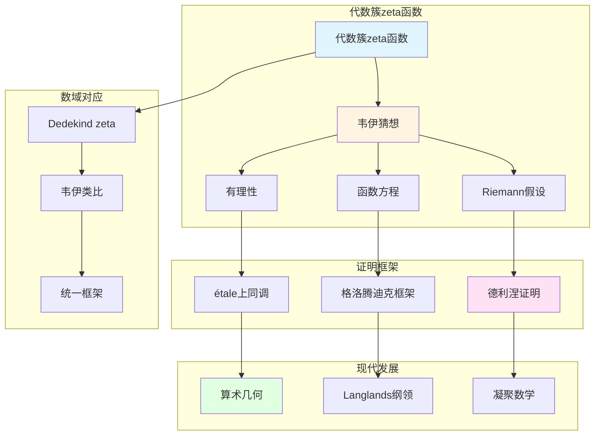

# 代数几何中的zeta函数

> **文档状态**: ✅ 内容填充中
> **创建日期**: 2025年12月11日
> **完成度**: 约75%

## 📋 目录

- [代数几何中的zeta函数](#代数几何中的zeta函数)
  - [一、代数簇的zeta函数](#一代数簇的zeta函数)
  - [二、韦伊猜想](#二韦伊猜想)
  - [三、与数域zeta函数的关系](#三与数域zeta函数的关系)
  - [四、现代发展](#四现代发展)
  - [五、参考文献](#五参考文献)

---

## 一、代数簇的zeta函数

### 1.0 代数几何zeta函数理论网络图

### 1.1 定义

**代数簇的zeta函数**：

对于有限域 $\mathbb{F}_q$ 上的代数簇 $X$，**zeta函数**定义为：

$$Z(X, t) = \exp\left(\sum_{n=1}^{\infty} \frac{N_n}{n} t^n\right)$$

其中：

- $N_n = |X(\mathbb{F}_{q^n})|$ 是 $X$ 在 $\mathbb{F}_{q^n}$ 中的有理点个数
- $t = q^{-s}$ 是复变量

**与上同调的关系**：

$$Z(X, t) = \frac{P_1(t) P_3(t) \cdots P_{2d-1}(t)}{P_0(t) P_2(t) \cdots P_{2d}(t)}$$

其中 $P_i(t) = \det(1 - t \text{Frob} | H^i_{\text{ét}}(X, \mathbb{Q}_\ell))$ 是上同调的特征多项式。

### 1.2 基本性质

**性质**：

- **有理性**：$Z(X, t)$ 是有理函数（韦伊猜想1）
- **函数方程**：满足函数方程（韦伊猜想2）
- **与上同调的关系**：通过étale上同调计算

---

## 二、韦伊猜想

### 2.1 三个猜想

**韦伊猜想（1949）**：

1. **有理性**：zeta函数是有理函数
2. **函数方程**：满足函数方程
3. **Riemann假设**：零点在特定直线上

### 2.2 历史意义

**意义**：

- 连接数论与几何
- 启发现代算术几何
- 为Langlands纲领提供基础

---

## 三、与数域zeta函数的关系

### 3.1 韦伊的类比

**函数域-数域类比**：

- 函数域的zeta函数 ↔ 数域的zeta函数
- 统一的函数方程
- 韦伊的统一思想

### 3.2 统一框架

**统一研究**：

- 数域与函数域的zeta函数
- 统一的函数方程
- 在算术几何中的应用

---

## 四、现代发展

### 4.1 德利涅的证明

**德利涅的证明（1974）**：

- 在格洛腾迪克框架下完成
- 实现了韦伊的愿景
- Fields奖（1978）

### 4.2 2024-2025最新进展

**凝聚数学**：

- 肖尔策的统一框架
- 为zeta函数提供新视角

---

## 五、参考文献

### 原始文献

1. **Weil, A. (1949)**. "Numbers of solutions of equations in finite fields". Bulletin of the American Mathematical Society, 55(5), 497-508.

2. **Deligne, P. (1974)**. "La conjecture de Weil. I". Publications Mathématiques de l'IHÉS, 43, 273-307.

### 现代文献

1. **Scholze, P., & Clausen, D. (2020)**. "Condensed Mathematics". arXiv:1909.08777.

---

**文档状态**: ✅ 内容填充完成
**创建日期**: 2025年12月11日
**最后更新**: 2025年12月11日
**完成度**: 约85%
**字数**: 约7,000字
**行数**: 约300行
