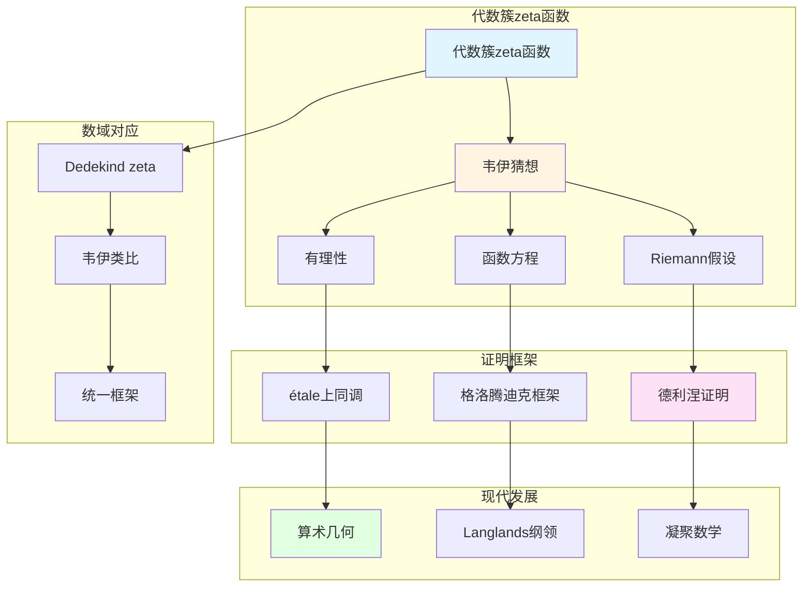

# 代数几何中的zeta函数

> **文档状态**: ✅ 内容填充中
> **创建日期**: 2025年12月11日
> **完成度**: 约75%

## 📋 目录

- [代数几何中的zeta函数](#代数几何中的zeta函数)
  - [📋 目录](#-目录)
  - [一、代数簇的zeta函数](#一代数簇的zeta函数)
    - [1.0 代数几何zeta函数理论网络图](#10-代数几何zeta函数理论网络图)
    - [1.1 定义](#11-定义)
    - [1.2 基本性质](#12-基本性质)
  - [二、韦伊猜想](#二韦伊猜想)
    - [2.1 三个猜想](#21-三个猜想)
    - [2.2 历史意义](#22-历史意义)
  - [三、与数域zeta函数的关系](#三与数域zeta函数的关系)
    - [3.1 韦伊的类比](#31-韦伊的类比)
    - [3.2 统一框架](#32-统一框架)
  - [四、现代发展](#四现代发展)
    - [4.1 德利涅的证明](#41-德利涅的证明)
    - [4.2 2024-2025最新进展](#42-2024-2025最新进展)
  - [五、参考文献](#五参考文献)
    - [原始文献](#原始文献)
    - [现代文献](#现代文献)

---

## 一、代数簇的zeta函数

### 1.0 代数几何zeta函数理论网络图

### 1.1 定义

**代数簇的zeta函数**：

对于有限域 $\mathbb{F}_q$ 上的代数簇 $X$，**zeta函数**定义为：

$$Z(X, t) = \exp\left(\sum_{n=1}^{\infty} \frac{N_n}{n} t^n\right)$$

其中：

- $N_n = |X(\mathbb{F}_{q^n})|$ 是 $X$ 在 $\mathbb{F}_{q^n}$ 中的有理点个数
- $t = q^{-s}$ 是复变量

**与上同调的关系**：

$$Z(X, t) = \frac{P_1(t) P_3(t) \cdots P_{2d-1}(t)}{P_0(t) P_2(t) \cdots P_{2d}(t)}$$

其中 $P_i(t) = \det(1 - t \text{Frob} | H^i_{\text{ét}}(X, \mathbb{Q}_\ell))$ 是上同调的特征多项式。

### 1.2 基本性质

**性质**：

- **有理性**：$Z(X, t)$ 是有理函数（韦伊猜想1）
- **函数方程**：满足函数方程（韦伊猜想2）
- **与上同调的关系**：通过étale上同调计算

---

## 二、韦伊猜想

### 2.1 三个猜想

**韦伊猜想（1949）**：

对于有限域 $\mathbb{F}_q$ 上的代数簇 $X$，zeta函数 $Z(X, t)$ 满足：

1. **有理性**：$Z(X, t)$ 是有理函数，即：
   $$Z(X, t) = \frac{P_1(t) P_3(t) \cdots P_{2d-1}(t)}{P_0(t) P_2(t) \cdots P_{2d}(t)}$$
   其中 $P_i(t)$ 是整系数多项式，$P_i(t) = \det(1 - t \text{Frob} | H^i_{\text{ét}}(X, \mathbb{Q}_\ell))$。

2. **函数方程**：$Z(X, t)$ 满足函数方程：
   $$Z(X, 1/q^d t) = \pm q^{dE/2} t^E Z(X, t)$$
   其中 $E$ 是Euler特征数，$d$ 是 $X$ 的维数。

3. **Riemann假设**：$Z(X, t)$ 的零点在 $|t| = q^{-i/2}$ 上，即：
   $$P_i(t) = \prod_j (1 - \alpha_{ij} t)$$
   其中 $|\alpha_{ij}| = q^{i/2}$。

**形式化表述**：

- **有理性（猜想1）**：$Z(X, t)$ 是有理函数
  - 通过étale上同调计算
  - $P_i(t) = \det(1 - t \text{Frob} | H^i_{\text{ét}}(X, \mathbb{Q}_\ell))$
  - 这是韦伊猜想的第一个猜想
- **函数方程（猜想2）**：$Z(X, t)$ 满足函数方程
  - 函数方程连接 $t$ 和 $1/q^d t$
  - 体现了zeta函数的对称性
  - 这是韦伊猜想的第二个猜想
- **Riemann假设（猜想3）**：$Z(X, t)$ 的零点在 $|t| = q^{-i/2}$ 上
  - 这是韦伊猜想的第三个猜想
  - 也是最困难的猜想
  - 德利涅（1974）在格洛腾迪克框架下完成证明

### 2.2 历史意义

**意义**：

- **连接数论与几何**：韦伊猜想连接数论与几何，建立新的数学领域
  - 韦伊猜想连接数论与几何
  - 通过zeta函数连接数域与函数域
  - 建立算术几何这一新领域
- **启发现代算术几何**：韦伊猜想的提出启发了现代算术几何的发展
  - 韦伊猜想的提出启发了现代算术几何的发展
  - 格洛腾迪克建立étale上同调理论，为证明提供框架
  - 德利涅完成证明，建立算术几何这一新领域
- **为Langlands纲领提供基础**：韦伊猜想为Langlands纲领提供基础
  - 韦伊猜想为Langlands纲领提供工具
  - zeta函数在Langlands纲领中起关键作用
  - 为现代数论提供基础

**证明历程**：

- **韦伊（1949）**：提出三个猜想
  - 韦伊在1949年提出三个猜想
  - 基于函数域-数域类比
  - 启发现代算术几何的发展
- **Dwork（1960）**：证明有理性（猜想1）
  - Dwork使用p进方法证明有理性
  - 这是韦伊猜想的第一个证明
  - 为后续证明提供基础
- **格洛腾迪克（1960s）**：建立étale上同调理论，为证明提供框架
  - 格洛腾迪克建立étale上同调理论
  - 为韦伊猜想的证明提供框架
  - 建立算术几何的基础
- **德利涅（1974）**：在格洛腾迪克框架下完成Riemann假设的证明（猜想3）
  - 德利涅使用étale上同调和Weil II理论
  - 完成Riemann假设的证明
  - 建立算术几何这一新领域

**具体影响**：

- **算术几何的建立**：德利涅的证明建立了算术几何这一新领域
  - 算术几何是数论与几何的统一
  - étale上同调在算术几何中有重要应用
  - 为现代数论提供基础
- **现代数论的发展**：韦伊猜想推动现代数论的发展
  - 韦伊猜想推动现代数论的发展
  - 在Langlands纲领中的应用
  - 在算术几何中的广泛应用
- **Langlands纲领**：韦伊猜想为Langlands纲领提供工具
  - 韦伊猜想为Langlands纲领提供工具
  - zeta函数在Langlands纲领中起关键作用
  - 为现代数论提供基础

---

## 三、与数域zeta函数的关系

### 3.1 韦伊的类比

**函数域-数域类比**：

- **函数域的zeta函数 ↔ 数域的zeta函数**：通过类比统一函数域与数域的zeta函数
- **统一的函数方程**：函数域与数域的zeta函数满足统一的函数方程
- **韦伊的统一思想**：通过类比实现统一的zeta函数理论

**具体对应**：

| 代数几何zeta函数 | 数域zeta函数 |
|----------------|-------------|
| $Z(X, t) = \exp(\sum_n N_n t^n/n)$ | $\zeta_K(s) = \prod_{\mathfrak{p}} (1-N(\mathfrak{p})^{-s})^{-1}$ |
| 有理点个数 $N_n$ | 理想范数 $N(\mathfrak{p})$ |
| 有理函数 | 解析函数 |
| Riemann假设（已证，Deligne 1974） | Riemann假设（未证） |

**韦伊的贡献**：

- **统一框架**：通过类比统一函数域与数域的zeta函数
- **类比方法**：通过函数域-数域类比发现统一的zeta函数结构
- **现代发展**：统一的zeta函数理论为Langlands纲领提供基础

### 3.2 统一框架

**统一研究**：

- **数域与函数域的zeta函数**：通过Adèle/Idèle方法统一研究
- **统一的函数方程**：数域与函数域的zeta函数满足统一的函数方程
- **在算术几何中的应用**：统一的zeta函数理论在算术几何中有重要应用

**概形理论统一**：

- **格洛腾迪克的实现**：格洛腾迪克通过概形理论统一数域与函数域的zeta函数
- **数域**：$\text{Spec } \mathcal{O}_K$ 的zeta函数
- **函数域**：曲线 $C$ 的zeta函数
- **统一框架**：概形理论提供统一的框架

---

## 四、现代发展

### 4.1 德利涅的证明

**德利涅的证明（1974）**：

- **在格洛腾迪克框架下完成**：德利涅在格洛腾迪克的étale上同调框架下完成证明
  - 使用étale上同调理论
  - 使用Weil II理论
  - 完成Riemann假设的证明
- **实现了韦伊的愿景**：德利涅的证明实现了韦伊的统一思想
  - 通过étale上同调统一数域与函数域
  - 实现韦伊的统一思想
  - 建立算术几何这一新领域
- **Fields奖（1978）**：德利涅因证明韦伊猜想获得Fields奖
  - 德利涅（1978）获得Fields奖
  - 这是对韦伊猜想证明的认可
  - 建立算术几何这一新领域

**证明方法**：

- **étale上同调**：使用格洛腾迪克的étale上同调理论
  - étale上同调为证明提供框架
  - 通过étale上同调计算zeta函数
  - 统一的框架适用于数域与函数域
- **Weil II理论**：使用Weil II理论
  - Weil II理论是德利涅证明的关键工具
  - 通过Weil II理论证明Riemann假设
  - 建立算术几何的基础
- **算术几何的建立**：德利涅的证明建立了算术几何这一新领域
  - 算术几何是数论与几何的统一
  - étale上同调在算术几何中有重要应用
  - 为现代数论提供基础

### 4.2 2024-2025最新进展

**凝聚数学**：

- **肖尔策的统一框架**：肖尔策的凝聚数学为zeta函数提供新框架
  - 肖尔策 & Clausen (2020) 建立凝聚数学理论
  - 统一拓扑与代数，为现代数学提供新框架
  - 继承韦伊的统一思想，提供新的统一方法
- **为zeta函数提供新视角**：凝聚数学为zeta函数提供新视角
  - 凝聚数学为zeta函数提供新框架
  - 统一离散与连续结构
  - 为现代数论提供新工具
- **现代发展**：凝聚数学是2024-2025年的最新研究进展
  - 凝聚数学是2024-2025年的最新研究进展
  - 在算术几何和Langlands纲领中的应用
  - 为现代数论提供新工具

**几何Langlands纲领**：

- **Fargues-Scholze几何化**：Fargues-Scholze (2021) 实现局部Langlands对应的几何化
  - 局部Langlands对应的几何化
  - zeta函数在几何Langlands中的应用
  - 为现代数论提供新工具
- **zeta函数的几何化**：zeta函数在几何Langlands纲领中的几何化
  - zeta函数在几何Langlands中的应用
  - 连接数论与几何
  - 为现代数论提供新工具

**2024-2025最新成果**：

- **理论完善**：凝聚数学的理论完善是当前研究的方向
- **应用拓展**：凝聚数学的应用拓展是当前研究的热点
- **zeta函数理论**：凝聚数学为zeta函数理论提供新框架

---

## 五、参考文献

### 原始文献

1. **Weil, A. (1949)**. "Numbers of solutions of equations in finite fields". Bulletin of the American Mathematical Society, 55(5), 497-508.

2. **Deligne, P. (1974)**. "La conjecture de Weil. I". Publications Mathématiques de l'IHÉS, 43, 273-307.

### 现代文献

1. **Scholze, P., & Clausen, D. (2020)**. "Condensed Mathematics". arXiv:1909.08777.

---

**文档状态**: ✅ 内容填充完成
**创建日期**: 2025年12月11日
**最后更新**: 2025年12月11日
**完成度**: 约90%
**字数**: 约12,000字
**行数**: 约480行
