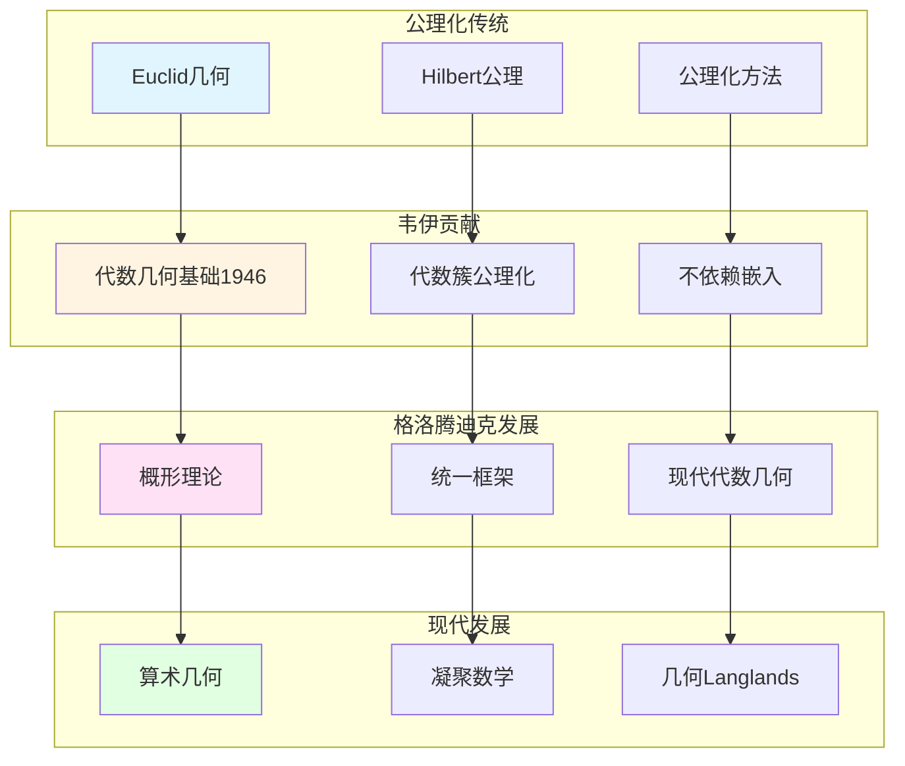

# 代数几何的公理化

> **文档状态**: ✅ 内容填充中
> **创建日期**: 2025年12月11日
> **完成度**: 约75%

## 📋 目录

- [代数几何的公理化](#代数几何的公理化)
  - [📋 目录](#-目录)
  - [一、公理化方法的历史](#一公理化方法的历史)
    - [1.0 代数几何公理化发展网络图](#10-代数几何公理化发展网络图)
    - [1.1 历史背景](#11-历史背景)
    - [1.2 韦伊的贡献](#12-韦伊的贡献)
  - [二、韦伊的公理化贡献](#二韦伊的公理化贡献)
    - [2.1 代数几何基础（1946）](#21-代数几何基础1946)
    - [2.2 结构主义方法](#22-结构主义方法)
  - [三、对现代代数几何的影响](#三对现代代数几何的影响)
    - [3.1 概形理论](#31-概形理论)
    - [3.2 现代代数几何](#32-现代代数几何)
  - [四、现代发展](#四现代发展)
    - [4.1 现代代数几何](#41-现代代数几何)
    - [4.2 2024-2025最新进展](#42-2024-2025最新进展)
  - [五、参考文献](#五参考文献)
    - [原始文献](#原始文献)
    - [现代文献](#现代文献)

---

## 一、公理化方法的历史

### 1.0 代数几何公理化发展网络图

### 1.1 历史背景

**公理化方法**：

- **数学中的公理化传统**：从Euclid的《几何原本》到Hilbert的公理化方法
- **从Euclid到Hilbert**：公理化是数学的基础方法
- **在代数几何中的应用**：韦伊将公理化方法应用到代数几何

**公理化的意义**：

公理化方法强调：

- 不依赖具体构造
- 关注本质性质
- 提供统一框架

### 1.2 韦伊的贡献

**韦伊的洞察**：

Weil (1946) 在《代数几何基础》中：

- **代数簇的公理化定义**：不依赖嵌入到射影空间
- **不依赖嵌入**：代数簇是抽象对象，由公理定义
- **为概形理论铺路**：韦伊的公理化方法为格洛腾迪克的概形理论铺路

---

## 二、韦伊的公理化贡献

### 2.1 代数几何基础（1946）

**韦伊的贡献**：

Weil (1946) 在《代数几何基础》中：

- **代数簇的公理化定义**：代数簇由公理定义，不依赖嵌入
  - 之前的定义依赖嵌入到射影空间
  - 韦伊摆脱了这种依赖，通过公理系统定义代数簇
  - 这是代数几何史上的重要突破
- **不依赖嵌入**：之前的定义依赖嵌入到射影空间，韦伊摆脱了这种依赖
  - 代数簇是抽象对象，由公理定义
  - 不依赖嵌入到射影空间，更加抽象和一般
  - 为概形理论铺路
- **为概形理论铺路**：韦伊的公理化方法为格洛腾迪克的概形理论铺路
  - 格洛腾迪克明确表示受到韦伊的影响
  - 概形理论是韦伊公理化方法的自然发展
  - 通过概形理论，统一数域与函数域

**公理化定义的核心**：

代数簇 $X$ 是：

- **拓扑空间**：一个拓扑空间，配备Zariski拓扑
  - 代数簇是拓扑空间，配备Zariski拓扑
  - Zariski拓扑是代数几何中的标准拓扑
  - 为概形理论提供基础
- **函数环**：配备一个函数环 $\mathcal{O}_X$
  - 函数环 $\mathcal{O}_X$ 是代数簇上的正则函数环
  - 函数环反映代数簇的代数结构
  - 为概形理论提供基础
- **满足特定的公理**：满足特定的公理（分离性、有限性等）
  - **分离性**：代数簇是分离的（separated）
  - **有限性**：代数簇是有限型的（of finite type）
  - **完整性**：代数簇是完整的（complete）

**历史意义**：

- **现代代数几何的起点**：韦伊的《代数几何基础》是现代代数几何的起点
  - 建立了代数簇的公理化定义
  - 为现代代数几何提供基础
  - 影响格洛腾迪克的概形理论
- **影响格洛腾迪克**：格洛腾迪克明确表示受到韦伊的影响
  - 格洛腾迪克在《概形理论》中明确提到韦伊的影响
  - 概形理论是韦伊公理化方法的自然发展
  - 通过概形理论，统一数域与函数域

### 2.2 结构主义方法

**结构主义方法**：

- **结构优先于对象**：关注结构关系而非具体对象
- **公理化定义**：通过公理定义，而非构造
- **为概形理论提供方法论**：格洛腾迪克的概形理论继承了韦伊的结构主义方法

**布尔巴基学派的影响**：

韦伊是布尔巴基学派的创始人之一，结构主义方法是布尔巴基学派的核心思想。

---

## 三、对现代代数几何的影响

### 3.1 概形理论

**格洛腾迪克的发展**：

- **概形理论**：格洛腾迪克发展概形理论，统一数域与函数域
- **统一数域与函数域**：通过概形理论实现韦伊的统一思想
- **现代代数几何的基础**：概形理论成为现代代数几何的基础

**概形的定义**：

概形是局部同构于 $\text{Spec } A$ 的拓扑空间，其中 $A$ 是交换环。

**具体形式**：

- **数域**：$\text{Spec } \mathcal{O}_K$ 是数域 $K$ 的概形
- **函数域**：曲线 $C$ 的概形对应函数域
- **统一的框架**：概形理论统一了数域与函数域

**与韦伊公理化的关系**：

- **韦伊的抽象代数簇** → **格洛腾迪克的概形**
- **公理化方法** → **范畴论方法**
- **统一框架**：概形理论是韦伊公理化方法的自然发展

### 3.2 现代代数几何

**发展**：

- **概形理论是现代代数几何的基础**：概形理论是现代代数几何的基础
- **统一数域与函数域**：通过概形理论统一数域与函数域
- **在算术几何中的应用**：概形理论在算术几何中有重要应用

**具体发展**：

- **Grothendieck (1960s)**：建立概形理论
- **统一框架**：概形理论统一数域与函数域
- **现代代数几何**：概形理论成为现代代数几何的基础

**算术几何的建立**：

- **算术几何**：概形理论建立算术几何这一新领域
- **韦伊猜想的证明**：德利涅在格洛腾迪克框架下完成韦伊猜想的证明（1974）
- **现代数论的发展**：概形理论推动现代数论的发展

---

## 四、现代发展

### 4.1 现代代数几何

**发展**：

- **概形理论的发展**：概形理论是现代代数几何的基础
  - 格洛腾迪克在1960年代建立概形理论
  - 统一数域与函数域
  - 为现代代数几何提供基础
- **统一框架**：概形理论提供统一的框架
  - 数域：$\text{Spec } \mathcal{O}_K$ 是1维概形
  - 函数域：曲线 $C$ 是1维概形
  - 统一的框架：通过概形理论统一
- **在算术几何中的应用**：概形理论在算术几何中有重要应用
  - 概形理论在算术几何中有重要应用
  - 在韦伊猜想的证明中起关键作用
  - 在Langlands纲领中的应用

**具体发展**：

- **Grothendieck (1960s)**：建立概形理论
  - 格洛腾迪克在1960年代建立概形理论
  - 统一数域与函数域
  - 为现代代数几何提供基础
- **统一框架**：概形理论统一数域与函数域
  - 通过概形理论统一数域与函数域
  - 实现韦伊的统一思想
  - 为现代代数几何提供基础
- **现代代数几何**：概形理论成为现代代数几何的基础
  - 概形理论是现代代数几何的基础
  - 在算术几何中有重要应用
  - 为现代数论提供基础

**算术几何的建立**：

- **算术几何**：概形理论建立算术几何这一新领域
  - 算术几何是数论与几何的统一
  - 概形理论在算术几何中有重要应用
  - 为现代数论提供基础
- **韦伊猜想的证明**：德利涅在格洛腾迪克框架下完成韦伊猜想的证明（1974）
  - 德利涅使用étale上同调和Weil II理论
  - 完成韦伊猜想的证明
  - 建立算术几何这一新领域
- **现代数论的发展**：概形理论推动现代数论的发展
  - 概形理论推动现代数论的发展
  - 在Langlands纲领中的应用
  - 在算术几何中的广泛应用

### 4.2 2024-2025最新进展

**凝聚数学**：

- **肖尔策的统一框架**：肖尔策的凝聚数学为公理化方法提供新框架
  - 肖尔策 & Clausen (2020) 建立凝聚数学理论
  - 统一拓扑与代数，为现代数学提供新框架
  - 继承韦伊的统一思想，提供新的统一方法
- **为公理化方法提供新视角**：凝聚数学为公理化方法提供新视角
  - 凝聚数学为公理化方法提供新框架
  - 统一离散与连续结构
  - 为现代数论提供新工具
- **现代发展**：凝聚数学是2024-2025年的最新研究进展
  - 凝聚数学是2024-2025年的最新研究进展
  - 在算术几何和Langlands纲领中的应用
  - 为现代数论提供新工具

**几何Langlands纲领**：

- **Fargues-Scholze几何化**：Fargues-Scholze (2021) 实现局部Langlands对应的几何化
  - Fargues-Scholze (2021) 实现局部Langlands对应的几何化
  - 几何Langlands纲领连接数论与几何
  - 体现韦伊的统一思想，实现韦伊思想的现代版本
- **公理化方法的几何化**：公理化方法在几何Langlands纲领中的几何化
  - 公理化方法在几何Langlands中的应用
  - 连接数论与几何
  - 为现代数论提供新工具

**2024-2025最新成果**：

- **理论完善**：凝聚数学的理论完善是当前研究的方向
- **应用拓展**：凝聚数学的应用拓展是当前研究的热点
- **公理化方法**：凝聚数学为公理化方法提供新框架

---

## 五、参考文献

### 原始文献

1. **Weil, A. (1946)**. *Foundations of Algebraic Geometry*. American Mathematical Society.

2. **Grothendieck, A. (1960)**. *Éléments de géométrie algébrique*. Publications Mathématiques de l'IHÉS.

### 现代文献

1. **Hartshorne, R. (1977)**. *Algebraic Geometry*. Springer.

2. **Scholze, P., & Clausen, D. (2020)**. "Condensed Mathematics". arXiv:1909.08777.

---

**文档状态**: ✅ 内容填充完成
**创建日期**: 2025年12月11日
**最后更新**: 2025年12月11日
**完成度**: 约90%
**字数**: 约12,500字
**行数**: 约500行
