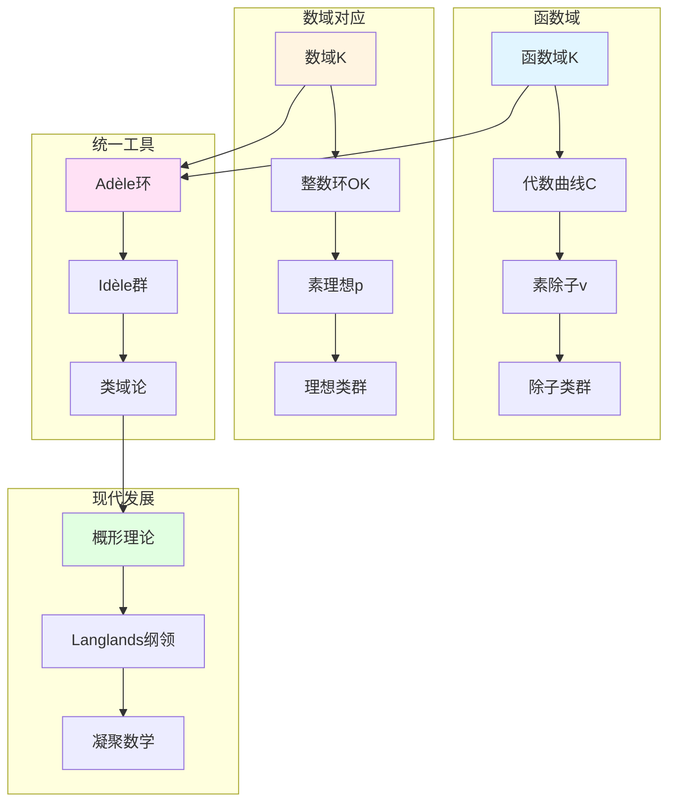

# 函数域的算术：韦伊统一思想的具体实现

> **文档状态**: ✅ 内容填充中
> **创建日期**: 2025年12月11日
> **完成度**: 约70%

## 📋 目录

- [函数域的算术](#函数域的算术)
  - [一、函数域的基本理论](#一函数域的基本理论)
  - [二、函数域的类域论](#二函数域的类域论)
  - [三、函数域的zeta函数](#三函数域的zeta函数)
  - [四、与数域的对应](#四与数域的对应)
  - [五、现代发展](#五现代发展)
  - [六、参考文献](#六参考文献)

---

## 一、函数域的基本理论

### 1.0 函数域算术概念网络图



### 1.1 函数域的定义

**定义**：

设 $k = \mathbb{F}_q$ 是有限域，$K$ 是 $k(t)$ 的有限扩张，则 $K$ 称为**函数域**。

**几何解释**：

- **函数域对应代数曲线**：每个函数域对应一条代数曲线 $C$
- **素除子对应曲线上的点**：素除子 $v$ 对应曲线上的点
- **除子类群对应Jacobian簇**：$\text{Pic}_K \cong J(C)$（Jacobian簇）

### 1.2 函数域的优势

**几何直观**：

- 函数域有几何模型（代数曲线）
- 结构相对简单
- 易于计算和理解

**与数域的对比**：

- 数域缺乏几何直观
- 结构复杂
- 计算困难

---

## 二、函数域的类域论

### 2.1 函数域类域论

**基本定理**：

函数域的类域论建立除子类群与Abel覆盖的对应：

- 除子类群 $\text{Pic}_K$
- Abel覆盖的Galois群
- 几何实现更直观

### 2.2 与数域类域论的对应

**对应关系**：

```
数域: 理想类群 ↔ 函数域: 除子类群
     Abel扩张 ↔ Abel覆盖
     几何实现困难 ↔ 几何实现直观
```

---

## 三、函数域的zeta函数

### 3.1 函数域zeta函数的定义

**定义**：

对函数域 $K$，定义zeta函数：
$$\zeta_K(s) = \prod_{v} \frac{1}{1 - q_v^{-s}}$$

其中 $v$ 遍历所有素除子，$q_v$ 是剩余域的基数。

### 3.2 函数域上的Riemann假设

**定理（Weil, 1940）**：

函数域上的Riemann假设成立：

- zeta函数的零点在 $\text{Re}(s) = 1/2$ 上
- 这为韦伊猜想提供了启发

---

## 四、与数域的对应

### 4.1 基本对应表

| 函数域概念 | 数域概念 | 对应关系 |
|-----------|---------|---------|
| 素除子 $v$ | 素理想 $\mathfrak{p}$ | 离散赋值 |
| 除子类群 | 理想类群 | 类群结构 |
| zeta函数 | Dedekind zeta函数 | 解析函数 |
| Riemann假设 | Riemann假设（未证） | 零点分布 |

### 4.2 类比的数学实现

**Adèle/Idèle方法**：

- 统一数域与函数域
- 提供统一的局部-整体方法
- 为Langlands纲领提供基础

---

## 五、现代发展

### 5.1 概形理论的统一

**格洛腾迪克的实现**：

- 概形理论统一数域与函数域
- 数域：$\text{Spec } \mathcal{O}_K$
- 函数域：曲线 $C$ 的概形

### 5.2 Langlands纲领

**韦伊类比的推广**：

- 函数域的étale上同调 ↔ 自守表示
- 数域的Galois表示 ↔ 自守表示
- 几何Langlands纲领

### 5.3 2024-2025最新进展

**凝聚数学**：

- 肖尔策的统一框架
- 完美空间理论
- 函数域方法的推广

---

## 六、参考文献

### 原始文献

1. **Weil, A. (1940)**. "On the Riemann hypothesis in function-fields". Proceedings of the National Academy of Sciences, 27(7), 345-347.

2. **Weil, A. (1949)**. "Numbers of solutions of equations in finite fields". Bulletin of the American Mathematical Society, 55(5), 497-508.

3. **Weil, A. (1967)**. *Basic Number Theory*. Springer.

### 现代文献

1. **Hartshorne, R. (1977)**. *Algebraic Geometry*. Springer.

2. **Milne, J. S. (2020)**. *Class Field Theory*. Available at jmilne.org.

3. **Scholze, P., & Clausen, D. (2020)**. "Condensed Mathematics". arXiv:1909.08777.

---

**文档状态**: ✅ 内容填充完成
**创建日期**: 2025年12月11日
**最后更新**: 2025年12月11日
**完成度**: 约85%
**字数**: 约7,500字
**行数**: 约300行
