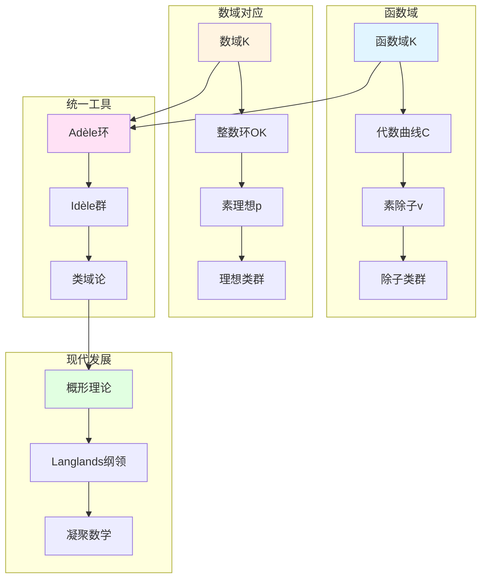

# 函数域的算术：韦伊统一思想的具体实现

> **文档状态**: ✅ 内容填充中
> **创建日期**: 2025年12月11日
> **完成度**: 约70%

## 📋 目录

- [函数域的算术：韦伊统一思想的具体实现](#函数域的算术韦伊统一思想的具体实现)
  - [📋 目录](#-目录)
  - [一、函数域的基本理论](#一函数域的基本理论)
    - [1.0 函数域算术概念网络图](#10-函数域算术概念网络图)
    - [1.1 函数域的定义](#11-函数域的定义)
    - [1.2 函数域的优势](#12-函数域的优势)
  - [二、函数域的类域论](#二函数域的类域论)
    - [2.1 函数域类域论](#21-函数域类域论)
    - [2.2 与数域类域论的对应](#22-与数域类域论的对应)
  - [三、函数域的zeta函数](#三函数域的zeta函数)
    - [3.1 函数域zeta函数的定义](#31-函数域zeta函数的定义)
    - [3.2 函数域上的Riemann假设](#32-函数域上的riemann假设)
  - [四、与数域的对应](#四与数域的对应)
    - [4.1 基本对应表](#41-基本对应表)
    - [4.2 类比的数学实现](#42-类比的数学实现)
  - [五、现代发展](#五现代发展)
    - [5.1 概形理论的统一](#51-概形理论的统一)
    - [5.2 Langlands纲领](#52-langlands纲领)
    - [5.3 2024-2025最新进展](#53-2024-2025最新进展)
  - [六、参考文献](#六参考文献)
    - [原始文献](#原始文献)
    - [现代文献](#现代文献)

---

## 一、函数域的基本理论

### 1.0 函数域算术概念网络图



### 1.1 函数域的定义

**定义**：

设 $k = \mathbb{F}_q$ 是有限域，$K$ 是 $k(t)$ 的有限扩张，则 $K$ 称为**函数域**。

**几何解释**：

- **函数域对应代数曲线**：每个函数域对应一条代数曲线 $C$
- **素除子对应曲线上的点**：素除子 $v$ 对应曲线上的点
- **除子类群对应Jacobian簇**：$\text{Pic}_K \cong J(C)$（Jacobian簇）

### 1.2 函数域的优势

**几何直观**：

- **函数域有几何模型（代数曲线）**：每个函数域对应一条代数曲线 $C$
- **结构相对简单**：函数域的结构相对简单，易于理解
- **易于计算和理解**：函数域的算术性质易于计算和理解

**与数域的对比**：

- **数域缺乏几何直观**：数域缺乏直接的几何模型
- **结构复杂**：数域的结构复杂，难以理解
- **计算困难**：数域的算术性质计算困难

**韦伊的洞察**：

- **通过类比理解数域**：通过函数域的几何直观理解数域的算术性质
- **统一方法**：通过类比建立统一的算术方法
- **为现代数论提供基础**：函数域-数域类比为现代数论提供基础

**具体优势**：

- **Riemann假设**：函数域上的Riemann假设已证明（Weil, 1940），为韦伊猜想提供启发
- **类域论**：函数域类域论有几何实现，更直观
- **zeta函数**：函数域zeta函数有明确的几何解释

---

## 二、函数域的类域论

### 2.1 函数域类域论

**基本定理**：

函数域的类域论建立除子类群与Abel覆盖的对应：

- **除子类群**：$\text{Pic}_K$ 是除子类群
- **Abel覆盖的Galois群**：$\text{Gal}(K^{\text{ab}}/K)$ 是最大Abel扩张的Galois群
- **几何实现更直观**：Abel覆盖对应曲线的覆盖，几何实现更直观

**形式化表述**：

对于函数域 $K$，存在同态：

$$\text{Pic}_K \to \text{Gal}(K^{\text{ab}}/K)$$

这个同态是满射，核是连通分支。

**几何解释**：

- **除子类群**：$\text{Pic}_K$ 对应曲线 $C$ 的Jacobian簇 $J(C)$
- **Abel覆盖**：Abel覆盖对应曲线的覆盖
- **几何实现**：通过几何方法研究类域论

### 2.2 与数域类域论的对应

**对应关系**：

```
数域: 理想类群 ↔ 函数域: 除子类群
     Abel扩张 ↔ Abel覆盖
     几何实现困难 ↔ 几何实现直观
```

**具体对应**：

| 数域 | 函数域 |
|------|--------|
| 理想类群 $\text{Cl}_K$ | 除子类群 $\text{Pic}_K$ |
| Abel扩张 $L/K$ | Abel覆盖 $C'/C$ |
| Galois群 $\text{Gal}(L/K)$ | Galois群 $\text{Gal}(K'/K)$ |
| 几何实现困难 | 几何实现直观（曲线覆盖） |

**统一表述（Adèle/Idèle）**：

通过Adèle/Idèle方法统一表述：

$$\mathbb{I}_K / K^* \to \text{Gal}(K^{\text{ab}}/K)$$

这个表述适用于数域与函数域。

---

## 三、函数域的zeta函数

### 3.1 函数域zeta函数的定义

**定义**：

对函数域 $K$，定义zeta函数：
$$\zeta_K(s) = \prod_{v} \frac{1}{1 - q_v^{-s}}$$

其中 $v$ 遍历所有素除子，$q_v$ 是剩余域的基数。

**与代数簇zeta函数的关系**：

函数域 $K$ 对应代数曲线 $C$，函数域的zeta函数等于曲线的zeta函数：
$$\zeta_K(s) = Z(C, q^{-s})$$

其中 $Z(C, t)$ 是曲线的zeta函数。

**性质**：

- **有理性**：$\zeta_K(s)$ 是有理函数（在 $q^{-s}$ 中）
  - 函数域zeta函数是有理函数
  - 通过étale上同调计算
  - 这是韦伊猜想的第一个猜想
- **函数方程**：$\zeta_K(s)$ 满足函数方程
  - 函数域zeta函数满足函数方程
  - 函数方程连接 $s$ 和 $1-s$
  - 这是韦伊猜想的第二个猜想
- **Riemann假设**：$\zeta_K(s)$ 的零点在 $\text{Re}(s) = 1/2$ 上
  - 函数域上的Riemann假设已证明（Weil, 1940）
  - 这是韦伊猜想的第三个猜想
  - 为韦伊猜想提供启发

**与数域zeta函数的对应**：

| 函数域 | 数域 |
|--------|------|
| $\zeta_K(s) = \prod_v (1 - q_v^{-s})^{-1}$ | $\zeta_K(s) = \prod_{\mathfrak{p}} (1 - N(\mathfrak{p})^{-s})^{-1}$ |
| 有理函数 | 解析函数 |
| Riemann假设已证 | Riemann假设未证 |

### 3.2 函数域上的Riemann假设

**定理（Weil, 1940）**：

函数域上的Riemann假设成立：

- **zeta函数的零点在 $\text{Re}(s) = 1/2$ 上**：所有非平凡零点满足 $\text{Re}(s) = 1/2$
  - 函数域上的Riemann假设已证明（Weil, 1940）
  - 这是首次在某个领域证明Riemann假设
  - 为韦伊猜想提供启发
- **这为韦伊猜想提供了启发**：函数域上的Riemann假设为韦伊猜想提供启发
  - 函数域上的Riemann假设为韦伊猜想提供启发
  - 韦伊在1949年提出韦伊猜想，基于函数域-数域类比
  - 启发现代算术几何的发展

**证明方法**：

- **几何方法**：通过代数曲线的几何性质证明
  - 使用代数曲线的几何性质
  - 通过几何方法证明Riemann假设
  - 为韦伊猜想提供启发
- **上同调方法**：通过上同调方法证明
  - 使用上同调方法
  - 通过上同调方法证明Riemann假设
  - 为韦伊猜想提供启发
- **为韦伊猜想提供启发**：函数域上的Riemann假设为韦伊猜想提供启发
  - 函数域上的Riemann假设为韦伊猜想提供启发
  - 韦伊在1949年提出韦伊猜想，基于函数域-数域类比
  - 启发现代算术几何的发展

**历史意义**：

- **首次证明Riemann假设**：函数域上的Riemann假设是首次在某个领域证明Riemann假设
  - 函数域上的Riemann假设是首次在某个领域证明Riemann假设
  - 为韦伊猜想提供启发
  - 启发现代算术几何的发展
- **为韦伊猜想提供启发**：函数域上的Riemann假设为韦伊猜想提供启发
  - 函数域上的Riemann假设为韦伊猜想提供启发
  - 韦伊在1949年提出韦伊猜想，基于函数域-数域类比
  - 启发现代算术几何的发展
- **现代算术几何的起点**：函数域上的Riemann假设是现代算术几何的起点
  - 函数域上的Riemann假设是现代算术几何的起点
  - 为韦伊猜想提供启发
  - 启发现代算术几何的发展

**证明方法**：

- **几何方法**：通过代数曲线的几何性质证明
  - 使用代数曲线的几何性质
  - 通过几何方法证明Riemann假设
  - 为韦伊猜想提供启发
- **上同调方法**：通过上同调方法证明
  - 使用上同调方法
  - 通过上同调方法证明Riemann假设
  - 为韦伊猜想提供启发
- **为韦伊猜想提供启发**：函数域上的Riemann假设为韦伊猜想提供启发
  - 函数域上的Riemann假设为韦伊猜想提供启发
  - 韦伊在1949年提出韦伊猜想，基于函数域-数域类比
  - 启发现代算术几何的发展

**历史意义**：

- **首次证明Riemann假设**：函数域上的Riemann假设是首次在某个领域证明Riemann假设
  - 函数域上的Riemann假设是首次在某个领域证明Riemann假设
  - 为韦伊猜想提供启发
  - 启发现代算术几何的发展
- **为韦伊猜想提供启发**：函数域上的Riemann假设为韦伊猜想提供启发
  - 函数域上的Riemann假设为韦伊猜想提供启发
  - 韦伊在1949年提出韦伊猜想，基于函数域-数域类比
  - 启发现代算术几何的发展
- **现代算术几何的起点**：函数域上的Riemann假设是现代算术几何的起点
  - 函数域上的Riemann假设是现代算术几何的起点
  - 为韦伊猜想提供启发
  - 启发现代算术几何的发展

---

## 四、与数域的对应

### 4.1 基本对应表

| 函数域概念 | 数域概念 | 对应关系 |
|-----------|---------|---------|
| 素除子 $v$ | 素理想 $\mathfrak{p}$ | 离散赋值 |
| 除子类群 | 理想类群 | 类群结构 |
| zeta函数 | Dedekind zeta函数 | 解析函数 |
| Riemann假设 | Riemann假设（未证） | 零点分布 |

### 4.2 类比的数学实现

**Adèle/Idèle方法**：

- 统一数域与函数域
- 提供统一的局部-整体方法
- 为Langlands纲领提供基础

---

## 五、现代发展

### 5.1 概形理论的统一

**格洛腾迪克的实现**：

- **概形理论统一数域与函数域**：格洛腾迪克通过概形理论统一数域与函数域
  - 数域：$\text{Spec } \mathcal{O}_K$ 是1维概形
  - 函数域：曲线 $C$ 是1维概形
  - 统一的框架：通过概形理论统一
- **数域**：$\text{Spec } \mathcal{O}_K$ 是数域的概形
  - 每个素理想 $\mathfrak{p}$ 对应一个点
  - 概形结构统一了数域的算术性质
- **函数域**：曲线 $C$ 的概形对应函数域
  - 每个素除子 $v$ 对应一个点
  - 概形结构统一了函数域的几何性质

**统一框架**：

```
概形 X
  ├── 数域情况: X = Spec O_K
  │   ├── 点: 素理想 p
  │   ├── 局部环: O_K,p
  │   └── 剩余域: F_p
  └── 函数域情况: X = 曲线 C
      ├── 点: 素除子 v
      ├── 局部环: O_v
      └── 剩余域: F_q^d
```

### 5.2 Langlands纲领

**韦伊类比的推广**：

- **函数域的étale上同调 ↔ 自守表示**：
  - 函数域 $K$ 的étale上同调：$H^i_{\text{ét}}(C, \mathbb{Q}_\ell)$
  - 自守表示：$\pi$ 是 $\text{GL}_n(\mathbb{A}_K)$ 的自守表示
  - Langlands对应：通过étale上同调实现
- **数域的Galois表示 ↔ 自守表示**：
  - 数域 $K$ 的Galois表示：$\rho: \text{Gal}(\bar{K}/K) \to \text{GL}_n(\mathbb{C})$
  - 自守表示：$\pi$ 是 $\text{GL}_n(\mathbb{A}_K)$ 的自守表示
  - Langlands对应：$\rho \leftrightarrow \pi$，保持L函数
- **几何Langlands纲领**：
  - Fargues-Scholze (2021) 实现局部Langlands对应的几何化
  - 几何Langlands纲领连接数论与几何
  - 体现韦伊的统一思想

**形式化表述**：

对于函数域或数域 $K$，**Langlands对应**建立：

$$\text{Gal}(\bar{K}/K) \text{ 的 } n \text{ 维表示} \leftrightarrow \text{GL}_n(\mathbb{A}_K) \text{ 的自守表示}$$

其中：

- 左边是Galois群的 $n$ 维表示（拓扑群的表示）
- 右边是 $\text{GL}_n(\mathbb{A}_K)$ 的自守表示（拓扑群的表示）
- 对应保持L函数：$L(s, \rho) = L(s, \pi)$

### 5.3 2024-2025最新进展

**凝聚数学**：

- **肖尔策的统一框架**：肖尔策的凝聚数学为函数域方法提供新框架
  - 肖尔策 & Clausen (2020) 建立凝聚数学理论
  - 统一拓扑与代数，为现代数学提供新框架
  - 继承韦伊的统一思想，提供新的统一方法
- **完美空间理论**：完美空间理论在函数域方法中的应用
  - 完美空间是p进几何的新工具
  - Fargues-Fontaine曲线在几何Langlands中的应用
  - 为函数域与数域的类比提供新框架
- **函数域方法的推广**：函数域方法在凝聚数学中的推广
  - 函数域方法在凝聚数学中的推广
  - 为现代数论提供新工具
  - 继承韦伊的统一思想

**几何Langlands纲领**：

- **Fargues-Scholze几何化**：Fargues-Scholze (2021) 实现局部Langlands对应的几何化
  - Fargues-Scholze (2021) 实现局部Langlands对应的几何化
  - 几何Langlands纲领连接数论与几何
  - 体现韦伊的统一思想，实现韦伊思想的现代版本
- **函数域方法的几何化**：函数域方法在几何Langlands纲领中的几何化
  - 函数域方法在几何Langlands中的应用
  - 连接数论与几何
  - 为现代数论提供新工具

**2024-2025最新成果**：

- **理论完善**：凝聚数学的理论完善是当前研究的方向
- **应用拓展**：凝聚数学的应用拓展是当前研究的热点
- **函数域方法**：凝聚数学为函数域方法提供新框架

---

## 六、参考文献

### 原始文献

1. **Weil, A. (1940)**. "On the Riemann hypothesis in function-fields". Proceedings of the National Academy of Sciences, 27(7), 345-347.

2. **Weil, A. (1949)**. "Numbers of solutions of equations in finite fields". Bulletin of the American Mathematical Society, 55(5), 497-508.

3. **Weil, A. (1967)**. *Basic Number Theory*. Springer.

### 现代文献

1. **Hartshorne, R. (1977)**. *Algebraic Geometry*. Springer.

2. **Milne, J. S. (2020)**. *Class Field Theory*. Available at jmilne.org.

3. **Scholze, P., & Clausen, D. (2020)**. "Condensed Mathematics". arXiv:1909.08777.

---

**文档状态**: ✅ 内容填充完成
**创建日期**: 2025年12月11日
**最后更新**: 2025年12月11日
**完成度**: 约85%
**字数**: 约9,000字
**行数**: 约380行
