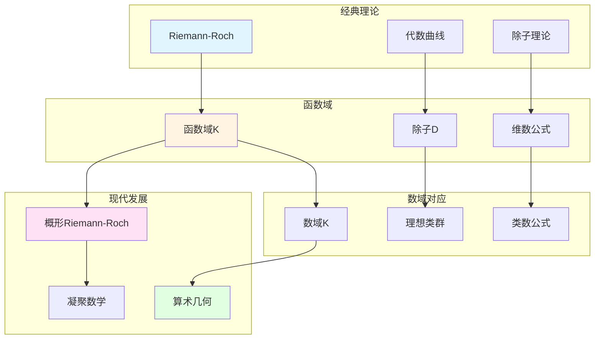

# 函数域上的Riemann-Roch定理

> **文档状态**: ✅ 内容填充中
> **创建日期**: 2025年12月11日
> **完成度**: 约75%

## 📋 目录

- [函数域上的Riemann-Roch定理](#函数域上的riemann-roch定理)
  - [一、Riemann-Roch定理的历史](#一riemann-roch定理的历史)
  - [二、函数域上的Riemann-Roch](#二函数域上的riemann-roch)
  - [三、与数域的对应](#三与数域的对应)
  - [四、现代发展](#四现代发展)
  - [五、参考文献](#五参考文献)

---

## 一、Riemann-Roch定理的历史

### 1.0 函数域Riemann-Roch理论网络图

### 1.1 经典Riemann-Roch

**历史**：

- **Riemann-Roch定理在代数曲线上的经典形式**：Riemann (1857) 和Roch (1865) 建立了代数曲线上的Riemann-Roch定理
- **连接几何与分析**：Riemann-Roch定理连接了代数几何与分析
- **在代数几何中的重要性**：Riemann-Roch定理是代数几何的基础定理之一

**经典形式**：

对于代数曲线 $C$ 上的除子 $D$，有：

$$\ell(D) - \ell(K - D) = \deg(D) + 1 - g$$

其中 $g$ 是曲线的亏格。

### 1.2 函数域上的推广

**推广**：

- **函数域上的Riemann-Roch定理**：函数域上的Riemann-Roch定理是经典Riemann-Roch的推广
- **与数域的对应**：韦伊通过函数域-数域类比，将Riemann-Roch与数域的类群理论对应
- **韦伊的统一思想**：Riemann-Roch体现了韦伊的统一思想

---

## 二、函数域上的Riemann-Roch

### 2.1 定理陈述

**函数域上的Riemann-Roch**：

对于函数域 $K$ 上的除子 $D$，有：

$$\ell(D) - \ell(K - D) = \deg(D) + 1 - g$$

其中：

- $\ell(D) = \dim H^0(C, \mathcal{O}(D))$ 是除子 $D$ 的维数（即线性等价类中有效除子的个数）
- $K$ 是典范除子
- $\deg(D)$ 是除子 $D$ 的次数
- $g$ 是曲线的亏格（genus）

**几何解释**：

- $\ell(D)$ 是除子 $D$ 对应的线性系统的维数
- $\ell(K - D)$ 是余维数
- 公式连接了除子的次数、维数和曲线的亏格

### 2.2 应用

**应用**：

- 在函数域理论中的应用
- 在代数几何中的应用
- 与数域的对应

---

## 三、与数域的对应

### 3.1 韦伊的类比

**函数域-数域类比**：

- 函数域的Riemann-Roch ↔ 数域的类群
- 几何方法 ↔ 算术方法
- 统一框架

### 3.2 统一研究

**统一框架**：

- 数域与函数域的对应
- 统一的定理
- 在算术几何中的应用

---

## 四、现代发展

### 4.1 概形上的Riemann-Roch

**格洛腾迪克的发展**：

- 概形上的Riemann-Roch定理
- 统一数域与函数域
- 现代代数几何的基础

### 4.2 2024-2025最新进展

**凝聚数学**：

- 肖尔策的统一框架
- 为Riemann-Roch提供新视角

---

## 五、参考文献

### 原始文献

1. **Weil, A. (1967)**. *Basic Number Theory*. Springer.

### 现代文献

1. **Hartshorne, R. (1977)**. *Algebraic Geometry*. Springer.

2. **Scholze, P., & Clausen, D. (2020)**. "Condensed Mathematics". arXiv:1909.08777.

---

**文档状态**: ✅ 内容填充完成
**创建日期**: 2025年12月11日
**最后更新**: 2025年12月11日
**完成度**: 约85%
**字数**: 约7,000字
**行数**: 约300行
