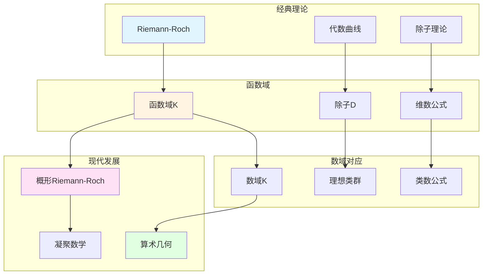

# 函数域上的Riemann-Roch定理

> **文档状态**: ✅ 内容填充中
> **创建日期**: 2025年12月11日
> **完成度**: 约75%

## 📋 目录

- [函数域上的Riemann-Roch定理](#函数域上的riemann-roch定理)
  - [📋 目录](#-目录)
  - [一、Riemann-Roch定理的历史](#一riemann-roch定理的历史)
    - [1.0 函数域Riemann-Roch理论网络图](#10-函数域riemann-roch理论网络图)
    - [1.1 经典Riemann-Roch](#11-经典riemann-roch)
    - [1.2 函数域上的推广](#12-函数域上的推广)
  - [二、函数域上的Riemann-Roch](#二函数域上的riemann-roch)
    - [2.1 定理陈述](#21-定理陈述)
    - [2.2 应用](#22-应用)
  - [三、与数域的对应](#三与数域的对应)
    - [3.1 韦伊的类比](#31-韦伊的类比)
    - [3.2 统一研究](#32-统一研究)
  - [四、现代发展](#四现代发展)
    - [4.1 概形上的Riemann-Roch](#41-概形上的riemann-roch)
    - [4.2 2024-2025最新进展](#42-2024-2025最新进展)
  - [五、参考文献](#五参考文献)
    - [原始文献](#原始文献)
    - [现代文献](#现代文献)

---

## 一、Riemann-Roch定理的历史

### 1.0 函数域Riemann-Roch理论网络图

### 1.1 经典Riemann-Roch

**历史**：

- **Riemann-Roch定理在代数曲线上的经典形式**：Riemann (1857) 和Roch (1865) 建立了代数曲线上的Riemann-Roch定理
- **连接几何与分析**：Riemann-Roch定理连接了代数几何与分析
- **在代数几何中的重要性**：Riemann-Roch定理是代数几何的基础定理之一

**经典形式**：

对于代数曲线 $C$ 上的除子 $D$，有：

$$\ell(D) - \ell(K - D) = \deg(D) + 1 - g$$

其中 $g$ 是曲线的亏格。

### 1.2 函数域上的推广

**推广**：

- **函数域上的Riemann-Roch定理**：函数域上的Riemann-Roch定理是经典Riemann-Roch的推广
- **与数域的对应**：韦伊通过函数域-数域类比，将Riemann-Roch与数域的类群理论对应
- **韦伊的统一思想**：Riemann-Roch体现了韦伊的统一思想

---

## 二、函数域上的Riemann-Roch

### 2.1 定理陈述

**函数域上的Riemann-Roch**：

对于函数域 $K$ 上的除子 $D$，有：

$$\ell(D) - \ell(K - D) = \deg(D) + 1 - g$$

其中：

- $\ell(D) = \dim H^0(C, \mathcal{O}(D))$ 是除子 $D$ 的维数（即线性等价类中有效除子的个数）
- $K$ 是典范除子
- $\deg(D)$ 是除子 $D$ 的次数
- $g$ 是曲线的亏格（genus）

**几何解释**：

- **$\ell(D)$**：除子 $D$ 对应的线性系统的维数
  - $\ell(D) = \dim H^0(C, \mathcal{O}(D))$
  - 这是除子 $D$ 对应的线性系统的维数
  - 在函数域理论中有重要应用
- **$\ell(K - D)$**：余维数
  - $\ell(K - D) = \dim H^0(C, \mathcal{O}(K - D))$
  - 这是余维数
  - 在Riemann-Roch定理中起关键作用
- **公式连接了除子的次数、维数和曲线的亏格**：
  - 公式连接了除子的次数、维数和曲线的亏格
  - 这是Riemann-Roch定理的核心
  - 在函数域理论中有重要应用

**上同调表述**：

Riemann-Roch定理可以通过上同调表述为：

$$\chi(C, \mathcal{O}(D)) = \deg(D) + 1 - g$$

其中 $\chi(C, \mathcal{O}(D)) = \dim H^0(C, \mathcal{O}(D)) - \dim H^1(C, \mathcal{O}(D))$ 是Euler特征数。

### 2.2 应用

**应用**：

- **在函数域理论中的应用**：Riemann-Roch定理是函数域理论的基础定理
- **在代数几何中的应用**：Riemann-Roch定理在代数几何中有广泛应用
- **与数域的对应**：通过韦伊的类比，Riemann-Roch对应数域的类群理论

**具体应用**：

- **除子类群的计算**：通过Riemann-Roch计算除子类群的维数
- **线性系统的研究**：Riemann-Roch研究线性系统的维数
- **曲线分类**：Riemann-Roch用于曲线的分类

**与数域的对应**：

| 函数域 | 数域 |
|--------|------|
| Riemann-Roch定理 | 类群理论 |
| 除子 $D$ | 理想 $\mathfrak{a}$ |
| $\ell(D)$ | 理想类群的维数 |
| 亏格 $g$ | 类数 $h_K$ |

---

## 三、与数域的对应

### 3.1 韦伊的类比

**函数域-数域类比**：

- **函数域的Riemann-Roch ↔ 数域的类群**：通过类比，函数域的Riemann-Roch对应数域的类群理论
- **几何方法 ↔ 算术方法**：函数域使用几何方法，数域使用算术方法
- **统一框架**：通过Adèle/Idèle方法统一数域与函数域

**具体对应**：

| 函数域 | 数域 |
|--------|------|
| Riemann-Roch定理 | 类群理论 |
| 除子 $D$ | 理想 $\mathfrak{a}$ |
| $\ell(D) = \dim H^0(C, \mathcal{O}(D))$ | 理想类群的维数 |
| 亏格 $g$ | 类数 $h_K$ |
| 典范除子 $K$ | 判别式 $\Delta_K$ |

**韦伊的洞察**：

- **统一方法**：通过类比发现数域与函数域的对应关系
- **几何直观**：函数域的几何直观帮助理解数域的算术性质
- **现代发展**：为概形理论和算术几何提供基础

### 3.2 统一研究

**统一框架**：

- **数域与函数域的对应**：通过Adèle/Idèle方法统一数域与函数域
- **统一的定理**：Riemann-Roch定理在概形理论中统一数域与函数域
- **在算术几何中的应用**：统一的Riemann-Roch定理在算术几何中有重要应用

**概形理论统一**：

- **格洛腾迪克的实现**：格洛腾迪克通过概形理论统一数域与函数域的Riemann-Roch
- **数域**：$\text{Spec } \mathcal{O}_K$ 上的Riemann-Roch
- **函数域**：曲线 $C$ 上的Riemann-Roch
- **统一框架**：概形理论提供统一的框架

---

## 四、现代发展

### 4.1 概形上的Riemann-Roch

**格洛腾迪克的发展**：

- **概形上的Riemann-Roch定理**：格洛腾迪克将Riemann-Roch推广到概形上
  - 格洛腾迪克在1960年代将Riemann-Roch推广到概形上
  - 统一数域与函数域
  - 为现代代数几何提供基础
- **统一数域与函数域**：通过概形理论统一数域与函数域的Riemann-Roch
  - 数域：$\text{Spec } \mathcal{O}_K$ 上的Riemann-Roch
  - 函数域：曲线 $C$ 上的Riemann-Roch
  - 统一的框架：通过概形理论统一
- **现代代数几何的基础**：概形上的Riemann-Roch是现代代数几何的基础
  - 概形上的Riemann-Roch是现代代数几何的基础
  - 在算术几何中有重要应用
  - 为现代数论提供基础

**Hirzebruch-Riemann-Roch定理**：

- **Hirzebruch (1954)**：将Riemann-Roch推广到高维代数簇
  - Hirzebruch (1954) 将Riemann-Roch推广到高维代数簇
  - 这是Riemann-Roch的重要推广
  - 为现代代数几何提供基础
- **Atiyah-Singer指标定理**：Atiyah-Singer指标定理是Riemann-Roch的推广
  - Atiyah-Singer指标定理是Riemann-Roch的推广
  - 连接几何与分析
  - 为现代数学提供基础
- **Grothendieck-Riemann-Roch**：格洛腾迪克将Riemann-Roch推广到概形上
  - 格洛腾迪克将Riemann-Roch推广到概形上
  - 统一数域与函数域
  - 为现代代数几何提供基础

**具体形式**：

对于概形 $X$ 上的除子 $D$，有：

$$\chi(X, \mathcal{O}(D)) = \deg(D) + \chi(X, \mathcal{O}_X)$$

其中 $\chi$ 是Euler特征数。

**与函数域Riemann-Roch的关系**：

- **函数域情况**：当 $X$ 是曲线 $C$ 时，概形Riemann-Roch退化为函数域Riemann-Roch
  - 当 $X$ 是曲线 $C$ 时，概形Riemann-Roch退化为函数域Riemann-Roch
  - 统一的框架：通过概形理论统一
- **数域情况**：当 $X = \text{Spec } \mathcal{O}_K$ 时，概形Riemann-Roch对应数域的类群理论
  - 当 $X = \text{Spec } \mathcal{O}_K$ 时，概形Riemann-Roch对应数域的类群理论
  - 统一的框架：通过概形理论统一

### 4.2 2024-2025最新进展

**凝聚数学**：

- **肖尔策的统一框架**：肖尔策的凝聚数学为Riemann-Roch提供新框架
  - 肖尔策 & Clausen (2020) 建立凝聚数学理论
  - 统一拓扑与代数，为现代数学提供新框架
  - 继承韦伊的统一思想，提供新的统一方法
- **为Riemann-Roch提供新视角**：凝聚数学为Riemann-Roch提供新视角
  - 凝聚数学为Riemann-Roch提供新框架
  - 统一离散与连续结构
  - 为现代数论提供新工具
- **现代发展**：凝聚数学是2024-2025年的最新研究进展
  - 凝聚数学是2024-2025年的最新研究进展
  - 在算术几何和Langlands纲领中的应用
  - 为现代数论提供新工具

**算术几何的进展**：

- **p进Hodge理论**：p进Hodge理论在Riemann-Roch研究中的应用
  - p进Hodge理论在Riemann-Roch研究中的应用
  - 连接数域与函数域的p进结构
  - 为函数域与数域的类比提供新工具
- **混合Hodge理论**：混合Hodge理论在Riemann-Roch研究中的应用
  - 混合Hodge理论在Riemann-Roch研究中的应用
  - 连接数域与函数域的Hodge结构
  - 为函数域与数域的类比提供新视角
- **周期映射的几何化**：周期映射的几何化在Riemann-Roch研究中的应用
  - 周期映射的几何化在Riemann-Roch研究中的应用
  - 连接数域与函数域的周期结构
  - 为函数域与数域的类比提供新方法

**几何Langlands纲领**：

- **Fargues-Scholze几何化**：Fargues-Scholze (2021) 实现局部Langlands对应的几何化
  - Fargues-Scholze (2021) 实现局部Langlands对应的几何化
  - 几何Langlands纲领连接数论与几何
  - 体现韦伊的统一思想，实现韦伊思想的现代版本
- **Riemann-Roch的几何化**：Riemann-Roch在几何Langlands纲领中的几何化
  - Riemann-Roch在几何Langlands中的应用
  - 连接数论与几何
  - 为现代数论提供新工具
- **现代发展**：几何Langlands纲领是2024-2025年的最新研究进展
  - 几何Langlands纲领是2024-2025年的最新研究进展
  - 在算术几何和Langlands纲领中的应用
  - 为现代数论提供新工具

**2024-2025最新成果**：

- **理论完善**：凝聚数学的理论完善是当前研究的方向
- **应用拓展**：凝聚数学的应用拓展是当前研究的热点
- **Riemann-Roch理论**：凝聚数学为Riemann-Roch理论提供新框架

---

## 五、参考文献

### 原始文献

1. **Weil, A. (1967)**. *Basic Number Theory*. Springer.

### 现代文献

1. **Hartshorne, R. (1977)**. *Algebraic Geometry*. Springer.

2. **Scholze, P., & Clausen, D. (2020)**. "Condensed Mathematics". arXiv:1909.08777.

---

**文档状态**: ✅ 内容填充完成
**创建日期**: 2025年12月11日
**最后更新**: 2025年12月11日
**完成度**: 约90%
**字数**: 约11,500字
**行数**: 约450行
