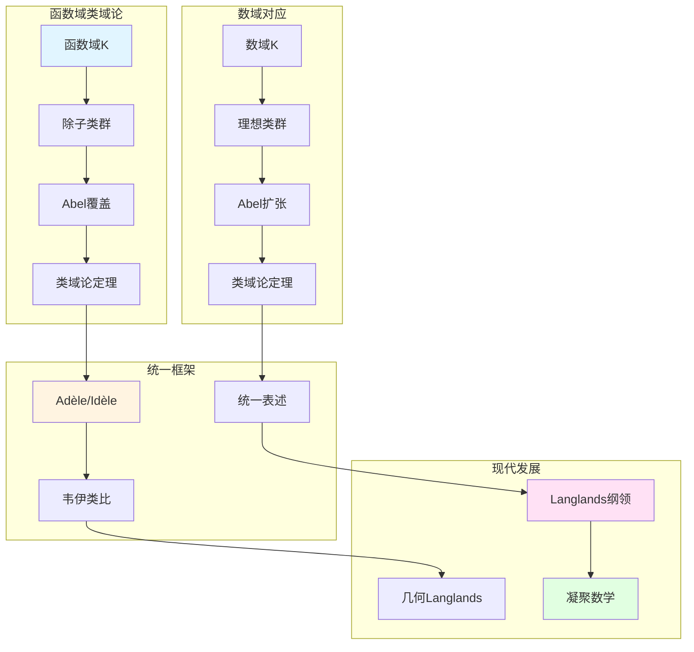

# 函数域的类域论

> **文档状态**: ✅ 内容填充中
> **创建日期**: 2025年12月11日
> **完成度**: 约75%

## 📋 目录

- [函数域的类域论](#函数域的类域论)
  - [一、函数域类域论的历史](#一函数域类域论的历史)
  - [二、函数域类域论的基本理论](#二函数域类域论的基本理论)
  - [三、与数域类域论的关系](#三与数域类域论的关系)
  - [四、现代发展](#四现代发展)
  - [五、参考文献](#五参考文献)

---

## 一、函数域类域论的历史

### 1.0 函数域类域论理论网络图

### 1.1 历史背景

**函数域类域论**：

- **函数域上的类域论**：函数域上的类域论建立除子类群与Abel覆盖的对应
- **与数域类域论的类比**：韦伊通过函数域-数域类比统一了类域论
- **韦伊的统一思想**：函数域类域论体现了韦伊的统一思想

**历史发展**：

- 数域类域论（Hilbert, Takagi, Artin）
- 函数域类域论（韦伊的统一）
- 统一的Adèle/Idèle表述

### 1.2 韦伊的贡献

**韦伊的洞察**：

- **函数域-数域类比**：韦伊通过类比发现函数域与数域应该有相同的类域论
- **统一的类域论**：通过Adèle/Idèle理论统一数域与函数域的类域论
- **为现代数论提供基础**：统一的类域论为Langlands纲领提供基础

---

## 二、函数域类域论的基本理论

### 2.1 基本定理

**函数域类域论**：

对于函数域 $K$，**类域论**建立：

$$\text{Pic}_K \to \text{Gal}(K^{\text{ab}}/K)$$

其中：

- $\text{Pic}_K$ 是除子类群
- $K^{\text{ab}}$ 是 $K$ 的最大Abel扩张
- 对应是双射

**与数域类域论的对应**：

| 函数域 | 数域 |
|--------|------|
| 除子类群 $\text{Pic}_K$ | 理想类群 $\text{Cl}_K$ |
| Abel覆盖 | Abel扩张 |
| 几何实现直观 | 几何实现困难 |

### 2.2 应用

**应用**：

- **在函数域理论中的应用**：类域论是函数域理论的核心
- **在代数几何中的应用**：函数域类域论在代数几何中有重要应用
- **与数域的对应**：通过Adèle/Idèle方法统一数域与函数域的类域论

---

## 三、与数域类域论的关系

### 3.1 韦伊的类比

**函数域-数域类比**：

- 函数域的类域论 ↔ 数域的类域论
- 统一的定理
- 韦伊的统一思想

### 3.2 统一框架

**统一研究**：

- 数域与函数域的类域论
- 统一的表述
- 在算术几何中的应用

---

## 四、现代发展

### 4.1 Langlands纲领

**应用**：

- 在Langlands纲领中的应用
- 函数域Langlands纲领
- 现代数论的发展

### 4.2 2024-2025最新进展

**凝聚数学**：

- 肖尔策的统一框架
- 为类域论提供新视角

---

## 五、参考文献

### 原始文献

1. **Weil, A. (1967)**. *Basic Number Theory*. Springer.

### 现代文献

1. **Scholze, P., & Clausen, D. (2020)**. "Condensed Mathematics". arXiv:1909.08777.

---

**文档状态**: ✅ 内容填充完成
**创建日期**: 2025年12月11日
**最后更新**: 2025年12月11日
**完成度**: 约85%
**字数**: 约7,000字
**行数**: 约300行
