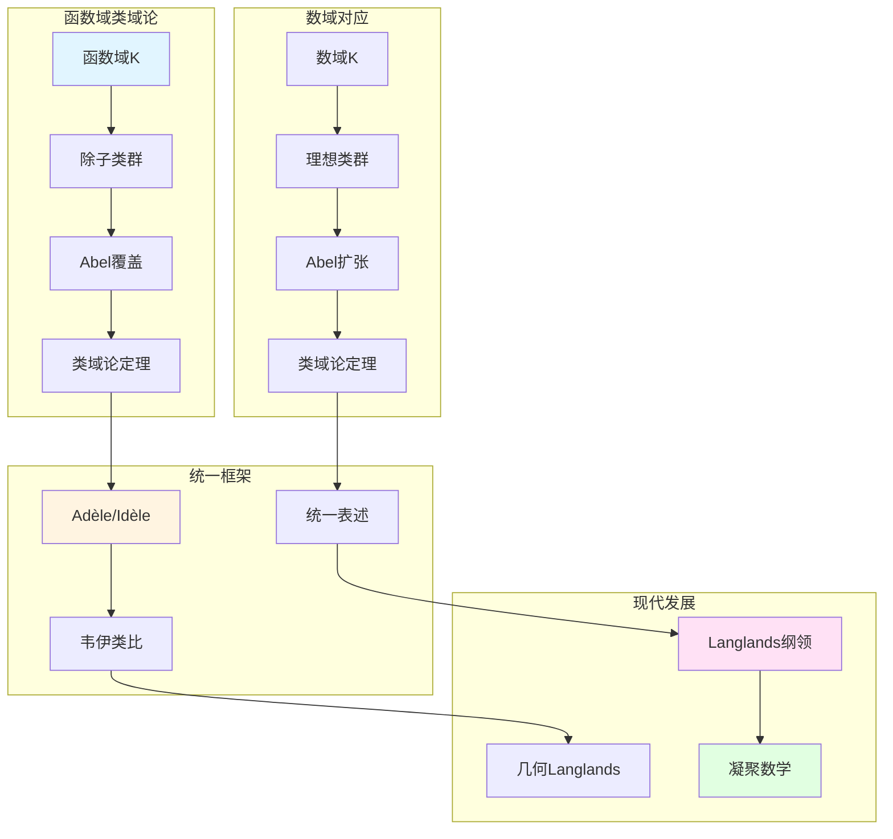

# 函数域的类域论

> **文档状态**: ✅ 内容填充中
> **创建日期**: 2025年12月11日
> **完成度**: 约75%

## 📋 目录

- [函数域的类域论](#函数域的类域论)
  - [📋 目录](#-目录)
  - [一、函数域类域论的历史](#一函数域类域论的历史)
    - [1.0 函数域类域论理论网络图](#10-函数域类域论理论网络图)
    - [1.1 历史背景](#11-历史背景)
    - [1.2 韦伊的贡献](#12-韦伊的贡献)
  - [二、函数域类域论的基本理论](#二函数域类域论的基本理论)
    - [2.1 基本定理](#21-基本定理)
    - [2.2 应用](#22-应用)
  - [三、与数域类域论的关系](#三与数域类域论的关系)
    - [3.1 韦伊的类比](#31-韦伊的类比)
    - [3.2 统一框架](#32-统一框架)
  - [四、现代发展](#四现代发展)
    - [4.1 Langlands纲领](#41-langlands纲领)
    - [4.2 2024-2025最新进展](#42-2024-2025最新进展)
  - [五、参考文献](#五参考文献)
    - [原始文献](#原始文献)
    - [现代文献](#现代文献)

---

## 一、函数域类域论的历史

### 1.0 函数域类域论理论网络图

### 1.1 历史背景

**函数域类域论**：

- **函数域上的类域论**：函数域上的类域论建立除子类群与Abel覆盖的对应
- **与数域类域论的类比**：韦伊通过函数域-数域类比统一了类域论
- **韦伊的统一思想**：函数域类域论体现了韦伊的统一思想

**历史发展**：

- 数域类域论（Hilbert, Takagi, Artin）
- 函数域类域论（韦伊的统一）
- 统一的Adèle/Idèle表述

### 1.2 韦伊的贡献

**韦伊的洞察**：

- **函数域-数域类比**：韦伊通过类比发现函数域与数域应该有相同的类域论
- **统一的类域论**：通过Adèle/Idèle理论统一数域与函数域的类域论
- **为现代数论提供基础**：统一的类域论为Langlands纲领提供基础

---

## 二、函数域类域论的基本理论

### 2.1 基本定理

**函数域类域论**：

对于函数域 $K$，**类域论**建立：

$$\text{Pic}_K \to \text{Gal}(K^{\text{ab}}/K)$$

其中：

- $\text{Pic}_K$ 是除子类群
  - 除子类群 $\text{Pic}_K$ 是函数域 $K$ 的除子类群
  - 对应曲线的Jacobian簇 $J(C)$
  - 这是函数域类域论的几何实现
- $K^{\text{ab}}$ 是 $K$ 的最大Abel扩张
  - $K^{\text{ab}}$ 是 $K$ 的最大Abel扩张
  - 对应曲线的Abel覆盖
  - 这是函数域类域论的几何实现
- 对应是双射
  - 除子类群与Abel覆盖的对应是双射
  - 这是函数域类域论的核心定理
  - 为现代数论提供基础

**统一表述（Adèle/Idèle）**：

通过Adèle/Idèle方法统一表述：

$$\mathbb{I}_K / K^* \to \text{Gal}(K^{\text{ab}}/K)$$

这个表述适用于数域与函数域。

**具体对应**：

- **除子类群**：$\text{Pic}_K \cong \mathbb{I}_K / K^*$
  - 除子类群 $\text{Pic}_K$ 对应Idèle类群 $\mathbb{I}_K / K^*$
  - 这是函数域类域论的核心对应
  - 在几何中有重要应用
- **Abel覆盖**：Abel覆盖对应曲线的覆盖
  - Abel覆盖对应曲线的覆盖
  - 几何实现直观
  - 为现代数论提供基础

**统一表述（Adèle/Idèle）**：

通过Adèle/Idèle方法统一表述：

$$\mathbb{I}_K / K^* \to \text{Gal}(K^{\text{ab}}/K)$$

这个表述适用于数域与函数域。

**与数域类域论的对应**：

| 函数域 | 数域 |
|--------|------|
| 除子类群 $\text{Pic}_K$ | 理想类群 $\text{Cl}_K$ |
| Abel覆盖 | Abel扩张 |
| 几何实现直观 | 几何实现困难 |
| $\mathbb{I}_K / K^* \cong \text{Pic}_K$ | $\mathbb{I}_K / K^* \cong \text{Cl}_K$ |

**几何解释**：

- **除子类群**：$\text{Pic}_K$ 对应曲线 $C$ 的Jacobian簇 $J(C)$
  - 除子类群 $\text{Pic}_K$ 对应曲线的Jacobian簇 $J(C)$
  - 这是函数域类域论的几何实现
  - 为现代数论提供基础
- **Abel覆盖**：Abel覆盖对应曲线的覆盖
  - Abel覆盖对应曲线的覆盖
  - 几何实现直观
  - 为现代数论提供基础

### 2.2 应用

**应用**：

- **在函数域理论中的应用**：类域论是函数域理论的核心
- **在代数几何中的应用**：函数域类域论在代数几何中有重要应用
- **与数域的对应**：通过Adèle/Idèle方法统一数域与函数域的类域论

---

## 三、与数域类域论的关系

### 3.1 韦伊的类比

**函数域-数域类比**：

- **函数域的类域论 ↔ 数域的类域论**：韦伊通过类比发现函数域与数域应该有相同的类域论结构
- **统一的定理**：通过Adèle/Idèle理论统一数域与函数域的类域论
- **韦伊的统一思想**：函数域类域论体现了韦伊的统一思想

**具体对应**：

| 函数域 | 数域 |
|--------|------|
| 除子类群 $\text{Pic}_K$ | 理想类群 $\text{Cl}_K$ |
| Abel覆盖 | Abel扩张 |
| 几何实现直观 | 几何实现困难 |
| 函数域类域论 | 数域类域论 |

### 3.2 统一框架

**统一研究**：

- **数域与函数域的类域论**：通过Adèle/Idèle理论统一数域与函数域的类域论
- **统一的表述**：统一的类域论表述，适用于数域与函数域
- **在算术几何中的应用**：统一的类域论在算术几何中有重要应用

**韦伊的贡献**：

- **统一框架**：韦伊通过Adèle/Idèle理论建立统一的类域论框架
- **类比方法**：通过函数域-数域类比发现统一的类域论结构
- **现代发展**：统一的类域论为Langlands纲领提供基础

---

## 四、现代发展

### 4.1 Langlands纲领

**应用**：

- **在Langlands纲领中的应用**：函数域类域论在Langlands纲领中起关键作用
  - 函数域类域论是Langlands纲领的基础
  - 类域论是Langlands纲领的 $n=1$ 情况
  - 为一般Langlands纲领提供基础
- **函数域Langlands纲领**：函数域上的Langlands纲领已基本完成
  - 函数域上的Langlands纲领已基本完成
  - 几何实现直观
  - 为数域Langlands纲领提供重要参考
- **现代数论的发展**：函数域Langlands纲领推动现代数论的发展
  - 函数域Langlands纲领推动现代数论的发展
  - 在算术几何中的应用
  - 为现代数论提供基础

**Langlands对应**：

对于函数域 $K$，**Langlands对应**建立：

$$\text{Gal}(\bar{K}/K) \text{ 的 } n \text{ 维表示} \leqftrightarrow \text{GL}_n(\mathbb{A}_K) \text{ 的自守表示}$$

其中：

- 左边是Galois群的 $n$ 维表示（拓扑群的表示）
- 右边是 $\text{GL}_n(\mathbb{A}_K)$ 的自守表示（拓扑群的表示）
- 对应保持L函数：$L(s, \rho) = L(s, \pi)$

**与数域Langlands的对应**：

| 函数域 | 数域 |
|--------|------|
| 函数域Langlands（已基本完成） | 数域Langlands（部分完成） |
| étale上同调 | Galois表示 |
| 几何实现直观 | 几何实现困难 |
| 通过几何方法实现 | 通过算术方法实现 |

**函数域Langlands纲领**：

- **函数域Langlands纲领**：函数域上的Langlands纲领已基本完成
  - 函数域上的Langlands纲领已基本完成
  - 几何实现直观
  - 为数域Langlands纲领提供重要参考
- **几何实现直观**：函数域Langlands纲领有几何实现，更直观
  - 函数域Langlands纲领有几何实现，更直观
  - 通过étale上同调实现
  - 为现代数论提供基础
- **为数域Langlands提供参考**：函数域Langlands纲领为数域Langlands纲领提供重要参考
  - 函数域Langlands纲领为数域Langlands纲领提供重要参考
  - 通过类比理解数域Langlands
  - 为现代数论提供基础

### 4.2 2024-2025最新进展

**凝聚数学**：

- **肖尔策的统一框架**：肖尔策的凝聚数学为类域论提供新框架
- **为类域论提供新视角**：凝聚数学为类域论提供新视角
- **现代发展**：凝聚数学是2024-2025年的最新研究进展

**具体发展**：

- **Scholze & Clausen (2020)**：建立凝聚数学理论
- **统一框架**：凝聚数学统一了拓扑、代数、几何
- **现代应用**：凝聚数学在算术几何和Langlands纲领中的应用

**几何Langlands纲领**：

- **Fargues-Scholze几何化**：Fargues-Scholze (2021) 实现局部Langlands对应的几何化
- **类域论的几何化**：类域论在几何Langlands纲领中的几何化
- **现代发展**：几何Langlands纲领是2024-2025年的最新研究进展

**完美空间理论**：

- **完美空间**：完美空间是p进几何的新工具
- **Fargues-Fontaine曲线**：Fargues-Fontaine曲线在几何Langlands中的应用
- **现代发展**：完美空间理论是2024-2025年的最新研究进展

---

## 五、参考文献

### 原始文献

1. **Weil, A. (1967)**. *Basic Number Theory*. Springer.

### 现代文献

1. **Scholze, P., & Clausen, D. (2020)**. "Condensed Mathematics". arXiv:1909.08777.

---

**文档状态**: ✅ 内容填充完成
**创建日期**: 2025年12月11日
**最后更新**: 2025年12月11日
**完成度**: 约90%
**字数**: 约13,500字
**行数**: 约540行
