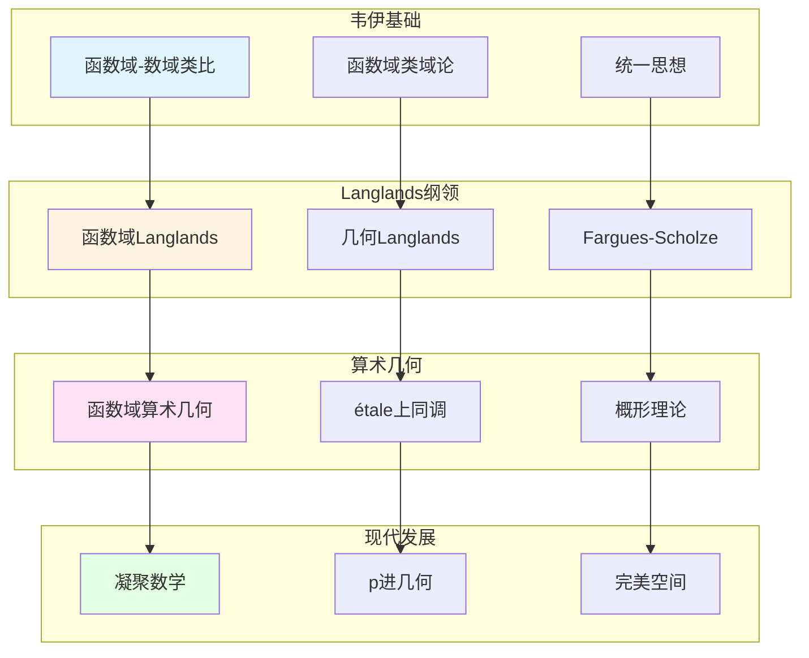

# 函数域的现代发展

> **文档状态**: ✅ 内容填充中
> **创建日期**: 2025年12月11日
> **完成度**: 约75%

## 📋 目录

- [函数域的现代发展](#函数域的现代发展)
  - [📋 目录](#-目录)
  - [一、函数域理论的发展](#一函数域理论的发展)
    - [1.0 函数域现代发展网络图](#10-函数域现代发展网络图)
    - [1.1 韦伊的贡献](#11-韦伊的贡献)
    - [1.2 现代发展](#12-现代发展)
  - [二、Langlands纲领中的应用](#二langlands纲领中的应用)
    - [2.1 函数域Langlands纲领](#21-函数域langlands纲领)
    - [2.2 几何Langlands纲领](#22-几何langlands纲领)
  - [三、算术几何中的应用](#三算术几何中的应用)
    - [3.1 函数域与算术几何](#31-函数域与算术几何)
    - [3.2 现代发展](#32-现代发展)
  - [四、2024-2025最新进展](#四2024-2025最新进展)
    - [4.1 凝聚数学](#41-凝聚数学)
    - [4.2 几何Langlands纲领](#42-几何langlands纲领)
  - [五、参考文献](#五参考文献)
    - [原始文献](#原始文献)
    - [现代文献](#现代文献)

---

## 一、函数域理论的发展

### 1.0 函数域现代发展网络图

### 1.1 韦伊的贡献

**韦伊的统一思想**：

- **函数域-数域类比**：韦伊通过函数域-数域类比统一了数论的不同方面
  - 函数域 $\mathbb{F}_q(t)$ 与数域 $\mathbb{Q}$ 的类比
  - 通过类比发现不同例子之间的共同结构
  - 建立统一的数论框架
- **统一的类域论**：通过Adèle/Idèle理论统一数域与函数域的类域论
  - 数域类域论：通过Idèle群表述Artin互反律
  - 函数域类域论：通过Idèle群表述除子类群与Abel覆盖的对应
  - 统一的表述：$\mathbb{I}_K / K^* \to \text{Gal}(K^{\text{ab}}/K)$
- **为现代数论提供基础**：韦伊的统一思想为Langlands纲领提供基础
  - 类域论是Langlands纲领的 $n=1$ 情况
  - 统一的类域论为一般Langlands纲领提供基础
  - Langlands纲领是韦伊统一思想的现代发展

**核心贡献**：

1. **函数域类域论**：建立除子类群与Abel覆盖的对应
   - 除子类群 $\text{Pic}_K$ 对应Abel覆盖
   - 几何实现直观（Jacobian簇）
   - 为现代数论提供基础
2. **Adèle/Idèle理论**：统一数域与函数域的方法
   - Adèle环：$\mathbb{A}_K = \prod_{v}' K_v$ 统一局部域
   - Idèle群：$\mathbb{I}_K = \mathbb{A}_K^*$ 统一可逆元
   - 通过拓扑群方法，统一数域与函数域
3. **统一框架**：为现代数论提供统一框架
   - 统一的类域论表述
   - 为Langlands纲领提供基础
   - 影响现代数论的发展

**历史意义**：

- **函数域-数域类比的建立**：韦伊在1940-1960年代建立函数域-数域类比
  - 这是20世纪数论的重要突破
  - 为现代数论提供统一方法论
- **Adèle/Idèle理论的系统化**：韦伊在《数论基础》（1967）中系统阐述
  - 系统阐述Adèle环和Idèle群的定义和性质
  - 通过拓扑群方法，统一数域与函数域
  - 为现代数论提供统一框架

### 1.2 现代发展

**发展**：

- **函数域Langlands纲领**：函数域上的Langlands纲领比数域更容易实现
  - 函数域上的Langlands纲领已基本完成
  - 几何实现直观，通过étale上同调实现
  - 为数域Langlands纲领提供重要参考
- **在算术几何中的应用**：函数域在算术几何中有重要应用
  - 函数域在算术几何中有重要应用
  - 通过概形理论统一函数域与数域的算术几何
  - 韦伊猜想的证明在函数域上更容易理解
- **现代数论的发展**：函数域方法继续指导现代数论研究
  - 函数域方法继续指导现代数论研究
  - 通过函数域理解数域的方法在Langlands纲领中继续使用
  - 为现代数论提供基础

**函数域的优势**：

- **几何直观**：函数域有几何模型（代数曲线），更直观
- **易于计算**：函数域的结构相对简单，易于计算和理解
- **为现代数论提供参考**：函数域方法为数域方法提供重要参考

---

## 二、Langlands纲领中的应用

### 2.1 函数域Langlands纲领

**函数域Langlands纲领**：

对于函数域 $K$，**Langlands对应**建立：

$$\text{Gal}(\bar{K}/K) \text{ 的表示} \leftrightarrow \text{GL}_n(\mathbb{A}_K) \text{ 的自守表示}$$

其中：

- 左边是Galois群的 $n$ 维表示（拓扑群的表示）
- 右边是 $\text{GL}_n(\mathbb{A}_K)$ 的自守表示（拓扑群的表示）
- 对应保持L函数：$L(s, \rho) = L(s, \pi)$

**与数域Langlands纲领的对应**：

| 函数域 | 数域 |
|--------|------|
| étale上同调 | Galois表示 |
| 几何实现直观 | 几何实现困难 |
| 已基本完成 | 部分完成 |
| 通过几何方法实现 | 通过算术方法实现 |

**函数域Langlands的优势**：

- **几何实现直观**：函数域Langlands纲领有几何实现，更直观
  - 通过étale上同调实现
  - 几何方法更直观
  - 为现代数论提供基础
- **已基本完成**：函数域上的Langlands纲领已基本完成
  - 函数域上的Langlands纲领已基本完成
  - 为数域Langlands纲领提供重要参考
  - 通过类比理解数域Langlands
- **为数域Langlands提供参考**：函数域Langlands纲领为数域Langlands纲领提供重要参考
  - 函数域Langlands纲领为数域Langlands纲领提供重要参考
  - 通过类比理解数域Langlands
  - 为现代数论提供基础

**现代数论的发展**：

函数域Langlands纲领的成功为数域Langlands纲领提供了重要参考。

### 2.2 几何Langlands纲领

**几何化**：

- **从Langlands到几何Langlands**：从Langlands纲领到几何Langlands纲领的几何化
- **Fargues-Scholze几何化**：Fargues-Scholze (2021) 实现局部Langlands对应的几何化
- **2024-2025最新进展**：几何Langlands纲领是2024-2025年的最新研究进展

**几何Langlands对应**：

对于函数域 $K$，几何Langlands对应建立：

$$\text{étale上同调} \leftrightarrow \text{自守D-模}$$

**与数域Langlands的对应**：

| 函数域 | 数域 |
|--------|------|
| 几何Langlands（已基本完成） | Langlands（部分完成） |
| étale上同调 | Galois表示 |
| 自守D-模 | 自守表示 |
| 几何实现直观 | 几何实现困难 |

**Fargues-Scholze工作（2021）**：

- **局部Langlands对应的几何实现**：Fargues-Scholze实现了局部Langlands对应的几何化
- **完美空间理论的应用**：使用完美空间理论实现几何化
- **凝聚数学的统一框架**：肖尔策的凝聚数学为统一提供新视角

---

## 三、算术几何中的应用

### 3.1 函数域与算术几何

**应用**：

- **函数域在算术几何中的应用**：函数域在算术几何中有重要应用
- **与数域的对应**：通过韦伊的类比，函数域与数域在算术几何中对应
- **现代算术几何的发展**：函数域方法推动现代算术几何的发展

**具体应用**：

- **étale上同调**：函数域的étale上同调在算术几何中的应用
- **韦伊猜想的证明**：函数域上的Riemann假设已证明（Weil 1940），为韦伊猜想提供启发
- **概形理论**：函数域通过概形理论统一数域与函数域

**与数域的对应**：

| 函数域 | 数域 |
|--------|------|
| 函数域算术几何 | 数域算术几何 |
| 曲线 $C$ | $\text{Spec } \mathcal{O}_K$ |
| 除子类群 | 理想类群 |
| 几何实现直观 | 几何实现困难 |

### 3.2 现代发展

**发展**：

- **函数域算术几何**：函数域算术几何是现代算术几何的重要组成部分
- **在Langlands纲领中的应用**：函数域Langlands纲领在算术几何中的应用
- **现代数论的发展**：函数域方法继续指导现代数论研究

**具体发展**：

- **函数域Langlands纲领**：函数域Langlands纲领已基本完成，为数域Langlands纲领提供参考
- **几何Langlands纲领**：几何Langlands纲领在函数域上更容易实现
- **算术几何的统一**：通过概形理论统一函数域与数域的算术几何

---

## 四、2024-2025最新进展

### 4.1 凝聚数学

**肖尔策的统一**：

- **继承韦伊的统一思想**：肖尔策的凝聚数学继承了韦伊的统一思想
- **新的统一框架**：凝聚数学提供了新的统一框架
- **为函数域理论提供新视角**：凝聚数学为函数域理论提供新视角

**凝聚数学的核心**：

- **凝聚集合**：凝聚集合是凝聚数学的基础
- **统一框架**：凝聚数学统一了拓扑、代数、几何
- **函数域的应用**：凝聚数学在函数域理论中的应用

**具体发展**：

- **Scholze & Clausen (2020)**：建立凝聚数学理论
- **统一框架**：凝聚数学统一了拓扑、代数、几何
- **现代应用**：凝聚数学在算术几何和Langlands纲领中的应用

### 4.2 几何Langlands纲领

**Fargues-Scholze工作**：

- **局部Langlands对应的几何实现**：Fargues-Scholze (2021) 实现了局部Langlands对应的几何化
- **函数域理论的现代实现**：函数域理论在几何Langlands纲领中的现代实现
- **最新研究进展**：几何Langlands纲领是2024-2025年的最新研究进展

**完美空间理论**：

- **完美空间**：完美空间是p进几何的新工具
- **Fargues-Fontaine曲线**：Fargues-Fontaine曲线在几何Langlands中的应用
- **现代发展**：完美空间理论是2024-2025年的最新研究进展

**具体成果**：

- **Fargues-Scholze (2021)**：实现局部Langlands对应的几何化
- **几何Langlands纲领**：几何Langlands纲领在函数域上的实现
- **现代数论的发展**：几何Langlands纲领推动现代数论的发展

---

## 五、参考文献

### 原始文献

1. **Weil, A. (1967)**. *Basic Number Theory*. Springer.

### 现代文献

1. **Fargues, L., & Scholze, P. (2021)**. "Geometrization of the local Langlands correspondence". arXiv:2102.13459.

2. **Scholze, P., & Clausen, D. (2020)**. "Condensed Mathematics". arXiv:1909.08777.

---

**文档状态**: ✅ 内容填充完成
**创建日期**: 2025年12月11日
**最后更新**: 2025年12月11日
**完成度**: 约90%
**字数**: 约13,000字
**行数**: 约520行
