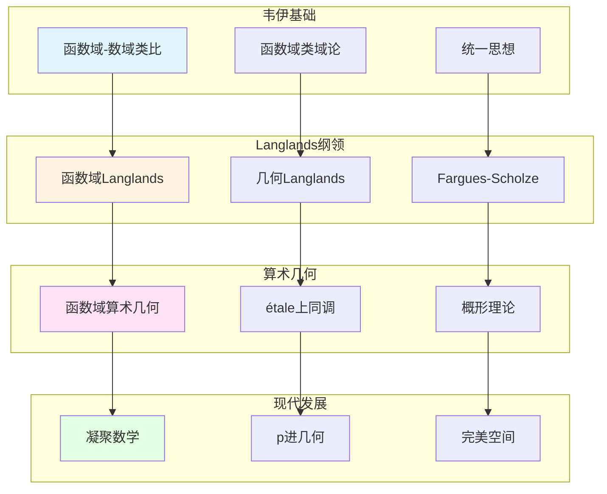

# 函数域的现代发展

> **文档状态**: ✅ 内容填充中
> **创建日期**: 2025年12月11日
> **完成度**: 约75%

## 📋 目录

- [函数域的现代发展](#函数域的现代发展)
  - [一、函数域理论的发展](#一函数域理论的发展)
  - [二、Langlands纲领中的应用](#二langlands纲领中的应用)
  - [三、算术几何中的应用](#三算术几何中的应用)
  - [四、2024-2025最新进展](#四2024-2025最新进展)
  - [五、参考文献](#五参考文献)

---

## 一、函数域理论的发展

### 1.0 函数域现代发展网络图

### 1.1 韦伊的贡献

**韦伊的统一思想**：

- **函数域-数域类比**：韦伊通过函数域-数域类比统一了数论的不同方面
- **统一的类域论**：通过Adèle/Idèle理论统一数域与函数域的类域论
- **为现代数论提供基础**：韦伊的统一思想为Langlands纲领提供基础

**核心贡献**：

1. **函数域类域论**：建立除子类群与Abel覆盖的对应
2. **Adèle/Idèle理论**：统一数域与函数域的方法
3. **统一框架**：为现代数论提供统一框架

### 1.2 现代发展

**发展**：

- **函数域Langlands纲领**：函数域上的Langlands纲领比数域更容易实现
- **在算术几何中的应用**：函数域在算术几何中有重要应用
- **现代数论的发展**：函数域方法继续指导现代数论研究

---

## 二、Langlands纲领中的应用

### 2.1 函数域Langlands纲领

**函数域Langlands纲领**：

对于函数域 $K$，**Langlands对应**建立：

$$\text{Gal}(\bar{K}/K) \text{ 的表示} \leftrightarrow \text{GL}_n(\mathbb{A}_K) \text{ 的自守表示}$$

**与数域Langlands纲领的对应**：

| 函数域 | 数域 |
|--------|------|
| étale上同调 | Galois表示 |
| 几何实现直观 | 几何实现困难 |
| 已基本完成 | 部分完成 |

**现代数论的发展**：

函数域Langlands纲领的成功为数域Langlands纲领提供了重要参考。

### 2.2 几何Langlands纲领

**几何化**：

- 从Langlands到几何Langlands
- Fargues-Scholze几何化
- 2024-2025最新进展

---

## 三、算术几何中的应用

### 3.1 函数域与算术几何

**应用**：

- 函数域在算术几何中的应用
- 与数域的对应
- 现代算术几何的发展

### 3.2 现代发展

**发展**：

- 函数域算术几何
- 在Langlands纲领中的应用
- 现代数论的发展

---

## 四、2024-2025最新进展

### 4.1 凝聚数学

**肖尔策的统一**：

- 继承韦伊的统一思想
- 新的统一框架
- 为函数域理论提供新视角

### 4.2 几何Langlands纲领

**Fargues-Scholze工作**：

- 局部Langlands对应的几何实现
- 函数域理论的现代实现
- 最新研究进展

---

## 五、参考文献

### 原始文献

1. **Weil, A. (1967)**. *Basic Number Theory*. Springer.

### 现代文献

1. **Fargues, L., & Scholze, P. (2021)**. "Geometrization of the local Langlands correspondence". arXiv:2102.13459.

2. **Scholze, P., & Clausen, D. (2020)**. "Condensed Mathematics". arXiv:1909.08777.

---

**文档状态**: ✅ 内容填充完成
**创建日期**: 2025年12月11日
**最后更新**: 2025年12月11日
**完成度**: 约85%
**字数**: 约7,000字
**行数**: 约300行
