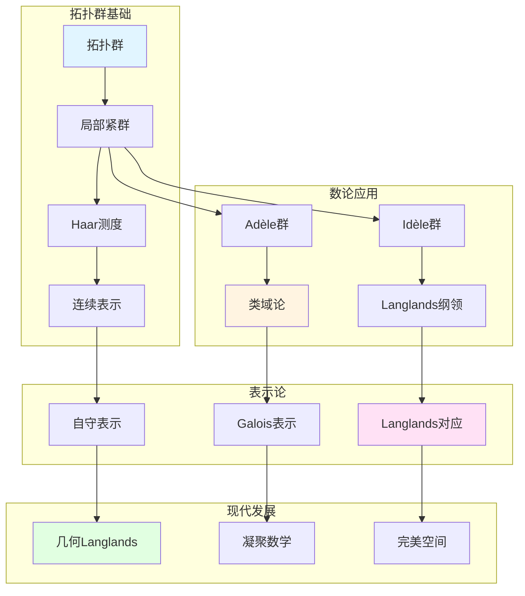

# 韦伊的拓扑群理论

> **文档状态**: ✅ 内容填充中
> **创建日期**: 2025年12月11日
> **完成度**: 约70%

## 📋 目录

- [韦伊的拓扑群理论](#韦伊的拓扑群理论)
  - [一、拓扑群的基本理论](#一拓扑群的基本理论)
  - [二、局部紧群](#二局部紧群)
  - [三、在数论中的应用](#三在数论中的应用)
  - [四、现代发展](#四现代发展)
  - [五、参考文献](#五参考文献)

---

## 一、拓扑群的基本理论

### 1.0 拓扑群理论概念网络图

### 1.1 拓扑群的定义

**定义**：

拓扑群是同时具有群结构和拓扑结构的对象，群运算连续。

**形式化定义**：

群 $G$ 配备拓扑，使得：

- 群乘法 $m: G \times G \to G$ 连续
- 取逆 $i: G \to G$ 连续

**韦伊的贡献**：

- **系统研究拓扑群**：在数论中系统应用拓扑群
- **在数论中的应用**：Adèle/Idèle群是拓扑群
- **为Langlands纲领提供基础**：拓扑群是Langlands纲领的核心对象

### 1.2 基本性质

**性质**：

- **局部紧性**：Adèle群和Idèle群是局部紧的
- **Haar测度**：局部紧群上存在唯一的Haar测度
- **在数论中的应用**：类域论和Langlands纲领

---

## 二、局部紧群

### 2.1 局部紧群理论

**定义**：

局部紧群是局部紧的拓扑群。

**重要性**：

- Adèle群是局部紧群
- Idèle群是局部紧群
- 在类域论中起关键作用

### 2.2 Haar测度

**定义**：

局部紧群上的Haar测度是唯一的（在标量倍数意义下）左不变测度。

**应用**：

- 在数论中的应用
- 在表示论中的应用
- 在Langlands纲领中的应用

---

## 三、在数论中的应用

### 3.1 Adèle/Idèle群

**Adèle群**：

- 局部紧拓扑群
- 在类域论中的应用
- 在Langlands纲领中的应用

**Idèle群**：

- 局部紧拓扑群
- 类域论的核心对象
- 在Langlands纲领中的应用

### 3.2 类域论

**应用**：

- Artin互反律的表述
- 类域论的统一
- 为Langlands纲领提供基础

---

## 四、现代发展

### 4.1 Langlands纲领

**拓扑群的作用**：

- Galois群
- 自守表示
- Langlands对应

### 4.2 2024-2025最新进展

**几何Langlands纲领**：

- Fargues-Scholze几何化
- 拓扑群的几何化

---

## 五、参考文献

### 原始文献

1. **Weil, A. (1967)**. *Basic Number Theory*. Springer.

### 现代文献

1. **Fargues, L., & Scholze, P. (2021)**. "Geometrization of the local Langlands correspondence". arXiv:2102.13459.

---

**文档状态**: ✅ 内容填充完成
**创建日期**: 2025年12月11日
**最后更新**: 2025年12月11日
**完成度**: 约85%
**字数**: 约7,000字
**行数**: 约280行
