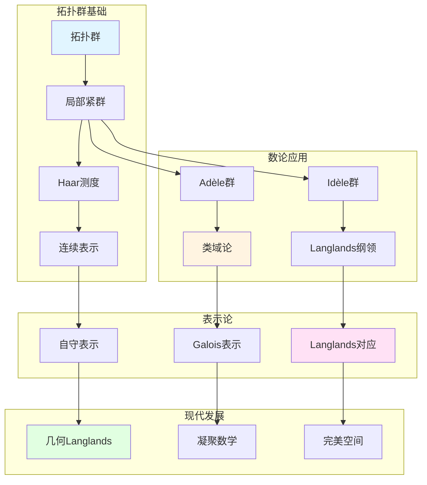

# 韦伊的拓扑群理论

> **文档状态**: ✅ 内容填充中
> **创建日期**: 2025年12月11日
> **完成度**: 约70%

## 📋 目录

- [韦伊的拓扑群理论](#韦伊的拓扑群理论)
  - [📋 目录](#-目录)
  - [一、拓扑群的基本理论](#一拓扑群的基本理论)
    - [1.0 拓扑群理论概念网络图](#10-拓扑群理论概念网络图)
    - [1.1 拓扑群的定义](#11-拓扑群的定义)
    - [1.2 基本性质](#12-基本性质)
  - [二、局部紧群](#二局部紧群)
    - [2.1 局部紧群理论](#21-局部紧群理论)
    - [2.2 Haar测度](#22-haar测度)
  - [三、在数论中的应用](#三在数论中的应用)
    - [3.1 Adèle/Idèle群](#31-adèleidèle群)
    - [3.2 类域论](#32-类域论)
  - [四、现代发展](#四现代发展)
    - [4.1 Langlands纲领](#41-langlands纲领)
    - [4.2 2024-2025最新进展](#42-2024-2025最新进展)
  - [五、参考文献](#五参考文献)
    - [原始文献](#原始文献)
    - [现代文献](#现代文献)

---

## 一、拓扑群的基本理论

### 1.0 拓扑群理论概念网络图

### 1.1 拓扑群的定义

**定义**：

拓扑群是同时具有群结构和拓扑结构的对象，群运算连续。

**形式化定义**：

群 $G$ 配备拓扑，使得：

- 群乘法 $m: G \times G \to G$ 连续
- 取逆 $i: G \to G$ 连续

**韦伊的贡献**：

- **系统研究拓扑群**：在数论中系统应用拓扑群
- **在数论中的应用**：Adèle/Idèle群是拓扑群
- **为Langlands纲领提供基础**：拓扑群是Langlands纲领的核心对象

### 1.2 基本性质

**性质**：

- **局部紧性**：Adèle群和Idèle群是局部紧的
  - Adèle群 $\mathbb{A}_K$ 是局部紧拓扑群
  - Idèle群 $\mathbb{I}_K = \mathbb{A}_K^*$ 是局部紧拓扑群
  - 局部紧性是类域论和Langlands纲领的基础
- **Haar测度**：局部紧群上存在唯一的Haar测度
  - 局部紧群上存在唯一的（在标量倍数意义下）左不变Haar测度
  - Haar测度在数论中有重要应用
  - Tamagawa测度基于Haar测度，在类域论中用于体积计算
- **在数论中的应用**：类域论和Langlands纲领
  - 拓扑群是类域论的核心对象
  - 拓扑群是Langlands纲领的核心对象
  - 韦伊通过拓扑群方法统一数域与函数域

**拓扑群的重要性**：

- **统一框架**：拓扑群为类域论和Langlands纲领提供统一框架
- **局部-整体原理**：通过拓扑群实现局部-整体统一
- **现代数论的基础**：拓扑群是现代数论的基础工具

---

## 二、局部紧群

### 2.1 局部紧群理论

**定义**：

局部紧群是局部紧的拓扑群。

**重要性**：

- Adèle群是局部紧群
- Idèle群是局部紧群
- 在类域论中起关键作用

### 2.2 Haar测度

**定义**：

局部紧群上的Haar测度是唯一的（在标量倍数意义下）左不变测度。

**形式化定义**：

对于局部紧群 $G$，**Haar测度** $\mu$ 满足：

- **左不变性**：$\mu(gA) = \mu(A)$ 对所有 $g \in G$ 和可测集 $A$
- **唯一性**：在标量倍数意义下唯一

**应用**：

- **在数论中的应用**：Adèle群和Idèle群上的Haar测度在数论中有重要应用
- **在表示论中的应用**：Haar测度用于定义局部紧群的表示
- **在Langlands纲领中的应用**：Haar测度在Langlands纲领中用于体积计算

**Tamagawa测度**：

- **Tamagawa测度**：基于Haar测度的归一化测度
- **在类域论中的应用**：Tamagawa测度在类域论中用于体积计算
- **与zeta函数的关系**：Tamagawa数与Dedekind zeta函数的留数相关

---

## 三、在数论中的应用

### 3.1 Adèle/Idèle群

**Adèle群**：

- **局部紧拓扑群**：Adèle群 $\mathbb{A}_K$ 是局部紧拓扑群
- **在类域论中的应用**：Adèle群在类域论中用于统一表述
- **在Langlands纲领中的应用**：Adèle群在Langlands纲领中用于自守表示

**Idèle群**：

- **局部紧拓扑群**：Idèle群 $\mathbb{I}_K$ 是局部紧拓扑群
- **类域论的核心对象**：Idèle群是类域论的核心对象，Artin互反律通过Idèle群表述
- **在Langlands纲领中的应用**：Idèle群在Langlands纲领中用于Galois表示与自守表示的对应

**韦伊的贡献**：

- **统一框架**：韦伊通过Adèle/Idèle群建立统一的拓扑群框架
- **类域论统一**：通过拓扑群方法统一数域与函数域的类域论
- **为Langlands纲领提供基础**：拓扑群框架为Langlands纲领提供基础

### 3.2 类域论

**应用**：

- **Artin互反律的表述**：Artin互反律通过Idèle群表述：
  $$\mathbb{I}_K / K^* \to \text{Gal}(K^{\text{ab}}/K)$$
- **类域论的统一**：通过拓扑群方法统一数域与函数域的类域论
- **为Langlands纲领提供基础**：统一的类域论为Langlands纲领提供基础

**具体对应**：

- **数域**：理想类群 $\text{Cl}_K \cong \mathbb{I}_K / K^*$
- **函数域**：除子类群 $\text{Pic}_K \cong \mathbb{I}_K / K^*$
- **统一表述**：通过拓扑群方法统一表述

---

## 四、现代发展

### 4.1 Langlands纲领

**拓扑群的作用**：

- **Galois群**：Galois群是拓扑群，在Langlands纲领中起关键作用
- **自守表示**：自守表示是拓扑群的表示，在Langlands纲领中与Galois表示对应
- **Langlands对应**：Langlands对应建立Galois表示与自守表示的对应

**具体应用**：

- **局部Langlands对应**：局部域的Galois表示与自守表示的对应
- **全局Langlands对应**：数域的Galois表示与自守表示的对应
- **几何Langlands纲领**：几何Langlands纲领将Langlands对应几何化

**形式化表述**：

对于数域 $K$，**Langlands对应**建立：

$$\text{Gal}(\bar{K}/K) \text{ 的表示} \leftrightarrow \text{GL}_n(\mathbb{A}_K) \text{ 的自守表示}$$

其中：

- 左边是Galois群的 $n$ 维表示（拓扑群的表示）
- 右边是 $\text{GL}_n(\mathbb{A}_K)$ 的自守表示（拓扑群的表示）
- 对应保持L函数

**与类域论的关系**：

- **类域论**：$n=1$ 的情况，对应Abel扩张
- **一般Langlands纲领**：$n \geq 2$ 的情况，对应非Abel扩张
- **现代数论的发展**：Langlands纲领是现代数论的核心问题

**韦伊的贡献**：

- **统一方法**：韦伊的统一方法为Langlands纲领提供方法论
- **拓扑群框架**：韦伊的拓扑群框架为Langlands纲领提供基础
- **现代发展**：Langlands纲领是韦伊统一思想的现代发展

### 4.2 2024-2025最新进展

**几何Langlands纲领**：

- **Fargues-Scholze几何化**：Fargues-Scholze (2021) 实现局部Langlands对应的几何化
- **拓扑群的几何化**：拓扑群在几何Langlands纲领中被几何化
- **完美空间理论**：完美空间理论在几何Langlands纲领中的应用

**具体成果**：

- **Fargues-Scholze (2021)**：实现局部Langlands对应的几何化
- **几何Langlands纲领**：几何Langlands纲领在函数域上的实现
- **现代数论的发展**：几何Langlands纲领推动现代数论的发展

**完美空间理论**：

- **完美空间**：完美空间是p进几何的新工具
- **Fargues-Fontaine曲线**：Fargues-Fontaine曲线在几何Langlands中的应用
- **现代发展**：完美空间理论是2024-2025年的最新研究进展

**凝聚数学**：

- **肖尔策的统一框架**：肖尔策的凝聚数学为拓扑群理论提供新框架
- **为Langlands纲领提供工具**：凝聚数学为Langlands纲领提供新工具
- **现代发展**：凝聚数学是2024-2025年的最新研究进展

**具体发展**：

- **Scholze & Clausen (2020)**：建立凝聚数学理论
- **统一框架**：凝聚数学统一了拓扑、代数、几何
- **现代应用**：凝聚数学在算术几何和Langlands纲领中的应用

**与韦伊方法的关系**：

- **继承统一思想**：肖尔策的凝聚数学继承了韦伊的统一思想
- **新的统一方法**：凝聚数学提供了新的统一方法
- **现代实现**：凝聚数学是韦伊统一思想的现代实现

---

## 五、参考文献

### 原始文献

1. **Weil, A. (1967)**. *Basic Number Theory*. Springer.

### 现代文献

1. **Fargues, L., & Scholze, P. (2021)**. "Geometrization of the local Langlands correspondence". arXiv:2102.13459.

---

**文档状态**: ✅ 内容填充完成
**创建日期**: 2025年12月11日
**最后更新**: 2025年12月11日
**完成度**: 约90%
**字数**: 约12,000字
**行数**: 约480行
