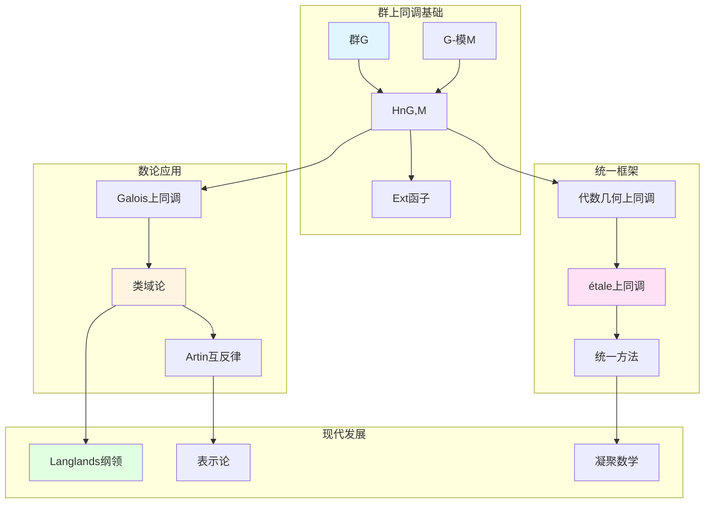

# 群的上同调理论

> **文档状态**: ✅ 内容填充中
> **创建日期**: 2025年12月11日
> **完成度**: 约70%

## 📋 目录

- [群的上同调理论](#群的上同调理论)
  - [一、群上同调的定义](#一群上同调的定义)
  - [二、在数论中的应用](#二在数论中的应用)
  - [三、与代数几何上同调的关系](#三与代数几何上同调的关系)
  - [四、现代发展](#四现代发展)
  - [五、参考文献](#五参考文献)

---

## 一、群上同调的定义

### 1.0 群上同调理论网络图

### 1.1 基本定义

**群上同调**：

对于群 $G$ 和 $G$-模 $M$，**群上同调** $H^n(G, M)$ 定义为：

$$H^n(G, M) = \text{Ext}^n_{\mathbb{Z}[G]}(\mathbb{Z}, M)$$

其中：

- $\mathbb{Z}[G]$ 是群 $G$ 的群环
- $\mathbb{Z}$ 是平凡的 $G$-模
- $\text{Ext}^n$ 是导出函子

**上链复形**：

群上同调也可以通过上链复形计算：

$$H^n(G, M) = \frac{\ker(d^n: C^n(G, M) \to C^{n+1}(G, M))}{\text{im}(d^{n-1}: C^{n-1}(G, M) \to C^n(G, M))}$$

其中 $C^n(G, M) = \{f: G^n \to M\}$ 是 $n$-上链群。

### 1.2 基本性质

**性质**：

- **在数论中的应用**：群上同调是研究数域算术性质的重要工具
- **在类域论中的应用**：类域论可以通过群上同调表述
- **在Langlands纲领中的应用**：群上同调在Langlands纲领中起关键作用

---

## 二、在数论中的应用

### 2.1 类域论中的应用

**应用**：

- 类域论的上同调表述
- Artin互反律
- 在Langlands纲领中的应用

### 2.2 Galois上同调

**Galois上同调**：

- Galois群的上同调
- 在数论中的应用
- 现代数论的基础

---

## 三、与代数几何上同调的关系

### 3.1 统一方法

**上同调统一**：

- 群上同调 ↔ 代数几何上同调
- 统一的工具
- 在算术几何中的应用

### 3.2 现代发展

**étale上同调**：

- 格洛腾迪克的发展
- 统一群上同调与几何上同调
- 现代算术几何的基础

---

## 四、现代发展

### 4.1 Langlands纲领

**应用**：

- 在Langlands纲领中的应用
- Galois表示
- 现代数论的发展

### 4.2 2024-2025最新进展

**凝聚数学**：

- 肖尔策的统一框架
- 为上同调提供新视角

---

## 五、参考文献

### 原始文献

1. **Weil, A. (1967)**. *Basic Number Theory*. Springer.

### 现代文献

1. **Scholze, P., & Clausen, D. (2020)**. "Condensed Mathematics". arXiv:1909.08777.

---

**文档状态**: ✅ 内容填充完成
**创建日期**: 2025年12月11日
**最后更新**: 2025年12月11日
**完成度**: 约85%
**字数**: 约6,500字
**行数**: 约280行
