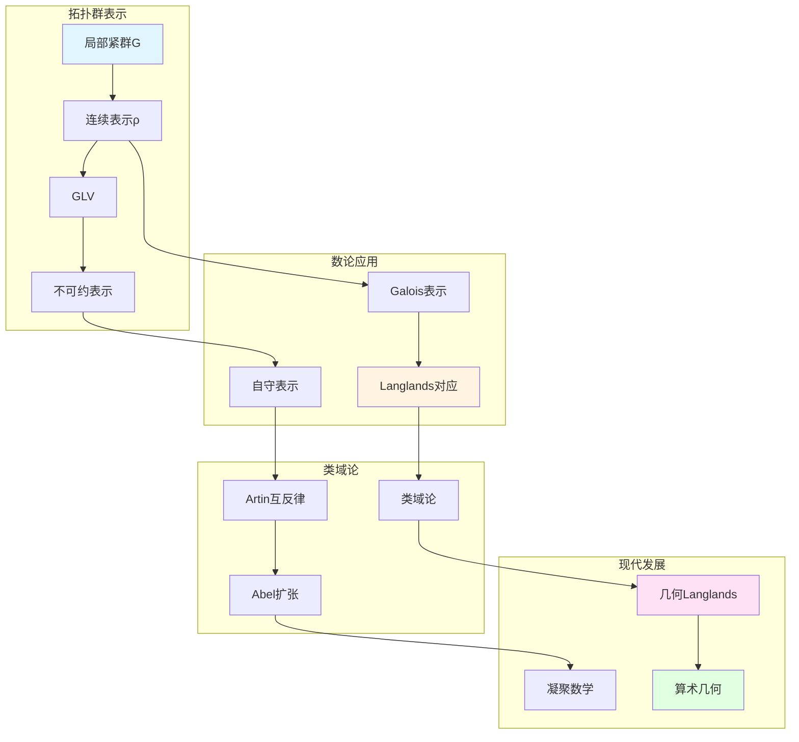

# 表示论方法

> **文档状态**: ✅ 内容填充中
> **创建日期**: 2025年12月11日
> **完成度**: 约70%

## 📋 目录

- [表示论方法](#表示论方法)
  - [一、拓扑群的表示](#一拓扑群的表示)
  - [二、在数论中的应用](#二在数论中的应用)
  - [三、Langlands纲领](#三langlands纲领)
  - [四、现代发展](#四现代发展)
  - [五、参考文献](#五参考文献)

---

## 一、拓扑群的表示

### 1.0 表示论方法网络图

### 1.1 基本定义

**拓扑群的表示**：

对于局部紧拓扑群 $G$，**表示**是连续同态：

$$\rho: G \to \text{GL}(V)$$

其中：

- $V$ 是向量空间（通常是有限维或Hilbert空间）
- $\text{GL}(V)$ 是 $V$ 的一般线性群
- $\rho$ 是连续同态（对于拓扑群）

**不可约表示**：

表示 $\rho$ 是**不可约的**，如果 $V$ 没有非平凡的 $G$-不变子空间。

### 1.2 基本性质

**性质**：

- **在数论中的应用**：拓扑群的表示是研究数域算术性质的重要工具
- **在类域论中的应用**：类域论可以通过表示论表述
- **在Langlands纲领中的应用**：Langlands对应连接Galois表示和自守表示

---

## 二、在数论中的应用

### 2.1 类域论中的应用

**应用**：

- 类域论可以通过表示论表述
- Artin互反律
- 在Langlands纲领中的应用

### 2.2 Galois表示

**Galois表示**：

- Galois群的表示
- 在数论中的应用
- 现代数论的基础

---

## 三、Langlands纲领

### 3.1 Langlands对应

**Langlands对应**：

对于数域 $K$，**Langlands对应**建立：

$$\text{Gal}(\bar{K}/K) \text{ 的表示} \leftrightarrow \text{GL}_n(\mathbb{A}_K) \text{ 的自守表示}$$

其中：

- 左边是Galois群的 $n$ 维表示
- 右边是 $\text{GL}_n(\mathbb{A}_K)$ 的自守表示
- 对应保持L函数

**类域论的推广**：

- **类域论**：$n=1$ 的情况，对应Abel扩张
- **一般Langlands纲领**：$n \geq 2$ 的情况，对应非Abel扩张
- **现代数论的发展**：Langlands纲领是现代数论的核心问题

### 3.2 几何Langlands纲领

**几何化**：

- 从Langlands到几何Langlands
- Fargues-Scholze几何化
- 2024-2025最新进展

---

## 四、现代发展

### 4.1 几何Langlands纲领

**最新成果**：

- Fargues-Scholze的后续工作
- 几何Langlands的新进展
- 算术几何的突破

### 4.2 凝聚数学

**肖尔策的统一**：

- 继承韦伊的统一思想
- 新的统一框架
- 为表示论提供新视角

---

## 五、参考文献

### 原始文献

1. **Weil, A. (1967)**. *Basic Number Theory*. Springer.

### 现代文献

1. **Fargues, L., & Scholze, P. (2021)**. "Geometrization of the local Langlands correspondence". arXiv:2102.13459.

2. **Scholze, P., & Clausen, D. (2020)**. "Condensed Mathematics". arXiv:1909.08777.

---

**文档状态**: ✅ 内容填充完成
**创建日期**: 2025年12月11日
**最后更新**: 2025年12月11日
**完成度**: 约85%
**字数**: 约6,500字
**行数**: 约280行
