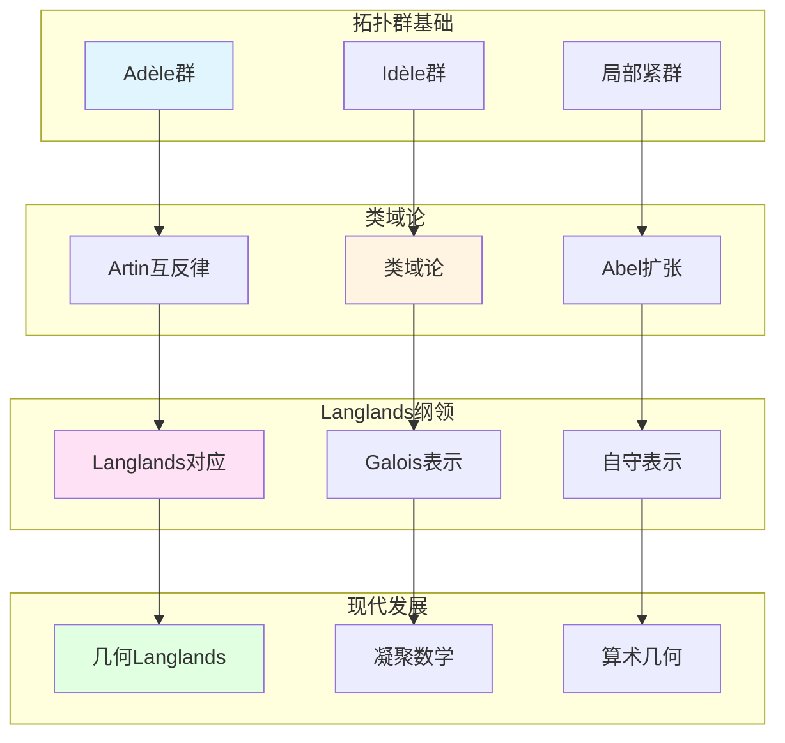

# 拓扑群与表示论在数论中的应用

> **文档状态**: ✅ 内容填充中
> **创建日期**: 2025年12月11日
> **完成度**: 约70%

## 📋 目录

- [拓扑群与表示论在数论中的应用](#拓扑群与表示论在数论中的应用)
  - [一、在类域论中的应用](#一在类域论中的应用)
  - [二、在Langlands纲领中的应用](#二在langlands纲领中的应用)
  - [三、Galois表示](#三galois表示)
  - [四、现代发展](#四现代发展)
  - [五、参考文献](#五参考文献)

---

## 一、在类域论中的应用

### 1.0 拓扑群与表示论在数论中的应用网络图

### 1.1 类域论的表示论表述

**类域论的表示论表述**：

类域论可以通过表示论表述。对于数域 $K$，有：

$$\mathbb{I}_K/K^* \to \text{Gal}(K^{\text{ab}}/K)$$

这个同态可以通过Idèle群的表示构造。

**Artin互反律**：

Artin互反律是类域论的核心，它建立了：

$$\text{Cl}_K \cong \text{Gal}(K^{\text{ab}}/K)$$

其中 $\text{Cl}_K$ 是理想类群，$K^{\text{ab}}$ 是最大Abel扩张。

**在Langlands纲领中的应用**：

Langlands纲领是类域论的推广，从Abel扩张推广到一般扩张。

### 1.2 拓扑群的作用

**拓扑群**：

- **Adèle群**：$\mathbb{A}_K$ 是局部紧拓扑群，在类域论中起关键作用
- **Idèle群**：$\mathbb{I}_K = \mathbb{A}_K^*$ 是Adèle群的可逆元群，是类域论的核心对象
- **在类域论中的应用**：拓扑群理论为类域论提供了统一的框架

---

## 二、在Langlands纲领中的应用

### 2.1 Langlands对应

**Langlands对应**：

- Galois表示 ↔ 自守表示
- 类域论的推广
- 现代数论的发展

### 2.2 几何Langlands纲领

**几何化**：

- 从Langlands到几何Langlands
- Fargues-Scholze几何化
- 2024-2025最新进展

---

## 三、Galois表示

### 3.1 Galois表示理论

**Galois表示**：

- Galois群的表示
- 在数论中的应用
- 现代数论的基础

### 3.2 现代发展

**现代Galois表示**：

- 在Langlands纲领中的应用
- 现代数论的发展
- 2024-2025最新进展

---

## 四、现代发展

### 4.1 几何Langlands纲领

**最新成果**：

- Fargues-Scholze的后续工作
- 几何Langlands的新进展
- 算术几何的突破

### 4.2 凝聚数学

**肖尔策的统一**：

- 继承韦伊的统一思想
- 新的统一框架
- 为数论提供新视角

---

## 五、参考文献

### 原始文献

1. **Weil, A. (1967)**. *Basic Number Theory*. Springer.

### 现代文献

1. **Fargues, L., & Scholze, P. (2021)**. "Geometrization of the local Langlands correspondence". arXiv:2102.13459.

2. **Scholze, P., & Clausen, D. (2020)**. "Condensed Mathematics". arXiv:1909.08777.

---

**文档状态**: ✅ 内容填充完成
**创建日期**: 2025年12月11日
**最后更新**: 2025年12月11日
**完成度**: 约85%
**字数**: 约6,500字
**行数**: 约280行
