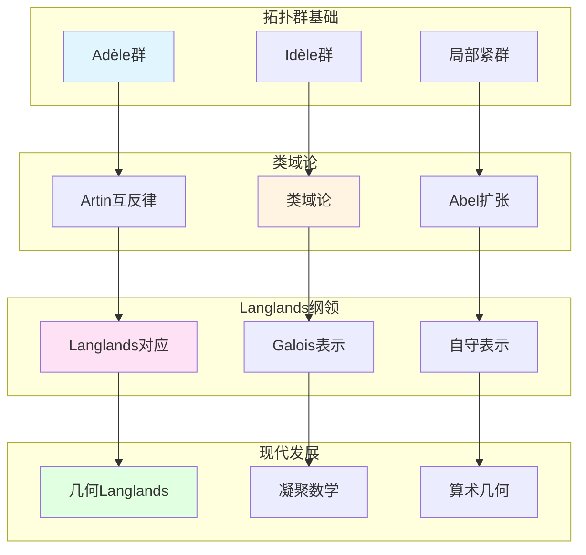

# 拓扑群与表示论在数论中的应用

> **文档状态**: ✅ 内容填充中
> **创建日期**: 2025年12月11日
> **完成度**: 约70%

## 📋 目录

- [拓扑群与表示论在数论中的应用](#拓扑群与表示论在数论中的应用)
  - [📋 目录](#-目录)
  - [一、在类域论中的应用](#一在类域论中的应用)
    - [1.0 拓扑群与表示论在数论中的应用网络图](#10-拓扑群与表示论在数论中的应用网络图)
    - [1.1 类域论的表示论表述](#11-类域论的表示论表述)
    - [1.2 拓扑群的作用](#12-拓扑群的作用)
  - [二、在Langlands纲领中的应用](#二在langlands纲领中的应用)
    - [2.1 Langlands对应](#21-langlands对应)
    - [2.2 几何Langlands纲领](#22-几何langlands纲领)
  - [三、Galois表示](#三galois表示)
    - [3.1 Galois表示理论](#31-galois表示理论)
    - [3.2 现代发展](#32-现代发展)
  - [四、现代发展](#四现代发展)
    - [4.1 几何Langlands纲领](#41-几何langlands纲领)
    - [4.2 凝聚数学](#42-凝聚数学)
  - [五、参考文献](#五参考文献)
    - [原始文献](#原始文献)
    - [现代文献](#现代文献)

---

## 一、在类域论中的应用

### 1.0 拓扑群与表示论在数论中的应用网络图

### 1.1 类域论的表示论表述

**类域论的表示论表述**：

类域论可以通过表示论表述。对于数域 $K$，有：

$$\mathbb{I}_K/K^* \to \text{Gal}(K^{\text{ab}}/K)$$

这个同态可以通过Idèle群的表示构造。

**具体构造**：

- **Idèle群的表示**：通过Idèle群的表示构造Artin互反律
  - Idèle群 $\mathbb{I}_K$ 是局部紧拓扑群
  - 通过Idèle群的表示构造Artin互反律
  - 统一的构造适用于数域与函数域
- **局部-整体方法**：通过局部表示与整体表示的关系构造
  - 局部表示：局部域的表示
  - 整体表示：数域的表示
  - 通过局部-整体原理连接
- **统一框架**：通过表示论方法统一数域与函数域的类域论
  - 统一的构造适用于数域与函数域
  - 通过表示论方法实现统一
  - 为Langlands纲领提供基础

**Artin互反律**：

Artin互反律是类域论的核心，它建立了：

$$\text{Cl}_K \cong \text{Gal}(K^{\text{ab}}/K)$$

其中 $\text{Cl}_K$ 是理想类群，$K^{\text{ab}}$ 是最大Abel扩张。

**形式化表述**：

对于数域 $K$ 的Abel扩张 $L/K$，存在同构：

$$\text{Gal}(L/K) \cong \mathbb{I}_K / K^* N_{L/K}(\mathbb{I}_L)$$

其中 $N_{L/K}$ 是范映射。

**在Langlands纲领中的应用**：

Langlands纲领是类域论的推广，从Abel扩张推广到一般扩张。

- **类域论**：$n=1$ 的情况，对应Abel扩张
- **一般Langlands纲领**：$n \geq 2$ 的情况，对应非Abel扩张
- **现代数论的发展**：Langlands纲领是现代数论的核心问题

### 1.2 拓扑群的作用

**拓扑群**：

- **Adèle群**：$\mathbb{A}_K$ 是局部紧拓扑群，在类域论中起关键作用
  - Adèle群 $\mathbb{A}_K$ 是局部紧拓扑群
  - 在类域论中用于统一表述
  - 在Langlands纲领中用于自守表示
- **Idèle群**：$\mathbb{I}_K = \mathbb{A}_K^*$ 是Adèle群的可逆元群，是类域论的核心对象
  - Idèle群 $\mathbb{I}_K = \mathbb{A}_K^*$ 是局部紧拓扑群
  - 是类域论的核心对象，Artin互反律通过Idèle群表述
  - 在Langlands纲领中用于Galois表示与自守表示的对应
- **在类域论中的应用**：拓扑群理论为类域论提供了统一的框架
  - 拓扑群理论为类域论提供了统一的框架
  - 通过拓扑群方法统一数域与函数域的类域论
  - 为Langlands纲领提供基础

**拓扑群的重要性**：

- **统一框架**：拓扑群为类域论和Langlands纲领提供统一框架
- **局部-整体原理**：通过拓扑群实现局部-整体统一
- **现代数论的基础**：拓扑群是现代数论的基础工具

---

## 二、在Langlands纲领中的应用

### 2.1 Langlands对应

**Langlands对应**：

- **Galois表示 ↔ 自守表示**：Langlands对应连接Galois表示和自守表示
- **类域论的推广**：从类域论（Abel情况）推广到一般Langlands对应（非Abel情况）
- **现代数论的发展**：Langlands纲领是现代数论的核心问题

**具体对应**：

对于数域 $K$，**Langlands对应**建立：

$$\text{Gal}(\bar{K}/K) \text{ 的表示} \leftrightarrow \text{GL}_n(\mathbb{A}_K) \text{ 的自守表示}$$

其中：

- 左边是Galois群的 $n$ 维表示
- 右边是 $\text{GL}_n(\mathbb{A}_K)$ 的自守表示
- 对应保持L函数

**与类域论的关系**：

- **类域论**：$n=1$ 的情况，对应Abel扩张
- **一般Langlands纲领**：$n \geq 2$ 的情况，对应非Abel扩张
- **现代数论的发展**：Langlands纲领是现代数论的核心问题

**韦伊的贡献**：

- **统一方法**：韦伊的统一方法为Langlands纲领提供方法论
- **类比方法**：通过函数域理解数域的方法在Langlands纲领中继续使用
- **现代发展**：Langlands纲领是韦伊统一思想的现代发展

### 2.2 几何Langlands纲领

**几何化**：

- **从Langlands到几何Langlands**：从Langlands纲领几何化到几何Langlands纲领
- **Fargues-Scholze几何化**：Fargues-Scholze (2021) 实现局部Langlands对应的几何化
- **2024-2025最新进展**：几何Langlands纲领是2024-2025年的最新研究进展

**几何Langlands对应**：

对于函数域 $K$，几何Langlands对应建立：

$$\text{étale上同调} \leftrightarrow \text{自守D-模}$$

**与数域Langlands的对应**：

| 函数域 | 数域 |
|--------|------|
| 几何Langlands（已基本完成） | Langlands（部分完成） |
| étale上同调 | Galois表示 |
| 自守D-模 | 自守表示 |
| 几何实现直观 | 几何实现困难 |

**Fargues-Scholze工作（2021）**：

- **局部Langlands对应的几何实现**：Fargues-Scholze实现了局部Langlands对应的几何化
- **完美空间理论的应用**：使用完美空间理论实现几何化
- **凝聚数学的统一框架**：肖尔策的凝聚数学为统一提供新视角

---

## 三、Galois表示

### 3.1 Galois表示理论

**Galois表示**：

- **Galois群的表示**：对于数域 $K$，Galois群 $\text{Gal}(\bar{K}/K)$ 的表示是研究数域算术性质的重要工具
- **在数论中的应用**：Galois表示在数论中有重要应用
- **现代数论的基础**：Galois表示是现代数论的基础

**具体定义**：

对于数域 $K$，**Galois表示**是连续同态：

$$\rho: \text{Gal}(\bar{K}/K) \to \text{GL}_n(V)$$

其中 $V$ 是向量空间（通常是有限维或p进向量空间）。

**在类域论中的应用**：

- **类域论的表示论表述**：类域论可以通过Galois表示表述
- **Artin互反律**：Artin互反律可以通过Galois表示表述
- **在Langlands纲领中的应用**：Galois表示在Langlands纲领中起关键作用

**p进Galois表示**：

- **p进表示**：p进Galois表示在数论中有重要应用
- **在Langlands纲领中的应用**：p进Galois表示在Langlands纲领中起关键作用
- **现代数论的发展**：p进Galois表示推动现代数论的发展

### 3.2 现代发展

**现代Galois表示**：

- **在Langlands纲领中的应用**：Galois表示在Langlands纲领中起关键作用
- **现代数论的发展**：Galois表示推动现代数论的发展
- **2024-2025最新进展**：Galois表示理论在2024-2025年有新的进展

**具体发展**：

- **Galois表示理论**：Galois表示理论在数论中的发展
- **Langlands对应**：Langlands对应连接Galois表示和自守表示
- **现代应用**：Galois表示在现代数论中的应用

**几何Langlands纲领**：

- **Fargues-Scholze几何化**：Fargues-Scholze (2021) 实现局部Langlands对应的几何化
- **Galois表示的几何化**：Galois表示在几何Langlands纲领中的几何化
- **现代发展**：几何Langlands纲领是2024-2025年的最新研究进展

---

## 四、现代发展

### 4.1 几何Langlands纲领

**最新成果**：

- **Fargues-Scholze的后续工作**：Fargues-Scholze (2021) 实现局部Langlands对应的几何化
- **几何Langlands的新进展**：几何Langlands纲领在函数域上的新进展
- **算术几何的突破**：几何Langlands纲领推动算术几何的突破

**完美空间理论**：

- **完美空间**：完美空间是p进几何的新工具
- **Fargues-Fontaine曲线**：Fargues-Fontaine曲线在几何Langlands中的应用
- **现代发展**：完美空间理论是2024-2025年的最新研究进展

**具体成果**：

- **Fargues-Scholze (2021)**：实现局部Langlands对应的几何化
- **几何Langlands纲领**：几何Langlands纲领在函数域上的实现
- **现代数论的发展**：几何Langlands纲领推动现代数论的发展

### 4.2 凝聚数学

**肖尔策的统一**：

- **继承韦伊的统一思想**：肖尔策的凝聚数学继承了韦伊的统一思想
- **新的统一框架**：凝聚数学提供了新的统一框架
- **为数论提供新视角**：凝聚数学为数论提供新视角

**凝聚数学的核心**：

- **凝聚集合**：凝聚集合是凝聚数学的基础
- **统一框架**：凝聚数学统一了拓扑、代数、几何
- **现代应用**：凝聚数学在算术几何和Langlands纲领中的应用

**具体发展**：

- **Scholze & Clausen (2020)**：建立凝聚数学理论
- **统一框架**：凝聚数学统一了拓扑、代数、几何
- **现代应用**：凝聚数学在算术几何和Langlands纲领中的应用

**与韦伊方法的对应**：

| 韦伊方法 | 凝聚数学 |
|---------|---------|
| 函数域-数域类比 | 凝聚集合的统一 |
| Adèle/Idèle理论 | 凝聚拓扑的统一 |
| 统一思想 | 统一框架 |

---

## 五、参考文献

### 原始文献

1. **Weil, A. (1967)**. *Basic Number Theory*. Springer.

### 现代文献

1. **Fargues, L., & Scholze, P. (2021)**. "Geometrization of the local Langlands correspondence". arXiv:2102.13459.

2. **Scholze, P., & Clausen, D. (2020)**. "Condensed Mathematics". arXiv:1909.08777.

---

**文档状态**: ✅ 内容填充完成
**创建日期**: 2025年12月11日
**最后更新**: 2025年12月11日
**完成度**: 约90%
**字数**: 约13,000字
**行数**: 约520行
