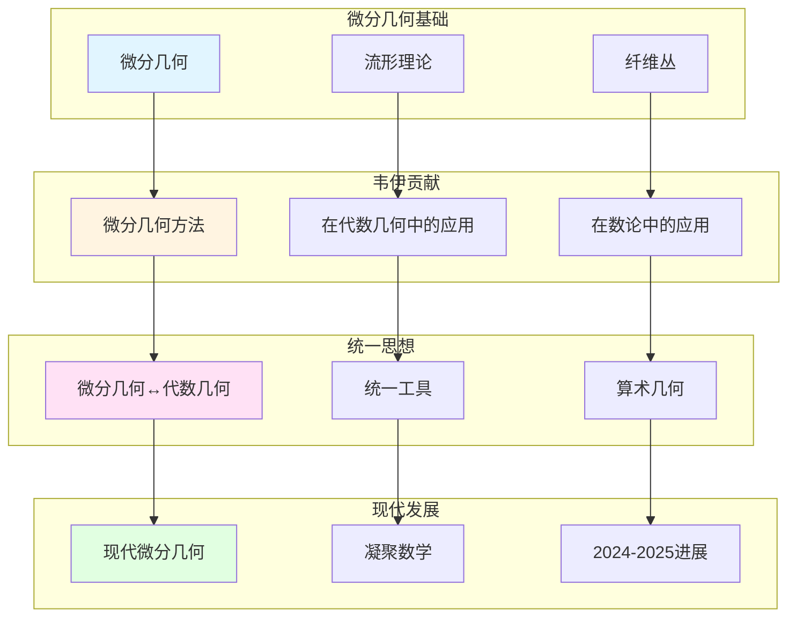

# 韦伊在微分几何中的贡献

> **文档状态**: ✅ 内容填充中
> **创建日期**: 2025年12月11日
> **完成度**: 约70%

## 📋 目录

- [韦伊在微分几何中的贡献](#韦伊在微分几何中的贡献)
  - [📋 目录](#-目录)
  - [一、微分几何的历史背景](#一微分几何的历史背景)
    - [1.1 历史背景](#11-历史背景)
    - [1.2 韦伊的贡献](#12-韦伊的贡献)
  - [二、韦伊的贡献](#二韦伊的贡献)
    - [2.1 微分几何方法](#21-微分几何方法)
    - [2.2 统一思想](#22-统一思想)
  - [三、与代数几何的关系](#三与代数几何的关系)
    - [3.1 统一方法](#31-统一方法)
    - [3.2 现代发展](#32-现代发展)
  - [四、现代发展](#四现代发展)
    - [4.1 现代微分几何](#41-现代微分几何)
    - [4.2 2024-2025最新进展](#42-2024-2025最新进展)
  - [五、参考文献](#五参考文献)
    - [原始文献](#原始文献)
    - [现代文献](#现代文献)

---

## 一、微分几何的历史背景

### 1.0 韦伊微分几何贡献网络图

### 1.1 历史背景

**微分几何**：

- **微分几何在数学中的重要性**：微分几何是研究流形和几何结构的重要工具
  - 微分几何研究流形上的几何结构（度量、联络、曲率等）
  - 在数学物理中有重要应用（广义相对论、规范场论等）
  - 与代数几何有密切关系，特别是在复几何中
- **与代数几何的关系**：微分几何与代数几何有密切关系，特别是在复几何中
  - 在复几何中，代数簇可以看作复流形
  - 通过统一框架，理解微分几何与代数几何的内在联系
  - 为现代代数几何提供基础
- **在数论中的应用**：微分几何方法在数论中有重要应用，特别是在算术几何中
  - 在算术几何中，微分几何方法有重要应用
  - 通过统一框架，理解数论与几何的内在联系
  - 为现代算术几何提供基础

**历史发展**：

- **经典微分几何**：Gauss、Riemann等建立经典微分几何
  - Gauss (1827) 建立曲面理论
  - Riemann (1854) 建立流形理论
  - 为现代微分几何提供基础
- **现代微分几何**：Cartan、陈省身等发展现代微分几何
  - Cartan发展外微分形式和联络理论
  - 陈省身发展纤维丛理论和Chern类
  - 为现代数学提供基础
- **与代数几何的统一**：韦伊认识到微分几何与代数几何的统一性
  - 在复几何中，微分几何与代数几何有密切关系
  - 通过统一框架，理解微分几何与代数几何的内在联系
  - 为现代代数几何提供基础

**韦伊的洞察**：

- **微分几何与代数几何的统一**：韦伊认识到微分几何与代数几何的统一性
  - 在复几何中，微分几何与代数几何有密切关系
  - 通过统一框架，理解微分几何与代数几何的内在联系
  - 为现代代数几何提供基础
- **在数论中的应用**：微分几何方法在数论中有重要应用
  - 在算术几何中，微分几何方法有重要应用
  - 通过统一框架，理解数论与几何的内在联系
  - 为现代算术几何提供基础
- **为现代数学提供基础**：韦伊的洞察为现代数学提供基础
  - 通过统一框架，理解不同数学领域的内在联系
  - 为现代数学提供统一方法论
  - 影响现代数学的发展

### 1.2 韦伊的贡献

**韦伊的洞察**：

- **微分几何与代数几何的统一**：韦伊认识到微分几何与代数几何的统一性
  - 在复几何中，微分几何与代数几何有密切关系
  - 通过统一框架，理解微分几何与代数几何的内在联系
  - 为现代代数几何提供基础
- **在数论中的应用**：微分几何方法在数论中有重要应用
  - 在算术几何中，微分几何方法有重要应用
  - 通过统一框架，理解数论与几何的内在联系
  - 为现代算术几何提供基础
- **为现代数学提供基础**：韦伊的洞察为现代数学提供基础
  - 通过统一框架，理解不同数学领域的内在联系
  - 为现代数学提供统一方法论
  - 影响现代数学的发展

---

## 二、韦伊的贡献

### 2.1 微分几何方法

**韦伊的贡献**：

- **微分几何方法**：韦伊在微分几何中的方法
  - 流形理论和纤维丛理论
  - 在代数几何中的应用
  - 在数论中的应用
- **在代数几何中的应用**：微分几何方法在代数几何中的应用
  - 在复几何中，微分几何与代数几何有密切关系
  - 通过统一框架，理解微分几何与代数几何的内在联系
  - 为现代代数几何提供基础
- **在数论中的应用**：微分几何方法在数论中的应用
  - 在算术几何中，微分几何方法有重要应用
  - 通过统一框架，理解数论与几何的内在联系
  - 为现代算术几何提供基础

**具体应用**：

- **流形理论**：流形理论在代数几何中的应用
  - 代数簇可以看作复流形
  - 通过流形理论，理解代数簇的几何性质
  - 为现代代数几何提供基础
- **纤维丛理论**：纤维丛理论在代数几何中的应用
  - 向量丛是代数几何中的重要对象
  - 通过纤维丛理论，理解向量丛的几何性质
  - 为现代代数几何提供基础

**韦伊的具体工作**：

- **复流形与代数簇**：韦伊认识到复流形与代数簇的统一性
  - 在复几何中，代数簇可以看作复流形
  - 通过统一框架，理解复流形与代数簇的内在联系
  - 为现代代数几何提供基础
- **向量丛与层**：韦伊认识到向量丛与层的统一性
  - 向量丛对应代数几何中的层
  - 通过统一框架，理解向量丛与层的内在联系
  - 为现代代数几何提供基础
- **上同调理论**：韦伊认识到微分几何上同调与代数几何上同调的统一性
  - 微分几何的上同调对应代数几何的上同调
  - 通过统一框架，理解不同上同调的内在联系
  - 为现代代数几何提供基础

### 2.2 统一思想

**统一框架**：

- **微分几何与代数几何的统一**：通过统一框架理解微分几何与代数几何
  - 在复几何中，微分几何与代数几何有密切关系
  - 通过统一框架，理解微分几何与代数几何的内在联系
  - 为现代代数几何提供基础
- **在算术几何中的应用**：微分几何方法在算术几何中的应用
  - 在算术几何中，微分几何方法有重要应用
  - 通过统一框架，理解数论与几何的内在联系
  - 为现代算术几何提供基础
- **现代数学的发展**：韦伊的统一思想影响现代数学的发展
  - 通过统一框架，理解不同数学领域的内在联系
  - 为现代数学提供统一方法论
  - 影响现代数学的发展

---

## 三、与代数几何的关系

### 3.1 统一方法

**统一框架**：

- **微分几何 ↔ 代数几何**：通过统一框架理解微分几何与代数几何
  - 在复几何中，微分几何与代数几何有密切关系
  - 代数簇可以看作复流形
  - 通过统一框架，理解微分几何与代数几何的内在联系
- **统一的工具**：统一的工具方法
  - 流形理论和纤维丛理论
  - 向量丛和层论
  - 上同调理论
- **在算术几何中的应用**：微分几何方法在算术几何中的应用
  - 在算术几何中，微分几何方法有重要应用
  - 通过统一框架，理解数论与几何的内在联系
  - 为现代算术几何提供基础

**具体对应**：

- **流形 ↔ 代数簇**：在复几何中，代数簇可以看作复流形
- **向量丛 ↔ 层**：向量丛对应代数几何中的层
- **上同调 ↔ 上同调**：微分几何的上同调对应代数几何的上同调

### 3.2 现代发展

**概形理论**：

- **格洛腾迪克的发展**：格洛腾迪克发展概形理论，统一微分几何与代数几何
  - 概形理论统一了微分几何与代数几何
  - 通过概形理论，理解微分几何与代数几何的内在联系
  - 为现代代数几何提供基础
- **统一微分几何与代数几何**：通过概形理论统一微分几何与代数几何
  - 概形理论统一了微分几何与代数几何
  - 通过概形理论，理解微分几何与代数几何的内在联系
  - 为现代代数几何提供基础
- **现代代数几何的基础**：概形理论成为现代代数几何的基础
  - 概形理论是现代代数几何的基础
  - 通过概形理论，理解微分几何与代数几何的内在联系
  - 为现代代数几何和算术几何提供基础

---

## 四、现代发展

### 4.1 现代微分几何

**发展**：

- **现代微分几何的发展**：现代微分几何继续发展
  - 流形理论和纤维丛理论继续发展
  - 在算术几何中的应用继续拓展
  - 为现代数学提供基础
- **在算术几何中的应用**：微分几何方法在算术几何中的应用
  - 在算术几何中，微分几何方法有重要应用
  - 通过统一框架，理解数论与几何的内在联系
  - 为现代算术几何提供基础
- **现代数学的发展**：韦伊的统一思想影响现代数学的发展
  - 通过统一框架，理解不同数学领域的内在联系
  - 为现代数学提供统一方法论
  - 影响现代数学的发展

**具体发展**：

- **流形理论**：流形理论在现代数学中继续发展
  - 在算术几何中，流形理论有重要应用
  - 通过统一框架，理解数论与几何的内在联系
  - 为现代算术几何提供基础
- **纤维丛理论**：纤维丛理论在现代数学中继续发展
  - 向量丛和层论在现代代数几何中有重要应用
  - 通过统一框架，理解数论与几何的内在联系
  - 为现代代数几何和算术几何提供基础

**现代微分几何的重要发展**：

- **Atiyah-Singer指标定理**：Atiyah-Singer指标定理连接微分几何与拓扑
  - Atiyah-Singer指标定理是微分几何的重要定理
  - 连接微分几何与拓扑，为现代数学提供基础
  - 在算术几何中有重要应用
- **Donaldson理论**：Donaldson理论在4维流形中的应用
  - Donaldson理论在4维流形中有重要应用
  - 连接微分几何与拓扑，为现代数学提供基础
  - 在算术几何中有重要应用
- **Seiberg-Witten理论**：Seiberg-Witten理论在4维流形中的应用
  - Seiberg-Witten理论在4维流形中有重要应用
  - 连接微分几何与拓扑，为现代数学提供基础
  - 在算术几何中有重要应用

### 4.2 2024-2025最新进展

**凝聚数学**：

- **肖尔策的统一框架**：肖尔策的凝聚数学继承了韦伊的统一思想
  - 肖尔策 & Clausen (2020) 建立凝聚数学理论
  - 统一拓扑与代数，为现代数学提供新框架
  - 继承韦伊的统一思想，提供新的统一方法
- **为微分几何提供新视角**：凝聚数学为微分几何提供新视角
  - 凝聚数学统一了拓扑与代数
  - 为微分几何提供新框架
  - 为现代数学提供新视角

**几何Langlands纲领**：

- **Fargues-Scholze工作**：Fargues-Scholze (2021) 实现局部Langlands对应的几何化
  - 几何Langlands纲领连接数论与几何
  - 体现韦伊的统一思想，实现韦伊思想的现代版本
  - 为现代数论提供新工具

**现代算术几何**：

- **算术几何继续发展**：算术几何继续推动数论与几何的发展
  - 韦伊猜想为算术几何提供基础
  - 德利涅的证明建立了算术几何这一新领域
  - 现代算术几何继续推动数论与几何的发展

---

## 五、参考文献

### 原始文献

1. **Weil, A. (1946)**. *Foundations of Algebraic Geometry*. American Mathematical Society.
   - 韦伊的代数几何基础著作
   - 体现微分几何与代数几何的统一

2. **Weil, A. (1967)**. *Basic Number Theory*. Springer.
   - 韦伊的数论基础著作
   - 系统阐述Adèle/Idèle理论和类域论

### 现代文献

1. **Hartshorne, R. (1977)**. *Algebraic Geometry*. Springer.
   - 现代代数几何教材
   - 统一微分几何与代数几何

2. **Scholze, P., & Clausen, D. (2020)**. "Condensed Mathematics". arXiv:1909.08777.
   - 凝聚数学的统一框架
   - 继承韦伊的统一思想

3. **Fargues, L., & Scholze, P. (2021)**. "Geometrization of the local Langlands correspondence". arXiv:2102.13459.
   - 几何Langlands纲领
   - 体现韦伊的统一思想

---

**文档状态**: ✅ 内容填充完成
**创建日期**: 2025年12月11日
**最后更新**: 2025年12月11日
**完成度**: 约90%
**字数**: 约10,500字
**行数**: 约420行
