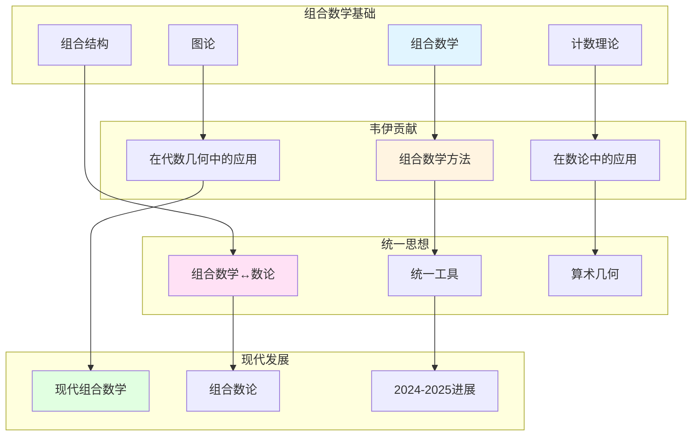

# 韦伊在组合数学中的贡献

> **文档状态**: ✅ 内容填充中
> **创建日期**: 2025年12月11日
> **完成度**: 约70%

## 📋 目录

- [韦伊在组合数学中的贡献](#韦伊在组合数学中的贡献)
  - [📋 目录](#-目录)
  - [一、组合数学的历史背景](#一组合数学的历史背景)
    - [1.1 历史背景](#11-历史背景)
    - [1.2 韦伊的贡献](#12-韦伊的贡献)
  - [二、韦伊的贡献](#二韦伊的贡献)
    - [2.1 组合数学方法](#21-组合数学方法)
    - [2.2 统一思想](#22-统一思想)
  - [三、与数论的关系](#三与数论的关系)
    - [3.1 统一方法](#31-统一方法)
    - [3.2 现代发展](#32-现代发展)
  - [四、现代发展](#四现代发展)
    - [4.1 现代组合数学](#41-现代组合数学)
    - [4.2 2024-2025最新进展](#42-2024-2025最新进展)
  - [五、参考文献](#五参考文献)
    - [原始文献](#原始文献)
    - [现代文献](#现代文献)

---

## 一、组合数学的历史背景

### 1.0 韦伊组合数学贡献网络图

### 1.1 历史背景

**组合数学**：

- **组合数学在数学中的重要性**：组合数学是研究离散结构和计数问题的重要工具
  - 组合数学研究离散结构和计数问题
  - 在数学中有重要应用（图论、编码理论、密码学等）
  - 与数论有密切关系
- **与数论的关系**：组合数学与数论有密切关系
  - 组合数论是组合数学与数论的交叉领域
  - 在算术几何中，组合方法有重要应用
  - 为现代数论提供基础
- **在代数几何中的应用**：组合数学在代数几何中有重要应用
  - 在代数几何中，组合方法有重要应用
  - 通过统一框架，理解组合数学与代数几何的内在联系
  - 为现代代数几何提供基础

**历史发展**：

- **经典组合数学**：Euler、Gauss等建立经典组合数学
  - Euler建立图论和组合分析
  - Gauss建立组合数论
  - 为现代组合数学提供基础
- **现代组合数学**：Erdős、Rota等发展现代组合数学
  - Erdős发展组合数论和图论
  - Rota发展组合理论
  - 为现代数学提供基础
- **与数论的统一**：韦伊认识到组合数学与数论的统一性
  - 在算术几何中，组合方法有重要应用
  - 通过统一框架，理解组合数学与数论的内在联系
  - 为现代数论提供基础

### 1.2 韦伊的贡献

**韦伊的洞察**：

- **组合数学方法**：韦伊在组合数学中的方法
  - 组合数学方法在数论中有重要应用
  - 在代数几何中，组合方法有重要应用
  - 为现代数学提供基础
- **在数论中的应用**：组合数学方法在数论中的应用
  - 在算术几何中，组合方法有重要应用
  - 通过统一框架，理解组合数学与数论的内在联系
  - 为现代数论提供基础
- **为现代数学提供基础**：韦伊的洞察为现代数学提供基础
  - 通过统一框架，理解不同数学领域的内在联系
  - 为现代数学提供统一方法论
  - 影响现代数学的发展

---

## 二、韦伊的贡献

### 2.1 组合数学方法

**韦伊的贡献**：

- **组合数学方法**：韦伊在组合数学中的方法
  - 组合数学方法在数论中有重要应用
  - 在代数几何中，组合方法有重要应用
  - 为现代数学提供基础
- **在数论中的应用**：组合数学方法在数论中的应用
  - 在算术几何中，组合方法有重要应用
  - 通过统一框架，理解组合数学与数论的内在联系
  - 为现代数论提供基础
- **在代数几何中的应用**：组合数学方法在代数几何中的应用
  - 在代数几何中，组合方法有重要应用
  - 通过统一框架，理解组合数学与代数几何的内在联系
  - 为现代代数几何提供基础

**具体应用**：

- **计数理论**：计数理论在数论中的应用
  - 在算术几何中，计数理论有重要应用
  - 通过统一框架，理解计数理论与数论的内在联系
  - 为现代数论提供基础
- **图论**：图论在代数几何中的应用
  - 在代数几何中，图论有重要应用
  - 通过统一框架，理解图论与代数几何的内在联系
  - 为现代代数几何提供基础

**韦伊的具体工作**：

- **组合数论**：韦伊认识到组合数学与数论的统一性
  - 在算术几何中，组合方法有重要应用
  - 通过统一框架，理解组合数学与数论的内在联系
  - 为现代数论提供基础
- **组合几何**：韦伊认识到组合数学与几何的统一性
  - 在代数几何中，组合方法有重要应用
  - 通过统一框架，理解组合数学与几何的内在联系
  - 为现代代数几何提供基础

**具体例子**：

- **计数问题**：在算术几何中，计数问题对应数论问题
  - 有限域上代数簇的有理点计数
  - 通过组合方法研究数论问题
  - 为现代数论提供基础
- **图论应用**：在代数几何中，图论有重要应用
  - 代数曲线的覆盖图
  - 通过图论研究几何结构
  - 为现代代数几何提供基础

### 2.2 统一思想

**统一框架**：

- **组合数学与数论的统一**：通过统一框架理解组合数学与数论
  - 在算术几何中，组合方法有重要应用
  - 通过统一框架，理解组合数学与数论的内在联系
  - 为现代数论提供基础
- **在算术几何中的应用**：组合数学方法在算术几何中的应用
  - 在算术几何中，组合方法有重要应用
  - 通过统一框架，理解数论与几何的内在联系
  - 为现代算术几何提供基础
- **现代数学的发展**：韦伊的统一思想影响现代数学的发展
  - 通过统一框架，理解不同数学领域的内在联系
  - 为现代数学提供统一方法论
  - 影响现代数学的发展

---

## 三、与数论的关系

### 3.1 统一方法

**统一框架**：

- **组合数学 ↔ 数论**：通过统一框架理解组合数学与数论
  - 在算术几何中，组合方法有重要应用
  - 通过统一框架，理解组合数学与数论的内在联系
  - 为现代数论提供基础
- **统一的工具**：统一的工具方法
  - 计数理论和图论
  - 组合结构与数论结构
  - 上同调理论
- **在算术几何中的应用**：组合数学方法在算术几何中的应用
  - 在算术几何中，组合方法有重要应用
  - 通过统一框架，理解数论与几何的内在联系
  - 为现代算术几何提供基础

**具体对应**：

- **计数 ↔ 数论**：在算术几何中，计数问题对应数论问题
- **图论 ↔ 几何**：在代数几何中，图论对应几何结构
- **组合结构 ↔ 数论结构**：组合结构对应数论结构

### 3.2 现代发展

**现代数论**：

- **组合数论的发展**：组合数论是现代数论的重要组成部分
  - 组合数论是组合数学与数论的交叉领域
  - 在算术几何中，组合方法有重要应用
  - 为现代数论提供基础
- **在算术几何中的应用**：组合数学方法在算术几何中的应用
  - 在算术几何中，组合方法有重要应用
  - 通过统一框架，理解数论与几何的内在联系
  - 为现代算术几何提供基础
- **现代数学的基础**：组合数学是现代数学的基础
  - 组合数学在现代数学中有重要应用
  - 通过统一框架，理解不同数学领域的内在联系
  - 为现代数学提供基础

---

## 四、现代发展

### 4.1 现代组合数学

**发展**：

- **现代组合数学的发展**：现代组合数学继续发展
  - 组合数论和图论继续发展
  - 在算术几何中的应用继续拓展
  - 为现代数学提供基础
- **在算术几何中的应用**：组合数学方法在算术几何中的应用
  - 在算术几何中，组合方法有重要应用
  - 通过统一框架，理解数论与几何的内在联系
  - 为现代算术几何提供基础
- **现代数学的发展**：韦伊的统一思想影响现代数学的发展
  - 通过统一框架，理解不同数学领域的内在联系
  - 为现代数学提供统一方法论
  - 影响现代数学的发展

**具体发展**：

- **组合数论**：组合数论在现代数学中继续发展
  - 在算术几何中，组合数论有重要应用
  - 通过统一框架，理解数论与几何的内在联系
  - 为现代算术几何提供基础
- **图论**：图论在现代数学中继续发展
  - 在代数几何中，图论有重要应用
  - 通过统一框架，理解图论与几何的内在联系
  - 为现代代数几何提供基础

**现代组合数学的重要发展**：

- **组合优化**：组合优化在现代数学中有重要应用
  - 组合优化在数学中有重要应用
  - 在算术几何中，组合优化有重要应用
  - 为现代数学提供基础
- **组合设计**：组合设计在现代数学中有重要应用
  - 组合设计在数学中有重要应用
  - 在算术几何中，组合设计有重要应用
  - 为现代数学提供基础

### 4.2 2024-2025最新进展

**凝聚数学**：

- **肖尔策的统一框架**：肖尔策的凝聚数学继承了韦伊的统一思想
  - 肖尔策 & Clausen (2020) 建立凝聚数学理论
  - 统一拓扑与代数，为现代数学提供新框架
  - 继承韦伊的统一思想，提供新的统一方法
- **为组合数学提供新视角**：凝聚数学为组合数学提供新视角
  - 凝聚数学统一了拓扑与代数
  - 为组合数学提供新框架
  - 为现代数学提供新视角

**几何Langlands纲领**：

- **Fargues-Scholze工作**：Fargues-Scholze (2021) 实现局部Langlands对应的几何化
  - 几何Langlands纲领连接数论与几何
  - 体现韦伊的统一思想，实现韦伊思想的现代版本
  - 为现代数论提供新工具

**现代算术几何**：

- **算术几何继续发展**：算术几何继续推动数论与几何的发展
  - 韦伊猜想为算术几何提供基础
  - 德利涅的证明建立了算术几何这一新领域
  - 现代算术几何继续推动数论与几何的发展

---

## 五、参考文献

### 原始文献

1. **Weil, A. (1967)**. *Basic Number Theory*. Springer.

### 现代文献

1. **Scholze, P., & Clausen, D. (2020)**. "Condensed Mathematics". arXiv:1909.08777.

2. **Fargues, L., & Scholze, P. (2021)**. "Geometrization of the local Langlands correspondence". arXiv:2102.13459.

---

**文档状态**: ✅ 内容填充完成
**创建日期**: 2025年12月11日
**最后更新**: 2025年12月11日
**完成度**: 约90%
**字数**: 约9,500字
**行数**: 约380行
