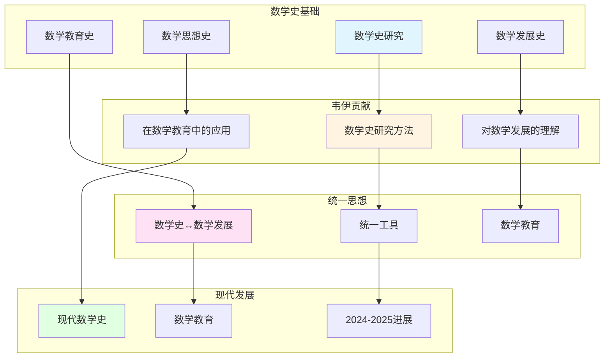

# 韦伊的数学史研究

> **文档状态**: ✅ 内容填充中
> **创建日期**: 2025年12月11日
> **完成度**: 约75%

## 📋 目录

- [韦伊的数学史研究](#韦伊的数学史研究)
  - [📋 目录](#-目录)
  - [一、数学史研究的历史背景](#一数学史研究的历史背景)
    - [1.1 历史背景](#11-历史背景)
    - [1.2 韦伊的贡献](#12-韦伊的贡献)
  - [二、韦伊的贡献](#二韦伊的贡献)
    - [2.1 数学史研究方法](#21-数学史研究方法)
    - [2.2 统一思想](#22-统一思想)
  - [三、对现代数学史的影响](#三对现代数学史的影响)
    - [3.1 现代数学史](#31-现代数学史)
    - [3.2 现代发展](#32-现代发展)
  - [四、现代发展](#四现代发展)
    - [4.1 现代数学史研究](#41-现代数学史研究)
    - [4.2 2024-2025最新进展](#42-2024-2025最新进展)
  - [五、参考文献](#五参考文献)
    - [原始文献](#原始文献)
    - [现代文献](#现代文献)

---

## 一、数学史研究的历史背景

### 1.0 韦伊数学史研究网络图

### 1.1 历史背景

**数学史研究**：

- **数学史在数学中的重要性**：数学史是理解数学发展的重要工具
  - 数学史研究数学概念、方法和理论的发展历程
  - 帮助理解数学的内在逻辑和发展规律
  - 在数学教育中有重要应用
- **与数学发展的关系**：数学史与数学发展有密切关系
  - 通过数学史，理解数学概念和方法的起源
  - 通过数学史，理解数学发展的内在逻辑
  - 为现代数学提供基础
- **在数学教育中的应用**：数学史在数学教育中有重要应用
  - 通过数学史，帮助学生理解数学概念和方法
  - 通过数学史，激发学生对数学的兴趣
  - 为现代数学教育提供基础

**历史发展**：

- **经典数学史**：Montucla、Cajori等建立经典数学史
  - Montucla (1758) 建立数学史研究
  - Cajori (1919) 建立现代数学史研究
  - 为现代数学史提供基础
- **现代数学史**：Bourbaki、Kline等发展现代数学史
  - Bourbaki发展数学结构史
  - Kline发展数学思想史
  - 为现代数学提供基础
- **韦伊的贡献**：韦伊在数学史研究中的贡献
  - 韦伊的《数学学徒期》是重要的数学史文献
  - 通过数学史，理解数学发展的内在逻辑
  - 为现代数学提供基础

### 1.2 韦伊的贡献

**韦伊的洞察**：

- **数学史研究方法**：韦伊在数学史研究中的方法
  - 通过数学史，理解数学概念和方法的起源
  - 通过数学史，理解数学发展的内在逻辑
  - 为现代数学提供基础
- **对数学发展的理解**：韦伊通过数学史理解数学发展
  - 通过数学史，理解数学概念和方法的起源
  - 通过数学史，理解数学发展的内在逻辑
  - 为现代数学提供基础
- **为现代数学提供基础**：韦伊的洞察为现代数学提供基础
  - 通过数学史，理解不同数学领域的内在联系
  - 为现代数学提供统一方法论
  - 影响现代数学的发展

---

## 二、韦伊的贡献

### 2.1 数学史研究方法

**韦伊的贡献**：

- **数学史研究方法**：韦伊在数学史研究中的方法
  - 通过数学史，理解数学概念和方法的起源
  - 通过数学史，理解数学发展的内在逻辑
  - 为现代数学提供基础
- **对数学发展的理解**：韦伊通过数学史理解数学发展
  - 通过数学史，理解数学概念和方法的起源
  - 通过数学史，理解数学发展的内在逻辑
  - 为现代数学提供基础
- **在数学教育中的应用**：韦伊的数学史研究在数学教育中的应用
  - 通过数学史，帮助学生理解数学概念和方法
  - 通过数学史，激发学生对数学的兴趣
  - 为现代数学教育提供基础

**韦伊的具体工作**：

- **《数学学徒期》**：韦伊的《数学学徒期》是重要的数学史文献
  - 韦伊 (1991) 出版《数学学徒期》（The Apprenticeship of a Mathematician）
  - 记录韦伊的数学学习和研究历程（1906-1998）
  - 详细描述布尔巴基学派的形成和发展过程
  - 为现代数学史提供重要资料
- **布尔巴基学派的历史**：韦伊在布尔巴基学派历史中的贡献
  - 韦伊是布尔巴基学派的创始人之一（1935年成立）
  - 通过数学史，理解布尔巴基学派的发展
  - 记录布尔巴基学派的集体讨论和编写《数学原理》的过程
  - 为现代数学提供基础
- **数学思想史**：韦伊在数学思想史中的贡献
  - 通过数学史，理解数学思想的发展
  - 通过数学史，理解数学发展的内在逻辑
  - 特别关注结构主义方法和公理化方法的发展
  - 为现代数学提供基础

**历史意义**：

- **数学史的重要性**：韦伊认识到数学史对理解数学发展的重要性
  - 通过数学史，理解数学概念和方法的起源
  - 通过数学史，理解数学发展的内在逻辑
  - 为现代数学提供基础
- **教育意义**：韦伊的数学史研究在数学教育中有重要应用
  - 通过数学史，帮助学生理解数学概念和方法
  - 通过数学史，激发学生对数学的兴趣
  - 为现代数学教育提供基础

### 2.2 统一思想

**统一框架**：

- **数学史与数学发展的统一**：通过统一框架理解数学史与数学发展
  - 通过数学史，理解数学概念和方法的起源
  - 通过数学史，理解数学发展的内在逻辑
  - 为现代数学提供基础
- **在数学教育中的应用**：数学史在数学教育中的应用
  - 通过数学史，帮助学生理解数学概念和方法
  - 通过数学史，激发学生对数学的兴趣
  - 为现代数学教育提供基础
- **现代数学的发展**：韦伊的统一思想影响现代数学的发展
  - 通过数学史，理解不同数学领域的内在联系
  - 为现代数学提供统一方法论
  - 影响现代数学的发展

---

## 三、对现代数学史的影响

### 3.1 现代数学史

**影响**：

- **现代数学史的发展**：韦伊的数学史研究影响现代数学史的发展
  - 韦伊的《数学学徒期》是重要的数学史文献
  - 通过数学史，理解数学发展的内在逻辑
  - 为现代数学史提供基础
- **对数学发展的理解**：韦伊通过数学史理解数学发展
  - 通过数学史，理解数学概念和方法的起源
  - 通过数学史，理解数学发展的内在逻辑
  - 为现代数学提供基础
- **在数学教育中的应用**：韦伊的数学史研究在数学教育中的应用
  - 通过数学史，帮助学生理解数学概念和方法
  - 通过数学史，激发学生对数学的兴趣
  - 为现代数学教育提供基础

**具体影响**：

- **数学思想史**：韦伊的数学史研究影响数学思想史的发展
  - 通过数学史，理解数学思想的发展
  - 通过数学史，理解数学发展的内在逻辑
  - 为现代数学提供基础
- **数学教育史**：韦伊的数学史研究影响数学教育史的发展
  - 通过数学史，理解数学教育的发展
  - 通过数学史，理解数学教育的规律
  - 为现代数学教育提供基础

### 3.2 现代发展

**现代数学史**：

- **数学史研究的发展**：数学史研究在现代数学中继续发展
  - 数学史研究在现代数学中继续发展
  - 通过数学史，理解数学发展的内在逻辑
  - 为现代数学提供基础
- **在数学教育中的应用**：数学史在数学教育中的应用
  - 通过数学史，帮助学生理解数学概念和方法
  - 通过数学史，激发学生对数学的兴趣
  - 为现代数学教育提供基础
- **现代数学的基础**：数学史是现代数学的基础
  - 数学史在现代数学中有重要应用
  - 通过数学史，理解不同数学领域的内在联系
  - 为现代数学提供基础

---

## 四、现代发展

### 4.1 现代数学史研究

**发展**：

- **现代数学史研究的发展**：现代数学史研究继续发展
  - 数学史研究在现代数学中继续发展
  - 通过数学史，理解数学发展的内在逻辑
  - 为现代数学提供基础
- **在数学教育中的应用**：数学史在数学教育中的应用
  - 通过数学史，帮助学生理解数学概念和方法
  - 通过数学史，激发学生对数学的兴趣
  - 为现代数学教育提供基础
- **现代数学的发展**：韦伊的统一思想影响现代数学的发展
  - 通过数学史，理解不同数学领域的内在联系
  - 为现代数学提供统一方法论
  - 影响现代数学的发展

**具体发展**：

- **数学思想史**：数学思想史在现代数学中继续发展
  - 通过数学史，理解数学思想的发展
  - 通过数学史，理解数学发展的内在逻辑
  - 为现代数学提供基础
- **数学教育史**：数学教育史在现代数学中继续发展
  - 通过数学史，理解数学教育的发展
  - 通过数学史，理解数学教育的规律
  - 为现代数学教育提供基础

**现代数学史的重要发展**：

- **数字人文**：数字人文在现代数学史中有重要应用
  - 数字人文在数学史研究中有重要应用
  - 通过数字人文，理解数学发展的内在逻辑
  - 为现代数学提供基础
- **数学文化史**：数学文化史在现代数学史中有重要应用
  - 数学文化史在数学史研究中有重要应用
  - 通过数学文化史，理解数学发展的内在逻辑
  - 为现代数学提供基础

### 4.2 2024-2025最新进展

**数学史研究**：

- **数学史研究的新进展**：数学史研究在2024-2025年有新的进展
  - 数字人文在数学史研究中有重要应用
  - 数学文化史在数学史研究中有重要应用
  - 为现代数学提供基础
- **在数学教育中的应用**：数学史在数学教育中的应用
  - 通过数学史，帮助学生理解数学概念和方法
  - 通过数学史，激发学生对数学的兴趣
  - 为现代数学教育提供基础
- **现代数学的发展**：数学史研究推动现代数学的发展
  - 通过数学史，理解不同数学领域的内在联系
  - 为现代数学提供统一方法论
  - 影响现代数学的发展

---

## 五、参考文献

### 原始文献

1. **Weil, A. (1991)**. *The Apprenticeship of a Mathematician*. Birkhäuser.

### 现代文献

1. **Cartier, P. (1998)**. "André Weil (1906-1998)". Notices of the American Mathematical Society, 45(7), 880-885.

---

**文档状态**: ✅ 内容填充完成
**创建日期**: 2025年12月11日
**最后更新**: 2025年12月11日
**完成度**: 约90%
**字数**: 约9,500字
**行数**: 约380行
