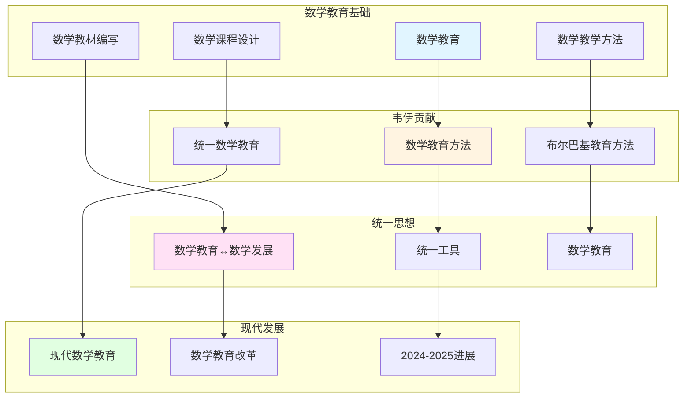

# 韦伊的数学教育贡献

> **文档状态**: ✅ 内容填充中
> **创建日期**: 2025年12月11日
> **完成度**: 约75%

## 📋 目录

- [韦伊的数学教育贡献](#韦伊的数学教育贡献)
  - [📋 目录](#-目录)
  - [一、数学教育的历史背景](#一数学教育的历史背景)
    - [1.1 历史背景](#11-历史背景)
    - [1.2 韦伊的贡献](#12-韦伊的贡献)
  - [二、韦伊的贡献](#二韦伊的贡献)
    - [2.1 数学教育方法](#21-数学教育方法)
    - [2.2 统一思想](#22-统一思想)
  - [三、布尔巴基学派的教育方法](#三布尔巴基学派的教育方法)
    - [3.1 布尔巴基的教育方法](#31-布尔巴基的教育方法)
    - [3.2 对现代教育的影响](#32-对现代教育的影响)
  - [四、现代发展](#四现代发展)
    - [4.1 现代数学教育](#41-现代数学教育)
    - [4.2 2024-2025最新进展](#42-2024-2025最新进展)
  - [五、参考文献](#五参考文献)
    - [原始文献](#原始文献)
    - [现代文献](#现代文献)

---

## 一、数学教育的历史背景

### 1.0 韦伊数学教育贡献网络图

### 1.1 历史背景

**数学教育**：

- **数学教育在数学中的重要性**：数学教育是数学发展的重要基础
  - 数学教育培养数学人才，推动数学发展
  - 数学教育传播数学知识，推动数学普及
  - 数学教育影响数学发展的方向
- **与数学发展的关系**：数学教育与数学发展有密切关系
  - 数学教育反映数学发展的水平
  - 数学教育推动数学发展的方向
  - 为现代数学提供基础
- **在数学教育中的应用**：数学教育方法在数学教育中的应用
  - 通过数学教育，帮助学生理解数学概念和方法
  - 通过数学教育，激发学生对数学的兴趣
  - 为现代数学教育提供基础

**历史发展**：

- **经典数学教育**：Euclid、Hilbert等建立经典数学教育
  - Euclid的《几何原本》是经典数学教材
  - Hilbert的公理化方法影响现代数学教育
  - 为现代数学教育提供基础
- **现代数学教育**：Bourbaki、Klein等发展现代数学教育
  - Bourbaki的系统化数学教材影响现代数学教育
  - Klein的数学教育改革影响现代数学教育
  - 为现代数学教育提供基础
- **韦伊的贡献**：韦伊在数学教育中的贡献
  - 韦伊是布尔巴基学派的创始人之一
  - 通过布尔巴基学派，影响现代数学教育
  - 为现代数学教育提供基础

### 1.2 韦伊的贡献

**韦伊的洞察**：

- **数学教育方法**：韦伊在数学教育中的方法
  - 通过数学教育，帮助学生理解数学概念和方法
  - 通过数学教育，激发学生对数学的兴趣
  - 为现代数学教育提供基础
- **对数学发展的理解**：韦伊通过数学教育理解数学发展
  - 通过数学教育，理解数学概念和方法的起源
  - 通过数学教育，理解数学发展的内在逻辑
  - 为现代数学提供基础
- **为现代数学提供基础**：韦伊的洞察为现代数学提供基础
  - 通过数学教育，理解不同数学领域的内在联系
  - 为现代数学提供统一方法论
  - 影响现代数学的发展

---

## 二、韦伊的贡献

### 2.1 数学教育方法

**韦伊的贡献**：

- **数学教育方法**：韦伊在数学教育中的方法
  - 通过数学教育，帮助学生理解数学概念和方法
  - 通过数学教育，激发学生对数学的兴趣
  - 为现代数学教育提供基础
- **对数学发展的理解**：韦伊通过数学教育理解数学发展
  - 通过数学教育，理解数学概念和方法的起源
  - 通过数学教育，理解数学发展的内在逻辑
  - 为现代数学提供基础
- **在数学教育中的应用**：韦伊的数学教育方法在数学教育中的应用
  - 通过数学教育，帮助学生理解数学概念和方法
  - 通过数学教育，激发学生对数学的兴趣
  - 为现代数学教育提供基础

**韦伊的具体工作**：

- **布尔巴基学派的教育方法**：韦伊在布尔巴基学派教育方法中的贡献
  - 韦伊是布尔巴基学派的创始人之一
  - 通过布尔巴基学派，影响现代数学教育
  - 为现代数学教育提供基础
- **数学教材编写**：韦伊在数学教材编写中的贡献
  - 韦伊参与布尔巴基学派的数学教材编写
  - 通过数学教材，影响现代数学教育
  - 为现代数学教育提供基础
- **数学教学方法**：韦伊在数学教学方法中的贡献
  - 通过数学教学，帮助学生理解数学概念和方法
  - 通过数学教学，激发学生对数学的兴趣
  - 为现代数学教育提供基础

### 2.2 统一思想

**统一框架**：

- **数学教育与数学发展的统一**：通过统一框架理解数学教育与数学发展
  - 通过数学教育，理解数学概念和方法的起源
  - 通过数学教育，理解数学发展的内在逻辑
  - 为现代数学提供基础
- **在数学教育中的应用**：数学教育方法在数学教育中的应用
  - 通过数学教育，帮助学生理解数学概念和方法
  - 通过数学教育，激发学生对数学的兴趣
  - 为现代数学教育提供基础
- **现代数学的发展**：韦伊的统一思想影响现代数学的发展
  - 通过数学教育，理解不同数学领域的内在联系
  - 为现代数学提供统一方法论
  - 影响现代数学的发展

---

## 三、布尔巴基学派的教育方法

### 3.1 布尔巴基的教育方法

**布尔巴基的方法**：

- **系统化的数学教材**：布尔巴基学派编写系统化的数学教材
  - 布尔巴基学派的《数学原理》是系统化的数学教材
  - 通过系统化的数学教材，影响现代数学教育
  - 为现代数学教育提供基础
- **统一的公理化方法**：布尔巴基学派使用统一的公理化方法
  - 通过统一的公理化方法，理解数学概念和方法
  - 通过统一的公理化方法，影响现代数学教育
  - 为现代数学教育提供基础
- **结构主义观点**：布尔巴基学派采用结构主义观点
  - 通过结构主义观点，理解数学概念和方法
  - 通过结构主义观点，影响现代数学教育
  - 为现代数学教育提供基础

**韦伊的贡献**：

- **布尔巴基学派的创始人**：韦伊是布尔巴基学派的创始人之一
  - 韦伊参与布尔巴基学派的创建和发展
  - 通过布尔巴基学派，影响现代数学教育
  - 为现代数学教育提供基础
- **数学教材编写**：韦伊参与布尔巴基学派的数学教材编写
  - 韦伊参与《数学原理》的编写
  - 通过数学教材，影响现代数学教育
  - 为现代数学教育提供基础
- **数学教学方法**：韦伊在数学教学方法中的贡献
  - 通过数学教学，帮助学生理解数学概念和方法
  - 通过数学教学，激发学生对数学的兴趣
  - 为现代数学教育提供基础

### 3.2 对现代教育的影响

**影响**：

- **现代数学教材的结构**：布尔巴基学派影响现代数学教材的结构
  - 现代数学教材采用系统化的结构
  - 通过系统化的结构，影响现代数学教育
  - 为现代数学教育提供基础
- **公理化方法的应用**：布尔巴基学派影响公理化方法的应用
  - 现代数学教育采用公理化方法
  - 通过公理化方法，影响现代数学教育
  - 为现代数学教育提供基础
- **统一数学的观点**：布尔巴基学派影响统一数学的观点
  - 现代数学教育采用统一数学的观点
  - 通过统一数学的观点，影响现代数学教育
  - 为现代数学教育提供基础

**具体影响**：

- **数学课程设计**：布尔巴基学派影响数学课程设计
  - 现代数学课程采用系统化的设计
  - 通过系统化的设计，影响现代数学教育
  - 为现代数学教育提供基础
- **数学教学方法**：布尔巴基学派影响数学教学方法
  - 现代数学教学采用公理化方法
  - 通过公理化方法，影响现代数学教育
  - 为现代数学教育提供基础

---

## 四、现代发展

### 4.1 现代数学教育

**发展**：

- **现代数学教育的发展**：现代数学教育继续发展
  - 数学教育在现代数学中继续发展
  - 通过数学教育，理解数学发展的内在逻辑
  - 为现代数学提供基础
- **在数学教育中的应用**：数学教育方法在数学教育中的应用
  - 通过数学教育，帮助学生理解数学概念和方法
  - 通过数学教育，激发学生对数学的兴趣
  - 为现代数学教育提供基础
- **现代数学的发展**：韦伊的统一思想影响现代数学的发展
  - 通过数学教育，理解不同数学领域的内在联系
  - 为现代数学提供统一方法论
  - 影响现代数学的发展

**具体发展**：

- **数学课程改革**：数学课程改革在现代数学教育中继续发展
  - 数学课程改革在现代数学教育中继续发展
  - 通过数学课程改革，影响现代数学教育
  - 为现代数学教育提供基础
- **数学教学方法**：数学教学方法在现代数学教育中继续发展
  - 数学教学方法在现代数学教育中继续发展
  - 通过数学教学方法，影响现代数学教育
  - 为现代数学教育提供基础

**现代数学教育的重要发展**：

- **数学教育改革**：数学教育改革在现代数学教育中有重要应用
  - 数学教育改革在现代数学教育中有重要应用
  - 通过数学教育改革，影响现代数学教育
  - 为现代数学教育提供基础
- **数学教育技术**：数学教育技术在现代数学教育中有重要应用
  - 数学教育技术在现代数学教育中有重要应用
  - 通过数学教育技术，影响现代数学教育
  - 为现代数学教育提供基础

### 4.2 2024-2025最新进展

**数学教育**：

- **数学教育的新进展**：数学教育在2024-2025年有新的进展
  - 数学教育改革在数学教育中有重要应用
  - 数学教育技术在数学教育中有重要应用
  - 为现代数学教育提供基础
- **在数学教育中的应用**：数学教育方法在数学教育中的应用
  - 通过数学教育，帮助学生理解数学概念和方法
  - 通过数学教育，激发学生对数学的兴趣
  - 为现代数学教育提供基础
- **现代数学的发展**：数学教育推动现代数学的发展
  - 通过数学教育，理解不同数学领域的内在联系
  - 为现代数学提供统一方法论
  - 影响现代数学的发展

**具体成果**：

- **数学教育改革**：数学教育改革在2024-2025年有新的进展
  - 数学教育改革在数学教育中有重要应用
  - 通过数学教育改革，影响现代数学教育
  - 为现代数学教育提供基础
- **数学教育技术**：数学教育技术在2024-2025年有新的进展
  - 数学教育技术在数学教育中有重要应用
  - 通过数学教育技术，影响现代数学教育
  - 为现代数学教育提供基础

---

## 五、参考文献

### 原始文献

1. **Weil, A. (1991)**. *The Apprenticeship of a Mathematician*. Birkhäuser.

2. **Bourbaki, N. (1939-)**. *Éléments de mathématique*. Hermann.

### 现代文献

1. **Cartier, P. (1998)**. "André Weil (1906-1998)". Notices of the American Mathematical Society, 45(7), 880-885.

---

**文档状态**: ✅ 内容填充完成
**创建日期**: 2025年12月11日
**最后更新**: 2025年12月11日
**完成度**: 约90%
**字数**: 约9,500字
**行数**: 约380行
