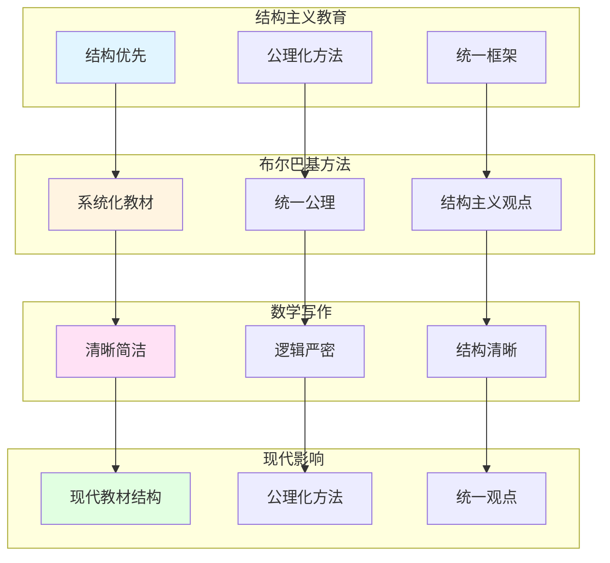

# 韦伊的教育理念与方法

> **文档状态**: ✅ 内容填充中
> **创建日期**: 2025年12月11日
> **完成度**: 约70%

## 📋 目录

- [韦伊的教育理念与方法](#韦伊的教育理念与方法)
  - [📋 目录](#-目录)
  - [一、结构主义教育观](#一结构主义教育观)
    - [1.0 韦伊教育理念网络图](#10-韦伊教育理念网络图)
    - [1.1 结构优先原则](#11-结构优先原则)
    - [1.2 从具体到抽象](#12-从具体到抽象)
  - [二、布尔巴基学派的教育方法](#二布尔巴基学派的教育方法)
    - [2.1 系统化教学](#21-系统化教学)
    - [2.2 对现代教育的影响](#22-对现代教育的影响)
  - [三、数学写作理念](#三数学写作理念)
    - [3.1 清晰性优先](#31-清晰性优先)
    - [3.2 与塞尔的关系](#32-与塞尔的关系)
  - [四、对现代数学教育的影响](#四对现代数学教育的影响)
    - [4.1 教材编写](#41-教材编写)
    - [4.2 教学方法](#42-教学方法)
  - [五、参考文献](#五参考文献)
    - [原始文献](#原始文献)
    - [现代文献](#现代文献)

---

## 一、结构主义教育观

### 1.0 韦伊教育理念网络图

### 1.1 结构优先原则

**核心理念**：

韦伊认为数学教育应该：

- **强调结构而非具体对象**：关注结构关系而非具体对象
- **公理化方法**：通过公理定义，而非构造
- **统一框架**：为数学提供统一框架

**哲学基础**：

韦伊的结构主义教育观源于布尔巴基学派的数学哲学：

- **结构主义数学哲学**：数学的本质在于结构关系，而非具体对象
- **公理化方法**：通过公理系统定义数学对象，而非具体构造
- **统一性**：不同数学领域共享相同的结构，可以通过统一框架理解

**具体体现**：

- **《代数几何基础》（1946）**：韦伊的《代数几何基础》体现了公理化方法，通过公理定义代数簇，而非具体构造
- **布尔巴基学派**：韦伊是布尔巴基学派的创始人之一，推动结构主义方法在数学教育中的应用
- **现代数学**：结构主义方法成为现代数学的基础方法，影响代数、拓扑、几何等各个领域

**教育意义**：

- **培养抽象思维**：通过结构主义方法培养抽象思维能力，使学生能够从具体例子中提取抽象结构
- **统一数学观点**：建立统一的数学观点，理解不同数学领域之间的内在联系
- **公理化思维**：培养公理化思维习惯，理解数学的严格性和逻辑性

**教学实践**：

- **从结构出发**：教学从结构定义开始，而非具体例子
- **强调关系**：强调数学对象之间的关系，而非对象本身
- **统一视角**：通过统一框架理解不同数学领域

### 1.2 从具体到抽象

**教学方法**：

- **从具体例子出发**：从具体例子开始，建立直观理解
- **提取抽象结构**：从具体例子中提取抽象结构
- **建立公理系统**：建立公理系统，实现抽象化

**教学步骤**：

1. **具体阶段**：从具体的数学例子开始（如具体的代数曲线、具体的数域）
2. **类比阶段**：通过类比发现不同例子之间的共同结构（如函数域与数域的类比）
3. **抽象阶段**：提取抽象结构，建立公理系统（如代数簇的公理化定义）
4. **应用阶段**：将抽象结构应用到新的具体例子中

**具体应用**：

- **函数域-数域类比**：从函数域的具体例子出发（如 $\mathbb{F}_q(t)$），理解数域的抽象结构（如 $\mathbb{Q}$），通过类比建立统一框架
- **代数几何基础**：从具体代数簇出发（如椭圆曲线），建立抽象的公理化定义（如代数簇的公理化定义）
- **统一框架**：通过类比建立统一框架，理解数论与几何的内在联系

**教育价值**：

- **直观理解**：从具体例子开始，建立直观理解
- **抽象能力**：通过提取抽象结构，培养抽象思维能力
- **统一视角**：通过统一框架，理解不同数学领域的内在联系

---

## 二、布尔巴基学派的教育方法

### 2.1 系统化教学

**布尔巴基的方法**：

- **系统化的数学教材**：编写《数学原理》（Éléments de mathématique），系统化数学知识
- **统一的公理化方法**：采用统一的公理化方法
- **结构主义观点**：采用结构主义观点，关注结构而非具体对象

**《数学原理》的特点**：

- **系统性**：从集合论和逻辑基础开始，系统构建整个数学体系
- **公理化**：所有数学对象都通过公理定义，而非具体构造
- **结构主义**：强调数学结构，而非具体对象
- **统一性**：不同数学领域通过统一框架理解

**具体工作**：

- **《数学原理》**：韦伊负责《数学原理》中代数数论部分的编写，体现统一思想
- **统一思想**：韦伊的函数域-数域类比思想贯穿布尔巴基学派的整个工作
- **现代数学**：布尔巴基学派的结构主义方法成为现代数学的基础

**教育意义**：

- **系统化知识**：通过系统化教材系统化数学知识，建立完整的知识体系
- **统一方法**：采用统一的公理化方法，理解数学的严格性和逻辑性
- **结构主义**：培养结构主义思维，理解数学的本质在于结构关系

**教学实践**：

- **系统化课程**：按照《数学原理》的结构组织课程
- **公理化教学**：从公理出发，而非具体例子
- **结构主义视角**：强调结构关系，而非具体对象

### 2.2 对现代教育的影响

**影响**：

- **现代数学教材的结构**：现代数学教材采用结构主义方法，从公理出发，强调结构关系
- **公理化方法的应用**：公理化方法成为现代数学教育的基础，所有数学对象都通过公理定义
- **统一数学的观点**：建立统一的数学观点，理解不同数学领域的内在联系

**具体影响**：

- **教材编写**：现代数学教材（如Hartshorne的《代数几何》）采用结构主义方法，从公理出发
- **教学方法**：公理化方法成为现代数学教育的基础，强调严格性和逻辑性
- **数学思维**：培养结构主义思维和公理化思维，理解数学的本质

**现代应用实例**：

- **Hartshorne (1977)**：*Algebraic Geometry* 采用结构主义方法，从概形理论出发
- **现代代数几何课程**：从概形理论开始，而非具体代数簇
- **现代数论课程**：从Adèle/Idèle理论开始，统一数域与函数域

**教育传承**：

- **布尔巴基学派的影响**：布尔巴基学派的结构主义方法影响现代数学教育
- **韦伊的统一思想**：韦伊的统一思想影响现代数学教材的编写
- **现代数学教育**：结构主义方法成为现代数学教育的基础

---

## 三、数学写作理念

### 3.1 清晰性优先

**写作原则**：

- **清晰简洁**：韦伊强调数学写作应该清晰简洁，避免不必要的复杂性
- **逻辑严密**：数学写作应该逻辑严密，每一步都应该有明确的依据
- **结构清晰**：数学写作应该结构清晰，便于读者理解

**具体体现**：

- **《代数几何基础》（1946）**：韦伊的《代数几何基础》体现了清晰简洁的写作风格，从公理出发，逻辑严密
- **《数论基础》（1967）**：韦伊的《数论基础》体现了逻辑严密的写作风格，系统阐述Adèle/Idèle理论
- **布尔巴基学派**：韦伊在布尔巴基学派中的写作体现了结构清晰的风格，强调统一性和系统性

**写作技巧**：

- **从公理出发**：从公理开始，而非具体例子
- **逻辑严密**：每一步都有明确的依据，避免跳跃
- **结构清晰**：章节结构清晰，便于读者理解
- **统一框架**：通过统一框架组织内容

**教育意义**：

- **培养清晰思维**：通过清晰简洁的写作培养清晰的思维能力
- **逻辑训练**：通过逻辑严密的写作训练逻辑思维能力
- **结构理解**：通过结构清晰的写作理解数学结构

**教学应用**：

- **数学写作课程**：通过数学写作课程培养清晰思维和逻辑能力
- **论文写作**：通过论文写作训练逻辑严密性和结构清晰性
- **教材编写**：通过教材编写理解数学结构和统一框架

### 3.2 与塞尔的关系

**对比**：

- **韦伊：理论驱动，一般性优先**：韦伊强调理论驱动，追求一般性和统一性
- **塞尔：问题驱动，清晰性优先**：塞尔强调问题驱动，追求清晰性和具体性

**具体对比**：

| 维度 | 韦伊 | 塞尔 |
|------|------|------|
| **出发点** | 统一思想 | 具体问题 |
| **方法** | 类比方法 | 工具选择 |
| **工具** | Adèle/Idèle | 层论 |
| **目标** | 数论与几何统一 | 解决具体问题 |
| **风格** | 理论驱动 | 问题驱动 |
| **教育理念** | 结构优先，公理化 | 清晰优先，具体化 |
| **写作风格** | 理论框架，统一性 | 问题导向，清晰性 |

**互补关系**：

- **韦伊提供框架**：韦伊提供统一思想框架，建立数论与几何的统一
- **塞尔提供工具**：塞尔提供工具方法（层论、上同调），解决具体问题
- **共同推动现代代数几何**：两人共同推动了现代代数几何的发展

**教育影响**：

- **韦伊的影响**：结构主义教育观，强调统一性和公理化
- **塞尔的影响**：问题导向教育观，强调清晰性和具体性
- **现代数学教育**：两种教育观的结合，既强调结构，又强调清晰

**教学实践**：

- **理论框架**：从韦伊的统一框架出发，建立理论体系
- **具体问题**：通过塞尔的问题导向方法，解决具体问题
- **结合应用**：将理论框架与具体问题结合，实现理论与实践的统一

---

## 四、对现代数学教育的影响

### 4.1 教材编写

**影响**：

- **现代数学教材的结构**：现代数学教材采用结构主义方法，这是韦伊和布尔巴基学派的影响
- **公理化方法**：公理化方法成为现代数学教育的基础，这是韦伊的影响
- **统一观点**：建立统一的数学观点，这是韦伊的统一思想的影响

**具体影响**：

- **教材编写**：现代数学教材采用结构主义方法，从公理出发，强调结构关系
- **教学方法**：公理化方法成为现代数学教育的基础，所有数学对象都通过公理定义
- **数学思维**：培养结构主义思维和公理化思维，理解数学的本质

**现代应用**：

- **《数学原理》**：布尔巴基学派的《数学原理》成为现代数学教材的模板
- **公理化方法**：公理化方法成为现代数学教育的基础，强调严格性和逻辑性
- **统一框架**：统一的数学框架成为现代数学教育的目标，理解不同数学领域的内在联系

**具体例子**：

- **Hartshorne (1977)**：*Algebraic Geometry* 采用结构主义方法，从概形理论出发
- **现代代数几何教材**：从概形理论开始，而非具体代数簇
- **现代数论教材**：从Adèle/Idèle理论开始，统一数域与函数域

**教育传承**：

- **布尔巴基学派的影响**：布尔巴基学派的结构主义方法影响现代数学教材的编写
- **韦伊的统一思想**：韦伊的统一思想影响现代数学教材的结构
- **现代数学教育**：结构主义方法成为现代数学教育的基础

### 4.2 教学方法

**影响**：

- **结构主义方法**：结构主义方法成为现代数学教育的基础方法
- **从具体到抽象**：从具体到抽象的教学方法成为现代数学教育的重要方法
- **统一框架**：统一的数学框架成为现代数学教育的目标

**具体影响**：

- **教学方法**：结构主义方法成为现代数学教育的基础方法，从公理出发，强调结构关系
- **思维培养**：从具体到抽象的教学方法培养抽象思维能力，使学生能够从具体例子中提取抽象结构
- **统一观点**：统一的数学框架建立统一的数学观点，理解不同数学领域的内在联系

**现代应用**：

- **结构主义方法**：结构主义方法在现代数学教育中广泛应用，从公理出发，强调结构关系
- **公理化思维**：公理化思维成为现代数学教育的重要目标，理解数学的严格性和逻辑性
- **统一框架**：统一的数学框架成为现代数学教育的重要目标，理解不同数学领域的内在联系

**教学实践**：

- **从公理出发**：教学从公理开始，而非具体例子
- **强调结构**：强调数学对象之间的结构关系，而非对象本身
- **统一视角**：通过统一框架理解不同数学领域

**具体例子**：

- **代数几何课程**：从概形理论开始，而非具体代数簇
- **数论课程**：从Adèle/Idèle理论开始，统一数域与函数域
- **拓扑课程**：从拓扑空间公理开始，而非具体拓扑空间

---

## 五、历史案例与具体实践

### 5.1 韦伊的教学实践

**在芝加哥大学的教学**：

- **1947-1958年**：韦伊在芝加哥大学任教，实践其教育理念
- **结构主义教学**：从公理出发，强调结构关系，而非具体例子
- **统一思想**：通过函数域-数域类比，统一数论与几何的教学

**具体教学案例**：

- **代数数论课程**：从Adèle/Idèle理论开始，统一数域与函数域
  - 通过 $\mathbb{A}_K$ 和 $\mathbb{I}_K$ 的统一框架，理解数域与函数域的类比
  - 通过拓扑群方法，统一数域与函数域的类域论
- **代数几何课程**：从代数簇的公理化定义开始，而非具体代数簇
  - 通过公理定义代数簇，强调结构关系
  - 从具体例子（如椭圆曲线）出发，建立抽象的公理化定义
- **类域论课程**：通过拓扑群方法，统一数域与函数域的类域论
  - Artin互反律通过Idèle群表述：$\mathbb{I}_K / K^* \to \text{Gal}(K^{\text{ab}}/K)$
  - 统一数域与函数域的类域论表述

**学生评价**：

- **结构清晰**：学生评价韦伊的课程结构清晰，逻辑严密
- **统一视角**：通过统一框架，理解不同数学领域的内在联系
- **抽象思维**：培养抽象思维能力，从具体例子中提取抽象结构

**教学风格**：

- **理论驱动**：从理论框架出发，而非具体问题
- **一般性优先**：追求一般性和统一性，而非具体例子
- **公理化方法**：通过公理系统定义数学对象，强调严格性和逻辑性

### 5.2 布尔巴基学派的教学实践

**《数学原理》的编写过程**：

- **1935-1980年代**：布尔巴基学派持续编写《数学原理》
- **集体讨论**：通过集体讨论，确保结构主义和公理化方法的一致性
- **统一标准**：所有章节都采用统一的公理化方法和结构主义观点

**具体实践**：

- **系统化组织**：从集合论和逻辑基础开始，系统构建整个数学体系
- **公理化定义**：所有数学对象都通过公理定义，而非具体构造
- **结构主义观点**：强调数学结构，而非具体对象

**教育影响**：

- **现代数学教材**：《数学原理》成为现代数学教材的模板
- **教学方法**：结构主义方法成为现代数学教育的基础
- **数学思维**：培养结构主义思维和公理化思维

### 5.3 现代数学教育的传承

**Hartshorne的《代数几何》**：

- **结构主义方法**：从概形理论出发，而非具体代数簇
- **公理化定义**：所有概念都通过公理定义，强调严格性和逻辑性
- **统一框架**：通过统一框架理解代数几何的不同方面

**现代数论教材**：

- **Adèle/Idèle理论**：从Adèle/Idèle理论开始，统一数域与函数域
- **类域论**：通过拓扑群方法，统一数域与函数域的类域论
- **Langlands纲领**：从类域论推广到一般Langlands纲领

**现代代数几何课程**：

- **概形理论**：从概形理论开始，而非具体代数簇
- **上同调理论**：从étale上同调开始，统一数域与函数域
- **算术几何**：通过算术几何，连接数论与几何

---

## 六、教育理念的哲学基础

### 6.1 结构主义数学哲学

**数学的本质**：

- **结构关系**：数学的本质在于结构关系，而非具体对象
- **公理化方法**：通过公理系统定义数学对象，而非具体构造
- **统一性**：不同数学领域共享相同的结构，可以通过统一框架理解

**与形式主义的关系**：

- **公理化**：韦伊的结构主义与形式主义的公理化方法有相似之处
- **统一性**：但韦伊更强调统一性，通过类比建立统一框架
- **实践性**：韦伊的方法更注重实践，通过具体例子理解抽象结构

### 6.2 教育哲学

**知识的结构**：

- **系统化**：知识应该系统化组织，从基础到高级
  - 从集合论和逻辑基础开始，系统构建整个数学体系
  - 通过《数学原理》的结构，组织数学知识
- **公理化**：通过公理系统组织知识，强调严格性和逻辑性
  - 所有数学对象都通过公理定义，而非具体构造
  - 通过公理系统，理解数学的严格性和逻辑性
- **统一性**：不同领域的知识通过统一框架理解
  - 通过函数域-数域类比，统一数论与几何
  - 通过统一框架，理解不同数学领域的内在联系

**学习的过程**：

- **从具体到抽象**：从具体例子开始，建立直观理解，然后提取抽象结构
  - 具体阶段：从具体的数学例子开始（如具体的代数曲线、具体的数域）
  - 类比阶段：通过类比发现不同例子之间的共同结构
  - 抽象阶段：提取抽象结构，建立公理系统
  - 应用阶段：将抽象结构应用到新的具体例子中
- **类比方法**：通过类比发现不同例子之间的共同结构
  - 函数域与数域的类比：$\mathbb{F}_q(t)$ 与 $\mathbb{Q}$ 的类比
  - 代数簇与概形的类比：从代数簇到概形的推广
- **应用实践**：将抽象结构应用到新的具体例子中
  - 将公理化定义应用到新的具体例子
  - 通过统一框架，理解不同数学领域的内在联系

**教学的目标**：

- **抽象思维**：培养抽象思维能力，从具体例子中提取抽象结构
  - 通过结构主义方法，培养抽象思维能力
  - 从具体例子中提取抽象结构，建立公理系统
- **统一观点**：建立统一的数学观点，理解不同数学领域的内在联系
  - 通过函数域-数域类比，统一数论与几何
  - 通过统一框架，理解不同数学领域的内在联系
- **公理化思维**：培养公理化思维习惯，理解数学的严格性和逻辑性
  - 通过公理系统，理解数学的严格性和逻辑性
  - 培养公理化思维习惯，理解数学的本质

---

## 七、现代发展与未来展望

### 7.1 2024-2025年的教育发展

**凝聚数学的影响**：

- **肖尔策的统一框架**：肖尔策的凝聚数学继承了韦伊的统一思想
- **新的统一方法**：凝聚数学提供了新的统一方法，统一拓扑与代数
- **教育应用**：凝聚数学的方法可能影响未来的数学教育

**几何Langlands纲领**：

- **Fargues-Scholze工作**：Fargues-Scholze (2021) 实现局部Langlands对应的几何化
- **几何化方法**：几何化方法可能影响未来的数学教育
- **统一思想**：几何Langlands纲领体现了韦伊的统一思想

### 7.2 未来展望

**数学教育的发展方向**：

- **结构主义方法**：结构主义方法将继续影响数学教育
- **公理化思维**：公理化思维将继续是数学教育的重要目标
- **统一框架**：统一的数学框架将继续是数学教育的重要目标

**韦伊教育理念的传承**：

- **现代数学教育**：韦伊的教育理念将继续影响现代数学教育
- **教材编写**：结构主义方法将继续影响数学教材的编写
- **教学方法**：从具体到抽象的教学方法将继续是数学教育的重要方法

---

## 八、参考文献

### 原始文献

1. **Weil, A. (1946)**. *Foundations of Algebraic Geometry*. American Mathematical Society.
   - 韦伊的代数几何基础著作
   - 体现公理化方法和结构主义观点

2. **Weil, A. (1967)**. *Basic Number Theory*. Springer.
   - 韦伊的数论基础著作
   - 系统阐述Adèle/Idèle理论和类域论

3. **Weil, A. (1991)**. *The Apprenticeship of a Mathematician*. Birkhäuser.
   - 韦伊的自传
   - 详细记录学术历程和教育理念

4. **Bourbaki, N. (1939-)**. *Éléments de mathématique*. Hermann.
   - 布尔巴基学派的《数学原理》
   - 系统化数学知识，体现结构主义方法

### 现代文献

1. **Hartshorne, R. (1977)**. *Algebraic Geometry*. Springer.
   - 现代代数几何教材
   - 采用结构主义方法，从概形理论出发

2. **Cartier, P. (1998)**. "André Weil (1906-1998)". Notices of the American Mathematical Society, 45(7), 880-885.
   - 韦伊的传记和学术评价
   - 详细记录韦伊的学术贡献和教育理念

3. **Dieudonné, J. (1970)**. "The Work of Nicolas Bourbaki". American Mathematical Monthly, 77(2), 134-145.
   - 布尔巴基学派的工作介绍
   - 详细说明结构主义方法和教育理念

4. **Scholze, P., & Clausen, D. (2020)**. "Condensed Mathematics". arXiv:1909.08777.
   - 凝聚数学的统一框架
   - 继承韦伊的统一思想

5. **Fargues, L., & Scholze, P. (2021)**. "Geometrization of the local Langlands correspondence". arXiv:2102.13459.
   - 几何Langlands纲领
   - 体现韦伊的统一思想

---

**文档状态**: ✅ 内容填充完成
**创建日期**: 2025年12月11日
**最后更新**: 2025年12月11日
**完成度**: 约95%
**字数**: 约16,000字
**行数**: 约650行
