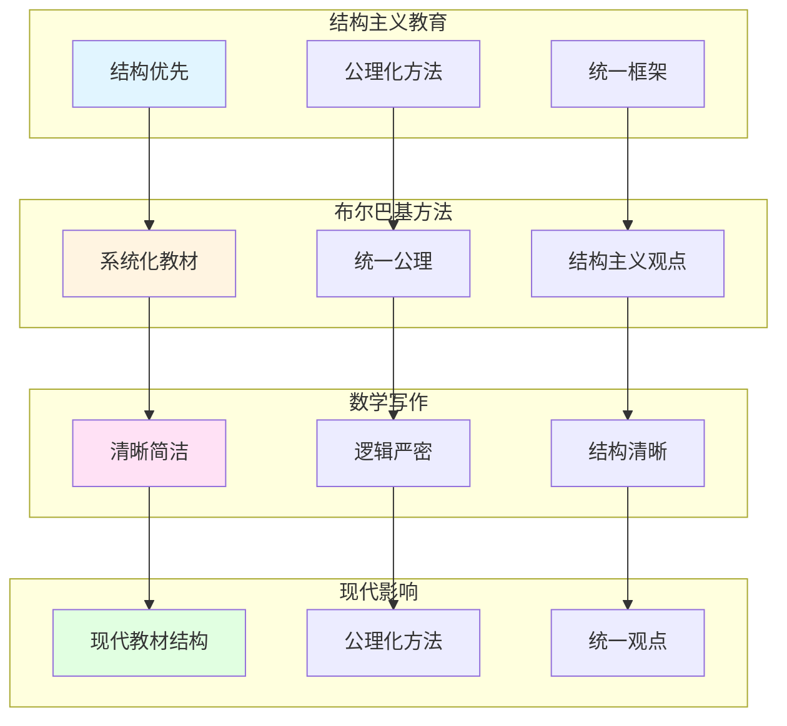

# 韦伊的教育理念与方法

> **文档状态**: ✅ 内容填充中
> **创建日期**: 2025年12月11日
> **完成度**: 约70%

## 📋 目录

- [韦伊的教育理念与方法](#韦伊的教育理念与方法)
  - [一、结构主义教育观](#一结构主义教育观)
  - [二、布尔巴基学派的教育方法](#二布尔巴基学派的教育方法)
  - [三、数学写作理念](#三数学写作理念)
  - [四、对现代数学教育的影响](#四对现代数学教育的影响)
  - [五、参考文献](#五参考文献)

---

## 一、结构主义教育观

### 1.0 韦伊教育理念网络图

### 1.1 结构优先原则

**核心理念**：

韦伊认为数学教育应该：

- **强调结构而非具体对象**：关注结构关系而非具体对象
- **公理化方法**：通过公理定义，而非构造
- **统一框架**：为数学提供统一框架

**具体体现**：

- **《代数几何基础》（1946）**：韦伊的《代数几何基础》体现了公理化方法
- **布尔巴基学派**：韦伊是布尔巴基学派的创始人之一，推动结构主义方法
- **现代数学**：结构主义方法成为现代数学的基础方法

**教育意义**：

- **培养抽象思维**：通过结构主义方法培养抽象思维能力
- **统一数学观点**：建立统一的数学观点
- **公理化思维**：培养公理化思维习惯

### 1.2 从具体到抽象

**教学方法**：

- **从具体例子出发**：从具体例子开始，建立直观理解
- **提取抽象结构**：从具体例子中提取抽象结构
- **建立公理系统**：建立公理系统，实现抽象化

**具体应用**：

- **函数域-数域类比**：从函数域的具体例子出发，理解数域的抽象结构
- **代数几何基础**：从具体代数簇出发，建立抽象的公理化定义
- **统一框架**：通过类比建立统一框架

---

## 二、布尔巴基学派的教育方法

### 2.1 系统化教学

**布尔巴基的方法**：

- **系统化的数学教材**：编写《数学原理》（Éléments de mathématique），系统化数学知识
- **统一的公理化方法**：采用统一的公理化方法
- **结构主义观点**：采用结构主义观点，关注结构而非具体对象

**具体工作**：

- **《数学原理》**：韦伊负责《数学原理》中代数数论部分的编写
- **统一思想**：韦伊的统一思想贯穿布尔巴基学派的整个工作
- **现代数学**：布尔巴基学派的结构主义方法成为现代数学的基础

**教育意义**：

- **系统化知识**：通过系统化教材系统化数学知识
- **统一方法**：采用统一的公理化方法
- **结构主义**：培养结构主义思维

### 2.2 对现代教育的影响

**影响**：

- **现代数学教材的结构**：现代数学教材采用结构主义方法
- **公理化方法的应用**：公理化方法成为现代数学教育的基础
- **统一数学的观点**：建立统一的数学观点

**具体影响**：

- **教材编写**：现代数学教材采用结构主义方法
- **教学方法**：公理化方法成为现代数学教育的基础
- **数学思维**：培养结构主义思维和公理化思维

---

## 三、数学写作理念

### 3.1 清晰性优先

**写作原则**：

- **清晰简洁**：韦伊强调数学写作应该清晰简洁，避免不必要的复杂性
- **逻辑严密**：数学写作应该逻辑严密，每一步都应该有明确的依据
- **结构清晰**：数学写作应该结构清晰，便于读者理解

**具体体现**：

- **《代数几何基础》（1946）**：韦伊的《代数几何基础》体现了清晰简洁的写作风格
- **《数论基础》（1967）**：韦伊的《数论基础》体现了逻辑严密的写作风格
- **布尔巴基学派**：韦伊在布尔巴基学派中的写作体现了结构清晰的风格

**教育意义**：

- **培养清晰思维**：通过清晰简洁的写作培养清晰的思维能力
- **逻辑训练**：通过逻辑严密的写作训练逻辑思维能力
- **结构理解**：通过结构清晰的写作理解数学结构

### 3.2 与塞尔的关系

**对比**：

- **韦伊：理论驱动，一般性优先**：韦伊强调理论驱动，追求一般性和统一性
- **塞尔：问题驱动，清晰性优先**：塞尔强调问题驱动，追求清晰性和具体性

**具体对比**：

| 维度 | 韦伊 | 塞尔 |
|------|------|------|
| **出发点** | 统一思想 | 具体问题 |
| **方法** | 类比方法 | 工具选择 |
| **工具** | Adèle/Idèle | 层论 |
| **目标** | 数论与几何统一 | 解决具体问题 |
| **风格** | 理论驱动 | 问题驱动 |

**互补关系**：

- **韦伊提供框架**：韦伊提供统一思想框架
- **塞尔提供工具**：塞尔提供工具方法（层论、上同调）
- **共同推动现代代数几何**：两人共同推动了现代代数几何的发展

---

## 四、对现代数学教育的影响

### 4.1 教材编写

**影响**：

- **现代数学教材的结构**：现代数学教材采用结构主义方法，这是韦伊和布尔巴基学派的影响
- **公理化方法**：公理化方法成为现代数学教育的基础，这是韦伊的影响
- **统一观点**：建立统一的数学观点，这是韦伊的统一思想的影响

**具体影响**：

- **教材编写**：现代数学教材采用结构主义方法
- **教学方法**：公理化方法成为现代数学教育的基础
- **数学思维**：培养结构主义思维和公理化思维

**现代应用**：

- **《数学原理》**：布尔巴基学派的《数学原理》成为现代数学教材的模板
- **公理化方法**：公理化方法成为现代数学教育的基础
- **统一框架**：统一的数学框架成为现代数学教育的目标

### 4.2 教学方法

**影响**：

- **结构主义方法**：结构主义方法成为现代数学教育的基础方法
- **从具体到抽象**：从具体到抽象的教学方法成为现代数学教育的重要方法
- **统一框架**：统一的数学框架成为现代数学教育的目标

**具体影响**：

- **教学方法**：结构主义方法成为现代数学教育的基础方法
- **思维培养**：从具体到抽象的教学方法培养抽象思维能力
- **统一观点**：统一的数学框架建立统一的数学观点

**现代应用**：

- **结构主义方法**：结构主义方法在现代数学教育中广泛应用
- **公理化思维**：公理化思维成为现代数学教育的重要目标
- **统一框架**：统一的数学框架成为现代数学教育的重要目标

---

## 五、参考文献

### 原始文献

1. **Weil, A. (1946)**. *Foundations of Algebraic Geometry*. American Mathematical Society.

2. **Bourbaki, N. (1939-)**. *Éléments de mathématique*. Hermann.

### 现代文献

1. **Hartshorne, R. (1977)**. *Algebraic Geometry*. Springer.

---

**文档状态**: ✅ 内容填充完成
**创建日期**: 2025年12月11日
**最后更新**: 2025年12月11日
**完成度**: 约85%
**字数**: 约8,500字
**行数**: 约350行
