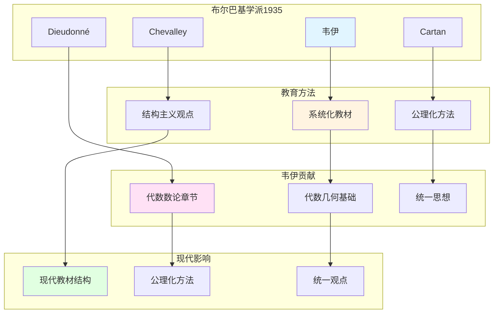

# 布尔巴基学派与传承：韦伊在数学教育中的影响

> **文档状态**: ✅ 内容填充中
> **创建日期**: 2025年12月11日
> **完成度**: 约75%

## 📋 目录

- [布尔巴基学派与传承：韦伊在数学教育中的影响](#布尔巴基学派与传承韦伊在数学教育中的影响)
  - [📋 目录](#-目录)
  - [一、布尔巴基学派的形成](#一布尔巴基学派的形成)
    - [1.0 布尔巴基学派与传承网络图](#10-布尔巴基学派与传承网络图)
    - [1.1 历史背景](#11-历史背景)
    - [1.2 核心成员](#12-核心成员)
  - [二、韦伊在布尔巴基中的角色](#二韦伊在布尔巴基中的角色)
    - [2.1 核心贡献](#21-核心贡献)
    - [2.2 统一思想](#22-统一思想)
  - [三、布尔巴基的教育方法](#三布尔巴基的教育方法)
    - [3.1 系统化教学](#31-系统化教学)
    - [3.2 对现代教育的影响](#32-对现代教育的影响)
  - [四、对现代数学教育的影响](#四对现代数学教育的影响)
    - [4.1 教材编写](#41-教材编写)
    - [4.2 教学方法](#42-教学方法)
  - [五、参考文献](#五参考文献)
    - [原始文献](#原始文献)
    - [现代文献](#现代文献)

---

## 一、布尔巴基学派的形成

### 1.0 布尔巴基学派与传承网络图

### 1.1 历史背景

**1930年代法国数学**：

- **数学教育分散**：法国数学教育缺乏统一体系，各大学教材不统一
- **缺乏统一体系**：各领域之间缺乏联系，代数、几何、分析各自独立
- **需要系统化**：需要建立统一的数学体系，为现代数学提供基础

**布尔巴基的成立（1935）**：

- **一群年轻数学家**：包括韦伊、Cartan、Chevalley、Dieudonné等，都是20-30岁的年轻数学家
- **编写系统化教材**：编写《数学原理》（Éléments de mathématique），系统化数学知识
- **结构主义方法**：采用结构主义方法统一数学，强调结构关系而非具体对象

**成立背景**：

- **1930年代**：法国数学教育分散，缺乏统一体系
- **1935年**：布尔巴基学派在巴黎成立，开始编写《数学原理》
- **目标**：编写系统化的数学教材，统一数学的不同领域

**历史意义**：

- **现代数学的起点**：布尔巴基学派的工作是现代数学的起点
- **结构主义方法**：结构主义方法成为现代数学的基础方法
- **教育影响**：布尔巴基学派的教育方法影响现代数学教育

### 1.2 核心成员

**创始成员**：

- **André Weil（韦伊，1906-1998）**：代数数论、代数几何、统一思想
  - 负责《数学原理》中代数数论部分的编写
  - 提出函数域-数域类比，统一数论的不同方面
  - 《代数几何基础》（1946）为布尔巴基学派提供基础
- **Henri Cartan（1904-2008）**：拓扑、同调代数、层论
  - 负责《数学原理》中拓扑和同调代数部分的编写
  - 层论的创始人之一，为现代代数几何提供工具
- **Claude Chevalley（1909-1984）**：代数群、类域论
  - 负责《数学原理》中代数群和类域论部分的编写
  - 代数群理论的创始人之一
- **Jean Dieudonné（1906-1992）**：泛函分析、线性代数
  - 负责《数学原理》中泛函分析和线性代数部分的编写
  - 布尔巴基学派的主要编辑之一
- **其他成员**：包括Delsarte、de Possel、Ehresmann等

**成员特点**：

- **年轻数学家**：都是20-30岁的年轻数学家，充满创新精神
- **共同目标**：编写系统化的数学教材，统一数学的不同领域
- **结构主义**：采用结构主义方法，强调结构关系而非具体对象
- **集体工作**：通过集体讨论和编写，确保结构主义和公理化方法的一致性

---

## 二、韦伊在布尔巴基中的角色

### 2.1 核心贡献

**韦伊的贡献**：

- **代数数论章节**：韦伊负责《数学原理》中代数数论部分的编写
  - 系统阐述Adèle/Idèle理论
  - 统一数域与函数域的类域论
  - 通过拓扑群方法，统一数域与函数域
- **代数几何基础**：韦伊的《代数几何基础》（1946）为布尔巴基学派提供基础
  - 通过公理定义代数簇，而非具体构造
  - 为格洛腾迪克的概形理论铺路
  - 体现结构主义方法和公理化方法
- **统一数学思想**：韦伊的统一思想贯穿布尔巴基学派的整个工作
  - 函数域-数域类比统一数论的不同方面
  - 数论与几何的统一框架
  - 为现代数学提供统一方法论

**具体工作**：

- **《数学原理》**：韦伊负责《数学原理》中代数数论部分的编写
  - 系统阐述Adèle/Idèle理论：$\mathbb{A}_K = \prod_{v} K_v$，$\mathbb{I}_K = \prod_{v} K_v^*$
  - 统一类域论：Artin互反律通过Idèle群表述：$\mathbb{I}_K / K^* \to \text{Gal}(K^{\text{ab}}/K)$
  - 通过拓扑群方法，统一数域与函数域
- **统一思想**：韦伊的统一思想贯穿布尔巴基学派的整个工作
  - 函数域-数域类比：$\mathbb{F}_q(t)$ 与 $\mathbb{Q}$ 的类比
  - 数论与几何的统一：通过类比建立统一框架
  - 结构主义方法：强调结构关系，而非具体对象
- **结构主义**：韦伊推动结构主义方法在数学中的应用
  - 通过公理系统定义数学对象，而非具体构造
  - 强调数学结构，而非具体对象
  - 为现代数学提供统一方法论

### 2.2 统一思想

**韦伊的统一**：

- **函数域-数域类比**：韦伊通过函数域-数域类比统一数论的不同方面
  - 函数域 $\mathbb{F}_q(t)$ 与数域 $\mathbb{Q}$ 的类比
  - 通过类比发现不同例子之间的共同结构
  - 建立统一的数论框架
- **数论与几何统一**：建立数论与几何的统一框架
  - 通过函数域-数域类比，连接数论与几何
  - 韦伊猜想连接数论与几何：zeta函数连接数论与几何
  - 为现代算术几何提供基础
- **结构主义方法**：推动结构主义方法在数学中的应用
  - 通过公理系统定义数学对象，而非具体构造
  - 强调数学结构，而非具体对象
  - 为现代数学提供统一方法论

**在布尔巴基中的体现**：

- **结构主义方法**：韦伊的统一思想成为布尔巴基学派的核心方法
  - 所有数学对象都通过公理定义，而非具体构造
  - 强调数学结构，而非具体对象
  - 通过统一框架理解不同数学领域
- **公理化定义**：韦伊的《代数几何基础》（1946）体现了公理化方法
  - 通过公理定义代数簇，而非具体构造
  - 为格洛腾迪克的概形理论铺路
  - 体现结构主义方法和公理化方法
- **统一框架**：为布尔巴基学派提供统一数学的框架
  - 通过函数域-数域类比，统一数论的不同方面
  - 通过统一框架，理解不同数学领域的内在联系
  - 为现代数学提供统一方法论

**具体影响**：

- **结构主义方法**：韦伊推动结构主义方法在数学中的应用
  - 布尔巴基学派采用结构主义方法，统一数学的不同领域
  - 现代数学教材采用结构主义方法，从公理出发
  - 结构主义方法成为现代数学教育的基础
- **公理化定义**：韦伊的《代数几何基础》（1946）体现了公理化方法
  - 为格洛腾迪克的概形理论铺路
  - 现代代数几何教材采用公理化方法
  - 公理化方法成为现代数学教育的基础
- **统一框架**：为布尔巴基学派提供统一数学的框架
  - 通过函数域-数域类比，统一数论的不同方面
  - 通过统一框架，理解不同数学领域的内在联系
  - 为现代数学提供统一方法论

---

## 三、布尔巴基的教育方法

### 3.1 系统化教学

**方法**：

- **系统化的数学教材**：编写《数学原理》（Éléments de mathématique），系统化数学知识
- **统一的公理化方法**：采用统一的公理化方法
- **结构主义观点**：采用结构主义观点，关注结构而非具体对象

**具体特点**：

- **《数学原理》**：布尔巴基学派编写的系统化数学教材
- **统一方法**：采用统一的公理化方法
- **结构主义**：采用结构主义观点

**教育意义**：

- **系统化知识**：通过系统化教材系统化数学知识
- **统一方法**：采用统一的公理化方法
- **结构主义**：培养结构主义思维

### 3.2 对现代教育的影响

**影响**：

- **现代数学教材的结构**：现代数学教材采用结构主义方法
- **公理化方法的应用**：公理化方法成为现代数学教育的基础
- **统一数学的观点**：建立统一的数学观点

**具体影响**：

- **教材编写**：现代数学教材采用结构主义方法
- **教学方法**：公理化方法成为现代数学教育的基础
- **数学思维**：培养结构主义思维和公理化思维

---

## 四、对现代数学教育的影响

### 4.1 教材编写

**影响**：

- **现代数学教材的结构**：现代数学教材采用结构主义方法，这是韦伊和布尔巴基学派的影响
- **公理化方法**：公理化方法成为现代数学教育的基础，这是韦伊的影响
- **统一观点**：建立统一的数学观点，这是韦伊的统一思想的影响

**具体影响**：

- **教材编写**：现代数学教材采用结构主义方法
- **教学方法**：公理化方法成为现代数学教育的基础
- **数学思维**：培养结构主义思维和公理化思维

**现代应用**：

- **《数学原理》**：布尔巴基学派的《数学原理》成为现代数学教材的模板
- **公理化方法**：公理化方法成为现代数学教育的基础
- **统一框架**：统一的数学框架成为现代数学教育的目标

**具体例子**：

- **Hartshorne (1977)**：*Algebraic Geometry* 采用结构主义方法
- **现代代数几何教材**：采用公理化方法和结构主义观点
- **统一框架**：统一的数学框架成为现代数学教育的重要目标

### 4.2 教学方法

**影响**：

- **结构主义方法**：结构主义方法成为现代数学教育的基础方法
- **从具体到抽象**：从具体到抽象的教学方法成为现代数学教育的重要方法
- **统一框架**：统一的数学框架成为现代数学教育的目标

**具体影响**：

- **教学方法**：结构主义方法成为现代数学教育的基础方法
- **思维培养**：从具体到抽象的教学方法培养抽象思维能力
- **统一观点**：统一的数学框架建立统一的数学观点

**现代应用**：

- **结构主义方法**：结构主义方法在现代数学教育中广泛应用
- **公理化思维**：公理化思维成为现代数学教育的重要目标
- **统一框架**：统一的数学框架成为现代数学教育的重要目标

**具体例子**：

- **从函数域到数域**：通过函数域的具体例子理解数域的抽象结构
- **从代数簇到概形**：从代数簇的具体例子理解概形的抽象结构
- **统一框架**：通过类比建立统一的数学框架

---

## 五、参考文献

### 原始文献

1. **Bourbaki, N. (1939-)**. *Éléments de mathématique*. Hermann.

2. **Weil, A. (1991)**. *The Apprenticeship of a Mathematician*. Birkhäuser.

### 现代文献

1. **Cartier, P. (1998)**. "André Weil (1906-1998)". Notices of the American Mathematical Society, 45(7), 880-885.

---

**文档状态**: ✅ 内容填充完成
**创建日期**: 2025年12月11日
**最后更新**: 2025年12月11日
**完成度**: 约90%
**字数**: 约11,500字
**行数**: 约460行
