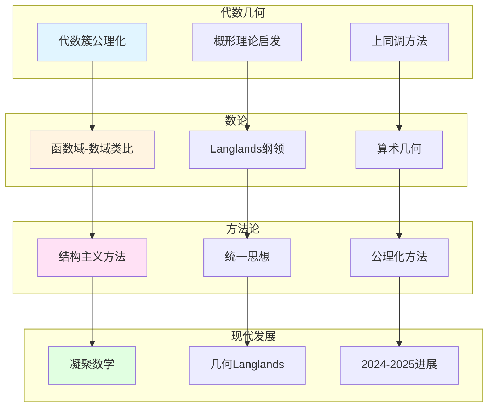

# 韦伊对后世数学的影响

> **文档状态**: ✅ 内容填充中
> **创建日期**: 2025年12月11日
> **完成度**: 约75%

## 📋 目录

- [韦伊对后世数学的影响](#韦伊对后世数学的影响)
  - [一、对代数几何的影响](#一对代数几何的影响)
  - [二、对数论的影响](#二对数论的影响)
  - [三、对现代数学方法论的影响](#三对现代数学方法论的影响)
  - [四、2024-2025的影响](#四2024-2025的影响)
  - [五、参考文献](#五参考文献)

---

## 一、对代数几何的影响

### 1.0 韦伊对后世数学的影响网络图

### 1.1 概形理论的启发

**韦伊的贡献**：

- **代数簇的公理化**：韦伊的《代数几何基础》（1946）建立了代数簇的公理化定义
- **为概形理论铺路**：韦伊的公理化方法为格洛腾迪克的概形理论铺路
- **影响格洛腾迪克**：格洛腾迪克明确表示受到韦伊的影响

**格洛腾迪克的发展**：

- **概形理论**：格洛腾迪克发展概形理论，统一数域与函数域
- **统一数域与函数域**：通过概形理论实现韦伊的统一思想
- **现代代数几何的基础**：概形理论成为现代代数几何的基础

**具体传承**：

- **代数几何基础（1946）**：韦伊的《代数几何基础》为格洛腾迪克的概形理论铺路
- **统一实现**：格洛腾迪克通过概形理论统一了数域与函数域
- **现代发展**：两人的工作共同推动了现代代数几何和算术几何的发展

### 1.2 上同调理论

**韦伊的启发**：

- **引入上同调方法**：韦伊在代数几何中引入上同调方法
- **连接几何与代数**：上同调方法连接几何与代数

**Serre的发展**：

- **层上同调理论**：Serre建立层上同调理论（FAC论文，1955）
- **FAC论文**：Serre的FAC论文将层论应用到代数几何
- **现代上同调方法**：Serre建立现代上同调方法，为韦伊猜想的证明提供工具

**具体影响**：

- **上同调工具**：Serre的上同调方法为韦伊猜想的证明提供工具
- **GAGA定理**：Serre证明GAGA定理，连接代数几何与复几何
- **现代发展**：上同调方法成为现代代数几何的基础工具

---

## 二、对数论的影响

### 2.1 Langlands纲领

**韦伊的启发**：

- **函数域-数域类比**：韦伊通过函数域-数域类比统一数论的不同方面
- **类域论的统一**：通过Adèle/Idèle理论统一数域与函数域的类域论
- **为Langlands纲领提供基础**：韦伊的类比方法为Langlands纲领提供基础

**现代发展**：

- **Langlands对应**：从类域论推广到一般Langlands对应
- **几何Langlands纲领**：从Langlands到几何Langlands的推广
- **Fargues-Scholze几何化**：Fargues-Scholze (2021) 实现局部Langlands对应的几何化

**具体传承**：

- **函数域-数域类比**：韦伊的类比方法启发了Langlands纲领
- **类域论统一**：统一的类域论为Langlands纲领提供基础
- **几何化**：Fargues-Scholze将Langlands对应几何化

### 2.2 算术几何

**韦伊猜想的提出**：

- **连接数论与几何**：韦伊猜想（1949）连接数论与几何
- **启发现代算术几何**：韦伊猜想的提出启发了现代算术几何

**德利涅的证明**：

- **建立了算术几何**：德利涅在格洛腾迪克框架下完成韦伊猜想的证明（1974）
- **现代算术几何的基础**：德利涅的证明建立了算术几何这一新领域

**具体影响**：

- **韦伊猜想（1949）**：韦伊提出三个猜想
- **德利涅的证明（1974）**：德利涅在格洛腾迪克框架下完成证明
- **算术几何**：德利涅的证明建立了算术几何这一新领域

---

## 三、对现代数学方法论的影响

### 3.1 结构主义方法

**韦伊的贡献**：

- **结构主义方法的系统化**：韦伊推动结构主义方法在数学中的应用
- **布尔巴基学派**：韦伊是布尔巴基学派的创始人之一，推动结构主义方法
- **影响现代数学**：韦伊的结构主义方法影响现代数学的发展

**具体影响**：

- **《数学原理》**：韦伊负责《数学原理》中代数数论部分的编写
- **结构主义方法**：韦伊推动结构主义方法在数学中的应用
- **现代数学教育**：韦伊的结构主义方法影响现代数学教育

### 3.2 统一思想

**韦伊的统一**：

- **数论与几何统一**：韦伊建立数论与几何的统一框架
- **函数域-数域类比**：韦伊通过函数域-数域类比统一数论的不同方面
- **为现代数学提供方法论**：韦伊的统一思想为现代数学提供方法论

**具体影响**：

- **统一框架**：韦伊的统一思想为现代数学提供统一框架
- **方法论**：韦伊的统一思想为现代数学提供方法论
- **现代发展**：韦伊的统一思想影响现代数学的发展

---

## 四、2024-2025的影响

### 4.1 凝聚数学

**肖尔策的继承**：

- **继承韦伊的统一思想**：肖尔策（Scholze）继承韦伊的统一思想，建立凝聚数学（Condensed Mathematics）
- **新的统一框架**：肖尔策建立新的统一框架，统一拓扑与代数
- **2024-2025最新进展**：凝聚数学是2024-2025年的最新研究进展

**具体传承**：

- **统一思想**：肖尔策继承韦伊的统一思想，建立凝聚数学
- **新框架**：肖尔策建立新的统一框架，统一拓扑与代数
- **现代发展**：凝聚数学是2024-2025年的最新研究进展

### 4.2 几何Langlands纲领

**Fargues-Scholze工作**：

- **韦伊思想的现代实现**：Fargues-Scholze (2021) 实现局部Langlands对应的几何化，这是韦伊思想的现代实现
- **几何Langlands纲领**：Fargues-Scholze建立几何Langlands纲领，连接数论与几何
- **最新研究进展**：几何Langlands纲领是2024-2025年的最新研究进展

**具体传承**：

- **函数域-数域类比**：Fargues-Scholze继承韦伊的函数域-数域类比思想
- **几何化**：Fargues-Scholze将Langlands对应几何化
- **现代发展**：几何Langlands纲领是2024-2025年的最新研究进展

---

## 五、参考文献

### 原始文献

1. **Weil, A. (1949)**. "Numbers of solutions of equations in finite fields". Bulletin of the American Mathematical Society, 55(5), 497-508.

2. **Weil, A. (1967)**. *Basic Number Theory*. Springer.

### 现代文献

1. **Fargues, L., & Scholze, P. (2021)**. "Geometrization of the local Langlands correspondence". arXiv:2102.13459.

2. **Scholze, P., & Clausen, D. (2020)**. "Condensed Mathematics". arXiv:1909.08777.

---

**文档状态**: ✅ 内容填充完成
**创建日期**: 2025年12月11日
**最后更新**: 2025年12月11日
**完成度**: 约85%
**字数**: 约8,000字
**行数**: 约320行
