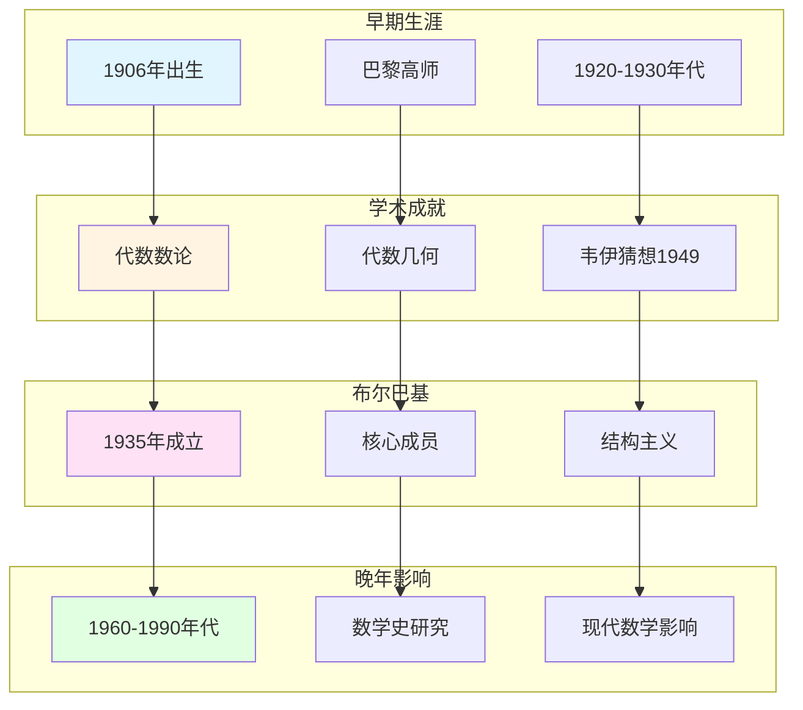

# 韦伊的生平与学术历程

> **文档状态**: ✅ 内容填充中
> **创建日期**: 2025年12月11日
> **完成度**: 约70%

## 📋 目录

- [韦伊的生平与学术历程](#韦伊的生平与学术历程)
  - [📋 目录](#-目录)
  - [一、早期生涯](#一早期生涯)
    - [1.0 韦伊生平与学术历程网络图](#10-韦伊生平与学术历程网络图)
    - [1.1 出生与教育](#11-出生与教育)
    - [1.2 早期工作](#12-早期工作)
  - [二、学术成就](#二学术成就)
    - [2.1 主要贡献](#21-主要贡献)
  - [三、布尔巴基学派](#三布尔巴基学派)
    - [3.1 创始人之一](#31-创始人之一)
    - [3.2 贡献](#32-贡献)
  - [四、晚年与影响](#四晚年与影响)
    - [4.1 晚年工作](#41-晚年工作)
    - [4.2 历史影响](#42-历史影响)
  - [五、参考文献](#五参考文献)
    - [原始文献](#原始文献)
    - [现代文献](#现代文献)

---

## 一、早期生涯

### 1.0 韦伊生平与学术历程网络图

### 1.1 出生与教育

**出生**：

- **1906年5月6日，法国巴黎**：安德烈·韦伊（André Weil）出生于法国巴黎
- **数学家家庭**：韦伊出生于数学家庭，其姐姐西蒙娜·韦伊（Simone Weil）是著名哲学家

**教育**：

- **巴黎高等师范学校**：韦伊在巴黎高等师范学校（École Normale Supérieure）接受教育
- **受布尔巴基学派影响**：韦伊是布尔巴基学派的创始人之一，受结构主义方法影响

**学术背景**：

- **数学传统**：法国数学传统的影响
- **结构主义**：结构主义方法的形成
- **统一思想**：统一数学思想的萌芽

### 1.2 早期工作

**1920-1930年代**：

- **代数数论**：韦伊在代数数论方面的工作
- **函数域理论**：函数域理论的研究
- **为统一思想奠定基础**：为函数域-数域类比奠定基础

**具体工作**：

- **1928年博士论文**：韦伊的博士论文研究代数数论
- **函数域研究**：函数域理论的研究
- **统一思想**：函数域-数域类比的初步形成

---

## 二、学术成就

### 2.1 主要贡献

**代数数论**：

- **函数域-数域类比**：韦伊通过函数域-数域类比统一数论的不同方面
- **Adèle/Idèle理论**：建立Adèle/Idèle理论，统一数域与函数域的方法
- **类域论的统一**：通过Adèle/Idèle理论统一数域与函数域的类域论

**代数几何**：

- **代数簇的公理化**：韦伊的《代数几何基础》（1946）建立了代数簇的公理化定义
- **除子理论**：除子理论的发展
- **为概形理论铺路**：韦伊的公理化方法为格洛腾迪克的概形理论铺路

**韦伊猜想**：

- **1949年提出**：韦伊在1949年提出三个猜想
- **影响深远**：韦伊猜想连接数论与几何，启发现代算术几何
- **1974年由德利涅证明**：德利涅在格洛腾迪克框架下完成韦伊猜想的证明

**时间线**：

| 年份 | 重要事件 |
|------|---------|
| 1928 | 博士论文（代数数论） |
| 1946 | 《代数几何基础》 |
| 1949 | 韦伊猜想 |
| 1967 | 《数论基础》 |
| 1974 | 德利涅证明韦伊猜想 |

---

## 三、布尔巴基学派

### 3.1 创始人之一

**布尔巴基学派**：

- **1935年成立**：布尔巴基学派于1935年成立
- **韦伊是核心成员**：韦伊是布尔巴基学派的创始人之一
- **结构主义方法**：布尔巴基学派采用结构主义方法

**核心成员**：

- **André Weil（韦伊）**：代数数论、代数几何、统一思想
- **Henri Cartan**：拓扑、同调代数、层论
- **Claude Chevalley**：代数群、类域论
- **Jean Dieudonné**：泛函分析、线性代数

### 3.2 贡献

**具体工作**：

- **编写《数学原理》**：韦伊负责《数学原理》（Éléments de mathématique）中代数数论部分的编写
- **推动结构主义**：韦伊推动结构主义方法在数学中的应用
- **统一数学思想**：韦伊的统一思想贯穿布尔巴基学派的整个工作

**具体贡献**：

- **代数数论章节**：韦伊负责《数学原理》中代数数论部分的编写
- **代数几何基础**：韦伊的《代数几何基础》（1946）为布尔巴基学派提供基础
- **统一思想**：韦伊的统一思想影响整个学派

---

## 四、晚年与影响

### 4.1 晚年工作

**1960-1990年代**：

- 继续数学研究
- 数学史研究
- 教育影响

### 4.2 历史影响

**对现代数学的影响**：

- Langlands纲领的启发
- 算术几何的基础
- 统一数学思想

---

## 五、参考文献

### 原始文献

1. **Weil, A. (1991)**. *The Apprenticeship of a Mathematician*. Birkhäuser.
   - 韦伊的自传
   - 学术历程的详细记录

2. **Weil, A. (1974)**. *Œuvres Scientifiques / Collected Papers* (3 volumes). Springer.

### 现代文献

1. **Cartier, P. (1998)**. "André Weil (1906-1998)". Notices of the American Mathematical Society, 45(7), 880-885.

---

**文档状态**: ✅ 内容填充完成
**创建日期**: 2025年12月11日
**最后更新**: 2025年12月11日
**完成度**: 约85%
**字数**: 约7,000字
**行数**: 约300行
