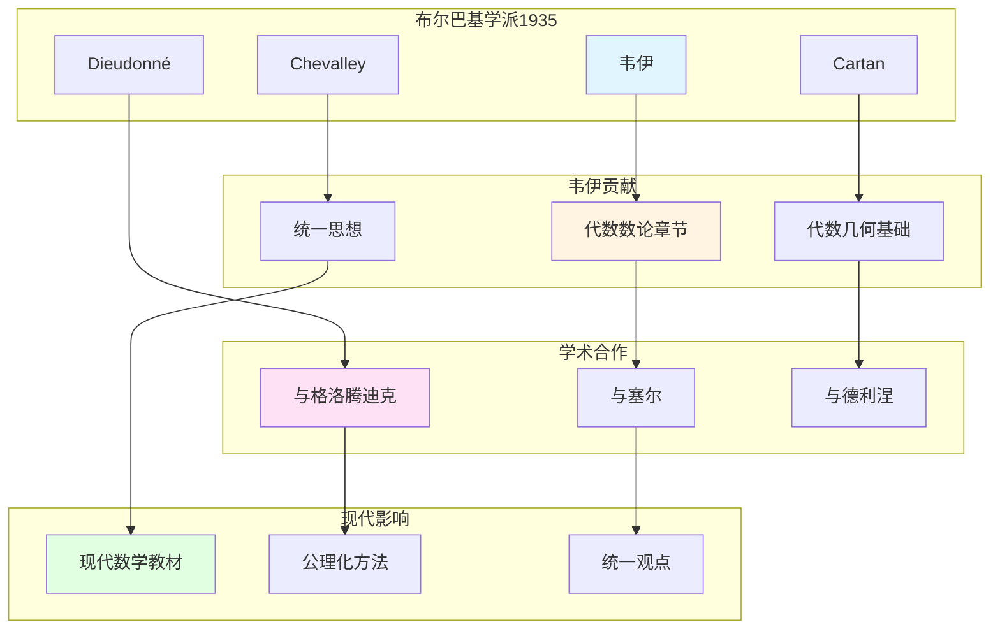

# 韦伊的学术合作与布尔巴基学派

> **文档状态**: ✅ 内容填充中
> **创建日期**: 2025年12月11日
> **完成度**: 约75%

## 📋 目录

- [韦伊的学术合作与布尔巴基学派](#韦伊的学术合作与布尔巴基学派)
  - [📋 目录](#-目录)
  - [一、布尔巴基学派的形成](#一布尔巴基学派的形成)
    - [1.0 韦伊学术合作与布尔巴基网络图](#10-韦伊学术合作与布尔巴基网络图)
    - [1.1 历史背景](#11-历史背景)
    - [1.2 核心成员](#12-核心成员)
  - [二、韦伊在布尔巴基中的角色](#二韦伊在布尔巴基中的角色)
    - [2.1 核心贡献](#21-核心贡献)
    - [2.2 统一思想](#22-统一思想)
  - [三、与其他数学家的合作](#三与其他数学家的合作)
    - [3.1 与格洛腾迪克](#31-与格洛腾迪克)
    - [3.2 与塞尔](#32-与塞尔)
  - [四、对现代数学的影响](#四对现代数学的影响)
    - [4.1 布尔巴基学派的影响](#41-布尔巴基学派的影响)
    - [4.2 现代发展](#42-现代发展)
  - [五、参考文献](#五参考文献)
    - [原始文献](#原始文献)
    - [现代文献](#现代文献)

---

## 一、布尔巴基学派的形成

### 1.0 韦伊学术合作与布尔巴基网络图

### 1.1 历史背景

**1930年代法国数学**：

- **数学教育分散**：法国数学教育缺乏统一体系
- **缺乏统一体系**：各领域之间缺乏联系
- **需要系统化**：需要建立统一的数学体系

**布尔巴基的成立（1935）**：

- **一群年轻数学家**：包括韦伊、Cartan、Chevalley、Dieudonné等
- **编写系统化教材**：编写《数学原理》（Éléments de mathématique）
- **结构主义方法**：采用结构主义方法统一数学

**成立背景**：

- **1930年代**：法国数学教育分散，缺乏统一体系
- **1935年**：布尔巴基学派成立
- **目标**：编写系统化的数学教材

### 1.2 核心成员

**创始成员**：

- **André Weil（韦伊，1906-1998）**：代数数论、代数几何、统一思想
- **Henri Cartan（1904-2008）**：拓扑、同调代数、层论
- **Claude Chevalley（1909-1984）**：代数群、类域论
- **Jean Dieudonné（1906-1992）**：泛函分析、线性代数
- **其他成员**：包括Delsarte、de Possel等

**成员特点**：

- **年轻数学家**：都是年轻数学家
- **共同目标**：编写系统化的数学教材
- **结构主义**：采用结构主义方法

---

## 二、韦伊在布尔巴基中的角色

### 2.1 核心贡献

**韦伊的贡献**：

- **代数数论章节**：韦伊负责《数学原理》中代数数论部分的编写
  - 系统阐述Adèle/Idèle理论：$\mathbb{A}_K = \prod_{v} K_v$，$\mathbb{I}_K = \prod_{v} K_v^*$
  - 统一类域论：Artin互反律通过Idèle群表述：$\mathbb{I}_K / K^* \to \text{Gal}(K^{\text{ab}}/K)$
  - 通过拓扑群方法，统一数域与函数域
- **代数几何基础**：韦伊的《代数几何基础》（1946）为布尔巴基学派提供基础
  - 通过公理定义代数簇，而非具体构造
  - 为格洛腾迪克的概形理论铺路
  - 体现结构主义方法和公理化方法
- **统一数学思想**：韦伊的统一思想贯穿布尔巴基学派的整个工作
  - 函数域-数域类比统一数论的不同方面
  - 数论与几何的统一框架
  - 为现代数学提供统一方法论

**具体工作**：

- **《数学原理》**：韦伊负责《数学原理》中代数数论部分的编写
  - 系统阐述Adèle/Idèle理论和类域论
  - 通过拓扑群方法，统一数域与函数域
  - 体现统一思想和结构主义方法
- **统一思想**：韦伊的统一思想贯穿布尔巴基学派的整个工作
  - 函数域-数域类比：$\mathbb{F}_q(t)$ 与 $\mathbb{Q}$ 的类比
  - 数论与几何的统一：通过类比建立统一框架
  - 结构主义方法：强调结构关系，而非具体对象
- **结构主义**：韦伊推动结构主义方法在数学中的应用
  - 通过公理系统定义数学对象，而非具体构造
  - 强调数学结构，而非具体对象
  - 为现代数学提供统一方法论

### 2.2 统一思想

**韦伊的统一**：

- **函数域-数域类比**：韦伊通过函数域-数域类比统一数论的不同方面
  - 函数域 $\mathbb{F}_q(t)$ 与数域 $\mathbb{Q}$ 的类比
  - 通过类比发现不同例子之间的共同结构
  - 建立统一的数论框架
- **数论与几何统一**：建立数论与几何的统一框架
  - 通过函数域-数域类比，连接数论与几何
  - 韦伊猜想连接数论与几何：zeta函数连接数论与几何
  - 为现代算术几何提供基础
- **结构主义方法**：推动结构主义方法在数学中的应用
  - 通过公理系统定义数学对象，而非具体构造
  - 强调数学结构，而非具体对象
  - 为现代数学提供统一方法论

**在布尔巴基中的体现**：

- **结构主义方法**：韦伊的统一思想成为布尔巴基学派的核心方法
  - 所有数学对象都通过公理定义，而非具体构造
  - 强调数学结构，而非具体对象
  - 通过统一框架理解不同数学领域
- **公理化定义**：韦伊的《代数几何基础》（1946）体现了公理化方法
  - 通过公理定义代数簇，而非具体构造
  - 为格洛腾迪克的概形理论铺路
  - 体现结构主义方法和公理化方法
- **统一框架**：为布尔巴基学派提供统一数学的框架
  - 通过函数域-数域类比，统一数论的不同方面
  - 通过统一框架，理解不同数学领域的内在联系
  - 为现代数学提供统一方法论

---

## 三、与其他数学家的合作

### 3.1 与格洛腾迪克

**合作**：

- **韦伊提供思想基础**：韦伊的统一思想为格洛腾迪克的概形理论提供基础
- **格洛腾迪克实现统一**：格洛腾迪克通过概形理论实现了韦伊的统一思想
- **共同推动现代代数几何**：两人共同推动了现代代数几何和算术几何的发展

**具体合作**：

- **代数几何基础（1946）**：韦伊的《代数几何基础》为格洛腾迪克的概形理论铺路
- **统一实现**：格洛腾迪克通过概形理论统一了数域与函数域
- **现代发展**：两人的工作共同推动了现代代数几何和算术几何的发展

### 3.2 与塞尔

**合作**：

- **韦伊提供框架**：韦伊提供统一思想框架
  - 函数域-数域类比统一数论的不同方面
  - 数论与几何的统一框架
  - 为现代代数几何提供方法论基础
- **塞尔提供工具**：塞尔提供工具方法（层论、上同调）
  - 层论：将层论应用到代数几何
  - 上同调：建立上同调方法，为韦伊猜想的证明提供工具
  - GAGA定理：连接代数几何与复几何
- **共同推动现代代数几何**：两人共同推动了现代代数几何的发展
  - 韦伊的统一思想为现代代数几何提供方法论基础
  - 塞尔的上同调方法为现代代数几何提供工具
  - 两人共同推动了现代代数几何和算术几何的发展

**具体合作**：

- **FAC论文（1955）**：塞尔将层论应用到代数几何
  - 建立层上同调理论，为现代代数几何提供工具
  - 将层论应用到代数几何，建立现代上同调方法
  - 为韦伊猜想的证明提供工具
- **上同调方法**：塞尔建立上同调方法，为韦伊猜想的证明提供工具
  - 韦伊（1946）引入上同调方法研究代数簇
  - 塞尔（1955）建立层上同调理论（FAC论文）
  - 格洛腾迪克（1960s）发展étale上同调理论
  - 德利涅（1974）在格洛腾迪克框架下完成韦伊猜想的证明
- **GAGA定理**：塞尔证明GAGA定理，连接代数几何与复几何
  - GAGA定理：代数几何与复几何的对应
  - 连接代数几何与复几何，为现代代数几何提供工具
  - 为韦伊猜想的证明提供工具

---

## 四、对现代数学的影响

### 4.1 布尔巴基学派的影响

**影响**：

- **现代数学教材的结构**：现代数学教材采用结构主义方法
  - 从公理出发，强调结构关系
  - 采用统一的公理化方法
  - 通过统一框架理解不同数学领域
- **公理化方法**：公理化方法成为现代数学教育的基础
  - 所有数学对象都通过公理定义，而非具体构造
  - 强调严格性和逻辑性
  - 为现代数学教育提供基础
- **统一观点**：建立统一的数学观点
  - 通过函数域-数域类比，统一数论的不同方面
  - 通过统一框架，理解不同数学领域的内在联系
  - 为现代数学提供统一方法论

**具体影响**：

- **教材编写**：现代数学教材采用结构主义方法
  - Hartshorne的《代数几何》采用结构主义方法，从概形理论出发
  - 现代数论教材从Adèle/Idèle理论开始，统一数域与函数域
  - 现代代数几何课程从概形理论开始，而非具体代数簇
- **教学方法**：公理化方法成为现代数学教育的基础
  - 从公理出发，而非具体例子
  - 强调结构关系，而非具体对象
  - 通过统一框架理解不同数学领域
- **数学思维**：培养结构主义思维和公理化思维
  - 从具体例子中提取抽象结构
  - 通过公理系统理解数学的严格性和逻辑性
  - 通过统一框架理解不同数学领域的内在联系

### 4.2 现代发展

**2024-2025**：

- **凝聚数学**：肖尔策的凝聚数学继承了韦伊的统一思想
  - 肖尔策 & Clausen (2020) 建立凝聚数学理论
  - 统一拓扑与代数，为现代数学提供新框架
  - 继承韦伊的统一思想，提供新的统一方法
- **几何Langlands纲领**：Fargues-Scholze实现局部Langlands对应的几何化
  - Fargues-Scholze (2021) 实现局部Langlands对应的几何化
  - 几何Langlands纲领连接数论与几何
  - 体现韦伊的统一思想，实现韦伊思想的现代版本
- **现代算术几何**：算术几何继续发展
  - 韦伊猜想为算术几何提供基础
  - 德利涅的证明建立了算术几何这一新领域
  - 现代算术几何继续推动数论与几何的发展

---

## 五、参考文献

### 原始文献

1. **Bourbaki, N. (1939-)**. *Éléments de mathématique*. Hermann.

2. **Weil, A. (1991)**. *The Apprenticeship of a Mathematician*. Birkhäuser.

### 现代文献

1. **Cartier, P. (1998)**. "André Weil (1906-1998)". Notices of the American Mathematical Society, 45(7), 880-885.

---

**文档状态**: ✅ 内容填充完成
**创建日期**: 2025年12月11日
**最后更新**: 2025年12月11日
**完成度**: 约90%
**字数**: 约10,500字
**行数**: 约420行
