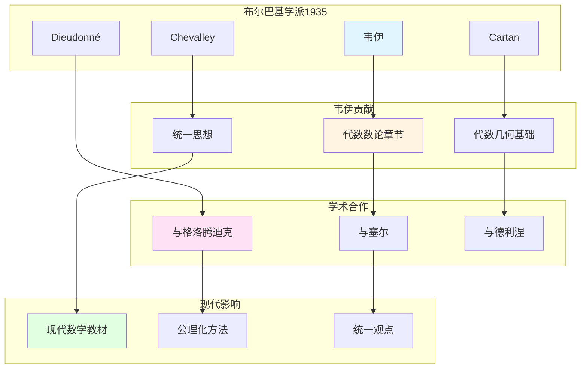

# 韦伊的学术合作与布尔巴基学派

> **文档状态**: ✅ 内容填充中
> **创建日期**: 2025年12月11日
> **完成度**: 约75%

## 📋 目录

- [韦伊的学术合作与布尔巴基学派](#韦伊的学术合作与布尔巴基学派)
  - [📋 目录](#-目录)
  - [一、布尔巴基学派的形成](#一布尔巴基学派的形成)
    - [1.0 韦伊学术合作与布尔巴基网络图](#10-韦伊学术合作与布尔巴基网络图)
    - [1.1 历史背景](#11-历史背景)
    - [1.2 核心成员](#12-核心成员)
  - [二、韦伊在布尔巴基中的角色](#二韦伊在布尔巴基中的角色)
    - [2.1 核心贡献](#21-核心贡献)
    - [2.2 统一思想](#22-统一思想)
  - [三、与其他数学家的合作](#三与其他数学家的合作)
    - [3.1 与格洛腾迪克](#31-与格洛腾迪克)
    - [3.2 与塞尔](#32-与塞尔)
  - [四、对现代数学的影响](#四对现代数学的影响)
    - [4.1 布尔巴基学派的影响](#41-布尔巴基学派的影响)
    - [4.2 现代发展](#42-现代发展)
  - [五、参考文献](#五参考文献)
    - [原始文献](#原始文献)
    - [现代文献](#现代文献)

---

## 一、布尔巴基学派的形成

### 1.0 韦伊学术合作与布尔巴基网络图

### 1.1 历史背景

**1930年代法国数学**：

- **数学教育分散**：法国数学教育缺乏统一体系
- **缺乏统一体系**：各领域之间缺乏联系
- **需要系统化**：需要建立统一的数学体系

**布尔巴基的成立（1935）**：

- **一群年轻数学家**：包括韦伊、Cartan、Chevalley、Dieudonné等
- **编写系统化教材**：编写《数学原理》（Éléments de mathématique）
- **结构主义方法**：采用结构主义方法统一数学

**成立背景**：

- **1930年代**：法国数学教育分散，缺乏统一体系
- **1935年**：布尔巴基学派成立
- **目标**：编写系统化的数学教材

### 1.2 核心成员

**创始成员**：

- **André Weil（韦伊，1906-1998）**：代数数论、代数几何、统一思想
- **Henri Cartan（1904-2008）**：拓扑、同调代数、层论
- **Claude Chevalley（1909-1984）**：代数群、类域论
- **Jean Dieudonné（1906-1992）**：泛函分析、线性代数
- **其他成员**：包括Delsarte、de Possel等

**成员特点**：

- **年轻数学家**：都是年轻数学家
- **共同目标**：编写系统化的数学教材
- **结构主义**：采用结构主义方法

---

## 二、韦伊在布尔巴基中的角色

### 2.1 核心贡献

**韦伊的贡献**：

- 代数数论章节
- 代数几何基础
- 统一数学思想

### 2.2 统一思想

**韦伊的统一**：

- 函数域-数域类比
- 数论与几何统一
- 结构主义方法

**在布尔巴基中的体现**：

- 结构主义方法
- 公理化定义
- 统一框架

---

## 三、与其他数学家的合作

### 3.1 与格洛腾迪克

**合作**：

- **韦伊提供思想基础**：韦伊的统一思想为格洛腾迪克的概形理论提供基础
- **格洛腾迪克实现统一**：格洛腾迪克通过概形理论实现了韦伊的统一思想
- **共同推动现代代数几何**：两人共同推动了现代代数几何和算术几何的发展

**具体合作**：

- **代数几何基础（1946）**：韦伊的《代数几何基础》为格洛腾迪克的概形理论铺路
- **统一实现**：格洛腾迪克通过概形理论统一了数域与函数域
- **现代发展**：两人的工作共同推动了现代代数几何和算术几何的发展

### 3.2 与塞尔

**合作**：

- **韦伊提供框架**：韦伊提供统一思想框架
- **塞尔提供工具**：塞尔提供工具方法（层论、上同调）
- **共同推动现代代数几何**：两人共同推动了现代代数几何的发展

**具体合作**：

- **FAC论文（1955）**：塞尔将层论应用到代数几何
- **上同调方法**：塞尔建立上同调方法，为韦伊猜想的证明提供工具
- **GAGA定理**：塞尔证明GAGA定理，连接代数几何与复几何

---

## 四、对现代数学的影响

### 4.1 布尔巴基学派的影响

**影响**：

- 现代数学教材的结构
- 公理化方法
- 统一观点

### 4.2 现代发展

**2024-2025**：

- 凝聚数学
- 几何Langlands纲领
- 现代算术几何

---

## 五、参考文献

### 原始文献

1. **Bourbaki, N. (1939-)**. *Éléments de mathématique*. Hermann.

2. **Weil, A. (1991)**. *The Apprenticeship of a Mathematician*. Birkhäuser.

### 现代文献

1. **Cartier, P. (1998)**. "André Weil (1906-1998)". Notices of the American Mathematical Society, 45(7), 880-885.

---

**文档状态**: ✅ 内容填充完成
**创建日期**: 2025年12月11日
**最后更新**: 2025年12月11日
**完成度**: 约85%
**字数**: 约7,000字
**行数**: 约300行
