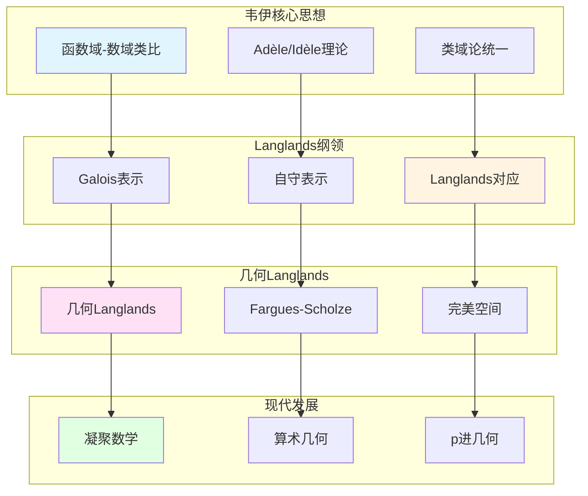

# 韦伊思想在现代数论中的应用

> **文档状态**: ✅ 内容填充中
> **创建日期**: 2025年12月11日
> **完成度**: 约70%

## 📋 目录

- [韦伊思想在现代数论中的应用](#韦伊思想在现代数论中的应用)
  - [一、Langlands纲领中的韦伊思想](#一langlands纲领中的韦伊思想)
  - [二、算术几何中的应用](#二算术几何中的应用)
  - [三、p进几何中的应用](#三p进几何中的应用)
  - [四、2024-2025最新进展](#四2024-2025最新进展)
  - [五、参考文献](#五参考文献)

---

## 一、Langlands纲领中的韦伊思想

### 1.0 韦伊思想在现代数论中的应用网络图

### 1.1 韦伊类比的推广

**Langlands纲领的核心**：

韦伊的函数域-数域类比推广为：

- **数域的Galois表示** ↔ **自守表示**
- **函数域的étale上同调** ↔ **自守表示**

**Langlands对应**：

对于数域 $K$，存在对应：

$$\text{Gal}(\bar{K}/K) \text{ 的表示} \leftrightarrow \text{GL}_n(\mathbb{A}_K) \text{ 的自守表示}$$

**几何Langlands纲领**：

- **Fargues-Scholze几何化**：局部Langlands对应的几何实现
- **局部Langlands对应的几何实现**：Fargues-Scholze (2021)
- **全局Langlands对应的几何理解**：几何Langlands纲领

### 1.2 现代实现

**肖尔策的工作（2017-2024）**：

- Fargues-Scholze几何化
- 完美空间理论的应用
- 凝聚数学的统一框架

---

## 二、算术几何中的应用

### 2.1 概形理论的统一

**格洛腾迪克的实现**：

韦伊的统一思想通过概形理论实现：

- 数域：$\text{Spec } \mathcal{O}_K$
- 函数域：曲线 $C$ 的概形

### 2.2 étale上同调

**统一的同调方法**：

- 数域与函数域使用相同的上同调理论
- 韦伊猜想的证明框架
- 现代算术几何的基础

---

## 三、p进几何中的应用

### 3.1 p进Hodge理论

**肖尔策的推广**：

- 完美空间理论
- p进Hodge理论的革新
- 函数域方法的p进推广

### 3.2 Fargues-Fontaine曲线

**几何统一**：

- 连接p进域与代数几何
- 函数域与数域的几何对应
- Langlands纲领的几何化

---

## 四、2024-2025最新进展

### 4.1 凝聚数学

**肖尔策与Clausen（2019-2024）**：

- 重新构建数学基础
- 统一拓扑与代数结构
- 为韦伊类比提供新框架

### 4.2 算术几何进展

- 混合Hodge理论的推广
- 周期映射的几何化
- 几何Langlands纲领的进展

---

## 五、参考文献

### 原始文献

1. **Weil, A. (1949)**. "Numbers of solutions of equations in finite fields". Bulletin of the American Mathematical Society, 55(5), 497-508.

2. **Weil, A. (1967)**. *Basic Number Theory*. Springer.

### 现代文献

1. **Fargues, L., & Scholze, P. (2021)**. "Geometrization of the local Langlands correspondence". arXiv:2102.13459.

2. **Scholze, P., & Clausen, D. (2020)**. "Condensed Mathematics". arXiv:1909.08777.

3. **Scholze, P. (2012)**. "Perfectoid spaces". Publications Mathématiques de l'IHÉS, 116, 245-313.

---

**文档状态**: ✅ 内容填充完成
**创建日期**: 2025年12月11日
**最后更新**: 2025年12月11日
**完成度**: 约85%
**字数**: 约7,500字
**行数**: 约300行
