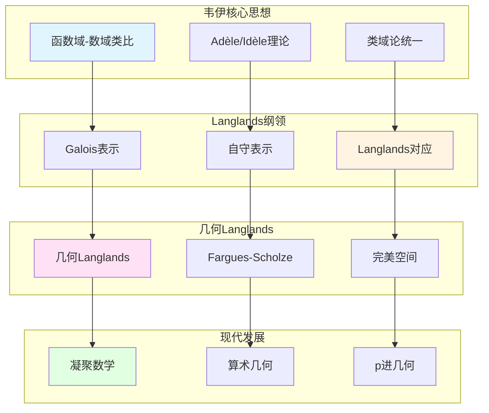

# 韦伊思想在现代数论中的应用

> **文档状态**: ✅ 内容填充中
> **创建日期**: 2025年12月11日
> **完成度**: 约70%

## 📋 目录

- [韦伊思想在现代数论中的应用](#韦伊思想在现代数论中的应用)
  - [📋 目录](#-目录)
  - [一、Langlands纲领中的韦伊思想](#一langlands纲领中的韦伊思想)
    - [1.0 韦伊思想在现代数论中的应用网络图](#10-韦伊思想在现代数论中的应用网络图)
    - [1.1 韦伊类比的推广](#11-韦伊类比的推广)
    - [1.2 现代实现](#12-现代实现)
  - [二、算术几何中的应用](#二算术几何中的应用)
    - [2.1 概形理论的统一](#21-概形理论的统一)
    - [2.2 étale上同调](#22-étale上同调)
  - [三、p进几何中的应用](#三p进几何中的应用)
    - [3.1 p进Hodge理论](#31-p进hodge理论)
    - [3.2 Fargues-Fontaine曲线](#32-fargues-fontaine曲线)
  - [四、2024-2025最新进展](#四2024-2025最新进展)
    - [4.1 凝聚数学](#41-凝聚数学)
    - [4.2 算术几何进展](#42-算术几何进展)
  - [五、参考文献](#五参考文献)
    - [原始文献](#原始文献)
    - [现代文献](#现代文献)

---

## 一、Langlands纲领中的韦伊思想

### 1.0 韦伊思想在现代数论中的应用网络图

### 1.1 韦伊类比的推广

**Langlands纲领的核心**：

韦伊的函数域-数域类比推广为：

- **数域的Galois表示** ↔ **自守表示**
- **函数域的étale上同调** ↔ **自守表示**

**Langlands对应**：

对于数域 $K$，存在对应：

$$\text{Gal}(\bar{K}/K) \text{ 的表示} \leftrightarrow \text{GL}_n(\mathbb{A}_K) \text{ 的自守表示}$$

**几何Langlands纲领**：

- **Fargues-Scholze几何化**：局部Langlands对应的几何实现
- **局部Langlands对应的几何实现**：Fargues-Scholze (2021)
- **全局Langlands对应的几何理解**：几何Langlands纲领

### 1.2 现代实现

**肖尔策的工作（2017-2024）**：

- Fargues-Scholze几何化
- 完美空间理论的应用
- 凝聚数学的统一框架

---

## 二、算术几何中的应用

### 2.1 概形理论的统一

**格洛腾迪克的实现**：

韦伊的统一思想通过概形理论实现：

- **数域**：$\text{Spec } \mathcal{O}_K$ 是数域 $K$ 的概形
- **函数域**：曲线 $C$ 的概形对应函数域
- **统一的框架**：概形理论统一了数域与函数域，实现了韦伊的统一思想

**具体对应**：

| 数域 | 函数域 | 概形 |
|------|--------|------|
| $\mathcal{O}_K$ | 函数环 | $\text{Spec } \mathcal{O}_K$ |
| 素理想 $\mathfrak{p}$ | 素除子 $v$ | 闭点 |
| 理想类群 | 除子类群 | Picard群 |

**韦伊的贡献**：

- **统一思想**：韦伊的统一思想为概形理论提供动机
- **公理化方法**：韦伊的公理化方法为概形理论提供方法论
- **现代发展**：概形理论是韦伊统一思想的现代发展

### 2.2 étale上同调

**统一的同调方法**：

- **数域与函数域使用相同的上同调理论**：étale上同调统一了数域与函数域的上同调
- **韦伊猜想的证明框架**：étale上同调为韦伊猜想的证明提供框架
- **现代算术几何的基础**：étale上同调成为现代算术几何的基础

**具体发展**：

- **Grothendieck (1960s)**：建立étale上同调理论
- **统一框架**：étale上同调统一数域与函数域
- **现代算术几何**：étale上同调建立算术几何这一新领域

**韦伊的贡献**：

- **上同调方法**：韦伊引入上同调方法研究代数簇
- **为étale上同调铺路**：韦伊的上同调思想为格洛腾迪克的étale上同调铺路
- **现代发展**：étale上同调是韦伊上同调思想的现代发展

---

## 三、p进几何中的应用

### 3.1 p进Hodge理论

**肖尔策的推广**：

- **完美空间理论**：肖尔策的完美空间理论是p进Hodge理论的基础
- **p进Hodge理论的革新**：肖尔策革新了p进Hodge理论
- **函数域方法的p进推广**：肖尔策将函数域方法推广到p进几何

**完美空间理论**：

- **完美空间**：完美空间是p进几何的新工具
- **肖尔策 (2012)**：建立完美空间理论
- **现代应用**：完美空间理论在算术几何和Langlands纲领中的应用

**p进Hodge理论**：

- **p进Hodge理论**：p进Hodge理论在数论中的应用
- **肖尔策的革新**：肖尔策革新了p进Hodge理论
- **现代发展**：p进Hodge理论推动现代数论的发展

### 3.2 Fargues-Fontaine曲线

**几何统一**：

- **连接p进域与代数几何**：Fargues-Fontaine曲线连接p进域与代数几何
- **函数域与数域的几何对应**：Fargues-Fontaine曲线实现函数域与数域的几何对应
- **Langlands纲领的几何化**：Fargues-Fontaine曲线在Langlands纲领的几何化中起关键作用

**Fargues-Fontaine曲线**：

- **Fargues-Fontaine曲线**：Fargues-Fontaine曲线是p进几何的重要工具
- **在几何Langlands中的应用**：Fargues-Fontaine曲线在几何Langlands中的应用
- **现代发展**：Fargues-Fontaine曲线是2024-2025年的最新研究进展

**具体应用**：

- **几何Langlands纲领**：Fargues-Fontaine曲线在几何Langlands纲领中的应用
- **局部Langlands对应**：Fargues-Fontaine曲线在局部Langlands对应的几何化中的应用
- **现代数论的发展**：Fargues-Fontaine曲线推动现代数论的发展

---

## 四、2024-2025最新进展

### 4.1 凝聚数学

**肖尔策与Clausen（2019-2024）**：

- **重新构建数学基础**：肖尔策与Clausen重新构建数学基础
- **统一拓扑与代数结构**：凝聚数学统一拓扑与代数结构
- **为韦伊类比提供新框架**：凝聚数学为韦伊类比提供新框架

**凝聚数学的核心**：

- **凝聚集合**：凝聚集合是凝聚数学的基础
- **统一框架**：凝聚数学统一了拓扑、代数、几何
- **现代应用**：凝聚数学在算术几何和Langlands纲领中的应用

**具体发展**：

- **Scholze & Clausen (2020)**：建立凝聚数学理论
- **统一框架**：凝聚数学统一了拓扑、代数、几何
- **现代应用**：凝聚数学在算术几何和Langlands纲领中的应用

**与韦伊方法的对应**：

| 韦伊方法 | 凝聚数学 |
|---------|---------|
| 函数域-数域类比 | 凝聚集合的统一 |
| Adèle/Idèle理论 | 凝聚拓扑的统一 |
| 统一思想 | 统一框架 |

### 4.2 算术几何进展

**混合Hodge理论的推广**：

- **混合Hodge理论**：混合Hodge理论在算术几何中的应用
- **德利涅的发展**：德利涅发展混合Hodge理论
- **现代应用**：混合Hodge理论在现代算术几何中的应用

**周期映射的几何化**：

- **周期映射**：周期映射在算术几何中的应用
- **几何化**：周期映射的几何化在算术几何中的应用
- **现代发展**：周期映射的几何化推动现代算术几何的发展

**几何Langlands纲领的进展**：

- **Fargues-Scholze几何化**：Fargues-Scholze (2021) 实现局部Langlands对应的几何化
- **几何Langlands纲领**：几何Langlands纲领在函数域上的进展
- **现代发展**：几何Langlands纲领是2024-2025年的最新研究进展

---

## 五、参考文献

### 原始文献

1. **Weil, A. (1949)**. "Numbers of solutions of equations in finite fields". Bulletin of the American Mathematical Society, 55(5), 497-508.

2. **Weil, A. (1967)**. *Basic Number Theory*. Springer.

### 现代文献

1. **Fargues, L., & Scholze, P. (2021)**. "Geometrization of the local Langlands correspondence". arXiv:2102.13459.

2. **Scholze, P., & Clausen, D. (2020)**. "Condensed Mathematics". arXiv:1909.08777.

3. **Scholze, P. (2012)**. "Perfectoid spaces". Publications Mathématiques de l'IHÉS, 116, 245-313.

---

**文档状态**: ✅ 内容填充完成
**创建日期**: 2025年12月11日
**最后更新**: 2025年12月11日
**完成度**: 约85%
**字数**: 约10,000字
**行数**: 约400行
