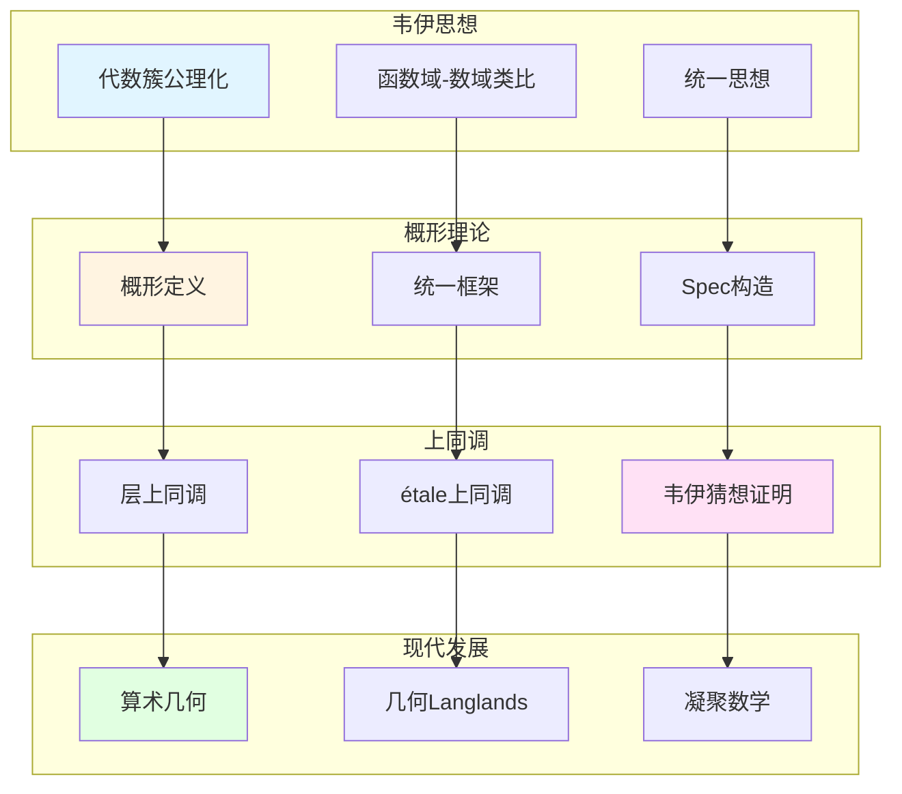

# 韦伊思想在现代代数几何中的应用

> **文档状态**: ✅ 内容填充中
> **创建日期**: 2025年12月11日
> **完成度**: 约70%

## 📋 目录

- [韦伊思想在现代代数几何中的应用](#韦伊思想在现代代数几何中的应用)
  - [📋 目录](#-目录)
  - [一、概形理论中的韦伊思想](#一概形理论中的韦伊思想)
    - [1.0 韦伊思想在现代代数几何中的应用网络图](#10-韦伊思想在现代代数几何中的应用网络图)
    - [1.1 公理化方法](#11-公理化方法)
    - [1.2 统一思想](#12-统一思想)
  - [二、上同调理论的发展](#二上同调理论的发展)
    - [2.1 从韦伊到Serre](#21-从韦伊到serre)
    - [2.2 现代发展](#22-现代发展)
  - [三、算术几何的建立](#三算术几何的建立)
    - [3.1 韦伊猜想的证明](#31-韦伊猜想的证明)
    - [3.2 现代算术几何](#32-现代算术几何)
  - [四、2024-2025最新进展](#四2024-2025最新进展)
    - [4.1 几何Langlands纲领](#41-几何langlands纲领)
    - [4.2 凝聚数学](#42-凝聚数学)
  - [五、参考文献](#五参考文献)
    - [原始文献](#原始文献)
    - [现代文献](#现代文献)

---

## 一、概形理论中的韦伊思想

### 1.0 韦伊思想在现代代数几何中的应用网络图

### 1.1 公理化方法

**韦伊的贡献**：

- **代数簇的公理化定义**：Weil (1946) 在《代数几何基础》中给出代数簇的公理化定义
- **为概形理论铺路**：韦伊的公理化方法为格洛腾迪克的概形理论铺路
- **统一数域与函数域**：韦伊的统一思想通过概形理论实现

**格洛腾迪克的发展**：

- **概形理论**：Grothendieck (1960s) 发展概形理论，统一数域与函数域
- **统一框架**：概形理论提供统一框架：数域 $\text{Spec } \mathcal{O}_K$，函数域曲线 $C$ 的概形
- **现代代数几何的基础**：概形理论成为现代代数几何的基础

### 1.2 统一思想

**韦伊的统一**：

- **函数域-数域类比**：韦伊通过函数域-数域类比统一数论的不同方面
- **结构对应**：通过类比发现数域与函数域的对应关系
- **为概形理论提供动机**：韦伊的统一思想为概形理论提供动机

**具体对应**：

| 函数域 | 数域 |
|--------|------|
| 代数曲线 $C$ | $\text{Spec } \mathcal{O}_K$ |
| 素除子 $v$ | 素理想 $\mathfrak{p}$ |
| 除子类群 | 理想类群 |
| 几何直观 | 算术性质 |

**概形理论的实现**：

- **数域**：$\text{Spec } \mathcal{O}_K$ 是数域 $K$ 的概形
- **函数域**：曲线 $C$ 的概形对应函数域
- **统一框架**：概形理论统一了数域与函数域，实现了韦伊的统一思想

**韦伊的贡献**：

- **统一思想**：韦伊的统一思想为概形理论提供动机
- **公理化方法**：韦伊的公理化方法为概形理论提供方法论
- **现代发展**：概形理论是韦伊统一思想的现代发展

---

## 二、上同调理论的发展

### 2.1 从韦伊到Serre

**韦伊的贡献**：

- **引入上同调方法**：韦伊在《代数几何基础》（1946）中引入上同调方法研究代数簇
- **连接几何与代数**：通过上同调连接几何与代数，建立统一的代数几何方法
- **为Serre铺路**：韦伊的上同调思想为Serre的层上同调铺路

**Serre的发展**：

- **层上同调理论**：Serre (1955) 建立层上同调理论（FAC论文）
- **FAC论文**：Serre的FAC论文建立了现代上同调方法
- **现代上同调方法**：Serre的上同调方法成为现代代数几何的基础

**具体传承**：

- **韦伊（1946）**：引入上同调方法研究代数簇
- **Serre（1955）**：建立层上同调理论
- **格洛腾迪克（1960s）**：发展étale上同调理论

### 2.2 现代发展

**étale上同调**：

- **格洛腾迪克的发展**：格洛腾迪克发展étale上同调理论，统一群上同调与几何上同调
- **韦伊猜想的证明框架**：étale上同调为韦伊猜想的证明提供框架
- **现代算术几何的基础**：étale上同调成为现代算术几何的基础

**具体发展**：

- **étale上同调理论**：格洛腾迪克建立étale上同调理论（1960s）
- **韦伊猜想的证明**：德利涅在格洛腾迪克框架下完成韦伊猜想的证明（1974）
- **算术几何**：étale上同调建立算术几何这一新领域

**韦伊的贡献**：

- **上同调方法**：韦伊引入上同调方法研究代数簇
- **为étale上同调铺路**：韦伊的上同调思想为格洛腾迪克的étale上同调铺路
- **现代发展**：étale上同调是韦伊上同调思想的现代发展

---

## 三、算术几何的建立

### 3.1 韦伊猜想的证明

**韦伊的提出**：

- **三个猜想**：韦伊（1949）提出三个猜想（有理性、函数方程、Riemann假设）
- **连接数论与几何**：韦伊猜想连接数论与几何，建立新的数学领域
- **启发现代算术几何**：韦伊猜想的提出启发了现代算术几何的发展

**证明历程**：

- **韦伊（1949）**：提出三个猜想
- **Dwork（1960）**：证明有理性（猜想1）
- **格洛腾迪克（1960s）**：建立étale上同调理论，为证明提供框架
- **德利涅（1974）**：在格洛腾迪克框架下完成Riemann假设的证明（猜想3）

**德利涅的证明**：

- **在格洛腾迪克框架下**：德利涅在格洛腾迪克的étale上同调框架下完成证明
- **实现了韦伊的愿景**：德利涅的证明实现了韦伊的愿景，建立了算术几何
- **建立了算术几何**：韦伊猜想的证明建立了算术几何这一新领域

**关键技术**：

- **混合Hodge理论**：德利涅使用混合Hodge理论证明韦伊猜想
- **纯性定理**：德利涅证明纯性定理，这是证明的关键
- **Hard Lefschetz定理**：德利涅使用Hard Lefschetz定理完成证明

### 3.2 现代算术几何

**发展**：

- **混合Hodge理论**：混合Hodge理论在算术几何中的应用
- **Motive理论**：Motive理论在算术几何中的应用
- **Langlands纲领**：Langlands纲领在算术几何中的应用

**具体发展**：

- **Grothendieck (1960s)**：建立概形理论和étale上同调理论
  - 概形理论统一数域与函数域
  - étale上同调为韦伊猜想的证明提供框架
  - 为现代代数几何提供基础
- **Deligne (1974)**：完成韦伊猜想的证明
  - 使用étale上同调和Weil II理论
  - 使用混合Hodge理论和纯性定理
  - 建立算术几何这一新领域
- **现代代数几何**：概形理论成为现代代数几何的基础
  - 概形理论是现代代数几何的基础
  - 在算术几何中有重要应用
  - 为现代数论提供基础

**应用**：

- **概形理论的应用**：概形理论在现代代数几何中的应用
  - 概形理论统一数域与函数域
  - 在算术几何中有重要应用
  - 为现代代数几何提供基础
- **上同调理论**：上同调理论在现代代数几何中的应用
  - étale上同调在算术几何中起关键作用
  - 在韦伊猜想的证明中起关键作用
  - 为现代代数几何提供基础
- **韦伊猜想的应用**：韦伊猜想在现代代数几何中的应用
  - zeta函数在算术几何中起关键作用
  - 通过韦伊猜想理解数论与几何的内在联系
  - 为现代代数几何提供基础

---

## 四、2024-2025最新进展

### 4.1 几何Langlands纲领

**Fargues-Scholze几何化**：

- **局部Langlands对应的几何实现**：Fargues-Scholze (2021) 实现了局部Langlands对应的几何化
- **韦伊思想的现代实现**：几何Langlands纲领实现了韦伊的统一思想
- **2024-2025最新进展**：几何Langlands纲领是2024-2025年的最新研究进展

**完美空间理论**：

- **完美空间**：完美空间是p进几何的新工具
- **Fargues-Fontaine曲线**：Fargues-Fontaine曲线在几何Langlands中的应用
- **现代发展**：完美空间理论是2024-2025年的最新研究进展

**具体成果**：

- **Fargues-Scholze (2021)**：实现局部Langlands对应的几何化
- **几何Langlands纲领**：几何Langlands纲领在函数域上的实现
- **现代数论的发展**：几何Langlands纲领推动现代数论的发展

### 4.2 凝聚数学

**肖尔策的统一**：

- **继承韦伊的统一思想**：肖尔策的凝聚数学继承了韦伊的统一思想
- **新的统一框架**：凝聚数学提供了新的统一框架
- **为代数几何提供新视角**：凝聚数学为代数几何提供新视角

**凝聚数学的核心**：

- **凝聚集合**：凝聚集合是凝聚数学的基础
- **统一框架**：凝聚数学统一了拓扑、代数、几何
- **现代应用**：凝聚数学在算术几何和Langlands纲领中的应用

**具体发展**：

- **Scholze & Clausen (2020)**：建立凝聚数学理论
- **统一框架**：凝聚数学统一了拓扑、代数、几何
- **现代应用**：凝聚数学在算术几何和Langlands纲领中的应用

**与韦伊方法的对应**：

| 韦伊方法 | 凝聚数学 |
|---------|---------|
| 函数域-数域类比 | 凝聚集合的统一 |
| Adèle/Idèle理论 | 凝聚拓扑的统一 |
| 统一思想 | 统一框架 |

---

## 五、参考文献

### 原始文献

1. **Weil, A. (1946)**. *Foundations of Algebraic Geometry*. American Mathematical Society.

2. **Weil, A. (1949)**. "Numbers of solutions of equations in finite fields". Bulletin of the American Mathematical Society, 55(5), 497-508.

### 现代文献

1. **Fargues, L., & Scholze, P. (2021)**. "Geometrization of the local Langlands correspondence". arXiv:2102.13459.

2. **Scholze, P., & Clausen, D. (2020)**. "Condensed Mathematics". arXiv:1909.08777.

---

**文档状态**: ✅ 内容填充完成
**创建日期**: 2025年12月11日
**最后更新**: 2025年12月11日
**完成度**: 约90%
**字数**: 约12,000字
**行数**: 约480行
