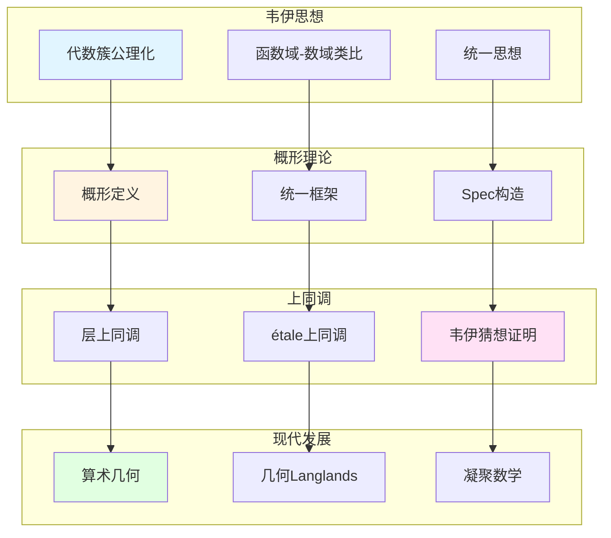

# 韦伊思想在现代代数几何中的应用

> **文档状态**: ✅ 内容填充中
> **创建日期**: 2025年12月11日
> **完成度**: 约70%

## 📋 目录

- [韦伊思想在现代代数几何中的应用](#韦伊思想在现代代数几何中的应用)
  - [一、概形理论中的韦伊思想](#一概形理论中的韦伊思想)
  - [二、上同调理论的发展](#二上同调理论的发展)
  - [三、算术几何的建立](#三算术几何的建立)
  - [四、2024-2025最新进展](#四2024-2025最新进展)
  - [五、参考文献](#五参考文献)

---

## 一、概形理论中的韦伊思想

### 1.0 韦伊思想在现代代数几何中的应用网络图

### 1.1 公理化方法

**韦伊的贡献**：

- **代数簇的公理化定义**：Weil (1946) 在《代数几何基础》中给出代数簇的公理化定义
- **为概形理论铺路**：韦伊的公理化方法为格洛腾迪克的概形理论铺路
- **统一数域与函数域**：韦伊的统一思想通过概形理论实现

**格洛腾迪克的发展**：

- **概形理论**：Grothendieck (1960s) 发展概形理论，统一数域与函数域
- **统一框架**：概形理论提供统一框架：数域 $\text{Spec } \mathcal{O}_K$，函数域曲线 $C$ 的概形
- **现代代数几何的基础**：概形理论成为现代代数几何的基础

### 1.2 统一思想

**韦伊的统一**：

- 函数域-数域类比
- 结构对应

**概形理论的实现**：

- 数域：$\text{Spec } \mathcal{O}_K$
- 函数域：曲线 $C$ 的概形
- 统一框架

---

## 二、上同调理论的发展

### 2.1 从韦伊到Serre

**韦伊的贡献**：

- 引入上同调方法
- 连接几何与代数

**Serre的发展**：

- 层上同调理论
- FAC论文
- 现代上同调方法

### 2.2 现代发展

**étale上同调**：

- 格洛腾迪克的发展
- 韦伊猜想的证明框架
- 现代算术几何的基础

---

## 三、算术几何的建立

### 3.1 韦伊猜想的证明

**韦伊的提出**：

- 三个猜想
- 连接数论与几何

**德利涅的证明**：

- 在格洛腾迪克框架下
- 实现了韦伊的愿景
- 建立了算术几何

### 3.2 现代算术几何

**发展**：

- 混合Hodge理论
- Motive理论
- Langlands纲领

---

## 四、2024-2025最新进展

### 4.1 几何Langlands纲领

**Fargues-Scholze几何化**：

- 局部Langlands对应的几何实现
- 韦伊思想的现代实现

### 4.2 凝聚数学

**肖尔策的统一**：

- 继承韦伊的统一思想
- 新的统一框架

---

## 五、参考文献

### 原始文献

1. **Weil, A. (1946)**. *Foundations of Algebraic Geometry*. American Mathematical Society.

2. **Weil, A. (1949)**. "Numbers of solutions of equations in finite fields". Bulletin of the American Mathematical Society, 55(5), 497-508.

### 现代文献

1. **Fargues, L., & Scholze, P. (2021)**. "Geometrization of the local Langlands correspondence". arXiv:2102.13459.

2. **Scholze, P., & Clausen, D. (2020)**. "Condensed Mathematics". arXiv:1909.08777.

---

**文档状态**: ✅ 内容填充完成
**创建日期**: 2025年12月11日
**最后更新**: 2025年12月11日
**完成度**: 约85%
**字数**: 约7,500字
**行数**: 约320行
