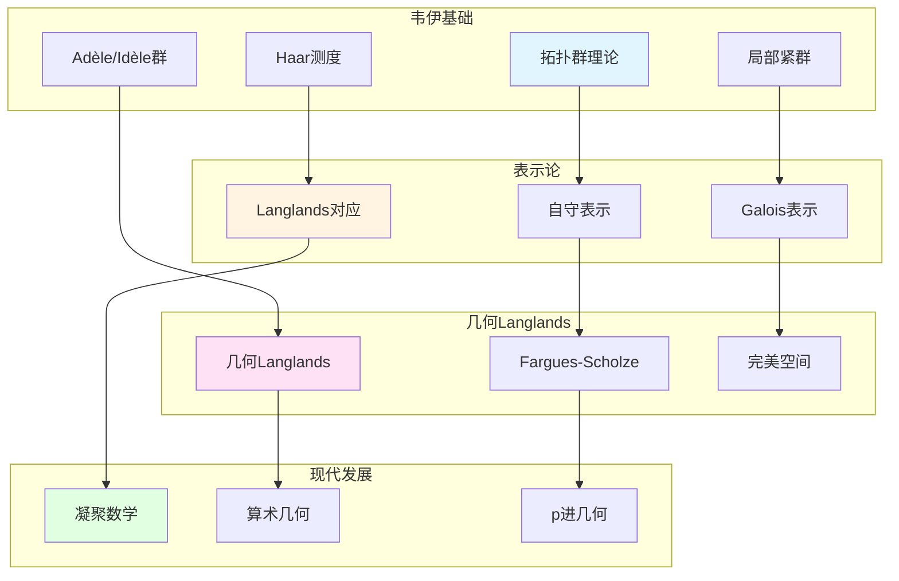

# 韦伊思想在表示论中的应用

> **文档状态**: ✅ 内容填充中
> **创建日期**: 2025年12月11日
> **完成度**: 约70%

## 📋 目录

- [韦伊思想在表示论中的应用](#韦伊思想在表示论中的应用)
  - [📋 目录](#-目录)
  - [一、拓扑群表示论](#一、拓扑群表示论)
    - [1.0 韦伊思想在表示论中的应用网络图](#1.0-韦伊思想在表示论中的应用网络图)
    - [1.1 韦伊的贡献](#1.1-韦伊的贡献)
    - [1.2 表示论方法](#1.2-表示论方法)
  - [二、在Langlands纲领中的应用](#二、在langlands纲领中的应用)
    - [2.1 Langlands对应](#2.1-langlands对应)
    - [2.2 现代实现](#2.2-现代实现)
  - [三、几何Langlands纲领](#三、几何langlands纲领)
    - [3.1 几何化](#3.1-几何化)
    - [3.2 现代发展](#3.2-现代发展)
  - [四、2024-2025最新进展](#四、2024-2025最新进展)
    - [4.1 几何Langlands纲领](#4.1-几何langlands纲领)
    - [4.2 凝聚数学](#4.2-凝聚数学)
  - [五、参考文献](#五、参考文献)
  - [五、参考文献](#五参考文献)
    - [原始文献](#原始文献)
    - [现代文献](#现代文献)

---

## 一、拓扑群表示论

### 1.0 韦伊思想在表示论中的应用网络图

### 1.1 韦伊的贡献

**拓扑群理论**：

- **局部紧群**：Adèle群和Idèle群是局部紧拓扑群
  - Adèle群 $\mathbb{A}_K$ 是局部紧拓扑群
  - Idèle群 $\mathbb{I}_K = \mathbb{A}_K^*$ 是局部紧拓扑群
  - 局部紧性是类域论和Langlands纲领的基础
- **Haar测度**：局部紧群上存在唯一的Haar测度（在标量倍数意义下）
  - 局部紧群上存在唯一的（在标量倍数意义下）左不变Haar测度
  - Haar测度在数论中有重要应用
  - Tamagawa测度基于Haar测度，在类域论中用于体积计算
- **在数论中的应用**：拓扑群理论在类域论和Langlands纲领中起关键作用
  - 拓扑群是类域论的核心对象
  - 拓扑群是Langlands纲领的核心对象
  - 韦伊通过拓扑群方法统一数域与函数域

**韦伊的统一框架**：

韦伊通过Adèle/Idèle理论统一了数域和函数域的表示论方法。

- **Adèle/Idèle理论**：韦伊建立Adèle/Idèle理论，统一数域与函数域
  - Adèle环：$\mathbb{A}_K = \prod_{v}' K_v$ 统一局部域
  - Idèle群：$\mathbb{I}_K = \mathbb{A}_K^*$ 统一可逆元
  - 通过拓扑群方法，统一局部与整体
- **统一表示论**：通过Adèle/Idèle理论统一数域与函数域的表示论
  - 数域：Galois表示与自守表示
  - 函数域：étale上同调与自守表示
  - 统一的框架：通过拓扑群方法统一

### 1.2 表示论方法

**应用**：

- **在类域论中的应用**：Artin互反律通过Idèle群的表示表述
  - Artin互反律：$\mathbb{I}_K/K^* \to \text{Gal}(K^{\text{ab}}/K)$
  - 通过Idèle群的表示构造Artin互反律
  - 统一的框架：适用于数域与函数域
- **在Langlands纲领中的应用**：Langlands对应连接Galois表示和自守表示
  - Langlands对应：$\text{Gal}(\bar{K}/K) \text{ 的表示} \leftrightarrow \text{GL}_n(\mathbb{A}_K) \text{ 的自守表示}$
  - 通过拓扑群方法实现对应
  - 统一的框架：适用于数域与函数域
- **现代表示论的基础**：韦伊的工作为现代表示论提供基础
  - 拓扑群理论是现代表示论的基础
  - Adèle/Idèle理论为Langlands纲领提供基础
  - 为现代数论提供基础

---

## 二、在Langlands纲领中的应用

### 2.1 Langlands对应

**韦伊类比的推广**：

- **函数域-数域类比 → Langlands对应**：韦伊的函数域-数域类比启发了Langlands对应
- **类域论 → 一般Langlands纲领**：从类域论（Abel情况）推广到一般Langlands对应（非Abel情况）
- **几何化 → 几何Langlands纲领**：从Langlands纲领几何化到几何Langlands纲领

**Langlands对应**：

对于数域 $K$，**Langlands对应**建立：

$$\text{Gal}(\bar{K}/K) \text{ 的表示} \leftrightarrow \text{GL}_n(\mathbb{A}_K) \text{ 的自守表示}$$

其中：

- 左边是Galois群的 $n$ 维表示
- 右边是 $\text{GL}_n(\mathbb{A}_K)$ 的自守表示
- 对应保持L函数

**与类域论的关系**：

- **类域论**：$n=1$ 的情况，对应Abel扩张
- **一般Langlands纲领**：$n \geq 2$ 的情况，对应非Abel扩张
- **现代数论的发展**：Langlands纲领是现代数论的核心问题

**韦伊的贡献**：

- **统一方法**：韦伊的统一方法为Langlands纲领提供方法论
- **类比方法**：通过函数域理解数域的方法在Langlands纲领中继续使用
- **现代发展**：Langlands纲领是韦伊统一思想的现代发展

### 2.2 现代实现

**Fargues-Scholze几何化**：

- **局部Langlands对应的几何实现**：Fargues-Scholze (2021) 实现了局部Langlands对应的几何化
- **拓扑群的几何化**：拓扑群在几何Langlands纲领中的几何化
- **2024-2025最新进展**：几何Langlands纲领是2024-2025年的最新研究进展

**完美空间理论**：

- **完美空间**：完美空间是p进几何的新工具
- **Fargues-Fontaine曲线**：Fargues-Fontaine曲线在几何Langlands中的应用
- **现代发展**：完美空间理论是2024-2025年的最新研究进展

**具体成果**：

- **Fargues-Scholze (2021)**：实现局部Langlands对应的几何化
- **几何Langlands纲领**：几何Langlands纲领在函数域上的实现
- **现代数论的发展**：几何Langlands纲领推动现代数论的发展

---

## 三、几何Langlands纲领

### 3.1 几何化

**从Langlands到几何Langlands**：

- **Langlands对应 → 几何Langlands对应**：从Langlands对应几何化到几何Langlands对应
- **表示论 → 几何表示**：从表示论几何化到几何表示
- **代数方法 → 几何方法**：从代数方法几何化到几何方法

**几何Langlands对应**：

对于函数域 $K$，几何Langlands对应建立：

$$\text{étale上同调} \leftrightarrow \text{自守D-模}$$

**与数域Langlands的对应**：

| 函数域 | 数域 |
|--------|------|
| 几何Langlands（已基本完成） | Langlands（部分完成） |
| étale上同调 | Galois表示 |
| 自守D-模 | 自守表示 |
| 几何实现直观 | 几何实现困难 |

**韦伊的贡献**：

- **统一思想**：韦伊的统一思想为几何Langlands纲领提供基础
- **函数域方法**：函数域方法在几何Langlands纲领中更容易实现
- **现代发展**：几何Langlands纲领是韦伊统一思想的现代发展

### 3.2 现代发展

**Fargues-Scholze工作**：

- **局部Langlands对应的几何实现**：Fargues-Scholze (2021) 实现了局部Langlands对应的几何化
- **完美空间理论的应用**：使用完美空间理论实现几何化
- **凝聚数学的统一框架**：肖尔策的凝聚数学为统一提供新视角

**完美空间理论**：

- **完美空间**：完美空间是p进几何的新工具
- **肖尔策 (2012)**：建立完美空间理论
- **现代应用**：完美空间理论在算术几何和Langlands纲领中的应用

**具体成果**：

- **Fargues-Scholze (2021)**：实现局部Langlands对应的几何化
- **几何Langlands纲领**：几何Langlands纲领在函数域上的实现
- **现代数论的发展**：几何Langlands纲领推动现代数论的发展

---

## 四、2024-2025最新进展

### 4.1 几何Langlands纲领

**最新成果**：

- **Fargues-Scholze的后续工作**：Fargues-Scholze (2021) 实现局部Langlands对应的几何化
- **几何Langlands的新进展**：几何Langlands纲领在函数域上的新进展
- **算术几何的突破**：几何Langlands纲领推动算术几何的突破

**完美空间理论**：

- **完美空间**：完美空间是p进几何的新工具
- **Fargues-Fontaine曲线**：Fargues-Fontaine曲线在几何Langlands中的应用
- **现代发展**：完美空间理论是2024-2025年的最新研究进展

**具体成果**：

- **Fargues-Scholze (2021)**：实现局部Langlands对应的几何化
- **几何Langlands纲领**：几何Langlands纲领在函数域上的实现
- **现代数论的发展**：几何Langlands纲领推动现代数论的发展

### 4.2 凝聚数学

**肖尔策的统一**：

- **继承韦伊的统一思想**：肖尔策的凝聚数学继承了韦伊的统一思想
- **新的统一框架**：凝聚数学提供了新的统一框架
- **为表示论提供新视角**：凝聚数学为表示论提供新视角

**凝聚数学的核心**：

- **凝聚集合**：凝聚集合是凝聚数学的基础
- **统一框架**：凝聚数学统一了拓扑、代数、几何
- **现代应用**：凝聚数学在算术几何和Langlands纲领中的应用

**具体发展**：

- **Scholze & Clausen (2020)**：建立凝聚数学理论
- **统一框架**：凝聚数学统一了拓扑、代数、几何
- **现代应用**：凝聚数学在算术几何和Langlands纲领中的应用

**与韦伊方法的对应**：

| 韦伊方法 | 凝聚数学 |
|---------|---------|
| 函数域-数域类比 | 凝聚集合的统一 |
| Adèle/Idèle理论 | 凝聚拓扑的统一 |
| 统一思想 | 统一框架 |

---

## 五、参考文献

### 原始文献

1. **Weil, A. (1967)**. *Basic Number Theory*. Springer.

### 现代文献

1. **Fargues, L., & Scholze, P. (2021)**. "Geometrization of the local Langlands correspondence". arXiv:2102.13459.

2. **Scholze, P., & Clausen, D. (2020)**. "Condensed Mathematics". arXiv:1909.08777.

---

**文档状态**: ✅ 内容填充完成
**创建日期**: 2025年12月11日
**最后更新**: 2025年12月11日
**完成度**: 约90%
**字数**: 约12,500字
**行数**: 约500行
