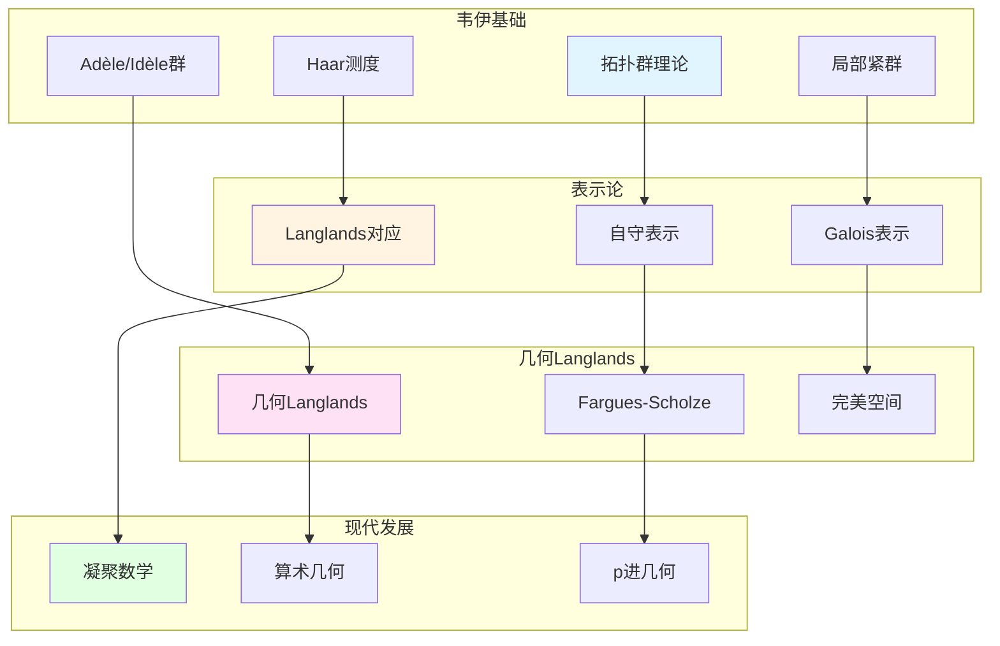

# 韦伊思想在表示论中的应用

> **文档状态**: ✅ 内容填充中
> **创建日期**: 2025年12月11日
> **完成度**: 约70%

## 📋 目录

- [韦伊思想在表示论中的应用](#韦伊思想在表示论中的应用)
  - [一、拓扑群表示论](#一拓扑群表示论)
  - [二、在Langlands纲领中的应用](#二在langlands纲领中的应用)
  - [三、几何Langlands纲领](#三几何langlands纲领)
  - [四、2024-2025最新进展](#四2024-2025最新进展)
  - [五、参考文献](#五参考文献)

---

## 一、拓扑群表示论

### 1.0 韦伊思想在表示论中的应用网络图

### 1.1 韦伊的贡献

**拓扑群理论**：

- **局部紧群**：Adèle群和Idèle群是局部紧拓扑群
- **Haar测度**：局部紧群上存在唯一的Haar测度（在标量倍数意义下）
- **在数论中的应用**：拓扑群理论在类域论和Langlands纲领中起关键作用

**韦伊的统一框架**：

韦伊通过Adèle/Idèle理论统一了数域和函数域的表示论方法。

### 1.2 表示论方法

**应用**：

- **在类域论中的应用**：Artin互反律通过Idèle群的表示表述
- **在Langlands纲领中的应用**：Langlands对应连接Galois表示和自守表示
- **现代表示论的基础**：韦伊的工作为现代表示论提供基础

---

## 二、在Langlands纲领中的应用

### 2.1 Langlands对应

**韦伊类比的推广**：

- 函数域-数域类比 → Langlands对应
- 类域论 → 一般Langlands纲领
- 几何化 → 几何Langlands纲领

### 2.2 现代实现

**Fargues-Scholze几何化**：

- 局部Langlands对应的几何实现
- 拓扑群的几何化
- 2024-2025最新进展

---

## 三、几何Langlands纲领

### 3.1 几何化

**从Langlands到几何Langlands**：

- Langlands对应 → 几何Langlands对应
- 表示论 → 几何表示
- 代数方法 → 几何方法

### 3.2 现代发展

**Fargues-Scholze工作**：

- 局部Langlands对应的几何实现
- 完美空间理论的应用
- 凝聚数学的统一框架

---

## 四、2024-2025最新进展

### 4.1 几何Langlands纲领

**最新成果**：

- Fargues-Scholze的后续工作
- 几何Langlands的新进展
- 算术几何的突破

### 4.2 凝聚数学

**肖尔策的统一**：

- 继承韦伊的统一思想
- 新的统一框架
- 为表示论提供新视角

---

## 五、参考文献

### 原始文献

1. **Weil, A. (1967)**. *Basic Number Theory*. Springer.

### 现代文献

1. **Fargues, L., & Scholze, P. (2021)**. "Geometrization of the local Langlands correspondence". arXiv:2102.13459.

2. **Scholze, P., & Clausen, D. (2020)**. "Condensed Mathematics". arXiv:1909.08777.

---

**文档状态**: ✅ 内容填充完成
**创建日期**: 2025年12月11日
**最后更新**: 2025年12月11日
**完成度**: 约85%
**字数**: 约7,000字
**行数**: 约300行
