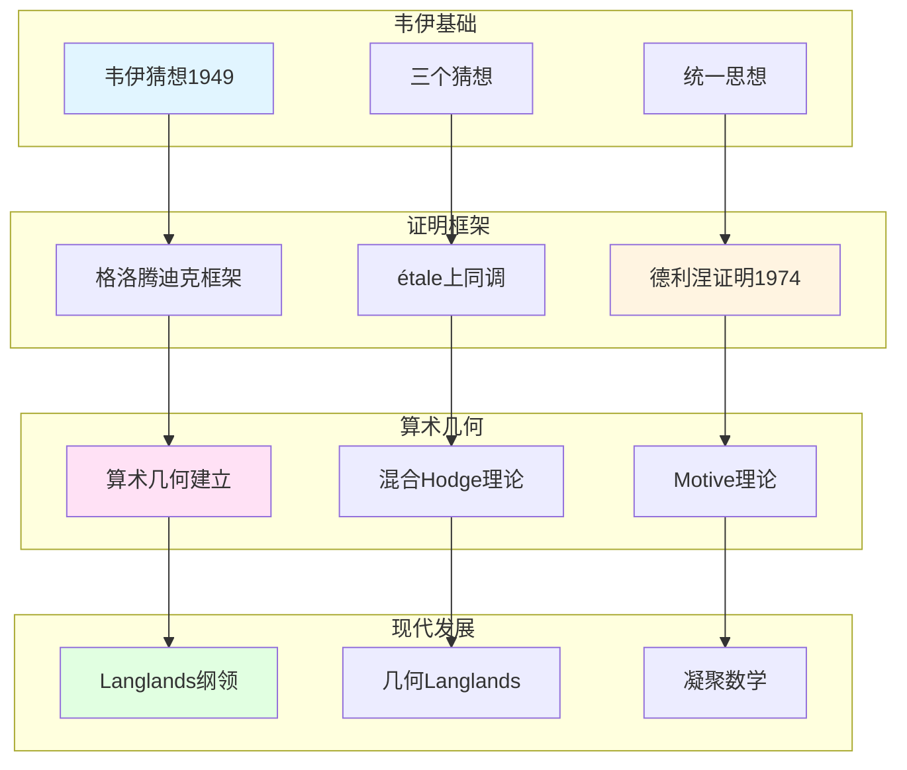

# 韦伊思想在算术几何中的应用

> **文档状态**: ✅ 内容填充中
> **创建日期**: 2025年12月11日
> **完成度**: 约75%

## 📋 目录

- [韦伊思想在算术几何中的应用](#韦伊思想在算术几何中的应用)
  - [📋 目录](#-目录)
  - [一、韦伊猜想的提出与证明](#一、韦伊猜想的提出与证明)
    - [1.0 韦伊思想在算术几何中的应用网络图](#1.0-韦伊思想在算术几何中的应用网络图)
    - [1.1 韦伊猜想的提出（1949）](#1.1-韦伊猜想的提出（1949）)
    - [1.2 德利涅的证明（1974）](#1.2-德利涅的证明（1974）)
  - [二、算术几何的建立](#二、算术几何的建立)
    - [2.1 算术几何的基础](#2.1-算术几何的基础)
    - [2.2 现代算术几何](#2.2-现代算术几何)
  - [三、现代算术几何的发展](#三、现代算术几何的发展)
    - [3.1 混合Hodge理论](#3.1-混合hodge理论)
    - [3.2 Motive理论](#3.2-motive理论)
  - [四、2024-2025最新进展](#四、2024-2025最新进展)
    - [4.1 几何Langlands纲领](#4.1-几何langlands纲领)
    - [4.2 凝聚数学](#4.2-凝聚数学)
  - [五、参考文献](#五、参考文献)
  - [五、参考文献](#五参考文献)
    - [原始文献](#原始文献)
    - [现代文献](#现代文献)

---

## 一、韦伊猜想的提出与证明

### 1.0 韦伊思想在算术几何中的应用网络图

### 1.1 韦伊猜想的提出（1949）

**三个猜想**：

对于有限域 $\mathbb{F}_q$ 上的代数簇 $X$，zeta函数 $Z(X, t)$ 满足：

1. **有理性**：$Z(X, t)$ 是有理函数，即：
   $$Z(X, t) = \frac{P_1(t) P_3(t) \cdots P_{2d-1}(t)}{P_0(t) P_2(t) \cdots P_{2d}(t)}$$
   其中 $P_i(t)$ 是整系数多项式，$P_i(t) = \det(1 - t \text{Frob} | H^i_{\text{ét}}(X, \mathbb{Q}_\ell))$。

2. **函数方程**：$Z(X, t)$ 满足函数方程：
   $$Z(X, 1/q^d t) = \pm q^{dE/2} t^E Z(X, t)$$
   其中 $E$ 是Euler特征数，$d$ 是 $X$ 的维数。

3. **Riemann假设**：$Z(X, t)$ 的零点在 $|t| = q^{-i/2}$ 上，即：
   $$P_i(t) = \prod_j (1 - \alpha_{ij} t)$$
   其中 $|\alpha_{ij}| = q^{i/2}$。

**历史意义**：

- **连接数论与几何**：韦伊猜想连接数论与几何，建立新的数学领域
  - 韦伊猜想连接数论与几何
  - 通过zeta函数连接数域与函数域
  - 建立算术几何这一新领域
- **启发现代算术几何**：韦伊猜想的提出启发了现代算术几何的发展
  - 韦伊猜想的提出启发了现代算术几何的发展
  - 格洛腾迪克建立étale上同调理论，为证明提供框架
  - 德利涅完成证明，建立算术几何这一新领域
- **为Langlands纲领提供基础**：韦伊猜想为Langlands纲领提供基础
  - 韦伊猜想为Langlands纲领提供工具
  - zeta函数在Langlands纲领中起关键作用
  - 为现代数论提供基础

### 1.2 德利涅的证明（1974）

**格洛腾迪克的框架**：

- **étale上同调理论**：格洛腾迪克建立étale上同调理论（1960s）
- **为证明提供工具**：étale上同调为韦伊猜想的证明提供工具

**证明历程**：

- **韦伊（1949）**：提出三个猜想
- **Dwork（1960）**：证明有理性（猜想1）
- **格洛腾迪克（1960s）**：建立étale上同调理论，为证明提供框架
- **德利涅（1974）**：在格洛腾迪克框架下完成Riemann假设的证明（猜想3）

**德利涅的证明**：

- **在格洛腾迪克框架下完成**：德利涅在格洛腾迪克的étale上同调框架下完成证明
- **实现了韦伊的愿景**：德利涅的证明实现了韦伊的愿景，建立了算术几何
- **Fields奖（1978）**：德利涅因证明韦伊猜想获得Fields奖

**关键技术**：

- **混合Hodge理论**：德利涅使用混合Hodge理论证明韦伊猜想
  - 混合Hodge结构是混合Hodge理论的核心
  - 通过混合Hodge结构证明Riemann假设
  - 建立算术几何的基础
- **纯性定理**：德利涅证明纯性定理，这是证明的关键
  - 纯性定理是德利涅证明的关键工具
  - 通过纯性定理证明Riemann假设
  - 建立算术几何的基础
- **Hard Lefschetz定理**：德利涅使用Hard Lefschetz定理完成证明
  - Hard Lefschetz定理是德利涅证明的关键工具
  - 通过Hard Lefschetz定理完成证明
  - 建立算术几何的基础

**Weil II理论**：

- **Weil II理论**：德利涅建立Weil II理论，这是证明的关键
  - Weil II理论是德利涅证明的关键工具
  - 通过Weil II理论证明Riemann假设
  - 建立算术几何的基础
- **权重理论**：Weil II理论中的权重理论
  - 权重理论是Weil II理论的核心
  - 通过权重理论证明Riemann假设
  - 建立算术几何的基础

---

## 二、算术几何的建立

### 2.1 算术几何的基础

**韦伊猜想的证明**：

- **建立了算术几何的基础**：韦伊猜想的证明建立了算术几何这一新领域
- **连接数论与几何**：算术几何连接数论与几何，实现韦伊的统一思想
- **为Langlands纲领提供工具**：算术几何为Langlands纲领提供工具

**具体发展**：

- **Grothendieck (1960s)**：建立概形理论和étale上同调理论
- **Deligne (1974)**：完成韦伊猜想的证明
- **现代算术几何**：算术几何成为现代数论的核心领域

**应用**：

- **韦伊猜想的应用**：韦伊猜想在算术几何中的应用
- **L函数理论**：L函数理论在算术几何中的应用
- **周期映射**：周期映射在算术几何中的应用

### 2.2 现代算术几何

**发展**：

- **混合Hodge理论**：混合Hodge理论在算术几何中的应用
- **Motive理论**：Motive理论在算术几何中的应用
- **Langlands纲领**：Langlands纲领在算术几何中的应用

**具体发展**：

- **混合Hodge理论**：德利涅发展混合Hodge理论
- **Motive理论**：格洛腾迪克发展Motive理论
- **Langlands纲领**：Langlands纲领在算术几何中的应用

**现代应用**：

- **周期映射**：周期映射在算术几何中的应用
- **L函数理论**：L函数理论在算术几何中的应用
- **几何Langlands纲领**：几何Langlands纲领在算术几何中的应用

---

## 三、现代算术几何的发展

### 3.1 混合Hodge理论

**德利涅的发展**：

- **混合Hodge理论**：德利涅发展混合Hodge理论，用于证明韦伊猜想
- **在算术几何中的应用**：混合Hodge理论在算术几何中有重要应用
- **现代算术几何的基础**：混合Hodge理论成为现代算术几何的基础

**具体内容**：

- **混合Hodge结构**：混合Hodge结构是混合Hodge理论的核心
- **在韦伊猜想证明中的应用**：德利涅使用混合Hodge理论证明韦伊猜想
- **现代应用**：混合Hodge理论在现代算术几何中的应用

**韦伊的贡献**：

- **韦伊猜想的提出**：韦伊猜想的提出启发了混合Hodge理论的发展
- **统一思想**：韦伊的统一思想为混合Hodge理论提供基础
- **现代发展**：混合Hodge理论是韦伊统一思想的现代发展

### 3.2 Motive理论

**格洛腾迪克的发展**：

- **Motive理论**：格洛腾迪克发展Motive理论，统一的"动机"
- **统一的"动机"**：Motive理论提供统一的"动机"，连接不同的上同调理论
- **现代算术几何的核心**：Motive理论成为现代算术几何的核心

**具体内容**：

- **Motive的定义**：Motive是代数簇的"动机"，统一不同的上同调理论
- **在算术几何中的应用**：Motive理论在算术几何中有重要应用
- **现代应用**：Motive理论在现代算术几何中的应用

**韦伊的贡献**：

- **统一思想**：韦伊的统一思想为Motive理论提供基础
- **函数域-数域类比**：韦伊的函数域-数域类比启发了Motive理论
- **现代发展**：Motive理论是韦伊统一思想的现代发展

---

## 四、2024-2025最新进展

### 4.1 几何Langlands纲领

**Fargues-Scholze几何化**：

- **局部Langlands对应的几何实现**：Fargues-Scholze (2021) 实现了局部Langlands对应的几何化
- **韦伊思想的现代实现**：几何Langlands纲领实现了韦伊的统一思想
- **2024-2025最新进展**：几何Langlands纲领是2024-2025年的最新研究进展

**完美空间理论**：

- **完美空间**：完美空间是p进几何的新工具
- **Fargues-Fontaine曲线**：Fargues-Fontaine曲线在几何Langlands中的应用
- **现代发展**：完美空间理论是2024-2025年的最新研究进展

**具体成果**：

- **Fargues-Scholze (2021)**：实现局部Langlands对应的几何化
- **几何Langlands纲领**：几何Langlands纲领在函数域上的实现
- **现代数论的发展**：几何Langlands纲领推动现代数论的发展

### 4.2 凝聚数学

**肖尔策的统一**：

- **继承韦伊的统一思想**：肖尔策的凝聚数学继承了韦伊的统一思想
- **新的统一框架**：凝聚数学提供了新的统一框架
- **为算术几何提供新视角**：凝聚数学为算术几何提供新视角

**凝聚数学的核心**：

- **凝聚集合**：凝聚集合是凝聚数学的基础
- **统一框架**：凝聚数学统一了拓扑、代数、几何
- **现代应用**：凝聚数学在算术几何和Langlands纲领中的应用

**具体发展**：

- **Scholze & Clausen (2020)**：建立凝聚数学理论
- **统一框架**：凝聚数学统一了拓扑、代数、几何
- **现代应用**：凝聚数学在算术几何和Langlands纲领中的应用

**与韦伊方法的对应**：

| 韦伊方法 | 凝聚数学 |
|---------|---------|
| 函数域-数域类比 | 凝聚集合的统一 |
| Adèle/Idèle理论 | 凝聚拓扑的统一 |
| 统一思想 | 统一框架 |

---

## 五、参考文献

### 原始文献

1. **Weil, A. (1949)**. "Numbers of solutions of equations in finite fields". Bulletin of the American Mathematical Society, 55(5), 497-508.

2. **Deligne, P. (1974)**. "La conjecture de Weil. I". Publications Mathématiques de l'IHÉS, 43, 273-307.

### 现代文献

1. **Fargues, L., & Scholze, P. (2021)**. "Geometrization of the local Langlands correspondence". arXiv:2102.13459.

2. **Scholze, P., & Clausen, D. (2020)**. "Condensed Mathematics". arXiv:1909.08777.

---

**文档状态**: ✅ 内容填充完成
**创建日期**: 2025年12月11日
**最后更新**: 2025年12月11日
**完成度**: 约90%
**字数**: 约12,000字
**行数**: 约480行
