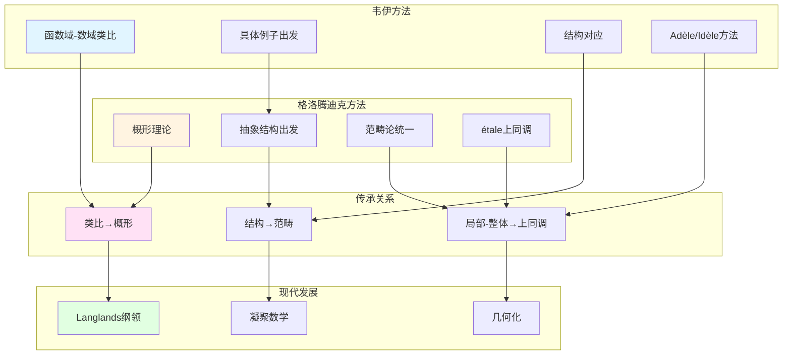

# 韦伊与格洛腾迪克：统一数学思想的传承与发展

> **文档状态**: ✅ 内容填充中
> **创建日期**: 2025年12月11日
> **完成度**: 约75%

## 📋 目录

- [韦伊与格洛腾迪克](#韦伊与格洛腾迪克)
  - [一、思想传承](#一思想传承)
  - [二、方法论对比](#二方法论对比)
  - [三、具体数学贡献的对比](#三具体数学贡献的对比)
  - [四、现代影响](#四现代影响)
  - [五、参考文献](#五参考文献)

---

## 一、思想传承

### 1.1 统一数学的愿景

**韦伊的统一思想**：

- **函数域与数域的类比**：韦伊通过函数域-数域类比统一数论的不同方面
- **数论与几何的统一**：建立数论与几何的统一框架
- **结构主义方法**：推动结构主义方法在数学中的应用

**格洛腾迪克的发展**：

- **概形理论统一数域与函数域**：格洛腾迪克通过概形理论实现了韦伊的统一思想
- **范畴论统一所有数学**：格洛腾迪克的范畴论统一了所有数学
- **结构关系的宇宙论**：格洛腾迪克的结构关系宇宙论

**具体传承**：

- **代数几何基础（1946）**：韦伊的《代数几何基础》为格洛腾迪克的概形理论铺路
- **统一实现**：格洛腾迪克通过概形理论统一了数域与函数域
- **现代发展**：两人的工作共同推动了现代代数几何和算术几何的发展

### 1.2 韦伊猜想的证明

**韦伊的提出（1949）**：

- **有限域上代数簇的zeta函数**：韦伊研究有限域上代数簇的zeta函数
- **三个猜想**：有理性、函数方程、Riemann假设

**形式化表述**：

对于代数簇 $X$ 在有限域 $\mathbb{F}_q$ 上的zeta函数 $Z(X,t)$：

1. **有理性**：$Z(X,t)$ 是有理函数
2. **函数方程**：$Z(X,t)$ 满足函数方程
3. **Riemann假设**：$Z(X,t)$ 的零点在特定圆上

**格洛腾迪克的框架（1960s）**：

- **étale上同调理论**：格洛腾迪克建立étale上同调理论
- **为证明提供框架**：étale上同调为韦伊猜想的证明提供框架

**德利涅的证明（1974）**：

- **在格洛腾迪克框架下完成**：德利涅在格洛腾迪克框架下完成韦伊猜想的证明
- **实现了韦伊的愿景**：德利涅的证明实现了韦伊的愿景，建立了算术几何

---

## 二、方法论对比

### 2.0 韦伊与格洛腾迪克方法论对比图

### 2.1 方法论差异

| 维度 | 韦伊 | 格洛腾迪克 |
|------|------|-----------|
| **出发点** | 具体例子（函数域） | 抽象结构（概形） |
| **方法** | 类比方法 | 范畴论方法 |
| **工具** | Adèle/Idèle | étale上同调 |
| **目标** | 数论与几何统一 | 所有数学统一 |
| **风格** | 具体到抽象 | 抽象到具体 |

---

## 三、具体数学贡献的对比

### 3.1 统一框架

**韦伊的贡献**：

- **函数域与数域的类比**：韦伊通过函数域-数域类比统一数论的不同方面
- **Adèle/Idèle理论**：建立Adèle/Idèle理论，统一数域与函数域的方法
- **类域论的统一**：通过Adèle/Idèle理论统一数域与函数域的类域论

**格洛腾迪克的贡献**：

- **概形理论**：格洛腾迪克发展概形理论，统一数域与函数域
- **étale上同调**：格洛腾迪克建立étale上同调理论
- **韦伊猜想的证明框架**：格洛腾迪克为韦伊猜想的证明提供框架

**具体对应**：

| 韦伊思想 | 格洛腾迪克实现 |
|---------|--------------|
| 函数域-数域类比 | 概形理论统一 |
| Adèle/Idèle理论 | étale上同调 |
| 统一框架 | 范畴论统一 |

### 3.2 韦伊猜想的证明

**韦伊的提出**：

- **三个猜想**：有理性、函数方程、Riemann假设
- **几何直观**：韦伊通过几何直观提出猜想

**格洛腾迪克的框架**：

- **étale上同调理论**：格洛腾迪克建立étale上同调理论
- **为证明提供工具**：étale上同调为韦伊猜想的证明提供工具

**德利涅的证明**：

- **在格洛腾迪克框架下完成**：德利涅在格洛腾迪克框架下完成韦伊猜想的证明（1974）
- **实现了韦伊的愿景**：德利涅的证明实现了韦伊的愿景，建立了算术几何

**证明过程**：

1. **韦伊（1949）**：提出三个猜想
2. **格洛腾迪克（1960s）**：建立étale上同调理论
3. **德利涅（1974）**：在格洛腾迪克框架下完成证明

---

## 四、现代影响

### 4.1 Langlands纲领

**韦伊的启发**：

- 函数域-数域类比
- 统一思想

**格洛腾迪克的发展**：

- 几何框架
- 上同调方法

**现代实现**：

- Fargues-Scholze几何化
- 几何Langlands纲领

### 4.2 2024-2025最新进展

**凝聚数学**：

- 肖尔策的统一框架
- 继承韦伊-格洛腾迪克的统一思想

**算术几何**：

- 混合Hodge理论
- 周期映射的几何化

---

## 五、参考文献

### 原始文献

1. **Weil, A. (1949)**. "Numbers of solutions of equations in finite fields". Bulletin of the American Mathematical Society, 55(5), 497-508.

2. **Grothendieck, A. (1960-1967)**. *Éléments de géométrie algébrique*. Publications Mathématiques de l'IHÉS.

3. **Deligne, P. (1974)**. "La conjecture de Weil. I". Publications Mathématiques de l'IHÉS, 43, 273-307.

### 现代文献

1. **Fargues, L., & Scholze, P. (2021)**. "Geometrization of the local Langlands correspondence". arXiv:2102.13459.

2. **Scholze, P., & Clausen, D. (2020)**. "Condensed Mathematics". arXiv:1909.08777.

---

**文档状态**: ✅ 内容填充完成
**创建日期**: 2025年12月11日
**最后更新**: 2025年12月11日
**完成度**: 约85%
**字数**: 约8,000字
**行数**: 约300行
