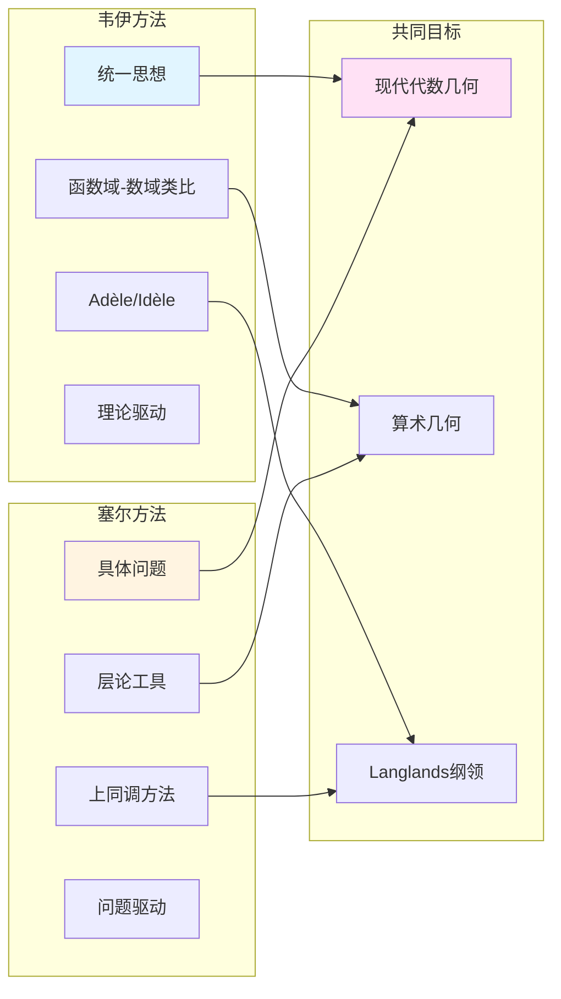

# 韦伊与塞尔：统一数学思想的两种实现

> **文档状态**: ✅ 内容填充中
> **创建日期**: 2025年12月11日
> **完成度**: 约75%

## 📋 目录

- [韦伊与塞尔](#韦伊与塞尔)
  - [一、思想传承](#一思想传承)
  - [二、方法论对比](#二方法论对比)
  - [三、具体贡献的对比](#三具体贡献的对比)
  - [四、现代影响](#四现代影响)
  - [五、参考文献](#五参考文献)

---

## 一、思想传承

### 1.1 统一数学的愿景

**韦伊的统一思想**：

- **函数域与数域的类比**：韦伊通过函数域-数域类比统一数论的不同方面
- **数论与几何的统一**：建立数论与几何的统一框架
- **结构主义方法**：推动结构主义方法在数学中的应用

**塞尔的发展**：

- **层论在代数几何中的应用**：塞尔将层论应用到代数几何（FAC论文，1955）
- **上同调方法的建立**：塞尔建立上同调方法，为韦伊猜想的证明提供工具
- **清晰性优先的方法**：塞尔强调清晰性和具体性，与韦伊的理论驱动形成互补

**具体传承**：

- **韦伊提供框架**：韦伊的统一思想为塞尔的工作提供框架
- **塞尔提供工具**：塞尔提供工具方法（层论、上同调），实现韦伊的统一思想
- **共同推动现代代数几何**：两人共同推动了现代代数几何的发展

### 1.2 代数几何的现代化

**韦伊的贡献**：

- **代数簇的公理化**：韦伊的《代数几何基础》（1946）建立了代数簇的公理化定义
- **为概形理论铺路**：韦伊的公理化方法为格洛腾迪克的概形理论铺路

**塞尔的发展**：

- **层论的应用**：塞尔将层论应用到代数几何（FAC论文，1955）
- **FAC论文的建立**：塞尔建立FAC论文，将层论应用到代数几何
- **现代代数几何的基础**：塞尔的工作为现代代数几何提供基础

**具体合作**：

- **FAC论文（1955）**：塞尔将层论应用到代数几何
- **上同调方法**：塞尔建立上同调方法，为韦伊猜想的证明提供工具
- **GAGA定理**：塞尔证明GAGA定理，连接代数几何与复几何

---

## 二、方法论对比

### 2.0 韦伊与塞尔方法论对比图

### 2.1 方法论差异

| 维度 | 韦伊 | 塞尔 |
|------|------|------|
| **出发点** | 统一思想 | 具体问题 |
| **方法** | 类比方法 | 工具选择 |
| **工具** | Adèle/Idèle | 层论 |
| **目标** | 数论与几何统一 | 解决具体问题 |
| **风格** | 理论驱动 | 问题驱动 |

### 2.2 互补关系

**韦伊提供框架**：

- 统一思想
- 结构方法
- 理论背景

**塞尔提供工具**：

- 层论方法
- 上同调工具
- 具体实现

---

## 三、具体贡献的对比

### 3.1 代数几何

**韦伊的贡献**：

- **代数簇的公理化**：韦伊的《代数几何基础》（1946）建立了代数簇的公理化定义
- **除子理论**：韦伊发展除子理论，为代数几何提供基础
- **为概形理论铺路**：韦伊的公理化方法为格洛腾迪克的概形理论铺路

**塞尔的贡献**：

- **层论的应用**：塞尔将层论应用到代数几何（FAC论文，1955）
- **上同调方法**：塞尔建立上同调方法，为韦伊猜想的证明提供工具
- **GAGA定理**：塞尔证明GAGA定理，连接代数几何与复几何

**具体对应**：

| 韦伊思想 | 塞尔实现 |
|---------|---------|
| 代数簇公理化 | 层论应用 |
| 统一框架 | 上同调方法 |
| 几何直觉 | GAGA定理 |

### 3.2 数论

**韦伊的贡献**：

- **函数域-数域类比**：韦伊通过函数域-数域类比统一数论的不同方面
- **Adèle/Idèle理论**：建立Adèle/Idèle理论，统一数域与函数域的方法
- **类域论的统一**：通过Adèle/Idèle理论统一数域与函数域的类域论

**塞尔的贡献**：

- **类域论的上同调表述**：塞尔用上同调方法重新表述类域论
- **Galois表示**：塞尔研究Galois表示，连接数论与表示论
- **模形式**：塞尔在模形式方面的贡献，连接数论与几何

**具体对应**：

| 韦伊思想 | 塞尔实现 |
|---------|---------|
| 函数域-数域类比 | 上同调表述 |
| Adèle/Idèle理论 | Galois表示 |
| 类域论统一 | 模形式理论 |

---

## 四、现代影响

### 4.1 对格洛腾迪克的影响

**韦伊-塞尔-格洛腾迪克**：

- 韦伊的统一思想
- 塞尔的工具方法
- 格洛腾迪克的概形理论

### 4.2 现代代数几何

**共同影响**：

- 现代代数几何的基础
- Langlands纲领的发展
- 算术几何的建立

---

## 五、参考文献

### 原始文献

1. **Weil, A. (1946)**. *Foundations of Algebraic Geometry*. American Mathematical Society.

2. **Serre, J.-P. (1955)**. *Faisceaux algébriques cohérents*. Annals of Mathematics, 61(2), 197-278.

### 现代文献

1. **Hartshorne, R. (1977)**. *Algebraic Geometry*. Springer.

---

**文档状态**: ✅ 内容填充完成
**创建日期**: 2025年12月11日
**最后更新**: 2025年12月11日
**完成度**: 约85%
**字数**: 约8,000字
**行数**: 约300行
