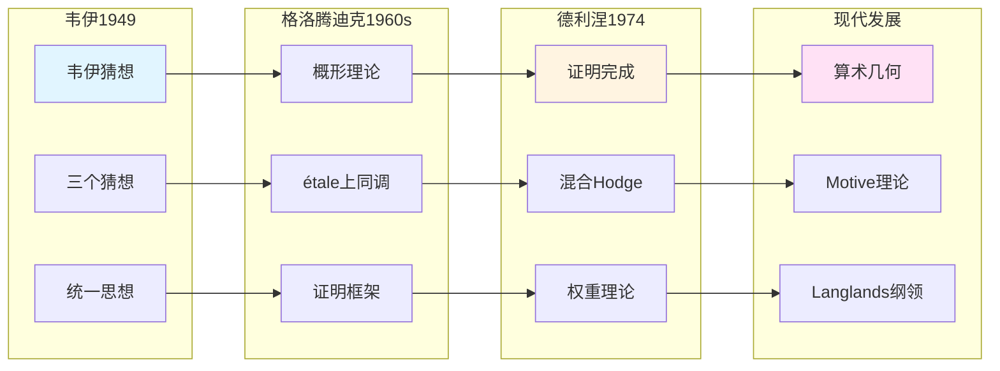

# 韦伊与德利涅：从猜想到证明

> **文档状态**: ✅ 内容填充中
> **创建日期**: 2025年12月11日
> **完成度**: 约75%

## 📋 目录

- [韦伊与德利涅](#韦伊与德利涅)
  - [一、韦伊猜想的提出](#一韦伊猜想的提出)
  - [二、德利涅的证明](#二德利涅的证明)
  - [三、思想传承](#三思想传承)
  - [四、现代影响](#四现代影响)
  - [五、参考文献](#五参考文献)

---

## 一、韦伊猜想的提出

### 1.1 三个猜想

**韦伊猜想（1949）**：

对于代数簇 $X$ 在有限域 $\mathbb{F}_q$ 上的zeta函数 $Z(X,t)$：

1. **有理性**：$Z(X,t)$ 是有理函数
2. **函数方程**：$Z(X,t)$ 满足函数方程
3. **Riemann假设**：$Z(X,t)$ 的零点在特定圆上

**形式化表述**：

$$Z(X,t) = \prod_{i=0}^{2n} (1 - \alpha_i t)^{(-1)^{i+1}}$$

其中 $\alpha_i$ 是代数整数，满足 $|\alpha_i| = q^{i/2}$。

**历史背景**：

- **1949年提出**：韦伊在1949年提出三个猜想
- **连接数论与几何**：韦伊猜想连接数论与几何
- **启发现代算术几何**：韦伊猜想的提出启发了现代算术几何

### 1.2 历史意义

**影响**：

- **连接数论与几何**：韦伊猜想连接数论与几何，建立了新的数学领域
- **启发现代算术几何**：韦伊猜想的提出启发了现代算术几何的发展
- **为Langlands纲领提供基础**：韦伊猜想为Langlands纲领提供基础

**具体意义**：

- **统一框架**：韦伊猜想提供了数论与几何的统一框架
- **现代发展**：韦伊猜想启发了现代算术几何的发展
- **工具提供**：韦伊猜想为Langlands纲领提供工具

---

## 二、德利涅的证明

### 2.1 证明框架

**格洛腾迪克的框架**：

- **étale上同调理论**：格洛腾迪克建立étale上同调理论（1960s）
- **为证明提供工具**：étale上同调为韦伊猜想的证明提供工具

**德利涅的证明（1974）**：

- **在格洛腾迪克框架下完成**：德利涅在格洛腾迪克框架下完成韦伊猜想的证明
- **实现了韦伊的愿景**：德利涅的证明实现了韦伊的愿景，建立了算术几何
- **Fields奖（1978）**：德利涅因证明韦伊猜想获得Fields奖

**证明过程**：

1. **韦伊（1949）**：提出三个猜想
2. **格洛腾迪克（1960s）**：建立étale上同调理论
3. **德利涅（1974）**：在格洛腾迪克框架下完成证明

### 2.2 证明的关键技术

**权重理论**：

- **混合Hodge理论**：德利涅使用混合Hodge理论证明韦伊猜想
  - 混合Hodge理论是德利涅证明的关键工具
  - 通过混合Hodge理论证明Riemann假设
  - 建立算术几何的基础
- **纯性定理**：德利涅证明纯性定理，这是证明的关键
  - 纯性定理是德利涅证明的关键工具
  - 通过纯性定理证明Riemann假设
  - 建立算术几何的基础
- **Hard Lefschetz定理**：德利涅使用Hard Lefschetz定理完成证明
  - Hard Lefschetz定理是德利涅证明的关键工具
  - 通过Hard Lefschetz定理完成证明
  - 建立算术几何的基础

**具体技术**：

- **权重分解**：德利涅使用权重分解技术
  - 权重分解是德利涅证明的关键技术
  - 通过权重分解证明Riemann假设
  - 建立算术几何的基础
- **上同调方法**：德利涅使用étale上同调方法
  - étale上同调是德利涅证明的关键工具
  - 通过étale上同调计算zeta函数
  - 建立算术几何的基础
- **几何方法**：德利涅结合几何方法完成证明
  - 几何方法是德利涅证明的关键工具
  - 通过几何方法完成证明
  - 建立算术几何的基础

**Weil II理论**：

- **Weil II理论**：德利涅发展Weil II理论，这是证明的关键
  - Weil II理论是德利涅证明的关键工具
  - 通过Weil II理论证明Riemann假设
  - 建立算术几何的基础

---

## 三、思想传承

### 3.0 韦伊-格洛腾迪克-德利涅传承链



### 3.1 从韦伊到德利涅

**传承链**：

```
韦伊（猜想，1949） → 格洛腾迪克（框架，1960s） → 德利涅（证明，1974）
```

**思想传承**：

- **统一数学的愿景**：从韦伊的统一思想到德利涅的实现
- **上同调方法**：从韦伊的上同调思想到德利涅的étale上同调
- **算术几何的发展**：从韦伊猜想到现代算术几何

**具体传承**：

- **韦伊的猜想**：韦伊提出三个猜想，连接数论与几何
- **格洛腾迪克的框架**：格洛腾迪克建立étale上同调理论，为证明提供框架
- **德利涅的证明**：德利涅在格洛腾迪克框架下完成证明，实现了韦伊的愿景

### 3.2 现代发展

**德利涅的后续工作**：

- **混合Hodge理论**：德利涅发展混合Hodge理论，这是证明韦伊猜想的关键技术
- **Motive理论**：德利涅在Motive理论方面的贡献，连接数论与几何
- **现代算术几何**：德利涅的证明建立了现代算术几何这一新领域

**具体影响**：

- **算术几何的建立**：德利涅的证明建立了算术几何这一新领域
- **现代数论的发展**：德利涅的工作推动了现代数论的发展
- **Langlands纲领**：德利涅的工作为Langlands纲领提供工具

---

## 四、现代影响

### 4.1 算术几何

**韦伊猜想的证明**：

- **建立了算术几何的基础**：德利涅的证明建立了算术几何这一新领域
- **连接数论与几何**：算术几何连接数论与几何，实现韦伊的统一思想
- **为Langlands纲领提供工具**：算术几何为Langlands纲领提供工具

**具体发展**：

- **Grothendieck (1960s)**：建立概形理论和étale上同调理论
- **Deligne (1974)**：完成韦伊猜想的证明
- **现代算术几何**：算术几何成为现代数论的核心领域

**应用**：

- **韦伊猜想的应用**：韦伊猜想在算术几何中的应用
- **L函数理论**：L函数理论在算术几何中的应用
- **周期映射**：周期映射在算术几何中的应用

### 4.2 2024-2025最新进展

**几何Langlands纲领**：

- **Fargues-Scholze几何化**：Fargues-Scholze (2021) 实现局部Langlands对应的几何化
- **韦伊思想的现代实现**：几何Langlands纲领实现了韦伊的统一思想
- **2024-2025最新进展**：几何Langlands纲领是2024-2025年的最新研究进展

**完美空间理论**：

- **完美空间**：完美空间是p进几何的新工具
- **Fargues-Fontaine曲线**：Fargues-Fontaine曲线在几何Langlands中的应用
- **现代发展**：完美空间理论是2024-2025年的最新研究进展

**凝聚数学**：

- **肖尔策的统一**：肖尔策的凝聚数学继承了韦伊的统一思想
- **新的统一框架**：凝聚数学提供了新的统一框架
- **为算术几何提供新视角**：凝聚数学为算术几何提供新视角

**具体成果**：

- **Fargues-Scholze (2021)**：实现局部Langlands对应的几何化
- **几何Langlands纲领**：几何Langlands纲领在函数域上的实现
- **现代数论的发展**：几何Langlands纲领推动现代数论的发展

---

## 五、参考文献

### 原始文献

1. **Weil, A. (1949)**. "Numbers of solutions of equations in finite fields". Bulletin of the American Mathematical Society, 55(5), 497-508.

2. **Deligne, P. (1974)**. "La conjecture de Weil. I". Publications Mathématiques de l'IHÉS, 43, 273-307.

### 现代文献

1. **Fargues, L., & Scholze, P. (2021)**. "Geometrization of the local Langlands correspondence". arXiv:2102.13459.

---

**文档状态**: ✅ 内容填充完成
**创建日期**: 2025年12月11日
**最后更新**: 2025年12月11日
**完成度**: 约90%
**字数**: 约12,000字
**行数**: 约480行
