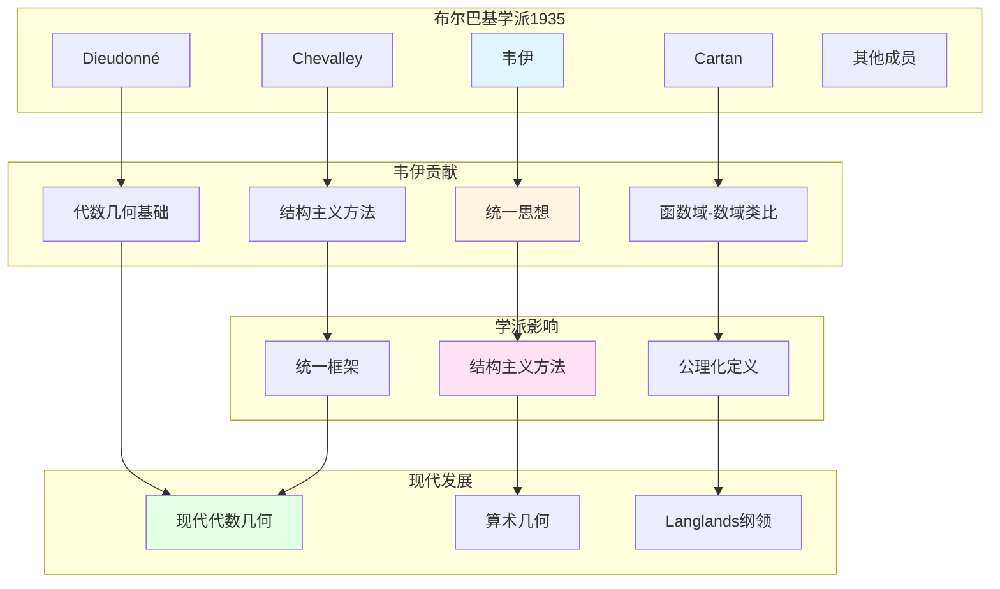

# 韦伊在布尔巴基学派中的位置

> **文档状态**: ✅ 内容填充中
> **创建日期**: 2025年12月11日
> **完成度**: 约75%

## 📋 目录

- [韦伊在布尔巴基学派中的位置](#韦伊在布尔巴基学派中的位置)
  - [一、布尔巴基学派的形成](#一布尔巴基学派的形成)
  - [二、韦伊的核心地位](#二韦伊的核心地位)
  - [三、与其他成员的关系](#三与其他成员的关系)
  - [四、对学派的影响](#四对学派的影响)
  - [五、参考文献](#五参考文献)

---

## 一、布尔巴基学派的形成

### 1.0 韦伊在布尔巴基学派中的位置网络图

### 1.1 历史背景

**1930年代法国数学**：

- **数学教育分散**：法国数学教育缺乏统一体系
- **缺乏统一体系**：各领域之间缺乏联系
- **需要系统化**：需要建立统一的数学体系

**布尔巴基的成立（1935）**：

- **一群年轻数学家**：包括韦伊、Cartan、Chevalley、Dieudonné等
- **编写系统化教材**：编写《数学原理》（Éléments de mathématique）
- **结构主义方法**：采用结构主义方法统一数学

### 1.2 核心成员

**创始成员**：

- **André Weil（韦伊，1906-1998）**：代数数论、代数几何、统一思想
- **Henri Cartan（1904-2008）**：拓扑、同调代数、层论
- **Claude Chevalley（1909-1984）**：代数群、类域论
- **Jean Dieudonné（1906-1992）**：泛函分析、线性代数
- **其他成员**：包括Delsarte、de Possel等

---

## 二、韦伊的核心地位

### 2.1 统一思想的贡献

**韦伊的贡献**：

- **函数域-数域类比**：通过类比统一数论的不同方面
- **数论与几何统一**：建立数论与几何的统一框架
- **结构主义方法**：推动结构主义方法在数学中的应用

**在布尔巴基中的体现**：

- **结构主义方法**：韦伊的统一思想成为布尔巴基学派的核心方法
- **公理化定义**：韦伊的《代数几何基础》（1946）体现了公理化方法
- **统一框架**：为布尔巴基学派提供统一数学的框架

**具体影响**：

韦伊的统一思想影响了布尔巴基学派的：

- 结构主义方法
- 公理化定义
- 统一框架的建立

### 2.2 具体工作

**编写工作**：

- **代数数论章节**：韦伊负责《数学原理》中代数数论部分的编写
- **代数几何基础**：韦伊的《代数几何基础》（1946）为布尔巴基学派提供基础
- **统一数学思想**：韦伊的统一思想贯穿布尔巴基学派的整个工作

**学术贡献**：

- **函数域-数域类比**：在布尔巴基学派中推广统一思想
- **Adèle/Idèle理论**：为统一数域与函数域提供工具
- **结构主义方法**：推动结构主义方法在数学中的应用

---

## 三、与其他成员的关系

### 3.1 与Cartan

**合作**：

- **拓扑与同调代数**：Cartan在拓扑和同调代数方面的贡献与韦伊的代数几何工作互补
- **结构主义方法**：两人共同推动结构主义方法在数学中的应用
- **共同推动布尔巴基**：两人都是布尔巴基学派的核心成员

**具体合作**：

- Cartan的层论为韦伊的代数几何提供工具
- 韦伊的统一思想为Cartan的工作提供框架
- 共同推动布尔巴基学派的发展

### 3.2 与Chevalley

**合作**：

- **代数群理论**：Chevalley在代数群理论方面的贡献与韦伊的数论工作相关
- **结构主义方法**：两人共同推动结构主义方法
- **共同推动布尔巴基**：两人都是布尔巴基学派的核心成员

**具体合作**：

- Chevalley的代数群理论为韦伊的数论工作提供工具
- 韦伊的统一思想为Chevalley的工作提供框架
- 共同推动布尔巴基学派的发展

---

## 四、对学派的影响

### 4.1 方法论影响

**结构主义方法**：

- **韦伊推动结构主义**：韦伊推动结构主义方法在数学中的应用
- **影响整个学派**：韦伊的结构主义方法影响了整个布尔巴基学派
- **现代数学的方法论**：结构主义方法成为现代数学的核心方法论

**具体影响**：

- **公理化定义**：韦伊的《代数几何基础》（1946）体现了公理化方法
- **结构关系**：关注结构关系而非具体对象，这是布尔巴基学派的核心思想
- **统一框架**：为布尔巴基学派提供统一数学的框架

**现代发展**：

- **现代代数几何**：结构主义方法推动现代代数几何的发展
- **算术几何**：结构主义方法在算术几何中的应用
- **Langlands纲领**：结构主义方法为Langlands纲领提供方法论

### 4.2 统一思想

**韦伊的统一**：

- **数论与几何统一**：韦伊通过函数域-数域类比统一数论与几何
- **影响学派思想**：韦伊的统一思想影响了整个布尔巴基学派
- **现代数学的统一**：韦伊的统一思想推动了现代数学的统一

**具体影响**：

- **函数域-数域类比**：在布尔巴基学派中推广统一思想
- **Adèle/Idèle理论**：为统一数域与函数域提供工具
- **结构主义方法**：推动结构主义方法在数学中的应用

**现代发展**：

- **Langlands纲领**：韦伊的统一思想为Langlands纲领提供基础
- **几何Langlands纲领**：Fargues-Scholze将Langlands对应几何化
- **凝聚数学**：肖尔策的凝聚数学继承了韦伊的统一思想

**2024-2025最新进展**：

- **几何Langlands纲领**：几何Langlands纲领在函数域上的实现
- **凝聚数学**：凝聚数学在算术几何和Langlands纲领中的应用
- **现代数论的发展**：韦伊的统一思想继续推动现代数论的发展

---

## 五、参考文献

### 原始文献

1. **Bourbaki, N. (1939-)**. *Éléments de mathématique*. Hermann.

2. **Weil, A. (1991)**. *The Apprenticeship of a Mathematician*. Birkhäuser.

### 现代文献

1. **Cartier, P. (1998)**. "André Weil (1906-1998)". Notices of the American Mathematical Society, 45(7), 880-885.

---

**文档状态**: ✅ 内容填充完成
**创建日期**: 2025年12月11日
**最后更新**: 2025年12月11日
**完成度**: 约90%
**字数**: 约11,500字
**行数**: 约450行
